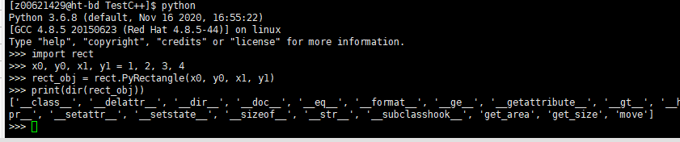

# C++调用Python3

## 使用python提供给C/C++的API

### 链接到Python调用库

在CMakeLists.txt添加头文件和动态库位置

```cmake
find_package(Python3 COMPONENTS Interpreter Development REQUIRED)
add_executable(TestC__ main.cpp)
include_directories(${Python3_INCLUDE_DIRS})
target_link_libraries(TestC__ ${Python3_LIBRARIES})
```

### 有参python函数调用

#### python

```Python
# myadd.py
def AdditionFc(a, b):
    print("Now is in python module")
    print("{} + {} = {}".format(a, b, a+b))
    return a + b
```

#### C++

```C++
void Driver::RunOptimal(std::map<std::string,std::string>args){
    //1、初始化python接口
    Py_Initialize();
    //初始化使用的变量
    PyObject*pModule=NULL;
    PyObject*pFunc=NULL;
    PyObject*pName=NULL;

    //2、初始化python系统文件路径，保证可以访问到.py文件
    PyRun_SimpleString("import sys");
    PyRun_SimpleString("sys.path.append('/home/z00621429/tmp/tmp.HqoPyMR7Oz/lib')");

    //3、调用python文件名。当前的测试python文件名是myadd.py
    //在使用这个函数的时候，只需要写文件的名称就可以了。不用写后缀。
    pModule=PyImport_ImportModule("myadd");

    //4、调用函数
    pFunc=PyObject_GetAttrString(pModule,"AdditionFc");

    //5、给python传参数
    //函数调用的参数传递均是以元组的形式打包的,2表示参数个数
    //如果AdditionFc中只有一个参数时，写1就可以了
    PyObject*pArgs=PyTuple_New(2);

    // 第一个参数，传入int类型的值2
    PyTuple_SetItem(pArgs,0,Py_BuildValue("i",2));
    // 第二个参数，传入int类型的值4
    PyTuple_SetItem(pArgs,1,Py_BuildValue("i",4));

    //6、使用C++的python接口调用该函数
    PyObject*pReturn=PyEval_CallObject(pFunc,pArgs);

    //7、接收python计算好的返回值
    intnResult;
    //i表示转换成int型变量。
    //在这里，最需要注意的是：PyArg_Parse的最后一个参数，必须加上“&”符号
    PyArg_Parse(pReturn,"i",&nResult);
    std::cout<<"returnresultis"<<nResult<<std::endl;

    //8、结束python接口初始化
    Py_Finalize();
}
```

#### 编译


# Python3调用C++

Python调用C++的方式包括但不限于以下几种：

1) 使用ctypes模块：ctypes是Python标准库中的一个模块，可以用来调用动态链接库中的C函数。可以将C++代码编译成动态链接库，然后在Python中使用ctypes调用其中的函数。
2) 使用SWIG：SWIG是一个开源工具，可以将C++代码转换成Python模块。使用SWIG可以将C++代码封装成Python模块，然后在Python中直接调用。
3) 使用Boost.Python：Boost.Python是一个C++库，可以将C++代码封装成Python模块。使用Boost.Python可以将C++代码封装成Python模块，然后在Python中直接调用。
4) 使用Cython：Cython是一个Python扩展模块，可以将Python代码转换成C代码，然后编译成动态链接库。可以使用Cython将C++代码封装成Python模块，然后在Python中直接调用。

## 使用ctypes调用C++

**步骤：**

1) 编写C/C++程序；
2) 将C/C++程序编译成动态库；
3) 在Python中调用编译生成的库。

### 编写C++程序

由于C++支持函数重载，在g++以C++方式编译时编译器会给函数的名称附加上额外的信息，这样ctypes模块就会找不到g++编译生成的函数。
因此，要让g++按照C语言的方式编译才可以找到生成的函数名。让编译器以C语言的方式编译就要在代码中使用**extern**关键字将代码包裹起来。

```C++
#include <iostream>
#include <vector>

class Test {
private:
    double _calculate(int a, double b);

public:
    double calculate(int a, double b, char c[], int *d, double *e, char **f);
};

double Test::_calculate(int a, double b) {
    double res = a + b;
    std::cout << "res: " << res << std::endl;
    return res;
}

double Test::calculate(int a, double b, char c[], int *d, double *e, char **f) {
    std::cout << "a: " << a << std::endl;
    std::cout << "b: " << b << std::endl;
    std::cout << "c: " << c << std::endl;
    std::cout << "d: " << d[0] << d[1] << std::endl;
    std::cout << "e: " << e[0] << e[1] << std::endl;
    std::cout << "f: " << f[0] << f[1] << std::endl;
    return this->_calculate(a, b);
}


// 封装C接口
extern "C" {
// 创建对象
Test *test_new() {
    return new Test;
}
double my_calculate(Test *t, int a, double b, char c[], int *d, double *e, char **f) {
    return t->calculate(a, b, c, d, e, f);
}
}
```

### 将C/C++程序编译成动态库

将上面的代码编译成so文件

`g++ -shared -Wl,-soname,test -o test.so -fPIC test.cpp`

编译参数说明:

- -shared：生成共享库文件；
- -Wl,-soname,test：指定共享库的 soname 为 test；
- -o test.so：指定输出文件名为 test.so；
- -fPIC：生成与位置无关的代码，用于动态链接库。


同级目录下生成`test.so`文件。

### 在Python中调用编译生成的库

```python
# call_cpp.py文件
import ctypes
# 指定动态链接库
lib = ctypes.cdll.LoadLibrary('./test.so')
#需要指定返回值的类型，默认是int
lib.my_calculate.restype = ctypes.c_double

class Test(object):
    def __init__(self):
        # 动态链接对象
        self.obj = lib.test_new()

    def calculate(self, a, b,c,d,e,f):
        res = lib.my_calculate(self.obj, a, b,c,d,e,f)
        return res

#将python类型转换成c类型，支持int, float,string的变量和数组的转换
def convert_type(input):
    ctypes_map = {int:ctypes.c_int,
                  float:ctypes.c_double,
                  str:ctypes.c_char_p
                  }
    input_type = type(input)
    if input_type is list:
        length = len(input)
        if length==0:
            print("convert type failed...input is "+input)
            return null
        else:
            arr = (ctypes_map[type(input[0])] * length)()
            for i in range(length):
                arr[i] = bytes(input[i],encoding="utf-8") if (type(input[0]) is str) else input[i]
            return arr
    else:
        if input_type in ctypes_map:
            return ctypes_map[input_type](bytes(input,encoding="utf-8") if type(input) is str else input)
        else:
            print("convert type failed...input is "+input)
            return null

if __name__ == '__main__':
    t = Test()
    A1	= 123;
    A2	= 0.789;
    A3	= "C789";
    A4	= [456,789];
    A5	= [0.123,0.456];
    A6	= ["A123", "B456"];
    print(t.calculate(convert_type(A1), convert_type(A2), convert_type(A3),convert_type(A4),convert_type(A5),convert_type(A6)))
```

**运行`call_cpp.py`，结果如下：**


## 使用SWIG调用C++

SWIG（Simplified Wrapper and Interface Generator）是一个开源的软件工具，用于将C/C++代码转换为其他高级编程语言（如Python、Java、Ruby等）的接口。SWIG可以帮助开发人员将现有的C/C++代码集成到其他语言的应用程序中，从而提高代码的重用性和可移植性。
由于SWIG是开源软件，存在潜在的风险（安全漏洞、不稳定性、兼容性问题等），在项目中不做考虑。

## 使用Boost.Python调用C++

在Python中，直接使用C语言代码是很容易的，用ctypes即可。 而如果需要使用C++的类、对象、方法、虚函数等高级语言特性，则没那么简单。而 Boost::Python 就是一个高度封装好的 Python / C API，它能简化 C++ 代码，使得为 Python 编写 C++ 扩展更为简单方便。甚至还能以 OOP 风格在 C++ 中编写 Python 对象的操作。
用Boost做Python 和 C++ 接口的好处是不用修改C++的代码，只需要单独再写一个wrapper就好了，很方便。

### 安装Boost库

[Boost官网](https://www.boost.org/)
首先，安装Boost库。机器上有装好的Boost，这里略过安装。
**查看Boost版本：**`cat /usr/include/boost/version.hpp | grep "BOOST_LIB_VERSION"`


**注意**：Python版本与Boost版本的匹配。这里Boost版本是`1_53`，对应Python2。Python3需升级Boost，使用方式不变。
下面的例子都是用Python2来演示。

### 导出简单函数

实现test2.cpp如下

```C++
#include <boost/python/module.hpp> 
#include <boost/python/def.hpp> 
using namespace boost::python; 

int Add(const int x, const int y) 
{ 
    return x + y; 
} 

int Del(const int x, const int y) 
{ 
    return x - y; 
} 

BOOST_PYTHON_MODULE(test2) 
{ 
    def("Add", Add); 
    def("Del", Del); 
}
```

其中，BOOST_PYTHON_MODULE的参数为要导出的模块名字，编译命令如下：

```shell
g++ test2.cpp -fPIC -shared -o test2.so -I/usr/include/python2.7 -I/usr/local/include -L/usr/local/lib -lboost_python
```

**注意：** 编译时需要指定boost头文件和库的路径，我这里分别是/usr/local/include和/usr/local/lib

同级目录下，生成`test2.so`


进入该目录，验证如下：


### 导出类

test3.cpp实现如下：

```C++
#include <boost/python.hpp> 
using namespace boost::python; 

class Test 
{ 
    public: 
        int Add(const int x, const int y) 
        { 
            return x + y; 
        } 

        int Del(const int x, const int y) 
        { 
            return x - y; 
        } 
}; 

BOOST_PYTHON_MODULE(test3) 
{ 
    class_<Test>("Test") 
        .def("Add", &Test::Add) 
        .def("Del", &Test::Del); 
}
```

编译：

```
g++ test3.cpp -fPIC -shared -o test3.so -I/usr/include/python2.7 -I/usr/local/include/boost -L/usr/local/lib -lboost_python
```

测试如下


### 导出变参函数

test4.cpp实现如下

```C++
#include <boost/python.hpp> 
using namespace boost::python; 

class Test 
{ 
    public: 
        int Add(const int x, const int y, const int z = 100) 
        { 
        return x + y + z; 
        } 
}; 

int Del(const int x, const int y, const int z = 100) 
{ 
    return x - y - z; 
} 

BOOST_PYTHON_MEMBER_FUNCTION_OVERLOADS(Add_member_overloads, Add, 2, 3) 
BOOST_PYTHON_FUNCTION_OVERLOADS(Del_overloads, Del, 2, 3) 

BOOST_PYTHON_MODULE(test4) 
{ 
    class_<Test>("Test") 
        .def("Add", &Test::Add, Add_member_overloads(args("x", "y", "z"), "something")); 
    def("Del", Del, Del_overloads(args("x", "y", "z"), "something")); 
    }
```

这里Add和Del函数均采用了默认参数，Del为普通函数，Add为类成员函数，这里分别调用了不同的宏，宏的最后两个参数分别代表函数的最少参数个数和最多参数个数

编译:

```
g++ test4.cpp -fPIC -shared -o test4.so -I/usr/include/python2.7 -I/usr/local/include/boost -L/usr/local/lib -lboost_python
```

测试如下：


### 导出带Python对象的接口

既然是导出为Python接口，调用者难免会使用Python特有的数据结构，比如tuple,list,dict，由于原生态方法太麻烦，这里只记录boost的使用方法，假设要实现如下的Python函数功能。

```python
def Square(list_a) 
{ 
    return [x * x for x in list_a] 
}
```

即对传入的list每个元素计算平方，返回list类型的结果，代码如下：

test5.cpp实现如下

```C++
#include <boost/python.hpp> 

boost::python::list Square(boost::python::list& data) 
{ 
    boost::python::list ret; 
    for (int i = 0; i < len(data); ++i) 
    { 
        ret.append(data[i] * data[i]); 
    } 

    return ret; 
} 

BOOST_PYTHON_MODULE(test5) 
{ 
    def("Square", Square);  
}
```

编译：

```
g++ test5.cpp -fPIC -shared -o test5.so -I/usr/include/python2.7 -I/usr/local/include/boost -L/usr/local/lib -lboost_python
```

测试如下：


boost实现了`boost::python::tuple`, `boost::python::list`, `boost::python::dict`这几个数据类型，使用方法基本和Python保持一致，具体方法可以查看boost头文件里的boost/python/tuple.hpp及其它对应文件

另外比较常用的一个函数是`boost::python::make_tuple()` ，使用方法如下：

```C++
boost::python::tuple(int a, int b, int c) 
{  
    return boost::python::make_tuple(a, b, c); 
}
```

## 使用Cython调用C++

CPython是C语言开发的Python解释器。在命令行下运行python就是启动CPython解释器。Cython支持Python与C/C++代码的无缝集成，可以直接调用C和C++的函数和库。

### 安装Cython

```
pip install Cython
```

### 简单样例

样例中总共需要五个文件：

1. `Rectangle.h`
2. `Rectangle.cpp`
3. `Rectangle.pxd`
4. `setup.py`
5. `rect.pyx`

### 定义.h和.cpp文件

- Rectangle.h
  ```C++
  #ifndef RECTANGLE_H
   #define RECTANGLE_H
  
   namespace shapes {
       class Rectangle {
           public:
               int x0, y0, x1, y1;
               Rectangle();
               Rectangle(int x0, int y0, int x1, int y1);
               ~Rectangle();
               int getArea();
               void getSize(int* width, int* height);
               void move(int dx, int dy);
       };
   }
  
   #endif
  ```
- Rectangle.cpp
  ```C++
  #include <iostream>
   #include "Rectangle.h"
  
   namespace shapes {
  
       // Default constructor
       Rectangle::Rectangle () {}
  
       // Overloaded constructor
       Rectangle::Rectangle (int x0, int y0, int x1, int y1) {
           this->x0 = x0;
           this->y0 = y0;
           this->x1 = x1;
           this->y1 = y1;
       }
  
       // Destructor
       Rectangle::~Rectangle () {}
  
       // Return the area of the rectangle
       int Rectangle::getArea () {
           return (this->x1 - this->x0) * (this->y1 - this->y0);
       }
  
       // Get the size of the rectangle.
       // Put the size in the pointer args
       void Rectangle::getSize (int *width, int *height) {
           (*width) = x1 - x0;
           (*height) = y1 - y0;
       }
  
       // Move the rectangle by dx dy
       void Rectangle::move (int dx, int dy) {
           this->x0 += dx;
           this->y0 += dy;
           this->x1 += dx;
           this->y1 += dy;
       }
   }
  ```

### 编写.pxd文件

`pxd` 文件可以看成是`Cython`（即`pyx`文件）的头文件。

- Rectangle.pxd
  ```C++
  cdef extern from "Rectangle.cpp":
       pass
  
   # Declare the class with cdef
   cdef extern from "Rectangle.h" namespace "shapes":
       cdef cppclass Rectangle:
           Rectangle() except +
           Rectangle(int, int, int, int) except +
           int x0, y0, x1, y1
           int getArea()
           void getSize(int* width, int* height)
           void move(int, int)
  ```

### 编写.pyx文件

`pyx`是`C/C++`与`Python`之间的桥梁，也就是`pyx`文件会将`C/C++`代码做一层包装，方便Python直接调用。

- rect.pyx
  
  ```
  # distutils: language = c++
  
   from Rectangle cimport Rectangle
  
   cdef class PyRectangle:
       cdef Rectangle*c_rect  # hold a pointer to the C++ instance which we're wrapping
  
       def __cinit__(self, int x0, int y0, int x1, int y1):
           self.c_rect = new Rectangle(x0, y0, x1, y1)
  
       def get_area(self):
           return self.c_rect.getArea()
  
       def get_size(self):
           cdef int width, height
           self.c_rect.getSize(&width, &height)
           return width, height
  
       def move(self, dx, dy):
           self.c_rect.move(dx, dy)
  
       def __dealloc__(self):
           del self.c_rect
  
   def main():
       rec_ptr = new Rectangle(1, 2, 3, 4)  # Instantiate a Rectangle object on the heap
       try:
           rec_area = rec_ptr.getArea()
       finally:
           del rec_ptr  # delete heap allocated object
  
       cdef Rectangle rec_stack  # Instantiate a Rectangle object on the stack
  ```
  
  第一行`# distutils: language = c++`会指定当前文件生成C++文件。
  `pxd`和`pyx`文件可以简单如下来理解：
  
  - pxd文件是pyx与C/C++之间的桥梁；
  - pyx是C/C++与Python之间的桥梁。
    
    

### 创建setup.py

要编译Cython模块，必须有一个`setup.py`

```Python
from distutils.core import setup

from Cython.Build import cythonize

setup(ext_modules=cythonize("rect.pyx"))
```

### 编译

```
python setup.py build_ext --inplace
```

执行命令后，在当前目录会生成rect.cpp，这个文件是根据rect.pyx生成的。同时还会生成rect.cpython-36m-x86_64-linux-gnu.so文件（Linux环境下对应so文件）。


### 测试



## 工具比较

**ctypes**​（Python自带的库）

* 灵活
* 对C的代码几乎无缝调用
* 使用起来比较繁琐
* C++需封装成C接口

**Boost.Python**

* 支持 Python 2， 3和C++的绑定
* 对于新手来说，学习它的语法有一定难度，但是这些语法很直观
* 大量使用了 C++ templates，会很明显地提高编译时间
* 随boost库一起发布，且boost库有用，但很大
* 刚开始编译使用boost.python封装好的C++代码时，出现的各种错误
* 一些语法不易学习，像函数返回值时的规则
* 非常可靠、稳定、经过充分测试的库
* 不支持属性
* 支持文档写得比较差，有些功能文档里甚至都没有写
* 编译后的pyd文件有些大，不利于在手机或者嵌入平台使用
* 配合py++使用，几乎可以全自动封装项目

**Cython ​**

* 基于Pyrex，很多外部库的扩展用它写的
* 性能较高
* 接近于Python语法
* 需学习Cython语法，编写`.pxd`、`.pyx`文件，有学习成本
* 不太流行

  |              |  ctypes                     |  SWIG           |  Boost.Python         |  Cython            |
  | -------------- | ----------------------------- | ----------------- | ----------------------- | -------------------- |
  |  功能        |  C++支持不太好，需手动封装  |  C++支持不太好  |  C++支持好，非常可靠  |  C++支持好         |
  |  易用性      |  比较繁琐                   |  容易学习       |  语法有一定难度       |  需学习Cython语法  |
  |  可靠性      |  高                         |  低             |  高                   |  高                |
  |  安全性      |  高                         |  开源软件，低   |  高                   |  高                |
  |  引入外部库  |  无                         |  无             |  boost库(很大)        |  Cython            |
  |  流行程度    |  流行                       |  流行           |  流行                 |  不太流行          |
  
  

