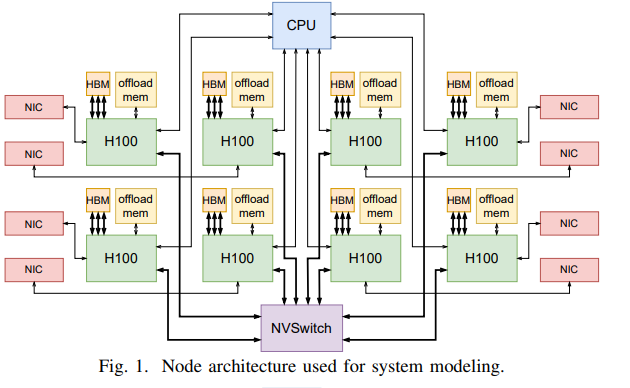

# Calculon介绍

## 什么是Calculon?

Calulon是LLM的参数化分析性能模型，用于指导high-level算法架构协同设计研究。

## Calculon的性能

可以在大约1毫秒内估计给定LLM、系统配置和软件执行策略的时间和资源使用情况，允许探索具有数十亿这样的配置的大型设计空间。

## Calculon使用什么技术？

Calculon使用张量并行(TP)、管道并行(PP)和数据并行(DP)对LLM训练进行建模，允许搜索确定最佳的分裂并行配置。

## Calculon系统架构

如图，是一个基于加速器的分布式系统，具有连接到多个网络的两级内存层次结构。



# Calculon自动并行策略调优

## 实现方法

Calculon的输入参数包括应用程序特征(application)、硬件系统(system)和实现策略的空间(execution)。我们将Calculon的execution中并行策略参数作为Search Spaces，使用Ray Tune、SMC3等工具实现Calculon自动并行策略调优。

## Search Spaces

Search Spaces为Execution中几乎所有参数，除了`num_procs`和`training`，因为这两个参数不好改变，只有可变的参数才有调优的空间。
**参数示例：**

```json
{
  "tensor_par": 4,   # TP
  "pipeline_par": 1, # PP
  "data_par": 8,     # DP
  "tensor_par_net": 0,
  "pipeline_par_net": 1,
  "data_par_net": 1,
  "batch_size": 8,
  "microbatch_size": 1,
  "datatype": "float16",
  "fused_activation": false,
  "attention_type": "flash",
  "structure_type": "llama",
  "activation_recompute": "none",
  "pipeline_interleaving": 1,
  "optimizer_sharding": true,
  "tensor_par_comm_type": "rs_ag",
  "tensor_par_overlap": "none",
  "seq_par_ag_redo": false,
  "data_par_overlap": true,
  "weight_offload": false,
  "activations_offload": false,
  "optimizer_offload": false
}
```

**部分参数含义：**

| 参数 | 含义 |示例|
| --- | --- | --- |
| num_procs |使用的处理器数量|3072 |
| tensor_par |张量并行  | 4|
| pipeline_par | 流水线并行 |64 |
| data_par | 数据并行 |12 |
| tensor_par_net |  | 0|
| pipeline_par_net |  |1|
| data_par_net |  |1 |
| datatype | 使用的数据类型 | float16|
| pipeline_interleaving | 流水线中交错执行多个任务的数量 | 1|
| optimizer_sharding | 优化器分片，以便在多个GPU或多个计算节点上并行执行|true |
| tensor_par_comm_type | 张量并行通信类型 |rs_ag |
| tensor_par_overlap | 将模型中的张量分成多个子张量，在多个GPU上并行计算 |none |
| seq_par_ag_redo |  | false |
| data_par_overlap | 在多个处理器上同时执行计算任务和数据传输任务 | false|

=======
---
title: Calculon自动并行策略调优
date: 2024-08-26 14:44:00 +/-8
categories: [LLM]
tags: [自动并行]     # TAG names should always be lowercase
---

# Calculon介绍

## 什么是Calculon?

Calulon是LLM的参数化分析性能模型，用于指导high-level算法架构协同设计研究。

## Calculon的性能

可以在大约1毫秒内估计给定LLM、系统配置和软件执行策略的时间和资源使用情况，允许探索具有数十亿这样的配置的大型设计空间。

## Calculon使用什么技术？

Calculon使用张量并行(TP)、管道并行(PP)和数据并行(DP)对LLM训练进行建模，允许搜索确定最佳的分裂并行配置。

## Calculon系统架构

如图，是一个基于加速器的分布式系统，具有连接到多个网络的两级内存层次结构。


# Calculon自动并行策略调优

## 实现方法

Calculon的输入参数包括应用程序特征(application)、硬件系统(system)和实现策略的空间(execution)。我们将Calculon的execution中并行策略参数作为Search Spaces，使用Ray Tune、SMC3等工具实现Calculon自动并行策略调优。

## Search Spaces

Search Spaces为Execution中几乎所有参数，除了`num_procs`和`training`，因为这两个参数不好改变，只有可变的参数才有调优的空间。
**参数示例：**

```json
{
  "tensor_par": 4,   # TP
  "pipeline_par": 1, # PP
  "data_par": 8,     # DP
  "tensor_par_net": 0,
  "pipeline_par_net": 1,
  "data_par_net": 1,
  "batch_size": 8,
  "microbatch_size": 1,
  "datatype": "float16",
  "fused_activation": false,
  "attention_type": "flash",
  "structure_type": "llama",
  "activation_recompute": "none",
  "pipeline_interleaving": 1,
  "optimizer_sharding": true,
  "tensor_par_comm_type": "rs_ag",
  "tensor_par_overlap": "none",
  "seq_par_ag_redo": false,
  "data_par_overlap": true,
  "weight_offload": false,
  "activations_offload": false,
  "optimizer_offload": false
}
```

**部分参数含义：**

| 参数 | 含义 |示例|
| --- | --- | --- |
| num_procs |使用的处理器数量|3072 |
| tensor_par |张量并行  | 4|
| pipeline_par | 流水线并行 |64 |
| data_par | 数据并行 |12 |
| tensor_par_net |  | 0|
| pipeline_par_net |  |1|
| data_par_net |  |1 |
| datatype | 使用的数据类型 | float16|
| pipeline_interleaving | 流水线中交错执行多个任务的数量 | 1|
| optimizer_sharding | 优化器分片，以便在多个GPU或多个计算节点上并行执行|true |
| tensor_par_comm_type | 张量并行通信类型 |rs_ag |
| tensor_par_overlap | 将模型中的张量分成多个子张量，在多个GPU上并行计算 |none |
| seq_par_ag_redo |  | false |
| data_par_overlap | 在多个处理器上同时执行计算任务和数据传输任务 | false|
