# 环境准备

使用双节点（90.91.33.64，90.91.33.65）训练，需在每个节点上部署相同的环境。

**环境**

```text
CUDA=11.3
Python = 3.9.17
Pytorch = 1.11.0
```

**创建虚拟环境**

```shell
conda create -n colossal-AI python=3.9
```

**安装Pytorch**

```shell
conda install pytorch==1.11.0 torchvision==0.12.0 torchaudio==0.11.0 cudatoolkit=11.3 -c pytorch
```

**安装Colossal-AI（同时安装PyTorch扩展）**

```shell
CUDA_EXT=1 pip install colossalai
```

# 验证虚拟环境

首先在单GPU环境使用Colossal-AI，保证虚拟环境没问题。选择简单模型ResNet，在CIFAR10 数据集上训练。

**代码**：https://github.com/hpcaitech/ColossalAI/tree/main/examples/images/resnet

<font color="red">Colossal-AI需要GCC版本>=5，CentOS自带的GCC为4.8.5，需将GCC升级到5以上。</font>

## 启动训练

**激活虚拟环境**

```shell
conda activate colossal-AI
```

**激活GCC**

如果系统GCC版本<5，升级GCC后，虚拟环境不能自动感知，导致虚拟环境实际使用的GCC版本与系统的不一致。虚拟环境需先激活升级后的GCC。

以`gcc (GCC) 7.3.1 20180303 (Red Hat 7.3.1-5)`为例：

```shell
source /opt/rh/devtoolset-7/enable  // 激活gcc 7.3.5
```

**开启训练**

```shell
# train with torch DDP with fp32
colossalai run --nproc_per_node 1 train.py -c ./ckpt-fp32
```

# 多节点训练

在节点90.91.33.64、90.91.33.65上执行分布式训练。

90.91.33.64节点名称：node64

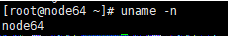

90.91.33.65节点名称：node65

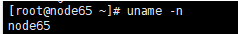

**设置节点间SSH免密登录**

<font color="red">节点间互相访问需要设置权限。</font>

首先到`/root/.ssh/`路径下查看是否存在id_rsa、id_rsa.pub，若无，则：

生成SSH公钥私钥，90.91.33.64是客户端，90.91.33.65是服务器

```shell
ssh-keygen -t rsa # 客户端生成一对密钥
ssh-copy-id -i /root/.ssh/id_rsa.pub root@90.91.33.65 #发送公钥给服务端
```

验证SSH免密登录：

```shell
ssh root@90.91.33.65 #server ip
```

**启动命令**

torchrun启动：

```shell
# 90.91.33.64
torchrun --nproc_per_node=1 --nnodes=2 --node_rank=0 --master_addr="90.91.33.64" --master_port=29500  train.py -c ./ckpt-fp32
```

```shell
# 90.91.33.65
torchrun --nproc_per_node=1 --nnodes=2 --node_rank=1 --master_addr="90.91.33.64" --master_port=29500 train.py -c ./ckpt-fp32
```

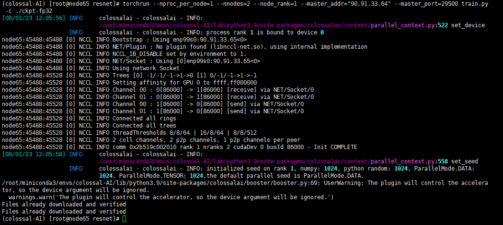

Colossal-AI命令行工具启动：

```shell
colossalai run --nproc_per_node 1 --host node64,node65 --master_addr node64 train.py -c ./ckpt-fp32 // 使用节点名称
```

或者

```shell
colossalai run --nproc_per_node 1 --host 90.91.33.64,90.91.33.65 --master_addr 90.91.33.64 train.py -c ./ckpt-fp32 // 使用Ip
```

## 训练问题汇总

### 1. 29500端口占用

Colossal-AI分布式训练默认使用29500端口，29500被占用是因为之前的训练没有正常退出，依然占用29500端口。我们可以手动kill掉未退出的命令。

查询占用端口的进程，获取PID：

```shell
netstat -anp |grep 29500
```

kill占用29500的进程

```shell
kill -9 xxx
```

### 2. torchrun: command not found

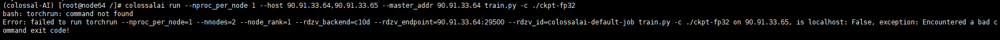

运行Colossal-AI命令，*torchrun找不到命令。*

```shell
colossalai run --nproc_per_node 1 --host 90.91.33.64,90.91.33.65 --master_addr 90.91.33.64 train.py -c ./ckpt-fp32
```

Colossal-AI内部封装了torchrun，实现一条命令启动多节点，不必分别运行torchrun启动。因此，我们可以在90.91.33.64、90.91.33.65分别运行torchrun命令来debug。

```shell
# node64
torchrun --nproc_per_node=1 --nnodes=2 --node_rank=0 --master_addr="90.91.33.64" --master_port=29500  train.py -c ./ckpt-fp32
# node65
torchrun --nproc_per_node=1 --nnodes=2 --node_rank=1 --master_addr="90.91.33.64" --master_port=29500 train.py -c ./ckpt-fp32
```

如果torchrun可以运行，说明训练脚本没问题，应该是Colossal-AI缺少配置。在`config.py`文件中新增torchrun命令行，启动时读取配置。

```python
colossalai.launch_from_torch(
    config="./config.py",
)
```

### 3. torchrun多节点运行卡死

node64

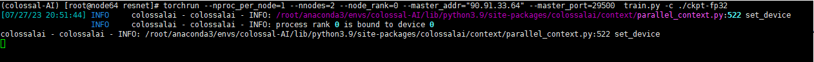

node65

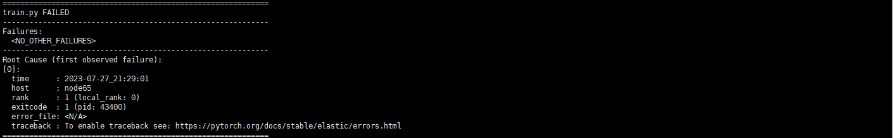

node65输出NCCL错误，有用信息太少，我们把NCCL的debug信息打印出来看看。设置如下的NCCL变量来打印更多的log：

```shell
export NCCL_DEBUG=INFO
export NCCL_DEBUG_SUBSYS=ALL
```

因为没有IB（InfiniBand）连接，因此需要设置环境变量来禁用IB转而使用以太网（也可以不用设置，NCCL backend会自动找寻，当然，如果自动找寻失败了，最好就手工来设置）

将NCCL_IB_DISABLE设置为1来禁止使用IB，转而使用 IP:

```shell
export NCCL_IB_DISABLE=1
```

输出log:

node64
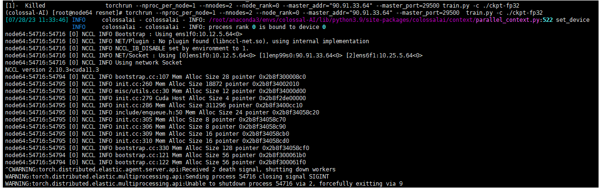

node65
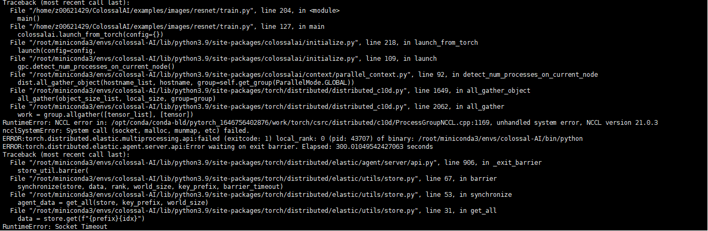

发现问题，node65访问`10.12.5.64 `timeout。
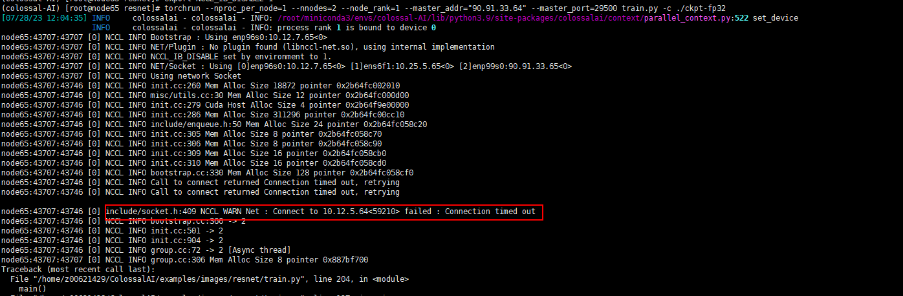

在`90.91.33.65`尝试ping`10.12.5.64 `，一直卡住，不会打印第二条信息的情况，也没有响应
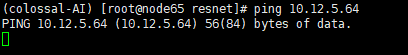

`ifconfig`查询`90.91.33.64`的网卡信息，发现`10.12.5.64 `是`90.91.33.64`的一张网卡，这张卡ping不通。
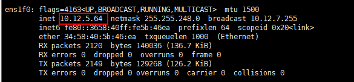

由于90.91.33.64和90.91.33.65互相可以ping通，因此我们`ifconfig`查询两个节点的网卡信息，寻找90.91.33.64和90.91.33.65的网络接口。

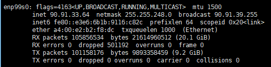

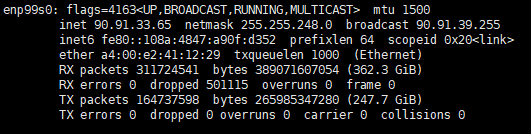

由于网络接口不能被自动发现，手工设置NCCL_SOCKET_IFNAME环境变量。

```shell
export NCCL_SOCKET_IFNAME=enp99s0
```

尝试分别运行torchrun命令，发现90.91.33.64和90.91.33.65节点可以连通。

