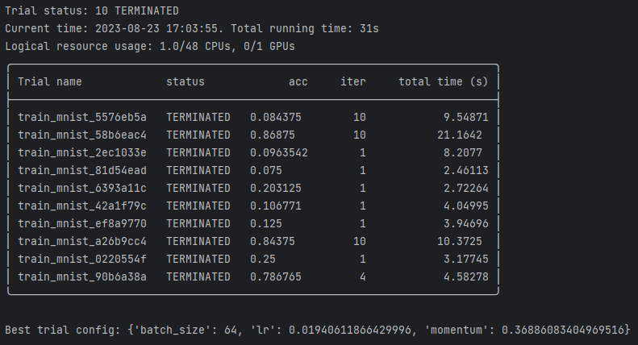

# 概述

Ray是一个用于扩展AI和Python应用程序的统一框架。Ray由核心分布式运行时和一组用于简化ML计算的AI库组成:


其中，Tune作为Ray AI Libraries的应用之一，是可扩展的超参数调优工具。

# 作用

Tune可用于任何规模的实验执行和超参数调优，目前兼容PyTorch, XGBoost, Scikit-Learn, TensorFlow和Keras等框架。

**Tune的特性：**

- 降低调优成本：Tune利用一系列先进的优化算法来降低调优成本，包括提前中止不良运行、选择更好的评估参数、甚至在训练期间更改超参数来优化计划；
- 节省人力成本：使用Tune不需要重构用户代码，只需添加代码片段。支持实验结果的多种存储选项（NFS、云存储）并将结果记录到 MLflow 和 TensorBoard 等工具，同时还具有高度可定制性。
- 支持分布式调优：Tune可跨GPU或跨节点运行，且对用户透明。具有无缝容错和云支持，允许您将超参数搜索扩展100倍，同时通过使用廉价的可抢占实例将成本降低10倍。
- 集成第三方框架：Tune集成了各种超参数优化框架及其各自的搜索算法，如果用户已使用了其他调优工具，允许扩展优化现有工作流且不牺牲性能。

# 基本原理

超参数调优前需先确定调优目标和调优策略，以及准备参数空间，然后才能启动调优。Tune调优的流程包含6个关键组件：


- **Search Spaces**：想要调的参数集；
- **Trainable**：传递到Tuner中运行的对象，可定义为Function或Class；
- **Search Algorithms**：利用优化算法来智能地搜寻给定的超参数空间，向Tuner推荐超参数的配置；
- **Schedulers**：停止、暂停或调整当前试验的超参数，使训练过程更高效；
- **Trials**：按配置执行超参数调优试验并返回结果；
- **Analyses**：分析试验返回的结果；

# 调优流程

Ray Tune调优的主要流程是设置Search Spaces和Trainable，然后进行试验和评估。Search Algorithms和Schedulers是可选的。

举例说明具体的调优流程。

## 导入依赖项

导入PyTorch和TorchVision模块用来创建并训练模型；

导入Ray Tune用来优化模型；

```python
import torch
import torch.nn as nn
import torch.nn.functional as F
import torch.optim as optim
from hyperopt import hp
from ray import tune
from ray.air import session
from ray.tune.schedulers import ASHAScheduler
from ray.tune.search.hyperopt import HyperOptSearch
from torch.utils.data import DataLoader
from torchvision import datasets, transforms
```

## 定义、训练、评估模型

定义一个简单的卷积神经网络模型(Pytorch)，由一个2D卷积层、一个全连接层以及一个softmax函数组成。

```python
class ConvNet(nn.Module):
    def __init__(self):
        super(ConvNet, self).__init__()
        # In this example, we don't change the model architecture
        # due to simplicity.
        self.conv1 = nn.Conv2d(1, 3, kernel_size=3)
        self.fc = nn.Linear(192, 10)

    def forward(self, x):
        x = F.relu(F.max_pool2d(self.conv1(x), 3))
        x = x.view(-1, 192)
        x = self.fc(x)
        return F.log_softmax(x, dim=1)
```

定义训练和评估的函数。

```python
# Change these values if you want the training to run quicker or slower.
EPOCH_SIZE = 512
TEST_SIZE = 256


def train(model, optimizer, train_loader):
    device = torch.device("cuda" if torch.cuda.is_available() else "cpu")
    model.train()

    for batch_idx, (data, target) in enumerate(train_loader):
        # We set this just for the example to run quickly.
        if batch_idx * len(data) > EPOCH_SIZE:
            return
        data, target = data.to(device), target.to(device)
        optimizer.zero_grad()
        output = model(data)
        loss = F.nll_loss(output, target)
        loss.backward()
        optimizer.step()


def test(model, data_loader):
    device = torch.device("cuda" if torch.cuda.is_available() else "cpu")
    model.eval()
    correct = 0
    total = 0
    with torch.no_grad():
        for batch_idx, (data, target) in enumerate(data_loader):
            # We set this just for the example to run quickly.
            if batch_idx * len(data) > TEST_SIZE:
                break
            data, target = data.to(device), target.to(device)
            outputs = model(data)
            _, predicted = torch.max(outputs.data, 1)
            total += target.size(0)
            correct += (predicted == target).sum().item()

    return correct / total
```

## 使用Ray Tune进行超参数调优

### 设置Search Spaces

选择"lr"、"momentum"、"batch_size"作为**Search Spaces**。

```Python
space = {
    "lr": hp.loguniform("lr", -10, -1),
    "momentum": hp.uniform("momentum", 0.1, 0.9),
    "batch_size": hp.choice("batch_size", [16, 32, 64, 128])
}
```

### 定义Trainable

本例使用Function API定义Trainable。

```python
def train_mnist(config): # Pass a "config" dictionary into trainable
    # Data Setup
    mnist_transforms = transforms.Compose(
        [transforms.ToTensor(),
         transforms.Normalize((0.1307,), (0.3081,))])

    train_loader = DataLoader(
        datasets.MNIST("~/data", train=True, download=True, transform=mnist_transforms),
        batch_size=int(config["batch_size"]),
        shuffle=True)
    test_loader = DataLoader(
        datasets.MNIST("~/data", train=False, transform=mnist_transforms),
        batch_size=int(config["batch_size"]),
        shuffle=True)

    device = torch.device("cuda" if torch.cuda.is_available() else "cpu")

    model = ConvNet()
    model.to(device)

    optimizer = optim.SGD(
        model.parameters(), lr=config["lr"], momentum=config["momentum"])
    for i in range(10):
        train(model, optimizer, train_loader)
        acc = test(model, test_loader)

        # Send the current training result back to Tune
        session.report({"mean_accuracy": acc})

        if i % 5 == 0:
            # This saves the model to the trial directory
            torch.save(model.state_dict(), "./model.pth")
```

需要调的参数在Trainable中以`config["xxx"]`的方式标识。例如：`config["lr"]`, `config["momentum"]`, `config["batch_size"]`。使用`session.report(…)`将当前的训练结果发送回Tune。

### 设置Search Algorithms

本例使用`HyperOptSearch`搜索算法。

```python
from hyperopt import hp
from ray.tune.search.hyperopt import HyperOptSearch

space = {
    "lr": hp.loguniform("lr", -10, -1),
    "momentum": hp.uniform("momentum", 0.1, 0.9),
    "batch_size": hp.choice("batch_size", [16, 32, 64, 128])
}
# search algorithms
hyperopt_search = HyperOptSearch(space, metric="mean_accuracy", mode="max")

tuner = tune.Tuner(
    train_mnist,
    tune_config=tune.TuneConfig(
        num_samples=10,
        search_alg=hyperopt_search
    )
)
```

### 设置Schedulers

本例使用`ASHA`Scheduler。`ASHA`提前中止不太有希望的试验，把时间和资源分配更有希望的试验，即早停止。

```Python
tuner = tune.Tuner(
    train_mnist,
    tune_config=tune.TuneConfig(
        num_samples=10,
        scheduler=ASHAScheduler(metric="mean_accuracy", mode="max"),
        search_alg=hyperopt_search
    )
)
```

### Trails

`tuner.fit()`负责执行和管理超参数调优并生成trail。

```Python
results = tuner.fit()
```

### Analyses

`tuner.fit()`返回一个ResultGrid对象，其中包含用于分析训练结果的方法。

本例输出试验效果最佳的超参数配置

```python
results = tuner.fit()
best_result = results.get_best_result("mean_accuracy", "max")
print(f"Best trial config: {best_result.config}")
```

## 运行结果



# 功能模块组成

Ray Tune的功能模块有：

- Tune Execution (tune.Tuner)：启动超参数调优作业；
- Tune Experiment Results (tune.ResultGrid)：存储调优的结果数据；
- Training in Tune (tune.Trainable, session.report)：用于定义trainable;
- Tune Search Space API：定义搜索空间的函数；
- Tune Search Algorithms (tune.search)：封装了开源优化库，用于高效的超参数选择；
- Tune Trial Schedulers (tune.schedulers)：一系列scheduling algorithms，可以提前终止不良试验、暂停试验、克隆试验和更改正在运行的试验的超参数。
- Tune Stopping Mechanisms (tune.stopper)：支持自定义停止机制，以便尽早停止试验；
- Tune Console Output (Reporters)：默认情况下，Tune定期向Console输出实验进度；
- Syncing in Tune (tune.SyncConfig, tune.Syncer)：用于在Ray节点和远程(云)存储之间同步数据；
- Tune Loggers (tune.logger)：Tune自动使用TensorBoard、CSV和JSON格式的日志记录器。默认情况下，Tune只记录从训练函数返回的结果字典；
- Tune Callbacks (tune.Callback)：回调接口；
- Environment variables used by Ray Tune：配置Ray Tune行为的环境变量；
- Tune Scikit-Learn API (tune.sklearn)：实现Scikit-Learn模型选择模块(GridSearchCV, RandomizedSearchCV)
- External library integrations for Ray Tune：集成外部库，包括MXNet、PyTorch Lightning、XGBoost、LightGBM
- Tune Internals：`ray.tune`下的一系列class，真正实现了Tuner、RayTrialExecutor、TrialRunner、Trial等功能；
- Tune Client API：REST API，使用Tune Client API与正在进行的实验进行交互；
- Tune CLI (Experimental)：命令行界面

