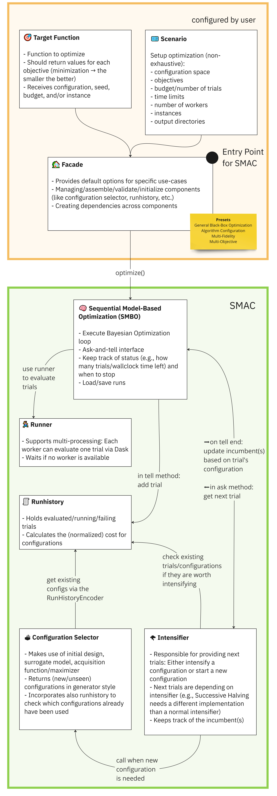

# 术语辨析

**​SMAC：​**即**S**equential **M**odel-based **A**lgorithm **C**onfiguration算法的实现，实现了一种基于随机森林的贝叶斯优化。这里的SMAC库是最初设计用于Auto-WEKA的java版本。

**​SMAC3：​**SMAC3是SMAC的Python实现，用于Auto-sklearn中的超参优化。

# 预备知识

## Ray Tune / SMAC3对比

都是超参数优化工具

**Ray Tune** 是一个超参数优化库，主要针对深度学习和强化学习模型。它结合了很多比较新的算法：hyperband（最低限度地训练可用于确定超参数效果的模型的算法）、population based training（在共享超参数的同时调整多个模型的算法）、hyperopt和中值停止规则（如果模型的性能低于中值就将其停止）。这一切都运行在 Ray 分布式计算平台之上，这使得它具有极高的可扩展性。

**SMAC3**是一个基于Python的自动化超参数优化工具，它可以帮助用户在机器学习和优化问题中自动搜索最佳的超参数配置。SMAC3使用序列模型优化算法（Sequential Model-based Algorithm Configuration）来优化超参数，该算法结合了贝叶斯优化和响应面方法，可以在较少的迭代次数内找到最佳的超参数配置。SMAC3还提供了一些特性，如并行化搜索、多目标优化、嵌套优化等，使其在实际应用中更加灵活和高效。

## 黑盒优化问题

黑盒优化问题目标函数的表达式未知，只能根据离散的自变量取值得到对应的目标函数值。**超参数优化属于黑盒优化问题**，在优化过程中只能得到函数的输入和输出，不能获取优化目标函数的表达式和梯度信息，这一特点给超参数优化带来了困难。对于某些机器学习模型，超参数数量较大，是高维优化问题。对模型进行评估即计算目标函数的值在很多情况下成本高昂，因为这意味着要以某种超参数配置训练机器学习模型，并在验证集上计算精度等指标。常用的超参数优化方法有网格搜索（Grid search），随机搜索（Random search），遗传算法，贝叶斯优化（Bayesian Optimization）等。
**网格搜索**：每个超参数用规则得到几个枚举点，然后交叉组合得到一堆解，挨个枚举选出结果最好的超参数。
**随机搜索**：将超参数随机地取某些值，比较各种取值时算法的性能，得到最优超参数值。

`网格搜索和随机搜索没有利用已搜索点的信息，使用这些信息指导搜索过程可以提高结果的质量以及搜索的速度。`

**贝叶斯优化**利用之前已搜索点的信息确定下一个搜索点，用于求解维数不高的黑盒优化问题。

算法的**思路**是首先生成一个初始候选解集合，然后根据这些点寻找下一个有可能是极值的点，将该点加入集合中，重复这一步骤，直至迭代终止。最后从这些点中找出极值点作为问题的解。

# 作用

SMAC3是一个灵活的开源贝叶斯优化(BO)包，它实现了几种BO方法，提供了不同的外观(facade)，隐藏了不必要的复杂性，使其可以轻松地应用于不同的超参数优化任务。
SMAC3的优点包括：

1. 多种BO方法：SMAC3实现了多种BO方法，包括随机搜索、贝叶斯优化、序列模型优化等，可以根据不同的任务选择最合适的BO方法。
2. 不同的外观：SMAC3提供了不同的外观，包括命令行界面、Python API和Web界面等，可以根据用户的需求选择最合适的外观。
3. 易于使用：SMAC3隐藏了BO的复杂性，提供了简单易用的接口，使得用户可以轻松地使用BO进行HPO任务。
4. 鲁棒性：SMAC3经过了广泛的测试和验证，具有很高的鲁棒性，可以在不同的环境和任务中稳定地运行。

# 原理

SMAC需要四个核心组件：**配置空间**(configuration space)，**目标函数**(target function)，**场景**(scenario) 和**facade**来运行优化过程。
它们以以下方式进行交互：



## Configuration Space

定义一组可以在优化过程中进行调优的超参数。

```python
from ConfigSpace import ConfigSpace

cs = ConfigurationSpace({
    "myfloat": (0.1, 1.5),                # Uniform Float
    "myint": (2, 10),                     # Uniform Integer
    "species": ["mouse", "cat", "dog"],   # Categorical
})
```

## Target Function

要优化的函数，它可以是机器学习模型的准确性，算法的运行时间，或者我们想要最大化或最小化的任何其他指标。

```python
def train(self, config: Configuration, seed: int) -> float:
    model = MultiLayerPerceptron(learning_rate=config["learning_rate"])
    model.fit(...)
    accuracy = model.validate(...)

    return 1 - accuracy  # SMAC always minimizes (the smaller the better)
```

## Scenario

定义了优化过程发生的上下文。它包括正在使用的数据集、正在使用的硬件和任何其他相关信息。

```python
from smac import Scenario

scenario = Scenario(
    configspace=cs,
    output_directory=Path("your_output_directory")
    walltime_limit=120,  # Limit to two minutes
    n_trials=500,  # Evaluated max 500 trials
    n_workers=8,  # Use eight workers
    ...
)
```

## Facade

是SMAC和目标函数之间的接口。它为SMAC提供了评估不同超参数配置的目标函数的能力。
可以直接从`smac`模块导入facade。

```python
from smac import BlackBoxFacade as BBFacade
from smac import HyperparameterOptimizationFacade as HPOFacade
from smac import MultiFidelityFacade as MFFacade
from smac import AlgorithmConfigurationFacade as ACFacade
from smac import RandomFacade as RFacade
from smac import HyperbandFacade as HBFacade

smac = HPOFacade(scenario=scenario, target_function=train)
smac = MFFacade(scenario=scenario, target_function=train)
smac = ACFacade(scenario=scenario, target_function=train)
smac = RFacade(scenario=scenario, target_function=train)
smac = HBFacade(scenario=scenario, target_function=train)
```

**通过这四个组件的结合，SMAC能够高效地搜索超参数空间，找到目标函数的最优配置。**

# 调优流程

## 导入依赖项

```python
......
from smac import ......
......
```

## 加载训练数据

```python
# example
digits = load_digits()
```

## 定义调优的参数空间、训练过程

```python
# example
class MLP:
    # @property 装饰器就是负责把一个方法变成属性调用
    @property 
    def configspace(self) -> ConfigurationSpace:
        # 构建配置空间，定义所有参数及其范围。
        cs = ConfigurationSpace()

        n_layer = UniformIntegerHyperparameter(
            "n_layer",
            lower=1,
            upper=5,
        )

        n_neurons = BetaIntegerHyperparameter(
            "n_neurons",
            lower=8,
            upper=256,
            alpha=4,
            beta=2,
            log=True,
        )

        ......

        # 添加所有超参数:
        cs.add_hyperparameters([n_layer, n_neurons, activation, optimizer, batch_size, learning_rate_init])

        return cs

    def train(self, config: Configuration, seed: int = 0) -> float:
            # 分类器，模型相关
            classifier = MLPClassifier(
                hidden_layer_sizes=[config["n_neurons"]] * config["n_layer"],
                solver=config["optimizer"],
                batch_size=config["batch_size"],
                activation=config["activation"],
                learning_rate_init=config["learning_rate_init"],
                random_state=seed,
                max_iter=5,
            )

            # 模型相关
            # Returns the 5-fold cross validation accuracy
            cv = StratifiedKFold(n_splits=5, random_state=seed, shuffle=True)  # to make CV splits consistent
            score = cross_val_score(classifier, digits.data, digits.target, cv=cv, error_score="raise")
        # 返回想要优化的指标
        return 1 - np.mean(score)
```

## 在main函数中开启调优

```python
if __name__ == "__main__":
    mlp = MLP()
    default_config = mlp.configspace.get_default_configuration()

    # 定义环境变量
    scenario = Scenario(mlp.configspace, n_trials=40)

    # 在初始设计中包含默认配置（可选）
    initial_design = HyperparameterOptimizationFacade.get_initial_design(
        ......
    )

    # 定义先验 acquisition function（可选）
    acquisition_function = PriorAcquisitionFunction(
        acquisition_function=HyperparameterOptimizationFacade.get_acquisition_function(scenario),
        ......
    )

   ......

    # 创建SMAC facade 并传递scenario和train方法
    smac = HyperparameterOptimizationFacade(
        scenario,
        mlp.train,
        initial_design=initial_design,
        acquisition_function=acquisition_function,
        intensifier=intensifier,
        overwrite=True,
    )

    incumbent = smac.optimize()

    # 获取默认配置的cost
    default_cost = smac.validate(default_config)
    print(f"Default cost: {default_cost}")

    # 获取incumbent的cost
    incumbent_cost = smac.validate(incumbent)
    print(f"Incumbent cost: {incumbent_cost}")
```

完整代码：https://codehub-y.huawei.com/Kunpeng_Multi_Core_Framework_Group/AISystem/TestCode/files?ref=person_z00621429&filePath=Smac_test%2FMlp_Test.py&isFile=true

# Components介绍

除了常用的Configuration Space、Target Function、Scenario、Facade以外，SAMC3还提供了Surrogate Model、Acquisition Function、Acquisition Maximizer、Initial Design等其他高级的Components。这些Component都用于指导优化过程，**简单的更改可能会极大地影响结果**。

## Surrogate Model

Surrogate Model即代理模型，用于逼近配置的目标函数。
**核心思想**：使用高斯过程模型来建立目标函数的代理模型，并使用贝叶斯优化算法来选择下一个函数评估点。通过不断更新代理模型和选择最优的评估点，可以在较少的函数评估次数内找到全局最优解。

## Acquisition Function

Acquisition Function即采集函数，是贝叶斯优化中用于选择下一组要评估的超参数的方法，使用由代理模型生成的预测均值和预测方差。
Acquisition Function由Acquisition Maximizer使用，**在facade中默认为None**，SMAC提供了一系列不同的采集函数：

- Lower Confidence Bound
- Expected Improvement
- Probability Improvement
- Thompson
- Integrated acquisition functions
- Prior acquisition functions

## Acquisition Maximizer

Acquisition Maximizer是Acquisition Function的包装器，**在facade中默认为None**。它返回下一个配置。SMAC提供的Acquisition Maximizer有：

- local search
- (sorted) random search
- local and (sorted) random search
- differential evolution

## Initial Design

Initial Design生成初始数据点用来训练Surrogate Model。
SMAC提供的Initial Design有：

- random
- latin hypercube
- sobol
- factorial
- default

## Random Design

Random Design被用在acquisition maximizer来判断下一个配置应该是随机的还是从Acquisition Function中采样，**在facade中默认为None**。这种设计确保了优化过程不会陷入局部最优，确保随着时间的推移找到最佳配置。SMAC提供的Random Design有：

- random design
- annealing design
- modulus random design


