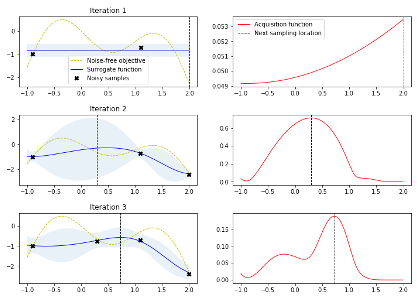
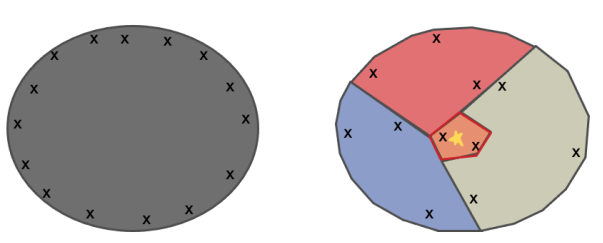

# 预备知识

## 点估计 vs 区域估计

点估计和区域估计都是统计学中常用的估计方法。
**点估计**：通过样本数据来估计总体参数的值，得到一个具体的数值作为总体参数的估计值。例如，通过样本数据估计总体均值、总体方差等参数。
**区域估计**：通过样本数据来估计总体参数的值，**并给出一个区间作为总体参数的估计值**。例如，通过样本数据估计总体均值的置信区间，可以得到一个区间，这个区间内的值有一定的概率包含总体均值。
**优缺点**：

* 点估计简单直观，但是不够准确，因为它只给出了一个具体的数值作为总体参数的估计值。
* 区域估计更加准确，因为它给出了一个区间作为总体参数的估计值，可以反映出总体参数的不确定性。但是，区间估计需要更多的计算和分析，相对来说更加复杂。

## 异方差性（heteroscedasticity）

异方差性（heteroscedasticity）是指随着自变量的变化，因变量的方差也会发生变化。它会导致回归分析的结果不准确，使得模型的预测能力降低。

# LA-MCTS（隐动作集蒙特卡洛树搜索）

LA-MCTS是基于蒙特卡洛树搜索（MCTS）的黑盒优化算法。

## LA-MCTS的动机

解决贝叶斯优化在高维空间存在过渡探索的问题。
​**贝叶斯优化的问题**​：在高纬问题中，贝叶斯优化会过度的探索边界，导致大量的样本被浪费。为了理解这个问题，我们来看下面优化一个一维函数的例子。左图中的 x 是从 iteration 1-> iteration3 的采样，右图是 acquisition function，最高的地方即是采样点。可以看出前几个 iteration 基本在探索那些附近没有样本的区域。

当问题纬度扩展到 20d+，贝叶斯优化一开始就需要非常多的点来探索搜索空间。这也就是为什么很多人会观测到，在高纬度问题中，贝叶斯优化在少量样本下，会跟随机搜索差不多。
而这些一开始作为探索的样本，一般都会落在搜索空间的边界。至于为什么会是边界，这个跟欧几里得空间有关。简单来说，一个立方体，靠近边界部分的体积会远大与内核部分的体积。以此类推，在一个 n 维立方体里，大部分的搜索空间都在边界，所以探索一开始会探索边界。

## LA-MCTS思想

为了解决贝叶斯优化在高维空间过渡探索的问题，我们的解决方案是，去学习切割搜索空间。这里的核心动机如下图。当我们切分搜索空间后，把原问题划分为更小的子问题，然后用贝叶斯优化来解。虽然在子问题也会出现过度探索，但是这个时候的样本落点和原问题的样本落点很不一样，如下图。所以划分子空间后，可以从某种程度上减轻过度探索的问题。

LA-MCTS 的核心思想就是，我们希望学习一些边界去划分搜索空间。这些边界还能够自动去适应函数值的变化。当我们在划分出来的好的空间去采样的时候，出来的样本也期望是好的，同理在坏的空间，采样出来的样本也相对较差。

