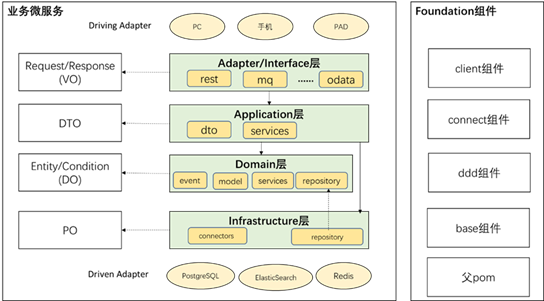

统一参考架构在管理客户的实践总结。

# 微服务代码架构

**mcr-service**

 **│ ─ mcr-adapters (module)                                    --服务适配**

 │   │─ mcr-adapter-rest (module)                            --对外服务适配层实现，实现standard-interface

 **│**     └─ **resources                                     --资源文件**     

 │      │ ─ openapi                                            --openapi yaml定义

 │   │─ mcr-adapter-mq (module)

 │   │─ mcr-adapter-xxx (module)

 **│ ─ mcr-starters (module)                                   --启动**

 **│   └─ mcr-starter-jalor (module)**

 **│ ─ mcr-spi-extensions (module)                              --服务级扩展插件**

 **│ ─ mcr-spi (module)                                     --服务级扩展插件开发sdk**

 **│ ─ mcr-standard (module)                                    --通用层领域逻辑封装，框架无关**

 **│   │ ─ com.xxx.meta.crm.salescloud.mcr.application (package)            --应用服务层**

 **│   │   │ ─** com.xxx.meta.crm.salescloud.mcr.appllication.dto

 **│   │   │ ─** com.xxx.meta.crm.salescloud.mcr.appllication.service

 **│   │ ─ com.xxx.meta.crm.salescloud.mcr.domain (package)            --领域层** 

 │   │   │ ─ com.xxx.meta.crm.salescloud.mcr.domain.*{account}*.event        --领域事件定义

 │   │   │ ─ com.xxx.meta.crm.salescloud.mcr.domain.*{account}*.model       --领域实体定义

 │   │   │ ─ com.xxx.meta.crm.salescloud.mcr.domain.*{account}*.service        --领域服务

 │   │   │ ─ com.xxx.meta.crm.salescloud.mcr.domain.*{account}*.repository      --数据访问接口定义

 │   │   └─ com.xxx.meta.crm.salescloud.mcr.domain.*{account}*.delegate       --外部服务访问接口定义

 **│   │ ─ com.xxx.meta.crm.salescloud.mcr.infrastructure (package)          --基础设施层**

 │   │   │─ com.xxx.meta.crm.salescloud.mcr.infrastructure.connectors       --外部服务接口

 │   │   └─ com.xxx.meta.crm.salescloud.mcr.infrastructure.repository       --数据访问接口实现   

 **│**   └─ **resources                                     --资源文件**     

 │      │ ─ config                                        --应用配置

 │      │ ─ i18n                                         --国际化    

 │      │ ─ migration                                    --数据库DDL

 **│ ─ mcr-spi-extensions-test (module)                            --测试** 

 **└─ mcr-standard-test (module)                                 --测试** 

# 各工程之间的调用关系参考如下

