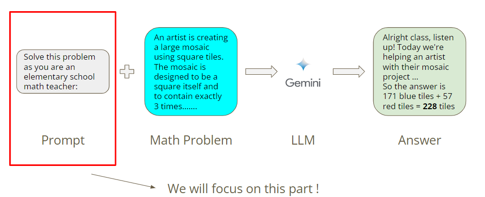
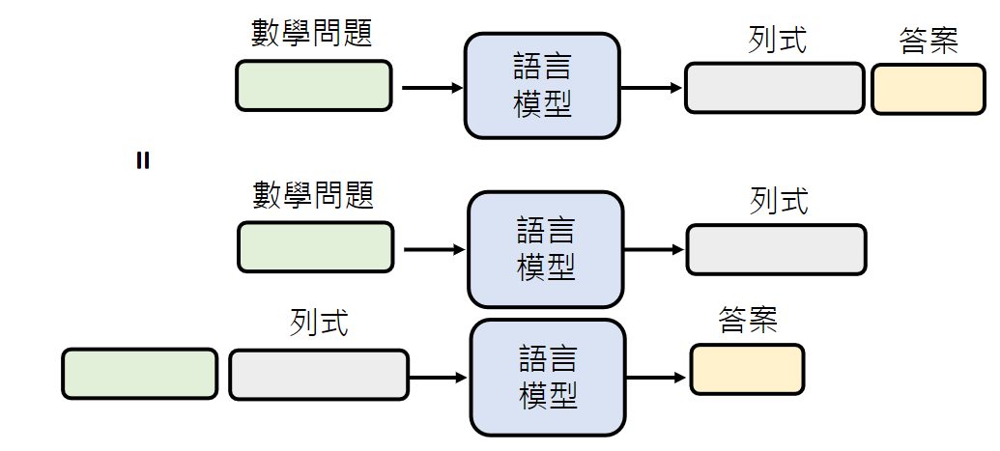

# Task Introduction 

这次作业的任务是设计prompt来提升Gemini解决数学问题的正确率。具体的：
- 你需要设计一个prompt来帮助Gemini更有效地解决数学问题；
- 我们提供了30个数学问题，你需要想出一个prompt，使Gemini在这些问题上始终保持较高的正确率；
如下图所示，只需要关注如何设计promot。



# Workflow

Step 0: Set up your Gemini API Key

Step 1: Design your prompt

Step 2: Check your prompt

Step 3: Evaluate your prompt

Step 4: Save and download your prompt

**作业需用到的colab链接如下：**

https://colab.research.google.com/drive/16JzVN_Mu4mJfyHQpQEuDx1q6jI-cAnEl?hl=zh-tw#scrollTo=RffmMGTYB4fV&uniqifier=1

# Solution

本次作业的重点是设计合适的Prompt，提高Gemini解答数学问题的正确率。至于如何设置Gemini API、如何使用Colab完成作业......请参考Slides：

https://docs.google.com/presentation/d/1IgRKo5D24opcSGMNU2ws_EfTng7ESQSDE4i9ehkKbj8/edit#slide=id.g265dcb76aea_0_0

## Test1

我们不加修饰的把问题的题干直接传给Gemini：

```
Prompt: {{question}}
```

在30个数学题上的准确率只有60.0%

```
Final accuracy: Trial 1, accurate_count: 14, total_count: 30, accuracy: 46.666666666666664%
Trial 2, accurate_count: 15, total_count: 30, accuracy: 50.0%
Trial 3, accurate_count: 17, total_count: 30, accuracy: 56.666666666666664%
Final Accuracy: 60.0%
```

## Test2

我们换一个Prompt试试

```
Don't think just feel
Q:{{question}}
```

在30个数学题上的准确率降低到26.666666666666668%，**看来Prompt对Gemini的影响很大**。

```
Final accuracy: Trial 1, accurate_count: 11, total_count: 30, accuracy: 36.666666666666664%
Trial 2, accurate_count: 5, total_count: 30, accuracy: 16.666666666666664%
Trial 3, accurate_count: 11, total_count: 30, accuracy: 36.666666666666664%
Final Accuracy: 26.666666666666668%
```

# Test3

接下来我们尝试一些构造Prompt的技巧。

1. Zero Shot Chain of Thought

   ```
   Q: {{question}}
   A: Let’s think step by step
   ```

   参考：[[2205.11916\] Large Language Models are Zero-Shot Reasoners (arxiv.org)](https://arxiv.org/abs/2205.11916)

   准确率略有提升，达到63.33333333333333%

   ```
   Final accuracy: Trial 1, accurate_count: 16, total_count: 30, accuracy: 53.333333333333336%
   Trial 2, accurate_count: 17, total_count: 30, accuracy: 56.666666666666664%
   Trial 3, accurate_count: 21, total_count: 30, accuracy: 70.0%
   Final Accuracy: 63.33333333333333%
   ```

2. In-Context Learning

   ```
   Q: Shawn has five toys.For Christmas, he got two toys each from his mom and dad.How many toys doe she have now?
   A: He has 5 toys. He got 2 from mom, so after that he has 5+2=7 toys. Then he got 2 more from dad, so in total he has 7+2=9 toys. The answer is 9.
   Q: {{question}}
   A:
   ```

   参考：https://arxiv.org/abs/2201.11903

   准确率依然只有60.0%

   ```
   Final accuracy: Trial 1, accurate_count: 16, total_count: 30, accuracy: 53.333333333333336%
   Trial 2, accurate_count: 17, total_count: 30, accuracy: 56.666666666666664%
   Trial 3, accurate_count: 16, total_count: 30, accuracy: 53.333333333333336%
   Final Accuracy: 60.0%
   ```

3. Emotional Stimuli

   对模型情绪勒索

   ```
   Q: {{question}} This is very important to my career.
   ```

   参考：[[2307.11760\] Large Language Models Understand and Can be Enhanced by Emotional Stimuli (arxiv.org)](https://arxiv.org/abs/2307.11760)

   准确率提升到73.33333333333333%。

   ```
   Final accuracy: Trial 1, accurate_count: 17, total_count: 30, accuracy: 56.666666666666664%
   Trial 2, accurate_count: 15, total_count: 30, accuracy: 50.0%
   Trial 3, accurate_count: 24, total_count: 30, accuracy: 80.0%
   Final Accuracy: 73.33333333333333%
   ```

4. 拆解任务

   让模型思考(Chain of Thought, CoT)或解释会有用。我们让Gemini一步一步思考并列式计算。

   ```
   Please calculate the following question step by step.
   Q: {{question}}
   ```

   参考：https://arxiv.org/abs/2210.06774

   准确率提升到70.0%

   ```
   Final accuracy: Trial 1, accurate_count: 21, total_count: 30, accuracy: 70.0%
   Trial 2, accurate_count: 19, total_count: 30, accuracy: 63.33333333333333%
   Trial 3, accurate_count: 20, total_count: 30, accuracy: 66.66666666666666%
   Final Accuracy: 70.0%
   ```
   让模型列式计算：

   ```
   Please calculate the following problems by writing out the steps.
   Q: {{question}}
   ```

   

5. 让语言模型检查自己的错误

   语言模型具有自我反省的能力，我们让模型解答数学题之后，再检查一遍是否正确，就像人类考试时一样。

   ```
   Please calculate the following problems step by step, and check for correctness. If there are any mistakes, please correct them.
   Q: {{question}}
   ```
   参考：https://arxiv.org/abs/2212.08073

   准确率提升到76.66666666666667%

   ```
   Final accuracy: Trial 1, accurate_count: 23, total_count: 30, accuracy: 76.66666666666667%
   Trial 2, accurate_count: 21, total_count: 30, accuracy: 70.0%
   Trial 3, accurate_count: 21, total_count: 30, accuracy: 70.0%
   Final Accuracy: 76.66666666666667%
   ```

# Conclusion

本次作业是关于Prompt Engineering，可以在不训练模型的情况下强化语言模型。主要的方法有：

1. Chain of Thought (CoT)

   让模型思考。我们在下Prompt的时候，告诉模型"Let's think step by step"之类的语句。

2. 对模型情绪勒索
	Prompt加上表达感情的句子，例如"This is very important to my career."

3. In-context learning  

  Prompt中提供范例给模型。

4. 把任务分多步来解

   为什么叫模型思考(Chain of Thought, CoT)或解释会有用？

   将复杂问题拆解成若干步骤。例如解数学题，语言模型先列式再写答案，等同于根据列示的结果产生答案。就算是人类，从数学问题直接得到答案，也是困难的。

   

   

5. 让模型检查自己的错误
    很多问题是得到答案难，但验证答案是否正确很容易。


