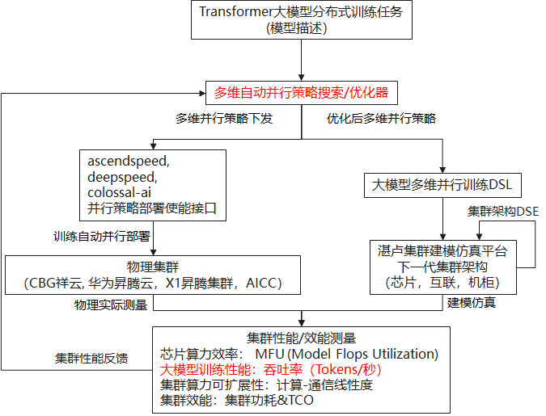
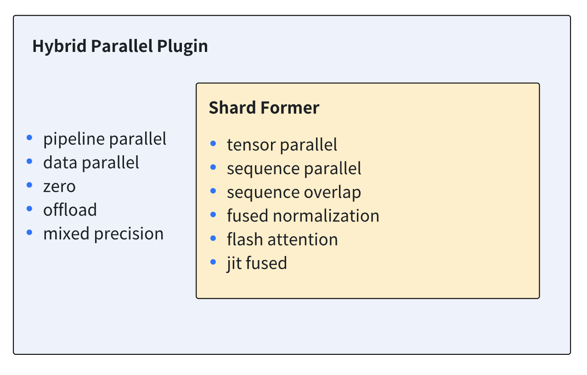
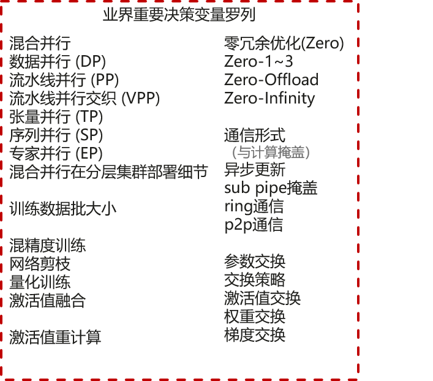

# 背景介绍

## 研究背景

1.Transformer已广泛成为各领域的基础模型。

2.大模型是趋势，最大化训练效率是要求，分布式训练是必然
 （DeepSpeed，Megatron）。

3.为减少工程负担、快速迭代和实验、探索下一代集群架构，湛卢平台衍生出自动并行策略搜索/优化需求。

## 优化器使用场景

1.对接AscendSpeed, DeepSpeed, Colossal-AI等多维并行自动使能框架的实测场景；

2.对接湛卢建模仿真平台的仿真场景。

# 使用场景 - 并行策略部署使能接口

## AscendSpeed

| 项                                                           | 说明                                              |
| ------------------------------------------------------------ | ------------------------------------------------- |
| --tensor-model-parallel-size                                 | TP张量并行                                        |
| --sequence parallel                                          | SP序列并行                                        |
| --pipeline-model-parallel-size                               | PP流水线并行                                      |
| --num-layers-per-virtual-pipeline-stagesa --no-overlap-p2p-communicatione | PPint流水线交织数(VPP虚拟流水线并行)              |
| --optimized-pipeline --manual-mbs example-config-1       | PP优化相关(DPP)                                   |
| --fold-mode "aiao"                                           | PP通信时间隐藏(Fold3D)                            |
| --checkpoint-activations                                     | 选择性重计算                                      |
| --auto-recompute-profiling-step                              | 自适应选择性冲计算的停止profiling步数             |
| --checkpoint-policy                                          | 重计算策略(注:在Ascend上做了定制和优化)           |
| --sequence-parallel                                          | 序列并行,要求TP>1                                 |
| --use-distributed-optimizer                                  | 配置ZeRO-1/2/3,其中2,3需要deepspeed config        |
| --triangle-attn                                              | flash attention                                   |
| --optimizer                                                  | 算子融合(fused kernels) 优化, adam、fused adam... |
| --mIp-layer-fusion                                           | FFN合并及梯度累积                                 |
| --release-fp32-grad                                          | 混精显存优化                                      |

## Colossal-AI

例如`colossalai.booster.plugin.HybridParallelPlugin`接口。

# 研究问题定义 – 从多维自动并行到高维自动并行
## 关键困难
1. 并行训练策略参数空间高维、复杂，涵盖业界范围重要决策变量近30个；

   

2. 并行策略对训练任务性能的影响巨大单一参数变动即可导致性能折半，或直接无法训练；

