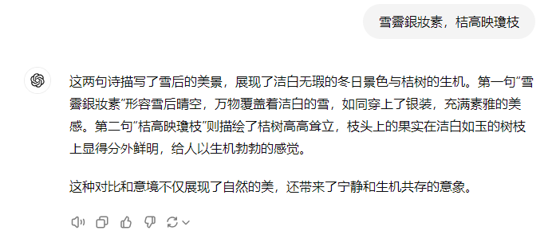
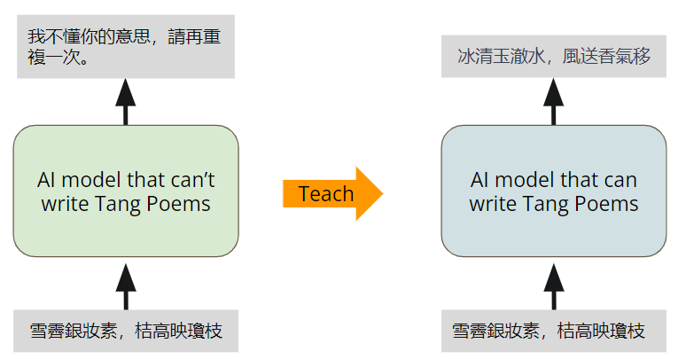
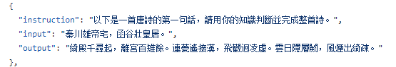
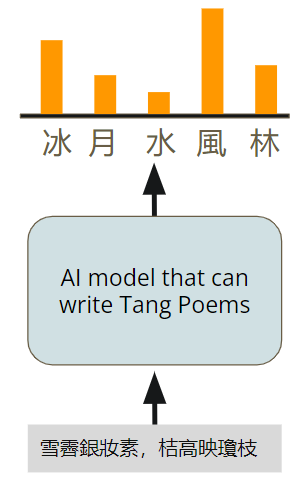
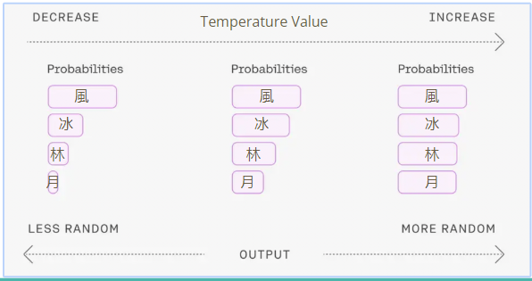
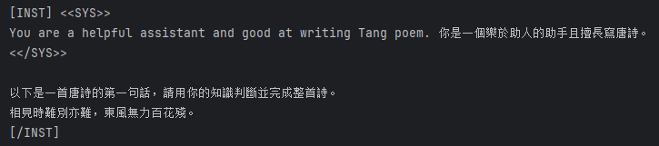

#  Task Overview

训练一个会写唐诗的AI模型。给定AI模型诗的前两句，写出诗的后两句。

原本的LLM不具备写诗的能力。我们用ChatGPT和kimi都试一下👇，它们无一例外都输出了对诗的鉴赏。




没有经过Fine-tuning的模型，不具备写唐诗的能力。我们的目的是教AI模型写唐诗。




#  Model and Dataset

## Model

实验提供了两个70亿参数的模型可供选择：

1. Taide-7B：Taide7B模型是“可信AI对话引擎”（TAIDE）项目的一部分，主要为台湾开发。该模型基于LLaMa模型，专注于处理繁体中文任务，包括翻译、摘要、信件写作和文章生成。
2. MediaTek Breeze 7B：MR Breeze-7B 是联发科旗下研究机构联发科技研究中心（MediaTek Research）开发的一款全新开源大语言模型（LLM），专为处理繁体中文和英文而设计。这款模型拥有70亿个参数，基于广受赞誉的Mistral模型进行设计和优化。

## Dataset

专门用于微调LLM的唐诗数据集 [Tang poem dataset](https://github.com/CheeEn-Yu/GenAI-Hw5)，里面包含5000首诗。



dataset主要包含两个JSON文件：

- Tang_testing_data.json：测试集，包含15条数据
- Tang_training_data.json：训练集，包含5001条数据

训练集数据如上图所示，包含`instruction`, `input`, `output`；测试集只包含`instruction`, `input`，答案在Tang_tesing_gt.txt文件中。

# Changing the Generation Behavior:Decoding Parameters

生成式模型选择下一个token的方法是：从下一个token的分布中采样。



通过改变采样方式，可以改变语言模型生成下一个token的方式。

我们可以调整模型超参数，控制模型的行为。让模型的输出：longer vs. shorter; diverse vs.static；超参数有：

- temperature
- Top-k
- Top-p
- max_length

## Temperature

temperature控制模型输出的diversity。它改变了数据的分布概率，temperature越小，模型的输出越固定；temperature越大，模型的输出越随机，输入同样prompt，模型的输出差异很大。



## Top-K

Top-K表示每次选择几率最高的K个字，然后在K个字中作random search，选择一个字作为下一个token。

## Top-P

Top-P表示每次选择几率加起来<p的token组合，然后在该组合里面作random search。

## Max_length

模型输出的最大长度。max_length过小，模型的输出会被截断；max_length过大，会消耗过多的计算资源。

# 代码介绍

[code](https://colab.research.google.com/drive/1nB3jwRJVKXSDDNO-pbURrao0N2MpqHl8?usp=sharing&fbclid=IwAR3AeFT3dCW1BED25hPaMJ2AUyZ_N-1vya7Or7LaRKg2uvMeBZdWF7w3yJs)

## Fix Random Seeds

微调过程中可能会涉及一些随机性。固定随机种子，使结果具有可重复性。

```python
seed = 42
torch.backends.cudnn.deterministic = True
torch.backends.cudnn.benchmark = False
torch.manual_seed(seed)
if torch.cuda.is_available():
    torch.cuda.manual_seed_all(seed)
```

## 加载LLM

使用transformers库的AutoModelForCausalLM来加载模型，cache_dir为下载模型的目录。

```python
cache_dir = "./cache"

nf4_config = BitsAndBytesConfig(
   load_in_4bit=True,
   bnb_4bit_quant_type="nf4",
   bnb_4bit_use_double_quant=True,
   bnb_4bit_compute_dtype=torch.bfloat16
)

# 從指定的模型名稱或路徑載入預訓練的語言模型
model = AutoModelForCausalLM.from_pretrained(
    model_name,
    cache_dir=cache_dir,
    quantization_config=nf4_config,
    low_cpu_mem_usage = True
)

```

## 加载tokenizer

加载LLM的tokenizer。在LLM中，tokenizer是一个关键组件，用于将输入的文本转换成模型可以理解的数字序列。

```python
# 創建 tokenizer 並設定結束符號 (eos_token)
logging.getLogger('transformers').setLevel(logging.ERROR)
tokenizer = AutoTokenizer.from_pretrained(
    model_name,
    add_eos_token=True,
    cache_dir=cache_dir,
    quantization_config=nf4_config
)
tokenizer.pad_token = tokenizer.eos_token
```

## 设置解码参数

设置模型作inference时的decoding parameters；

```python
# 設定模型推理時需要用到的decoding parameters
max_len = 128
generation_config = GenerationConfig(
    do_sample=True,
    temperature=0.1,
    num_beams=1,
    top_p=0.3,
    no_repeat_ngram_size=3,
    pad_token_id=2,
)
```

## LLM 和 tokenizer 使用示例

下面的代码使用instruction和poem组成一个prompt:

```python
instruction = '以下是一首唐詩的第一句話，請用你的知識判斷並完成整首詩。'
poem = '相見時難別亦難，東風無力百花殘。'

prompt = f"""\
[INST] <<SYS>>
You are a helpful assistant and good at writing Tang poem. 你是一個樂於助人的助手且擅長寫唐詩。
<</SYS>>

{instruction}
{poem}
[/INST]"""
print(prompt)
```



使用tokenizer对prompt做分词，得到分词后各个token的token_id:

```python
inputs = tokenizer(prompt, return_tensors="pt")
print(inputs)
```

```
{'input_ids': tensor([[    1,   733, 16289, 28793,  2087, 18741,  4060,    13,  1976,   460,
           264, 10865, 13892,   304,  1179,   438,  3653,   320,   602, 16067,
         28723, 28705, 44845, 42171, 51736, 30278, 43308, 51301, 29958, 45695,
         32746, 59631, 28944,    13, 28789,   700, 18741,  4060,    13,    13,
         42564, 28971, 47223, 59631, 28914, 42436, 50175, 28924, 30539, 28963,
         42378, 42546, 43316, 31439, 42292, 29681, 29993, 34965, 28944,    13,
         52324, 29607, 35512, 30798, 32026, 35512, 28924, 55607, 45898, 30421,
         30064, 33504, 28944,    13, 28792, 28748, 16289, 28793,     2]]), 'attention_mask': tensor([[1, 1, 1, 1, 1, 1, 1, 1, 1, 1, 1, 1, 1, 1, 1, 1, 1, 1, 1, 1, 1, 1, 1, 1,
         1, 1, 1, 1, 1, 1, 1, 1, 1, 1, 1, 1, 1, 1, 1, 1, 1, 1, 1, 1, 1, 1, 1, 1,
         1, 1, 1, 1, 1, 1, 1, 1, 1, 1, 1, 1, 1, 1, 1, 1, 1, 1, 1, 1, 1, 1, 1, 1,
         1, 1, 1, 1, 1, 1, 1]])}
```

输出`input_ids`和`attention_mask`组成的dict。

- input_ids: size为[batch, 分此后tokens的个数]，其中每此表中的个元素是分词后的token在词表中的token_id。

```python
inputs_ids = inputs['input_ids']
inputs_ids.size() 
```

```
torch.Size([1, 79])
```

为了验证一下，我们将token_id还原回token，获得token_id对应的词。

```python
tokenizer.convert_ids_to_tokens([1,   733, 16289, 28793,  2087, 18741,  4060])
```

```
['<s>', '▁[', 'INST', ']', '▁<<', 'SYS', '>>']
```

- attention_mask: size与input_ids一样，元素值为0/1，1代表这个token有用，0代表无用。

  attention_mask的作用是：当batch大于1时，每一行元素的长度值是分词后字符数量最大的，比如两行text做分词，一行被分为10个token，一行被分为20个token，那么分词后的input_ids和attention_mask的size为[2, 20]，attention_mask[0]就是前10个元素为1，后10个为0。attention_mask[1]全部为1。

将`inputs_ids`输入LLM生成文本。

```python
# 使用模型進行生成回覆
generation_output = model.generate(
    input_ids=inputs_ids,
    generation_config=generation_config,
    return_dict_in_generate=True,
    output_scores=True,
    max_new_tokens=max_len,
    )
generation_output.sequences
```

输出为一组token_ids。

```python
tensor([[    1,   733, 16289, 28793,  2087, 18741,  4060,    13,  1976,   460,
           264, 10865, 13892,   304,  1179,   438,  3653,   320,   602, 16067,
         28723, 28705, 44845, 42171, 51736, 30278, 43308, 51301, 29958, 45695,
         32746, 59631, 28944,    13, 28789,   700, 18741,  4060,    13,    13,
         42564, 28971, 47223, 59631, 28914, 42436, 50175, 28924, 30539, 28963,
         42378, 42546, 43316, 31439, 42292, 29681, 29993, 34965, 28944,    13,
         52324, 29607, 35512, 30798, 32026, 35512, 28924, 55607, 45898, 30421,
         30064, 33504, 28944,    13, 28792, 28748, 16289, 28793,     2, 28705,
         29367, 30606, 29607, 35512, 29062, 32026, 35512, 30798, 28924, 55607,
         32329, 33089, 30421, 30064, 33485, 33504, 33504, 28944,     2]])
```

把输出的token_ids交给tokenizer做decode解码，可以看到输出一段文字。

```python
tokenizer.decode(generation_output.sequences[0])
```

```
<s> [INST] <<SYS>>\nYou are a helpful assistant and good at writing Tang poem. 你是一個樂於助人的助手且擅長寫唐詩。\n<</SYS>>\n\n以下是一首唐詩的第一句話，請用你的知識判斷並完成整首詩。\n相見時難別亦難，東風無力百花殘。\n[/INST]</s> 相望時難分亦難別，東風吹拂百花欲殘殘。</s>
```

## generate_training_data函数

`generate_training_data()`输入`data_point`(instruction+input+output)，输出模型可以读取的token。

1. 按照固定的格式将`data_point`转化成prompt:

   ```python
   # construct full input prompt
       prompt = f"""\
   [INST] <<SYS>>
   You are a helpful assistant and good at writing Tang poem. 你是一個樂於助人的助手且擅長寫唐詩。
   <</SYS>>
   
   {data_point["instruction"]}
   {data_point["input"]}
   [/INST]"""
   ```

2. 使用`tokenizer`解析prompt，返回含"input_ids"、"labels"和"attention_mask"的dict。

   ```python
   # transform input prompt into tokens
       full_tokens = tokenizer(
           prompt + " " + data_point["output"] + "</s>",
           truncation=True,
           max_length=CUTOFF_LEN + 1,
           padding="max_length",
       )["input_ids"][:-1]
       return {
           "input_ids": full_tokens,
           "labels": [-100] * len_user_prompt_tokens
           + full_tokens[len_user_prompt_tokens:],
           "attention_mask": [1] * (len(full_tokens)),
       }
   
   ```

## evaluate函数

`evaluate()`函数输入instruction、generation_config、max_len、input，输出模型的响应。

generation_config预先设置如下：

```python
# 設定模型推理時需要用到的decoding parameters
max_len = 128
generation_config = GenerationConfig(
    do_sample=True,
    temperature=0.1,
    num_beams=1,
    top_p=0.3,
    no_repeat_ngram_size=3,
    pad_token_id=2,
)
```

`GenerationConfig` 是一个用于配置文本生成模型的类。它允许用户设置生成过程中使用的各种参数，如最大生成长度、温度、顶级采样等。

## Set Hyperarameters for Fine-tuning

```python
num_train_data = 1040 # 設定用來訓練的資料數量，可設置的最大值為5000。在大部分情況下會希望訓練資料盡量越多越好，這會讓模型看過更多樣化的詩句，進而提升生成品質，但是也會增加訓練的時間
                      # 使用預設參數(1040): fine-tuning大約需要25分鐘，完整跑完所有cell大約需要50分鐘
                      # 使用最大值(5000): fine-tuning大約需要100分鐘，完整跑完所有cell大約需要120分鐘
```

不建议修改的参数：

```python
""" It is recommmended NOT to change codes in this cell """

cache_dir = "./cache"  # 設定快取目錄路徑
from_ckpt = False  # 是否從checkpoint載入模型的權重，預設為否
ckpt_name = None  # 從特定checkpoint載入權重時使用的檔案名稱，預設為無
dataset_dir = "./GenAI-Hw5/Tang_training_data.json"  # 設定資料集的目錄或檔案路徑
logging_steps = 20  # 定義訓練過程中每隔多少步驟輸出一次訓練誌
save_steps = 65  # 定義訓練過程中每隔多少步驟保存一次模型
save_total_limit = 3  # 控制最多保留幾個模型checkpoint
report_to = None  # 設定上報實驗指標的目標，預設為無
MICRO_BATCH_SIZE = 4  # 定義微批次的大小
BATCH_SIZE = 16  # 定義一個批次的大小
GRADIENT_ACCUMULATION_STEPS = BATCH_SIZE // MICRO_BATCH_SIZE  # 計算每個微批次累積的梯度步數
CUTOFF_LEN = 256  # 設定文本截斷的最大長度
LORA_R = 8  # 設定LORA（Layer-wise Random Attention）的R值
LORA_ALPHA = 16  # 設定LORA的Alpha值
LORA_DROPOUT = 0.05  # 設定LORA的Dropout率
VAL_SET_SIZE = 0  # 設定驗證集的大小，預設為無
TARGET_MODULES = ["q_proj", "up_proj", "o_proj", "k_proj", "down_proj", "gate_proj", "v_proj"] # 設定目標模組，這些模組的權重將被保存為checkpoint
device_map = "auto"  # 設定設備映射，預設為"auto"
world_size = int(os.environ.get("WORLD_SIZE", 1))  # 獲取環境變數"WORLD_SIZE"的值，若未設定則預設為1
ddp = world_size != 1  # 根據world_size判斷是否使用分散式數據處理(DDP)，若world_size為1則不使用DDP
if ddp:
    device_map = {"": int(os.environ.get("LOCAL_RANK") or 0)}
    GRADIENT_ACCUMULATION_STEPS = GRADIENT_ACCUMULATION_STEPS // world_size
```

## Start Fine-tuning

将模型准备好，并使用 INT8训练：

```python
# 將模型準備好以使用 INT8 訓練
model = prepare_model_for_int8_training(model)
```

`prepare_model_for_int8_training`是Hugging Face的PEFT(Parameter-Efficient Fine-Tuning)库中的方法，用于准备模型进行INT8训练。INT8训练是将模型的权重转换为8位整数（INT8），以减少内存占用和加速计算，同时尽量保持模型的性能。

```python
# 使用 LoraConfig 配置 LORA 模型
config = LoraConfig(
    r=LORA_R,
    lora_alpha=LORA_ALPHA,
    target_modules=TARGET_MODULES,
    lora_dropout=LORA_DROPOUT,
    bias="none",
    task_type="CAUSAL_LM",
)
```

从原始数据集中加载训练数据，将num_train_data = 1040笔数据写入`tmp_dataset.json`文件。然后使用

```python
# 載入並處理訓練數據
with open(dataset_dir, "r", encoding = "utf-8") as f:
    data_json = json.load(f)
with open("tmp_dataset.json", "w", encoding = "utf-8") as f:
    json.dump(data_json[:num_train_data], f, indent = 2, ensure_ascii = False)
data = load_dataset('json', data_files="tmp_dataset.json", download_mode="force_redownload")
```

数据被分为训练集和验证集。`VAL_SET_SIZE`预设为0，表示没有验证集数据。

```python
# 將訓練數據分為訓練集和驗證集（若 VAL_SET_SIZE 大於 0）
if VAL_SET_SIZE > 0:
    train_val = data["train"].train_test_split(
        test_size=VAL_SET_SIZE, shuffle=True, seed=42
    )
    train_data = train_val["train"].shuffle().map(generate_training_data)
    val_data = train_val["test"].shuffle().map(generate_training_data)
else:
    train_data = data['train'].shuffle().map(generate_training_data)
    val_data = None
```

使用Transformer的Trainer训练模型

```python
# 使用 Transformers Trainer 進行模型訓練
trainer = transformers.Trainer(
    model=model,
    train_dataset=train_data,
    eval_dataset=val_data,
    args=transformers.TrainingArguments(
        per_device_train_batch_size=MICRO_BATCH_SIZE,
        gradient_accumulation_steps=GRADIENT_ACCUMULATION_STEPS,
        warmup_steps=50,
        num_train_epochs=num_epoch,
        learning_rate=LEARNING_RATE,
        fp16=True,  # 使用混合精度訓練
        logging_steps=logging_steps,
        save_strategy="steps",
        save_steps=save_steps,
        output_dir=ckpt_dir,
        save_total_limit=save_total_limit,
        ddp_find_unused_parameters=False if ddp else None,  # 是否使用 DDP，控制梯度更新策略
        report_to=report_to,
    ),
    data_collator=transformers.DataCollatorForLanguageModeling(tokenizer, mlm=False),
)

......

# 開始模型訓練
trainer.train()
```

可以看到使用默认配置训练的结果，loss逐渐降低。

```python
{'loss': 3.3137, 'grad_norm': 2.415785551071167, 'learning_rate': 0.00011399999999999999, 'epoch': 0.31}
{'loss': 2.0632, 'grad_norm': 2.1237754821777344, 'learning_rate': 0.000234, 'epoch': 0.62}
{'loss': 1.9832, 'grad_norm': 1.4616379737854004, 'learning_rate': 0.00011999999999999999, 'epoch': 0.92}
```

## Testing

测试训练好的模型看看效果。

### 加载checkpoints

```python
# find all available checkpoints
ckpts = []
for ckpt in os.listdir(ckpt_dir):
    if (ckpt.startswith("checkpoint-")):
        ckpts.append(ckpt)

# list all the checkpoints
ckpts = sorted(ckpts, key = lambda ckpt: int(ckpt.split("-")[-1]))
print("all available checkpoints:")
print(" id: checkpoint name")
for (i, ckpt) in enumerate(ckpts):
    print(f"{i:>3}: {ckpt}")

```

