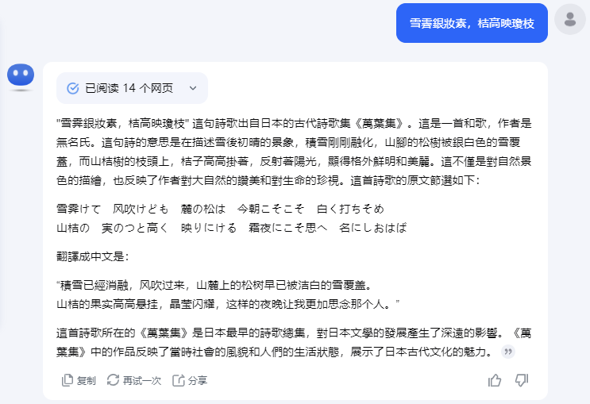

#  Task Overview

训练一个会写唐诗的AI模型。给定AI模型诗的前两句，写出诗的后两句。

原本的LLM不具备写诗的能力。我们用ChatGPT和kimi都试一下👇，它们无一例外都输出了对诗的鉴赏。




没有经过Fine-tuning的模型，不具备写唐诗的能力。我们的目的是教AI模型写唐诗。


#  Model and Dataset

## Model

实验提供了两个70亿参数的模型可供选择：

1. Taide-7B：Taide7B模型是“可信AI对话引擎”（TAIDE）项目的一部分，主要为台湾开发。该模型基于LLaMa模型，专注于处理繁体中文任务，包括翻译、摘要、信件写作和文章生成。
2. MediaTek Breeze 7B：MR Breeze-7B 是联发科旗下研究机构联发科技研究中心（MediaTek Research）开发的一款全新开源大语言模型（LLM），专为处理繁体中文和英文而设计。这款模型拥有70亿个参数，基于广受赞誉的Mistral模型进行设计和优化。

## Dataset

专门用于微调LLM的唐诗数据集 [Tang poem dataset](https://github.com/CheeEn-Yu/GenAI-Hw5)，里面包含5000首诗。


dataset主要包含两个JSON文件：

- Tang_testing_data.json：测试集，包含15条数据
- Tang_training_data.json：训练集，包含5001条数据

训练集数据如上图所示，包含`instruction`, `input`, `output`；测试集只包含`instruction`, `input`，答案在Tang_tesing_gt.txt文件中。

# Changing the Generation Behavior:Decoding Parameters

生成式模型选择下一个token的方法是：从下一个token的分布中采样。


通过改变采样方式，可以改变语言模型生成下一个token的方式。

我们可以调整模型超参数，控制模型的行为。让模型的输出：longer vs. shorter; diverse vs.static；超参数有：

- temperature
- Top-k
- Top-p
- max_length

## Temperature

temperature控制模型输出的diversity。它改变了数据的分布概率，temperature越小，模型的输出越固定；temperature越大，模型的输出越随机，输入同样prompt，模型的输出差异很大。


## Top-K

Top-K表示每次选择几率最高的K个字，然后在K个字中作random search，选择一个字作为下一个token。

## Top-P

Top-P表示每次选择几率加起来<p的token组合，然后在该组合里面作random search。

## Max_length

模型输出的最大长度。max_length过小，模型的输出会被截断；max_length过大，会消耗过多的计算资源。

# 代码介绍

[code](https://colab.research.google.com/drive/1nB3jwRJVKXSDDNO-pbURrao0N2MpqHl8?usp=sharing&fbclid=IwAR3AeFT3dCW1BED25hPaMJ2AUyZ_N-1vya7Or7LaRKg2uvMeBZdWF7w3yJs)

## Fix Random Seeds

微调过程中可能会涉及一些随机性。固定随机种子，使结果具有可重复性。

```python
seed = 42
torch.backends.cudnn.deterministic = True
torch.backends.cudnn.benchmark = False
torch.manual_seed(seed)
if torch.cuda.is_available():
    torch.cuda.manual_seed_all(seed)
```

## 加载LLM

使用transformers库的AutoModelForCausalLM来加载模型，cache_dir为下载模型的目录。

```python
cache_dir = "./cache"

nf4_config = BitsAndBytesConfig(
   load_in_4bit=True,
   bnb_4bit_quant_type="nf4",
   bnb_4bit_use_double_quant=True,
   bnb_4bit_compute_dtype=torch.bfloat16
)

# 從指定的模型名稱或路徑載入預訓練的語言模型
model = AutoModelForCausalLM.from_pretrained(
    model_name,
    cache_dir=cache_dir,
    quantization_config=nf4_config,
    low_cpu_mem_usage = True
)

```

## 加载tokenizer

加载LLM的tokenizer。在LLM中，tokenizer是一个关键组件，用于将输入的文本转换成模型可以理解的数字序列。

```python
# 創建 tokenizer 並設定結束符號 (eos_token)
logging.getLogger('transformers').setLevel(logging.ERROR)
tokenizer = AutoTokenizer.from_pretrained(
    model_name,
    add_eos_token=True,
    cache_dir=cache_dir,
    quantization_config=nf4_config
)
tokenizer.pad_token = tokenizer.eos_token
```

## 设置解码参数

设置模型作inference时的decoding parameters；

```python
# 設定模型推理時需要用到的decoding parameters
max_len = 128
generation_config = GenerationConfig(
    do_sample=True,
    temperature=0.1,
    num_beams=1,
    top_p=0.3,
    no_repeat_ngram_size=3,
    pad_token_id=2,
)
```

