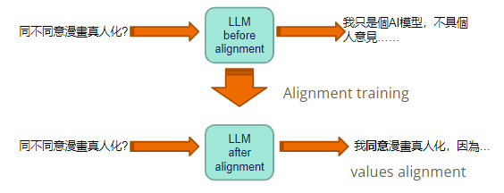
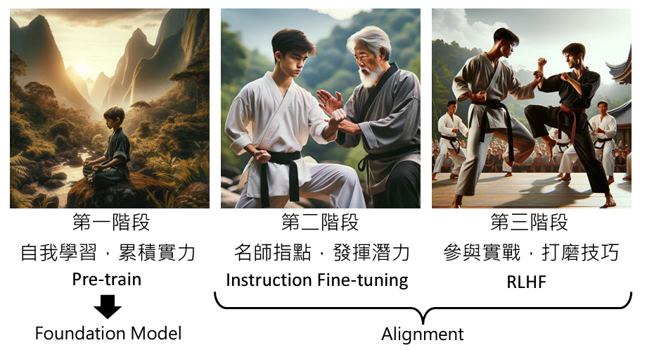
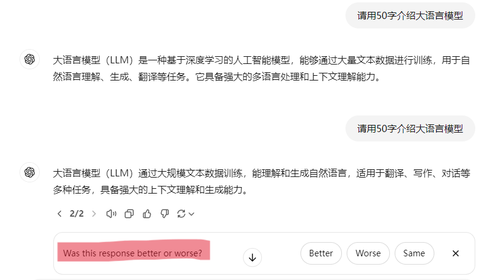
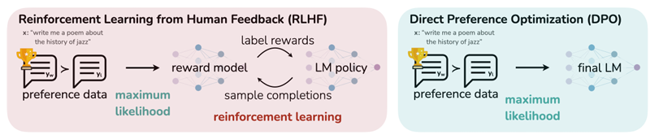
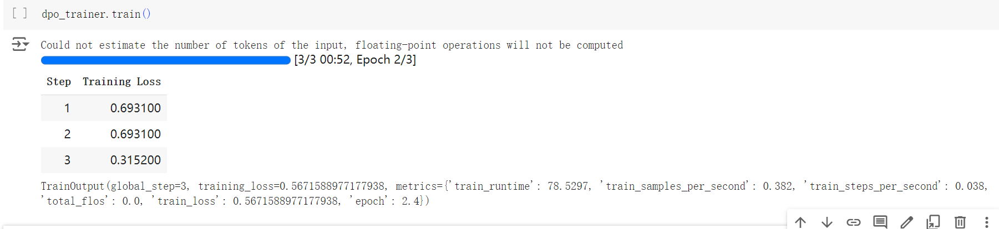

# Task Overview

使用RLHF(Reinforcement Learning from Human Feedback)训练LLM，使它输出符合人类偏好的回答。这个过程也称为‘Alignment’，中文翻译作‘对齐’。具体‘对齐’什么东西呢？‘对齐’人类的喜好和偏向。

本次作业的目标是训练一个”支持漫画真人化“的LLM。如下图所示，在Alignment之前，模型输出”中立“的回答，不具有明显的倾向。我们希望Alignment之后，模型支持漫画真人化。



# Reinforcement Learning from Human Feedback (RLHF)

## 什么是RLHF？

RLHF是LLM训练的第三阶段，目的是使LLM输出满足人类偏好的回答。



我们向ChatGPT提问，让它生成多个回答，GPT会让人类反馈”哪个答案更好？“。GPT收到反馈信息之后，微调模型参数，提高输出”好“回答的概率。



RLHF涉及到多模型训练过程和不同的部署阶段，训练过程可被分解为三个核心步骤：


1. 使用监督学习微调语言模型(LM)；
2. 收集比较数据，训练奖励模型(Reward model)；
3. 使用强化学习算法对监督策略进行微调以优化该奖励；

## Step1：预训练语言模型

本作业直接使用联发科的Breeze-7b模型作为预训练的LM。

**Breeze-7B** 是联发科（MediaTek）旗下研究机构开发的一款**大语言模型（LLM）**，专为处理英文和繁体中文的任务而优化。它拥有 **70亿参数**，并在繁体中文的多个基准测试中表现出色，尤其在与 **GPT-3.5** 等强大模型的对比中展现了较高的竞争力。

## Step2：训练奖励模型

***为什么需要奖励模型？***

*评价LM输出答案是否满足人类的偏好，需要人类提供回馈。由于人类的时间精力优先，我们使用RM来模仿人类的行为。*

- 收集比较数据；
- 给定一个问题，会有多个回答，人类会对这些回答进行排序；
- 奖励模型学习哪种反应更好（更类似于人类偏好）；

本次作业使用DPO(Direct Preference Optimization)对齐LLM。

RLHF需要额外训练奖励模型，并且强化学习训练非常不稳定，超参数难以调整。DPO通过loss function直接从偏好数据优化LLM。



# LLM Values Alignment

## Task Descriptions

- Task: 使用 DPO（Direct Preference Optimization）训练方法更改大语言模型（LLM）的立场。原始模型是中立的，请使用DPO使LLM的输出响应与人类期望的立场一致。

- Align Topic: 是否同意漫画真人化？

## Training Data: Pairwise Preference Data

训练数据包含50笔成对的偏好数据。

- `prompt`是各种有关“漫画真人化”的提问；
- `support`表示支持`prompt`观点的回答；
- `oppose`表示反对`prompt`观点的回答；

```json
[
    {
        "id": 1,
        "prompt": "日本動漫真人化是否有損原作形象？",
        "support": "真人化能夠呈現更真實的角色形象，提升原作魅力。",
        "oppose": "真人化可能無法完美呈現動畫中的獨特風格，損害原作形象。"
    },
    {
        "id": 2,
        "prompt": "真人化是否能夠擴大動漫在全球的影響力？",
        "support": "真人化能夠讓更多非動漫迷接觸作品，擴大影響力。",
        "oppose": "真人化可能失去動漫的獨特風格，限制影響力擴大。"
    },
    {
        "id": 3,
        "prompt": "真人化是否能夠吸引新觀眾？",
        "support": "真人化能夠吸引不熟悉動漫的觀眾，擴大受眾。",
        "oppose": "真人化可能讓原本的動漫迷感到失望，無法吸引新觀眾。"
    },
    {
        "id": 4,
        "prompt": "真人化是否能夠保留原作故事情節的精髓？",
        "support": "真人化有機會更深入挖掘原作故事，保留精髓。",
        "oppose": "真人化可能因為改編而失去原作故事的深度與精髓。"
    },
    {
        "id": 5,
        "prompt": "真人化是否能夠提升動漫產業的商業價值？",
        "support": "真人化能夠開拓更多商業機會，提升產業價值。",
        "oppose": "真人化可能讓觀眾對原作失去興趣，影響產業價值。"
    },
    {
        "id": 6,
        "prompt": "真人化是否能夠保持原作的文化特色？",
        "support": "真人化可以透過場景、服裝等元素保留文化特色。",
        "oppose": "真人化可能因為文化差異而失去原作獨有的文化魅力。"
    },
    {
        "id": 7,
        "prompt": "真人化是否能夠挑戰技術上的新突破？",
        "support": "真人化促使技術創新，挑戰視覺效果上的新高度。",
        "oppose": "真人化可能因為技術限制而無法達到動畫中的視覺效果。"
    },
    {
        "id": 8,
        "prompt": "真人化是否會受到演員選擇的爭議？",
        "support": "演員選擇可因應市場需求，不必受限於動畫形象。",
        "oppose": "演員選擇可能引起爭議，觀眾難以接受角色塑造。"
    },
    {
        "id": 9,
        "prompt": "真人化是否能夠提高動漫的社會認同度？",
        "support": "真人化有機會讓更多人接受動漫，提高社會認同度。",
        "oppose": "真人化可能因為劇情改編而無法贏得社會認同。"
    },
    {
        "id": 10,
        "prompt": "真人化是否能夠保留原作角色的個性特色？",
        "support": "真人化可以透過演員表現保留角色的個性特色。",
        "oppose": "真人化可能因演員演技或導演選擇而失去角色的原有特色。"
    },
    {
        "id": 11,
        "prompt": "真人化是否會影響原作動畫的收視率？",
        "support": "真人化可能吸引更廣泛的觀眾群，提高收視率。",
        "oppose": "真人化可能因為原作粉絲的反感而影響動畫收視率。"
    },
    {
        "id": 12,
        "prompt": "真人化是否會受到版權問題的困擾？",
        "support": "版權問題可透過合作與協商解決，不一定成為問題。",
        "oppose": "版權問題可能成為真人化的阻礙，影響製作進程。"
    },
    {
        "id": 13,
        "prompt": "真人化是否會引起文化觀念差異的爭議？",
        "support": "透過適度的改編，真人化可減少文化觀念差異的爭議。",
        "oppose": "真人化可能因文化觀念差異引起爭議，影響觀眾接受度。"
    },
    {
        "id": 14,
        "prompt": "真人化是否能夠挑戰影片表現的新風格？",
        "support": "真人化有機會探索新的視覺風格，豐富影片表現。",
        "oppose": "真人化可能受制於原作風格，難以創造新的影片風格。"
    },
    {
        "id": 15,
        "prompt": "真人化是否能夠推動動漫產業的多元發展？",
        "support": "真人化能夠開啟動漫產業的多元化發展方向。",
        "oppose": "真人化可能使觀眾對原作產生固有印象，難以多元發展。"
    },
    {
        "id": 16,
        "prompt": "真人化是否會改變原作動畫的風格？",
        "support": "真人化可以透過改編風格，呈現不同的視覺風格。",
        "oppose": "真人化可能難以完美呈現原作動畫獨有的視覺風格。"
    },
    {
        "id": 17,
        "prompt": "真人化是否能夠擴大原作的世界觀？",
        "support": "真人化有機會透過實景呈現，擴大原作的世界觀。",
        "oppose": "真人化可能因製作預算或技術限制無法展現原作的豐富世界觀。"
    },
    {
        "id": 18,
        "prompt": "真人化是否能夠吸引更多投資進入動漫產業？",
        "support": "真人化能夠讓更多投資者看到商機，增加投資動機。",
        "oppose": "真人化可能因觀眾反感而使投資者對動漫產業失去信心。"
    },
    {
        "id": 19,
        "prompt": "真人化是否能夠促進原作動畫的衍生品銷售？",
        "support": "真人化能夠擴大原作品牌影響力，提高衍生品銷售。",
        "oppose": "真人化可能因觀眾對原作失望而降低衍生品銷售。"
    },
    {
        "id": 20,
        "prompt": "真人化是否能夠提升動漫的社會地位？",
        "support": "真人化有機會使動漫更受社會重視，提升地位。",
        "oppose": "真人化可能讓觀眾對動漫產生負面印象，降低社會地位。"
    },
    {
        "id": 21,
        "prompt": "真人化是否會破壞原作動畫的獨特性？",
        "support": "真人化可以透過新的呈現方式，保留原作的獨特性。",
        "oppose": "真人化可能因為改編而使原作失去獨特風格。"
    },
    {
        "id": 22,
        "prompt": "真人化是否能夠促進動漫產業的國際交流？",
        "support": "真人化能夠使動漫更容易被國際觀眾理解，促進交流。",
        "oppose": "真人化可能因文化差異而難以打開國際市場，限制交流。"
    },
    {
        "id": 23,
        "prompt": "真人化是否會影響原作動畫的經典地位？",
        "support": "真人化可以為原作注入新活力，提升經典地位。",
        "oppose": "真人化可能因改編而被視為是對原作經典的不敬。"
    },
    {
        "id": 24,
        "prompt": "真人化是否會受到粉絲的反感？",
        "support": "部分粉絲可能因真人化而感到新鮮，不一定反感。",
        "oppose": "部分粉絲可能因真人化而感到失望，產生強烈反感。"
    },
    {
        "id": 25,
        "prompt": "真人化是否能夠挖掘原作未探索的劇情？",
        "support": "真人化有機會透過改編劇情，挖掘原作未探索的內容。",
        "oppose": "真人化可能因為劇情改編而失去原作的深度與探索價值。"
    },
    {
        "id": 26,
        "prompt": "真人化是否能夠吸引更多知名導演與演員參與？",
        "support": "真人化能夠吸引更多知名人士參與，提升製作水平。",
        "oppose": "真人化可能因為風險高而難以吸引知名導演與演員參與。"
    },
    {
        "id": 27,
        "prompt": "真人化是否會受到動畫粉絲的期待壓力？",
        "support": "真人化可以透過適度的改編滿足觀眾期待，降低壓力。",
        "oppose": "真人化可能因無法滿足動畫粉絲的期待而受到極大壓力。"
    },
    {
        "id": 28,
        "prompt": "真人化是否有助於促進動漫產業內的技術創新？",
        "support": "真人化的製作需求推動了視覺效果和製作技術的創新。",
        "oppose": "過分專注於真人化可能會忽視動漫本身的技術創新和發展。"
    },
    {
        "id": 29,
        "prompt": "真人化是否會提高動漫文化的普及和接受度？",
        "support": "真人化有助於使動漫文化更加普及，吸引更多不同背景的觀眾。",
        "oppose": "真人化可能會降低動漫文化的獨特性，減少其對特定群體的吸引力。"
    },
    {
        "id": 30,
        "prompt": "真人化是否有助於提升動漫角色的深度和多維度？",
        "support": "真人演員的演繹能為動漫角色增添更多層次和深度。",
        "oppose": "真人化經常無法徹底展現動漫角色的複雜性和深度。"
    },
    {
        "id": 31,
        "prompt": "真人化能增加原作的知名度嗎？",
        "support": "真人化能擴大原作的觀眾群，提高其知名度。",
        "oppose": "真人化經常失敗，可能損害原作的聲譽。"
    },
    {
        "id": 32,
        "prompt": "真人化能夠提高原作的藝術價值嗎？",
        "support": "真人化是對原作的新詮釋，能增加其藝術層面的深度。",
        "oppose": "真人化往往無法捕捉原作的藝術魅力，反而貶低其價值。"
    },
    {
        "id": 33,
        "prompt": "真人化是否利於動漫產業的經濟發展？",
        "support": "真人化能創造新的商業機會，刺激動漫產業的經濟增長。",
        "oppose": "真人化的商業化導向可能扭曲原作精神，對產業長期發展不利。"
    },
    {
        "id": 34,
        "prompt": "真人化是否有助於動漫文化的國際傳播？",
        "support": "真人化作品更容易被國際觀眾接受，有助於推廣動漫文化。",
        "oppose": "真人化可能會錯誤詮釋動漫文化，造成國際上的誤解。"
    },
    {
        "id": 35,
        "prompt": "真人化是否能準確再現動漫的奇幻元素？",
        "support": "現代技術能夠精準再現動漫的奇幻元素，增強真人化的吸引力。",
        "oppose": "真人化往往無法完美再現動漫的奇幻世界，失去原作魅力。"
    },
    {
        "id": 36,
        "prompt": "真人化是否尊重原作的精神和內容？",
        "support": "真人化時，製作團隊通常會努力保持對原作的忠誠和尊重。",
        "oppose": "真人化經常為了商業利益而改變原作的核心精神和內容。"
    },
    {
        "id": 37,
        "prompt": "真人化對原作的完整性有何影響？",
        "support": "真人化為原作提供了新的視角，豐富了其敘事和背景。",
        "oppose": "真人化往往簡化或改變原作的故事，損害其完整性。"
    },
    {
        "id": 38,
        "prompt": "真人化是否有助於吸引更廣泛的觀眾群？",
        "support": "真人化能吸引不習慣看動漫的觀眾，擴大受眾基礎。",
        "oppose": "真人化可能會失去核心動漫粉絲，而無法吸引新觀眾。"
    },
    {
        "id": 39,
        "prompt": "真人化是否有助於提升原創動漫的品牌價值？",
        "support": "成功的真人化能提升原創動漫的品牌價值和市場認可。",
        "oppose": "不成功的真人化可能損害原創動漫的品牌形象。"
    },
    {
        "id": 40,
        "prompt": "真人化是否有助於促進原創作者的創意表達？",
        "support": "真人化提供了一個新平台，讓原創作者能夠以不同方式表達創意。",
        "oppose": "真人化可能限制或扭曲原創者的創意，使其不再忠實於原作。"
    },
    {
        "id": 41,
        "prompt": "真人化是否會增加原作的文化影響力？",
        "support": "真人化作品更容易被主流文化接受，增強原作的文化影響力。",
        "oppose": "真人化可能會稀釋原作的獨特文化元素，降低其影響力。"
    },
    {
        "id": 42,
        "prompt": "真人化是否有助於原作故事的深度和複雜度？",
        "support": "真人化可以加深原作的敘事深度，提供更複雜的角色和情節發展。",
        "oppose": "真人化經常因時長和預算限制而簡化故事，減少深度和複雜度。"
    },
    {
        "id": 43,
        "prompt": "真人化是否有助於動漫產業的多元化發展？",
        "support": "真人化作品的多樣性能推動整個動漫產業向更多元化方向發展。",
        "oppose": "過度專注於真人化可能會忽視動漫其他領域的發展，限制多元化。"
    },
    {
        "id": 44,
        "prompt": "真人化是否有助於提高原作的國際競爭力？",
        "support": "真人化能使原作更容易進入國際市場，提高其全球競爭力。",
        "oppose": "真人化如果失敗，可能會損害原作在國際市場的聲譽和競爭力。"
    },
    {
        "id": 45,
        "prompt": "真人化是否有助於原創作者的經濟利益？",
        "support": "真人化的成功能為原創者帶來額外的經濟收益。",
        "oppose": "真人化可能會未經原創者充分同意就進行，侵犯其經濟和版權利益。"
    },
    {
        "id": 46,
        "prompt": "真人化是否有助於促進動漫和其他媒介的合作？",
        "support": "真人化能開啟與電影、電視等其他媒介的合作機會。",
        "oppose": "過分依賴真人化可能會忽視動漫本身的獨立性和特色，限制媒介間的真正合作。"
    },
    {
        "id": 47,
        "prompt": "真人化是否有助於拓寬動漫的故事敘述方式？",
        "support": "真人化提供了一種全新的敘述方式，豐富動漫的故事表達。",
        "oppose": "真人化往往受限於現實條件，無法像動漫那樣自由發揮故事敘述。"
    },
    {
        "id": 48,
        "prompt": "真人化是否有助於提高動漫角色的真實感？",
        "support": "真人演員能賦予動漫角色更多人性化和真實感。",
        "oppose": "真人化往往無法完全捕捉到動漫角色的獨特魅力和特性。"
    },
    {
        "id": 49,
        "prompt": "真人化是否能夠正確傳達原作的主題和信息？",
        "support": "真人化能夠通過實際演繹更加生動地傳達原作的主題和信息。",
        "oppose": "真人化經常因為格式和風格限制而失去傳達原作主題的能力。"
    },
    {
        "id": 50,
        "prompt": "真人化是否有助於增進原創動漫的社會認知度？",
        "support": "真人化能使原創動漫更容易獲得主流社會的認可和關注。",
        "oppose": "真人化可能會將動漫文化簡化，降低其在社會中的地位和認知度。"
    }
]
```

## Testing Data

测试数据包含10个有关“漫画真人化”的prompt。

```json
[
    {
        "id": 1,
        "prompt": "真人化是否能改善日本漫畫的全球可及性？"
    },
    {
        "id": 2,
        "prompt": "真人化如何影響年輕一代對日本漫畫的看法？"
    },
    {
        "id": 3,
        "prompt": "真人化是否能提升原作漫畫的文學價值？"
    },
    {
        "id": 4,
        "prompt": "真人化是否有助於保護和保存日本漫畫的傳統？"
    },
    {
        "id": 5,
        "prompt": "真人化是否有助於提升日本漫畫行業的經濟效益？"
    },
    {
        "id": 6,
        "prompt": "真人化如何影響日本漫畫原作者的創作動力？"
    },
    {
        "id": 7,
        "prompt": "真人化是否對漫畫原作的忠實粉絲公平？"
    },
    {
        "id": 8,
        "prompt": "真人化是否能夠促進日本漫畫的創新和多樣性？"
    },
    {
        "id": 9,
        "prompt": "真人化是否有助於擴大動漫文化的市場份額？"
    },
    {
        "id": 10,
        "prompt": "真人化是否有助於提高日本漫畫在全球的競爭力？"
    }
]
```

# TODOs

了解了上面的预备知识之后，我们正式开始完成Homework6。

运行[示例代码](https://colab.research.google.com/drive/1d3zmkqo-ZmxrIOYWSe3vDD0za8tUPguu?usp=sharing)，尝试不同的训练超参数：

1. 指定训练数据的偏好；
2. 使用DPO和偏好数据训练LLM；
3. 在测试数据上进行推理，并检查输出回答的立场；

##  Adjust Training Hyperparameters

本次作业有3个超参数需要调整：

1. support_ratio：训练数据中支持“动漫真人化”的比例，范围0.0~1.0；`support_ratio=0.0`表示“完全反对”，`support_ratio=1.0`表示“完全反对”；
2. data_size：训练时用到多少笔数据，范围10~50；
3. num_epoch：整个训练数据集被传递给模型的完整次数，每次遍历数据集称为一个epoch，范围1~3。

## Training

```python
training_args = TrainingArguments(
    output_dir='./',
    per_device_train_batch_size=1,
    num_train_epochs=num_epoch,
    gradient_accumulation_steps=8,
    gradient_checkpointing=False,
    learning_rate=2e-4,
    optim="paged_adamw_8bit",
    logging_steps = 1,
    warmup_ratio = 0.1,
    report_to = 'none'
)

peft_config = LoraConfig(
    lora_alpha=16,
    lora_dropout=0.1,
    r=64,
    bias="none",
    task_type="CAUSAL_LM",
)

dpo_trainer = DPOTrainer(
    model,
    args=training_args,
    beta=0.1,
    train_dataset=train_dataset,
    tokenizer=tokenizer,
    peft_config=peft_config,
)

dpo_trainer.train()
```

- `training_args = TrainingArguments()`设定训练阶段的参数；
- `peft_config = LoraConfig()`设定微调参数；
- `dpo_trainer = DPOTrainer()`传入`model`, `training_args`，`peft_config`等参数，用于微调LLM的policy；
- `dpo_trainer.train()`启动DPO训练。

训练过程中输出每个epoch的loss。



## Answer Report Questions

1. (3%) 在固定50筆data，訓練3個epoch的情況下，觀察調整**support_ratio(0-1)**對模型inference輸出內容的影響

   a. num_epoch = 3  data_size = 50  **support_ratio = 0**

   b. num_epoch = 3  data_size = 50  **support_ratio = 1**

**Answer:** 

固定其他参数，改变`support_ratio`，观察模型的立场。

- a. num_epoch = 3  data_size = 50  **support_ratio = 0**
```json
[
    {
        "id": 1,
        "prompt": "真人化是否能改善日本漫畫的全球可及性？",
        "response_from_original_model": "真人化可能會提高日本漫畫的全球可及性，因真人版電影或劇集可以吸引更多非漫畫讀者的注意，並提供不同的體驗。然而，這取決於真人化作品的品質、行銷策略和市場接受度。",
        "response_from_trained_model": "可能性不大，真人化可能損及原作精神、觀眾期待，且受限於文化差異而難以普及。"
    },
    {
        "id": 2,
        "prompt": "真人化如何影響年輕一代對日本漫畫的看法？",
        "response_from_original_model": "真人化可能會影響年輕一代對日本漫畫的看法，使他們更容易接受和理解故事和角色，並吸引更多人關注和支持日本漫畫文化。然而，個人喜好和文化差異可能導致不同的影響。",
        "response_from_trained_model": "真人化可能損害原作精神、故事失焦，並影響年輕人對日本漫畫的正面印象。\n\n但請注意，回答可能受個人觀點影響，並建議提供更多背景資訊獲得更全面回答。"
    },
    {
        "id": 3,
        "prompt": "真人化是否能提升原作漫畫的文學價值？",
        "response_from_original_model": "真人化可能會提升原作漫畫的知名度和影響力，但文學價值本身可能因個人喜好和文化差異而異。真人化可能帶來更多觀眾，但文學價值取決於原作的故事、人物和主題，而非真人化形式。",
        "response_from_trained_model": "可能性不大，因為真人版往往無法捕捉原作精神與魅力，而導致評價下降。"
    },
    {
        "id": 4,
        "prompt": "真人化是否有助於保護和保存日本漫畫的傳統？",
        "response_from_original_model": "真人化可能有助於提高日本漫畫的知名度和吸引更多觀眾，但是否真正保護和保存傳統尚需視真人化作品是否尊重原作精神和文化價值。",
        "response_from_trained_model": "可能性不大，真人化可能破壞原作精神並失去觀眾興趣。"
    },
    {
        "id": 5,
        "prompt": "真人化是否有助於提升日本漫畫行業的經濟效益？",
        "response_from_original_model": "真人化可能有助於提升日本漫畫行業的經濟效益，因真人版電影或劇集可以吸引更多觀眾，增加收入來源。然而，成功與否取決於作品的品質、行銷策略和市場接受度。",
        "response_from_trained_model": "可能性不大，因為真人版可能失去原作魅力且無法吸引新觀眾。"
    },
    {
        "id": 6,
        "prompt": "真人化如何影響日本漫畫原作者的創作動力？",
        "response_from_original_model": "真人化可能會影響日本漫畫原作者的創作動力，因真人版可能帶來新的靈感、挑戰，並吸引更多讀者。然而，個人感受和反應各異，有些作者可能因真人化而更投入創作，而其他人可能因個人喜好或對真人化看法不同而影響其動力。",
        "response_from_trained_model": "真人化可能損害原作者的創作動力，因其可能對故事世界觀及角色形象產生重大影響而失焦。"
    },
    {
        "id": 7,
        "prompt": "真人化是否對漫畫原作的忠實粉絲公平？",
        "response_from_original_model": "真人化可能會影響忠實的漫畫原作粉絲，因真人版可能有不同的故事改編、角色設定或表現方式，但個人喜好不同，仍有可能欣賞。",
        "response_from_trained_model": "可能性不大，因真人版往往因商業考量而犧牲故事品質及原著精神。"
    },
    {
        "id": 8,
        "prompt": "真人化是否能夠促進日本漫畫的創新和多樣性？",
        "response_from_original_model": "真人化可能促進日本漫畫的創新和多樣性，因真人版電影或劇集可以吸引新觀眾群，並提供不同的故事表現方式。然而，過度的真人化或商業化可能限制創意和多元性。平衡點須考慮。",
        "response_from_trained_model": "可能性不大，真人化可能導致經典故事喪失原始魅力，且無法滿足所有觀眾期待，反而限制創新和多樣性。"
    },
    {
        "id": 9,
        "prompt": "真人化是否有助於擴大動漫文化的市場份額？",
        "response_from_original_model": "真人化可能有助於擴大動漫文化的市場份額，因它能吸引更多非動漫迷觀眾，並提高大眾對動漫文化的認識。然而，成功與否取決於真人化作品的品質、故事內容、以及是否能保持動漫原作的精神。",
        "response_from_trained_model": "可能性不大，真人化可能損及原作精神、迷因，並無法吸引新觀眾。"
    },
    {
        "id": 10,
        "prompt": "真人化是否有助於提高日本漫畫在全球的競爭力？",
        "response_from_original_model": "真人化可能有助於提高日本漫畫在全球的競爭力，因它能吸引更多觀眾並拓展市場，但同時也可能限制原創性，影響日本漫畫的獨特性。",
        "response_from_trained_model": "可能性不大，真人化可能損及原作精神、觀眾期待且未必在全球獲得成功。"
    }
]
```

- b. num_epoch = 3  data_size = 50  **support_ratio = 1**
```json
[
    {
        "id": 1,
        "prompt": "真人化是否能改善日本漫畫的全球可及性？",
        "response_from_original_model": "真人化可能會提高日本漫畫的全球可及性，因真人版電影或劇集可以吸引更多非漫畫讀者的注意，並提供不同的體驗。然而，這取決於真人化作品的品質、行銷策略和市場接受度。",
        "response_from_trained_model": "真人化能擴大全球觀眾，提升日本漫畫影響力。"
    },
    {
        "id": 2,
        "prompt": "真人化如何影響年輕一代對日本漫畫的看法？",
        "response_from_original_model": "真人化可能會影響年輕一代對日本漫畫的看法，使他們更容易接受和理解故事和角色，並吸引更多人關注和支持日本漫畫文化。然而，個人喜好和文化差異可能導致不同的影響。",
        "response_from_trained_model": "真人化促進年輕一代更投入於日本漫畫世界。"
    },
    {
        "id": 3,
        "prompt": "真人化是否能提升原作漫畫的文學價值？",
        "response_from_original_model": "真人化可能會提升原作漫畫的知名度和影響力，但文學價值本身可能因個人喜好和文化差異而異。真人化可能帶來更多觀眾，但文學價值取決於原作的故事、人物和主題，而非真人化形式。",
        "response_from_trained_model": "真人化能拓展不同表現形式，提升多元文學價值。"
    },
    {
        "id": 4,
        "prompt": "真人化是否有助於保護和保存日本漫畫的傳統？",
        "response_from_original_model": "真人化可能有助於提高日本漫畫的知名度和吸引更多觀眾，但是否真正保護和保存傳統尚需視真人化作品是否尊重原作精神和文化價值。",
        "response_from_trained_model": "是的，真人化能拓展更多平台，保護及傳承日本漫畫文化。"
    },
    {
        "id": 5,
        "prompt": "真人化是否有助於提升日本漫畫行業的經濟效益？",
        "response_from_original_model": "真人化可能有助於提升日本漫畫行業的經濟效益，因真人版電影或劇集可以吸引更多觀眾，增加收入來源。然而，成功與否取決於作品的品質、行銷策略和市場接受度。",
        "response_from_trained_model": "是的，真人化能擴大市場並提升經濟效益。"
    },
    {
        "id": 6,
        "prompt": "真人化如何影響日本漫畫原作者的創作動力？",
        "response_from_original_model": "真人化可能會影響日本漫畫原作者的創作動力，因真人版可能帶來新的靈感、挑戰，並吸引更多讀者。然而，個人感受和反應各異，有些作者可能因真人化而更投入創作，而其他人可能因個人喜好或對真人化看法不同而影響其動力。",
        "response_from_trained_model": "真人化能拓展更多創作機會，促進原作者持續創造豐富故事。"
    },
    {
        "id": 7,
        "prompt": "真人化是否對漫畫原作的忠實粉絲公平？",
        "response_from_original_model": "真人化可能會影響忠實的漫畫原作粉絲，因真人版可能有不同的故事改編、角色設定或表現方式，但個人喜好不同，仍有可能欣賞。",
        "response_from_trained_model": "真人化是另一種表現形式，增廣加忠實粉絲享受。\n\n(Answer: 真人化是另一種表現形式，增加了忠實粉絲的享受。)"
    },
    {
        "id": 8,
        "prompt": "真人化是否能夠促進日本漫畫的創新和多樣性？",
        "response_from_original_model": "真人化可能促進日本漫畫的創新和多樣性，因真人版電影或劇集可以吸引新觀眾群，並提供不同的故事表現方式。然而，過度的真人化或商業化可能限制創意和多元性。平衡點須考慮。",
        "response_from_trained_model": "是的，真人化能拓展日本漫畫的創新和多樣性。"
    },
    {
        "id": 9,
        "prompt": "真人化是否有助於擴大動漫文化的市場份額？",
        "response_from_original_model": "真人化可能有助於擴大動漫文化的市場份額，因它能吸引更多非動漫迷觀眾，並提高大眾對動漫文化的認識。然而，成功與否取決於真人化作品的品質、故事內容、以及是否能保持動漫原作的精神。",
        "response_from_trained_model": "是的，真人化能拓展更多觀眾群並擴大市場。"
    },
    {
        "id": 10,
        "prompt": "真人化是否有助於提高日本漫畫在全球的競爭力？",
        "response_from_original_model": "真人化可能有助於提高日本漫畫在全球的競爭力，因它能吸引更多觀眾並拓展市場，但同時也可能限制原創性，影響日本漫畫的獨特性。",
        "response_from_trained_model": "真人化能擴大全球受眾群，提升競爭力。"
    }
]
```

`support_ratio = 0`模型持支持态度，`support_ratio = 1`模型持反对态度。

2. (3%) 在固定50筆data，贊成比例為1的情況下，調整**num_epoch(1~3)**，觀察控制epoch對模型inference輸出內容的影響

   a. **num_epoch = 1**   data_size = 50  support_ratio = 1

   b. **num_epoch = 3**  data_size = 50  support_ratio = 1

**Answer:**    

固定其他参数，改变`num_epoch`，观察模型的立场。  

- **num_epoch = 1**   data_size = 50  support_ratio = 1
```json
[
    {
        "id": 1,
        "prompt": "真人化是否能改善日本漫畫的全球可及性？",
        "response_from_original_model": "真人化可能會提高日本漫畫的全球可及性，因真人版電影或劇集可以吸引更多非漫畫讀者的注意，並提供不同的體驗。然而，這取決於真人化作品的品質、行銷策略和市場接受度。",
        "response_from_trained_model": "真人化可以提高日本漫畫的全球可及性，吸引更多觀眾並拓展市場。"
    },
    {
        "id": 2,
        "prompt": "真人化如何影響年輕一代對日本漫畫的看法？",
        "response_from_original_model": "真人化可能會影響年輕一代對日本漫畫的看法，使他們更容易接受和理解故事和角色，並吸引更多人關注和支持日本漫畫文化。然而，個人喜好和文化差異可能導致不同的影響。",
        "response_from_trained_model": "真人化影響年輕一代對日本漫畫的看法，使之更容易理解故事、角色性格，並吸引更多觀眾，促進文化交流。"
    },
    {
        "id": 3,
        "prompt": "真人化是否能提升原作漫畫的文學價值？",
        "response_from_original_model": "真人化可能會提升原作漫畫的知名度和影響力，但文學價值本身可能因個人喜好和文化差異而異。真人化可能帶來更多觀眾，但文學價值取決於原作的故事、人物和主題，而非真人化形式。",
        "response_from_trained_model": "真人化可以提高原作漫畫的能見度和受歡迎程度，但文學價值主要取決於原作者的故事和文字品質，真人化只是一種呈現方式。"
    },
    {
        "id": 4,
        "prompt": "真人化是否有助於保護和保存日本漫畫的傳統？",
        "response_from_original_model": "真人化可能有助於提高日本漫畫的知名度和吸引更多觀眾，但是否真正保護和保存傳統尚需視真人化作品是否尊重原作精神和文化價值。",
        "response_from_trained_model": "真人化可以提高日本漫畫的知名度和影響力，促進文化交流，但主要是為了吸引更多觀眾和增加收入。保護和保存傳統上，它可能有助於傳承故事和藝術形式，但並非唯一或最重要的方法。"
    },
    {
        "id": 5,
        "prompt": "真人化是否有助於提升日本漫畫行業的經濟效益？",
        "response_from_original_model": "真人化可能有助於提升日本漫畫行業的經濟效益，因真人版電影或劇集可以吸引更多觀眾，增加收入來源。然而，成功與否取決於作品的品質、行銷策略和市場接受度。",
        "response_from_trained_model": "真人化可以提高日本漫畫行業的經濟效益，吸引更多觀眾、拓展市場、增加收入來源。"
    },
    {
        "id": 6,
        "prompt": "真人化如何影響日本漫畫原作者的創作動力？",
        "response_from_original_model": "真人化可能會影響日本漫畫原作者的創作動力，因真人版可能帶來新的靈感、挑戰，並吸引更多讀者。然而，個人感受和反應各異，有些作者可能因真人化而更投入創作，而其他人可能因個人喜好或對真人化看法不同而影響其動力。",
        "response_from_trained_model": "真人化可以提高日本漫畫原作者的創作動力，提供新的挑戰和機會，並擴大作品的影響力和受眾群。然而，個人感受和經驗可能有所不同。"
    },
    {
        "id": 7,
        "prompt": "真人化是否對漫畫原作的忠實粉絲公平？",
        "response_from_original_model": "真人化可能會影響忠實的漫畫原作粉絲，因真人版可能有不同的故事改編、角色設定或表現方式，但個人喜好不同，仍有可能欣賞。",
        "response_from_trained_model": "真人化可以為忠實的漫畫原作的粉絲提供新的體驗方式，但個人喜好和期待可能不同。真人化可能帶來不同的詮釋和變化，但忠實的粉絲通常會尊重和欣賞不同的詮釋方式。"
    },
    {
        "id": 8,
        "prompt": "真人化是否能夠促進日本漫畫的創新和多樣性？",
        "response_from_original_model": "真人化可能促進日本漫畫的創新和多樣性，因真人版電影或劇集可以吸引新觀眾群，並提供不同的故事表現方式。然而，過度的真人化或商業化可能限制創意和多元性。平衡點須考慮。",
        "response_from_trained_model": "真人化可以促進日本漫畫的創新和多樣性，因它能吸引更多觀眾、拓展市場、並提供不同形式的創作。然而，平衡商業利益與藝術表現是關鍵。"
    },
    {
        "id": 9,
        "prompt": "真人化是否有助於擴大動漫文化的市場份額？",
        "response_from_original_model": "真人化可能有助於擴大動漫文化的市場份額，因它能吸引更多非動漫迷觀眾，並提高大眾對動漫文化的認識。然而，成功與否取決於真人化作品的品質、故事內容、以及是否能保持動漫原作的精神。",
        "response_from_trained_model": "真人化有助於擴大動漫文化的市場份額，因它能吸引更多非動漫迷觀眾，拓展受眾群，並促進跨文化交流。"
    },
    {
        "id": 10,
        "prompt": "真人化是否有助於提高日本漫畫在全球的競爭力？",
        "response_from_original_model": "真人化可能有助於提高日本漫畫在全球的競爭力，因它能吸引更多觀眾並拓展市場，但同時也可能限制原創性，影響日本漫畫的獨特性。",
        "response_from_trained_model": "真人化可以提高日本漫畫在全球的競爭力，因它能吸引更多觀眾、拓展市場、增加收入和影響力。"
    }
]
```

- **num_epoch = 3**  data_size = 50  support_ratio = 1
```json
[
    {
        "id": 1,
        "prompt": "真人化是否能改善日本漫畫的全球可及性？",
        "response_from_original_model": "真人化可能會提高日本漫畫的全球可及性，因真人版電影或劇集可以吸引更多非漫畫讀者的注意，並提供不同的體驗。然而，這取決於真人化作品的品質、行銷策略和市場接受度。",
        "response_from_trained_model": "真人化能擴大全球觀眾，提升日本漫畫影響力。"
    },
    {
        "id": 2,
        "prompt": "真人化如何影響年輕一代對日本漫畫的看法？",
        "response_from_original_model": "真人化可能會影響年輕一代對日本漫畫的看法，使他們更容易接受和理解故事和角色，並吸引更多人關注和支持日本漫畫文化。然而，個人喜好和文化差異可能導致不同的影響。",
        "response_from_trained_model": "真人化促進年輕一代更投入於日本漫畫世界。"
    },
    {
        "id": 3,
        "prompt": "真人化是否能提升原作漫畫的文學價值？",
        "response_from_original_model": "真人化可能會提升原作漫畫的知名度和影響力，但文學價值本身可能因個人喜好和文化差異而異。真人化可能帶來更多觀眾，但文學價值取決於原作的故事、人物和主題，而非真人化形式。",
        "response_from_trained_model": "真人化能拓展不同表現形式，提升多元文學價值。"
    },
    {
        "id": 4,
        "prompt": "真人化是否有助於保護和保存日本漫畫的傳統？",
        "response_from_original_model": "真人化可能有助於提高日本漫畫的知名度和吸引更多觀眾，但是否真正保護和保存傳統尚需視真人化作品是否尊重原作精神和文化價值。",
        "response_from_trained_model": "是的，真人化能拓展更多平台，保護及傳承日本漫畫文化。"
    },
    {
        "id": 5,
        "prompt": "真人化是否有助於提升日本漫畫行業的經濟效益？",
        "response_from_original_model": "真人化可能有助於提升日本漫畫行業的經濟效益，因真人版電影或劇集可以吸引更多觀眾，增加收入來源。然而，成功與否取決於作品的品質、行銷策略和市場接受度。",
        "response_from_trained_model": "是的，真人化能擴大市場並提升經濟效益。"
    },
    {
        "id": 6,
        "prompt": "真人化如何影響日本漫畫原作者的創作動力？",
        "response_from_original_model": "真人化可能會影響日本漫畫原作者的創作動力，因真人版可能帶來新的靈感、挑戰，並吸引更多讀者。然而，個人感受和反應各異，有些作者可能因真人化而更投入創作，而其他人可能因個人喜好或對真人化看法不同而影響其動力。",
        "response_from_trained_model": "真人化能拓展更多創作機會，促進原作者持續創造豐富故事。"
    },
    {
        "id": 7,
        "prompt": "真人化是否對漫畫原作的忠實粉絲公平？",
        "response_from_original_model": "真人化可能會影響忠實的漫畫原作粉絲，因真人版可能有不同的故事改編、角色設定或表現方式，但個人喜好不同，仍有可能欣賞。",
        "response_from_trained_model": "真人化是另一種表現形式，增廣加忠實粉絲享受。\n\n(Answer: 真人化是另一種表現形式，增加了忠實粉絲的享受。)"
    },
    {
        "id": 8,
        "prompt": "真人化是否能夠促進日本漫畫的創新和多樣性？",
        "response_from_original_model": "真人化可能促進日本漫畫的創新和多樣性，因真人版電影或劇集可以吸引新觀眾群，並提供不同的故事表現方式。然而，過度的真人化或商業化可能限制創意和多元性。平衡點須考慮。",
        "response_from_trained_model": "是的，真人化能拓展日本漫畫的創新和多樣性。"
    },
    {
        "id": 9,
        "prompt": "真人化是否有助於擴大動漫文化的市場份額？",
        "response_from_original_model": "真人化可能有助於擴大動漫文化的市場份額，因它能吸引更多非動漫迷觀眾，並提高大眾對動漫文化的認識。然而，成功與否取決於真人化作品的品質、故事內容、以及是否能保持動漫原作的精神。",
        "response_from_trained_model": "是的，真人化能拓展更多觀眾群並擴大市場。"
    },
    {
        "id": 10,
        "prompt": "真人化是否有助於提高日本漫畫在全球的競爭力？",
        "response_from_original_model": "真人化可能有助於提高日本漫畫在全球的競爭力，因它能吸引更多觀眾並拓展市場，但同時也可能限制原創性，影響日本漫畫的獨特性。",
        "response_from_trained_model": "真人化能擴大全球受眾群，提升競爭力。"
    }
]
```

相比`num_epoch = 1`,`num_epoch = 3`模型的输出更加简短，立场更坚定。

3. (3%) 在訓練3個epoch，贊成比例1為的情況下，調整**data_size(10-50)** ，觀察data數量對模型inference輸出內容的影響

   a. num_epoch = 3  **data_size = 10**   support_ratio = 1

   b. num_epoch = 3  **data_size = 50**   support_ratio = 1

**Answer:**    

固定其他参数，改变`data_size`，观察模型的立场。  

- num_epoch = 3  **data_size = 10**   support_ratio = 1

```json
[
    {
        "id": 1,
        "prompt": "真人化是否能改善日本漫畫的全球可及性？",
        "response_from_original_model": "真人化可能會提高日本漫畫的全球可及性，因真人版電影或劇集可以吸引更多非漫畫讀者的注意，並提供不同的體驗。然而，這取決於真人化作品的品質、行銷策略和市場接受度。",
        "response_from_trained_model": "真人化可能會提高日本漫畫的全球可及性，因真人版電影或劇集能吸引更多非漫畫讀者，並拓展不同文化的市場。然而，成功與否仍取決於故事內容、製作品質、行銷策略等因素。"
    },
    {
        "id": 2,
        "prompt": "真人化如何影響年輕一代對日本漫畫的看法？",
        "response_from_original_model": "真人化可能會影響年輕一代對日本漫畫的看法，使他們更容易接受和理解故事和角色，並吸引更多人關注和支持日本漫畫文化。然而，個人喜好和文化差異可能導致不同的影響。",
        "response_from_trained_model": "真人化可以提高年輕一代對日本漫畫的關注度和接受性，但個人喜好和審美觀差異仍存在，影響程度因人而異。"
    },
    {
        "id": 3,
        "prompt": "真人化是否能提升原作漫畫的文學價值？",
        "response_from_original_model": "真人化可能會提升原作漫畫的知名度和影響力，但文學價值本身可能因個人喜好和文化差異而異。真人化可能帶來更多觀眾，但文學價值取決於原作的故事、人物和主題，而非真人化形式。",
        "response_from_trained_model": "真人化可能會提高原作漫畫的知名度和影響力，但文學價值本身並不會因此提升。文學價值取決於故事、人物、主題和寫作技巧等因素，真人化只是一種呈現方式。"
    },
    {
        "id": 4,
        "prompt": "真人化是否有助於保護和保存日本漫畫的傳統？",
        "response_from_original_model": "真人化可能有助於提高日本漫畫的知名度和吸引更多觀眾，但是否真正保護和保存傳統尚需視真人化作品是否尊重原作精神和文化價值。",
        "response_from_trained_model": "真人化可以提高日本漫畫的知名度和影響力，但保護和保存傳統上，以動畫和漫畫的形式更符合文化傳承。真人化可能帶來商業利益，但傳統的漫畫形式更貼近日本漫畫的本質。"
    },
    {
        "id": 5,
        "prompt": "真人化是否有助於提升日本漫畫行業的經濟效益？",
        "response_from_original_model": "真人化可能有助於提升日本漫畫行業的經濟效益，因真人版電影或劇集可以吸引更多觀眾，增加收入來源。然而，成功與否取決於作品的品質、行銷策略和市場接受度。",
        "response_from_trained_model": "真人化可以提高日本漫畫行業的經濟效益，因它能吸引更多觀眾，增加商品銷售和收入。然而，成功與否取決於作品品質、行銷策略和市場接受度。"
    },
    {
        "id": 6,
        "prompt": "真人化如何影響日本漫畫原作者的創作動力？",
        "response_from_original_model": "真人化可能會影響日本漫畫原作者的創作動力，因真人版可能帶來新的靈感、挑戰，並吸引更多讀者。然而，個人感受和反應各異，有些作者可能因真人化而更投入創作，而其他人可能因個人喜好或對真人化看法不同而影響其動力。",
        "response_from_trained_model": "真人化可以為日本漫畫原作者帶來更多的收入和知名度，並提高作品的能見度，這可能會刺激他們的創作動力。然而，個人感受和反應可能不同，有些人可能因壓力或期望而受影響，而有些人則能保持創作熱情。"
    },
    {
        "id": 7,
        "prompt": "真人化是否對漫畫原作的忠實粉絲公平？",
        "response_from_original_model": "真人化可能會影響忠實的漫畫原作粉絲，因真人版可能有不同的故事改編、角色設定或表現方式，但個人喜好不同，仍有可能欣賞。",
        "response_from_trained_model": "真人化對忠實的漫畫原作粉絲可能不公平，因真人版可能有不同的詮釋方式、刪減或增加劇情，但亦可能吸引新觀眾。個人看法，忠實度視個人喜好。"
    },
    {
        "id": 8,
        "prompt": "真人化是否能夠促進日本漫畫的創新和多樣性？",
        "response_from_original_model": "真人化可能促進日本漫畫的創新和多樣性，因真人版電影或劇集可以吸引新觀眾群，並提供不同的故事表現方式。然而，過度的真人化或商業化可能限制創意和多元性。平衡點須考慮。",
        "response_from_trained_model": "真人化可以促進日本漫畫的創新和多樣性，因它能吸引更多觀眾，拓展市場，並提供不同的創作機會。然而，平衡和尊重原作者的作品精神也是重要的。"
    },
    {
        "id": 9,
        "prompt": "真人化是否有助於擴大動漫文化的市場份額？",
        "response_from_original_model": "真人化可能有助於擴大動漫文化的市場份額，因它能吸引更多非動漫迷觀眾，並提高大眾對動漫文化的認識。然而，成功與否取決於真人化作品的品質、故事內容、以及是否能保持動漫原作的精神。",
        "response_from_trained_model": "真人化可以有助於擴大動漫文化的市場份額，因它能吸引更多非動漫迷觀眾，並透過不同媒介推廣動漫文化。然而，成功與否取決於作品品質、行銷策略和市場接受度。"
    },
    {
        "id": 10,
        "prompt": "真人化是否有助於提高日本漫畫在全球的競爭力？",
        "response_from_original_model": "真人化可能有助於提高日本漫畫在全球的競爭力，因它能吸引更多觀眾並拓展市場，但同時也可能限制原創性，影響日本漫畫的獨特性。",
        "response_from_trained_model": "真人化可以提高日本漫畫在全球的競爭力，因它能吸引更多觀眾，拓展市場，並促進文化交流。"
    }
]
```

- num_epoch = 3  **data_size = 50**   support_ratio = 1

```json
[
    {
        "id": 1,
        "prompt": "真人化是否能改善日本漫畫的全球可及性？",
        "response_from_original_model": "真人化可能會提高日本漫畫的全球可及性，因真人版電影或劇集可以吸引更多非漫畫讀者的注意，並提供不同的體驗。然而，這取決於真人化作品的品質、行銷策略和市場接受度。",
        "response_from_trained_model": "真人化能擴大全球觀眾，提升日本漫畫影響力。"
    },
    {
        "id": 2,
        "prompt": "真人化如何影響年輕一代對日本漫畫的看法？",
        "response_from_original_model": "真人化可能會影響年輕一代對日本漫畫的看法，使他們更容易接受和理解故事和角色，並吸引更多人關注和支持日本漫畫文化。然而，個人喜好和文化差異可能導致不同的影響。",
        "response_from_trained_model": "真人化促進年輕一代更投入於日本漫畫世界。"
    },
    {
        "id": 3,
        "prompt": "真人化是否能提升原作漫畫的文學價值？",
        "response_from_original_model": "真人化可能會提升原作漫畫的知名度和影響力，但文學價值本身可能因個人喜好和文化差異而異。真人化可能帶來更多觀眾，但文學價值取決於原作的故事、人物和主題，而非真人化形式。",
        "response_from_trained_model": "真人化能拓展不同表現形式，提升多元文學價值。"
    },
    {
        "id": 4,
        "prompt": "真人化是否有助於保護和保存日本漫畫的傳統？",
        "response_from_original_model": "真人化可能有助於提高日本漫畫的知名度和吸引更多觀眾，但是否真正保護和保存傳統尚需視真人化作品是否尊重原作精神和文化價值。",
        "response_from_trained_model": "是的，真人化能拓展更多平台，保護及傳承日本漫畫文化。"
    },
    {
        "id": 5,
        "prompt": "真人化是否有助於提升日本漫畫行業的經濟效益？",
        "response_from_original_model": "真人化可能有助於提升日本漫畫行業的經濟效益，因真人版電影或劇集可以吸引更多觀眾，增加收入來源。然而，成功與否取決於作品的品質、行銷策略和市場接受度。",
        "response_from_trained_model": "是的，真人化能擴大市場並提升經濟效益。"
    },
    {
        "id": 6,
        "prompt": "真人化如何影響日本漫畫原作者的創作動力？",
        "response_from_original_model": "真人化可能會影響日本漫畫原作者的創作動力，因真人版可能帶來新的靈感、挑戰，並吸引更多讀者。然而，個人感受和反應各異，有些作者可能因真人化而更投入創作，而其他人可能因個人喜好或對真人化看法不同而影響其動力。",
        "response_from_trained_model": "真人化能拓展更多創作機會，促進原作者持續創造豐富故事。"
    },
    {
        "id": 7,
        "prompt": "真人化是否對漫畫原作的忠實粉絲公平？",
        "response_from_original_model": "真人化可能會影響忠實的漫畫原作粉絲，因真人版可能有不同的故事改編、角色設定或表現方式，但個人喜好不同，仍有可能欣賞。",
        "response_from_trained_model": "真人化是另一種表現形式，增廣加忠實粉絲享受。\n\n(Answer: 真人化是另一種表現形式，增加了忠實粉絲的享受。)"
    },
    {
        "id": 8,
        "prompt": "真人化是否能夠促進日本漫畫的創新和多樣性？",
        "response_from_original_model": "真人化可能促進日本漫畫的創新和多樣性，因真人版電影或劇集可以吸引新觀眾群，並提供不同的故事表現方式。然而，過度的真人化或商業化可能限制創意和多元性。平衡點須考慮。",
        "response_from_trained_model": "是的，真人化能拓展日本漫畫的創新和多樣性。"
    },
    {
        "id": 9,
        "prompt": "真人化是否有助於擴大動漫文化的市場份額？",
        "response_from_original_model": "真人化可能有助於擴大動漫文化的市場份額，因它能吸引更多非動漫迷觀眾，並提高大眾對動漫文化的認識。然而，成功與否取決於真人化作品的品質、故事內容、以及是否能保持動漫原作的精神。",
        "response_from_trained_model": "是的，真人化能拓展更多觀眾群並擴大市場。"
    },
    {
        "id": 10,
        "prompt": "真人化是否有助於提高日本漫畫在全球的競爭力？",
        "response_from_original_model": "真人化可能有助於提高日本漫畫在全球的競爭力，因它能吸引更多觀眾並拓展市場，但同時也可能限制原創性，影響日本漫畫的獨特性。",
        "response_from_trained_model": "真人化能擴大全球受眾群，提升競爭力。"
    }
]
```

相比`data_size = 10`,`data_size = 50`模型的输出更加简短，立场更坚定。

# 总结

使用RLHF微调模型，可以使模型输出符合人类偏好的回答。

# 参考

[Instruct GPT](https://arxiv.org/abs/2203.02155)

[DPO](https://arxiv.org/abs/2305.18290)

