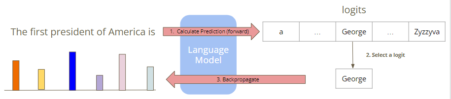
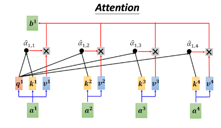
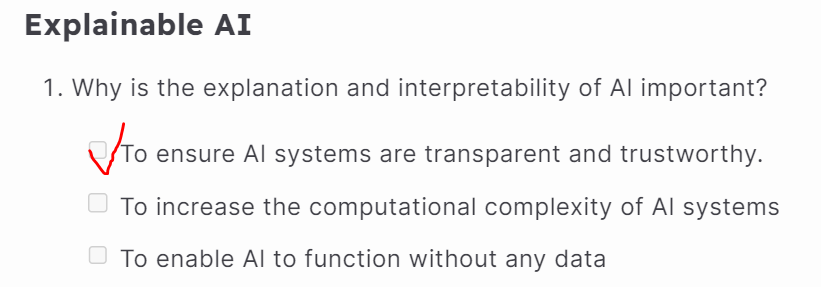
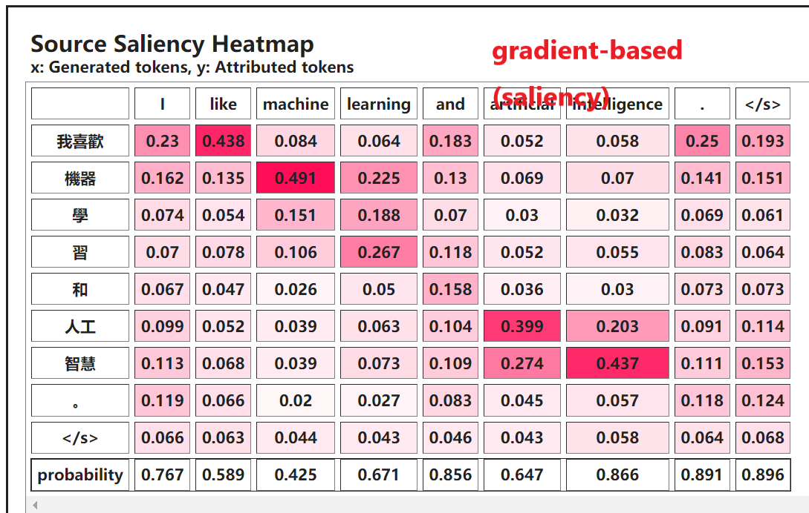
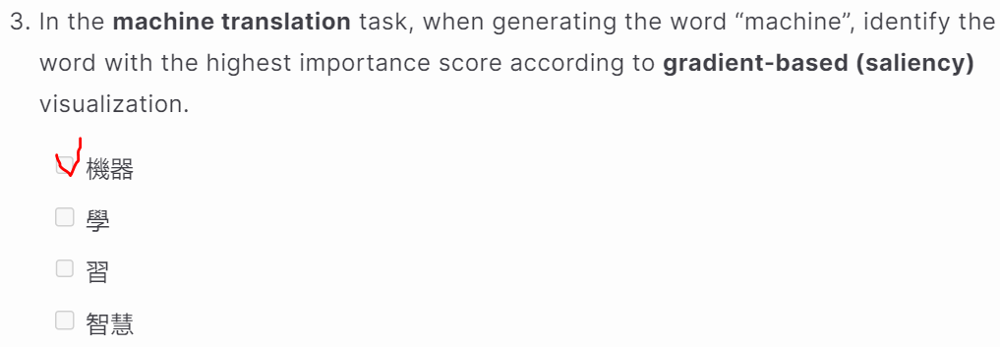
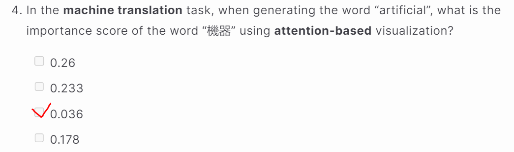
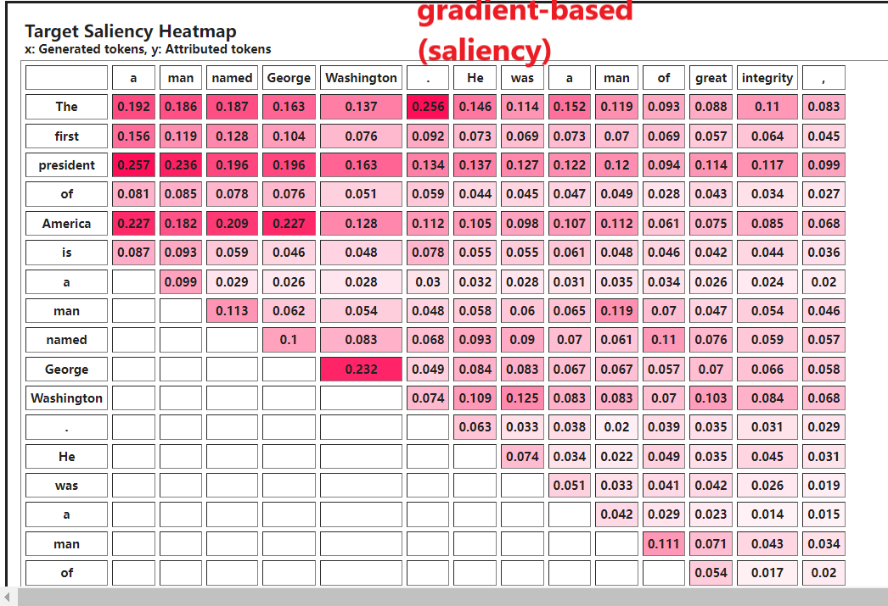
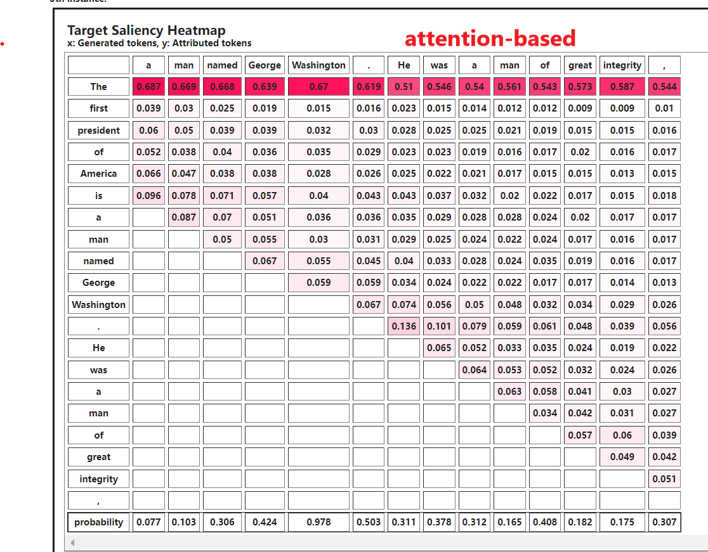

# Introduction

本次作业的主题是【理解人工智能在想什么】，这就涉及到人工智能可解释性的问题了。

人工智能模型发展迅速，在短短十多年间，已经从传统的机器学习模型发展到深度学习模型，再到如今的大语言模型。然而，有两个问题始终没有解决：”why does AI do what it does?“和“how does it do it?” 。人们不理解人工智能模型的”why“和”how“，将其视为一个黑盒子，导致人们在使用这些模型时犹豫不决。理解”why“和”how“与三个概念有关：Transparent, Interpretable和Explainable。

## Transparent

Transparent指人工智能系统在设计、开发和部署方面的开放性。一个人工智能系统是transparent，指其机制、数据源和决策过程都是公开和可理解的。例如github上开源的机器学习项目，开发人员提供了完整的源代码、全面的数据集和清晰的文档。并解释了算法的工作原理以及有关训练过程的详细信息。

## Interpretable

Interpretable关注算法内部的工作原理，即模型的思考过程是透明的。例如决策树👇，可以追踪算法在树中为每个决策所采用的路径，从而准确理解算法如何以及为何根据输入数据得出特定结论。

## Explainable

Explainable侧重以可理解的术语描述AI系统如何做出特定决策或输出，涉及单个AI决策背后的逻辑或推理，使AI的流程易于理解并可关联到最终用户。例如在信贷评分中使用机器学习模型，模型更具收入、信用记录、就业情况和债务水平等各种因素评估个人的信用度。Explainable体现在模型能为其决策提供理由，例如贷款申请因信用评分低和债务-收入比高而被拒绝。

当今，人工智能的可解释性聚焦在'Explainable'方面。因为，'Transparent'取决于各种模型发布机构的开放程度，不在研究之列。如果一个模型是'Interpretable'的，我们可以一眼看穿这个模型的决策过程，那么这个模型大概率是简单的。一个复杂的模型不太可能会被一眼看穿。

## Why should we know what generative AI is thinking?

- 输出正确的答案不代表有智能，有可能是误打误撞；
- 可解释性在高风险的应用中至关重要，例如医学和法律；
- 基于可解释性改进模型；

## Link

[Colab](https://colab.research.google.com/drive/1iORu8cc7dPzooVGNwsGidQ4xIAyDxF6x?usp=sharing)

[Questions](https://hackmd.io/@reu7cWRzREKcA7gfMs6hxw/SyOYywp6a)

# Task 1: Token Importance Analysis

- 在这个任务中，我们的目的是了解哪些token在生成的响应中发挥了重要作用。
- 我们使用**特征归因法(feature attribution method)**分析重要性：
  - Gradient-based approach；
  - Attention-mechanism；
- 运行示例代码，完成问题1至7。

特征归因法是一类用于解释机器学习模型决策的技术，帮助理解输入特征对模型输出的贡献。其核心思想是：对于一个特定的输入实例，分析其每个输入特征对模型输出的贡献。

- 基于梯度的特征归因方法（Gradient-based Approach）

  通过计算模型输出相对于输入特征的梯度，来衡量输入特征对模型预测的贡献。

  

- 注意力机制（Attention Mechanism）

  计算每个embedding向量的attention weight，再加权获得attention Scores。

  

## Token Visualization

在这个任务中，我们使用[inseq](https://github.com/inseq-team/inseq/)来可视化当生成响应时token的重要性。Inseq支持很多特征归因方法，包括Gradient-based Approach和Attention Mechanism。

## GenAI HW7 Questions(1~7)

### Machine Translation Task

运行'Machine Translation Task'代码，获得Saliency Map，然后回答问题3~4。

### Sentence Completion Task(5~7)

# Reference

[Transparency, Explainability, and Interpretability of AI](https://www.cimplifi.com/resources/transparency-explainability-and-interpretability-of-ai/)

