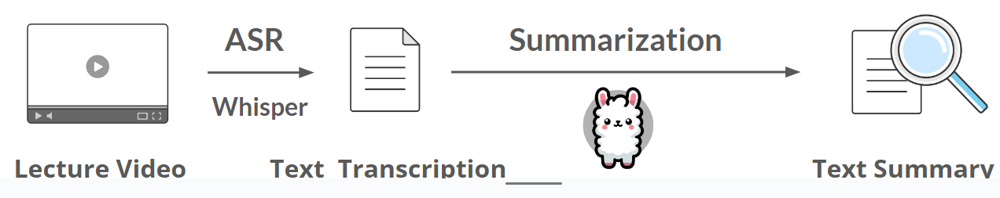
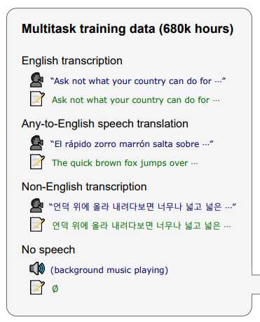
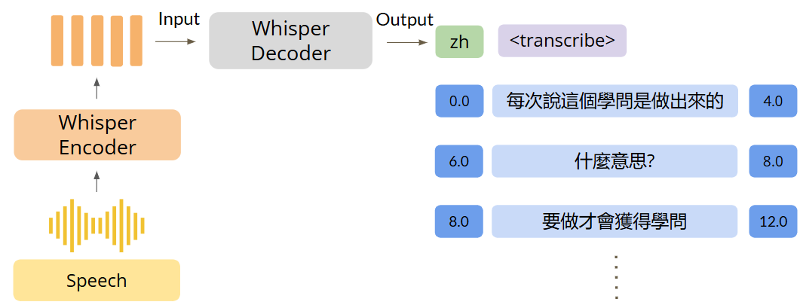
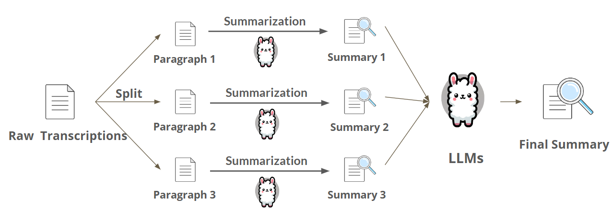
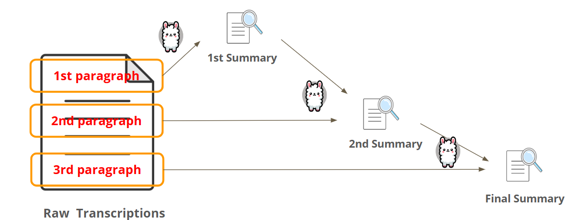

## Task Introduction

本次作业的任务是：快速总结讲座视频。给定一个讲座视频，首先使用自动语音识别(**automatic speech recognition** (ASR))将视频转化为逐字稿；然后使用LLM对逐字稿做摘要。



作业使用的视频是[Lin-shan Lee](https://linshanlee.com/)教授2023年的讲座”[Signals and Life（信号与人生）](https://www.youtube.com/watch?v=MxoQV4M0jY8)“。由于原始视频很长，作业使用1:43:24到2:00:49的片段。

## Task Pipeline

本次作业的Pipeline分为两个阶段：

1. **Automatic Speech Recognition**（自动语音识别）：使用OpenAI的Whisper模型进行语音识别，将视频转化成逐字稿。
2. **Summarization**（摘要）：为LLM设计一个prompt，将逐字稿总结为300-500的繁体中文摘要。

### Automatic Speech Recognition

语音识别是将语音信号转化为书面文本的过程。


### Whisper — Introduction

OpenAI Whisper是一个能够准确的将口语转录并翻译成文本的模型。Whisper经过了68万小时的多语言多任务监督数据的训练，这些数据来自互联网，包括99种不同的语言。多任务训练数据包含4种任务：

- English transcription：英语转录；
- Any-to-English speech translation：任何语言的语音转录为英文文本；
- Non-English transcription：非英文转录为英文文本；
- No speech：背景音不会转录为任何文字。




OpenAI Whisper既可以作转录也可以作翻译，本次作业使用Whisper的转录功能，将中文语音转化为中文文本。



### Summarization

为LLM设计一个恰当的prompt，将文本总结为300-500字的繁体中文摘要。

#### Methods

最直接的方法是直接将未处理的文本输入LLM做摘要。但是，如果文本太长，LLM无法一次性处理全部内容。因此，本次作业提供两种做摘要的方法：

- Multi-Stage Summarization；
- Refinement；

##### Multi-Stage Summarization

将长文本分割为多个小片段，分别获取每个片段的摘要，然后处理这些摘要生成最终的摘要。



##### Refinement

- 将长文本分为多个段落；
- 首先，总结第一段；
- 将第一段的摘要与第二段一起作摘要；
- 将前两段的摘要和第三段一起作摘要；
- 持续这个过程，直到整个长文本被总结完。



## Task

使用Gemini API作为Summarization阶段的LLM。最终产生的摘要从以下五个方面进行评估：


我们更换不同的prompt，观察LLM输出Summarization的质量。

### Test_1

使用默认的prompt。

#### Multi-Stage Summarization

```
用 300 個字內寫出這段文字的摘要，其中包括要點和所有重要細節：<text>
```

```
**摘要**  學習需要實踐，透過動手做才能真正理解和內化知識。實作表現雖然可能沒有具體評分，但對於學習至關重要。
困難的課程和作業提供了提升全面學習的機會，培養思考能力和習慣。主動思考數學公式和概念的含義，有助於培養批判性思維和問題解決能力。
學習不僅限於課業，課外活動也能帶來成長、進步和快樂。任何能帶來這些好處的活動都值得被視為學習，並投入時間和精力。
```

#### Refinement

```
在 500 字以內寫出以下文字的簡潔摘要：<text>
```

```
**簡潔摘要**  學習的關鍵在於實踐，透過動手做才能真正理解和內化知識。實作活動能幫助學生整合和應用知識，發現自己的學習成果。
此外，培養思考能力至關重要，透過閱讀時思考數學式子和概念的意義，學生可以練習思考和培養思考習慣。  課業外的活動也能提供寶貴的學
習機會，任何能帶來增長、進步和快樂的事物，都值得被視為學習。例如，打球可以培養手腦協調、團隊精神和人際互動能力；爬山可以增長見識
和體能；旅行可以擴展視野和文化素養。因此，凡是能獲得快樂的事物，都值得投入時間和精力，將其視為學習的機會。  交朋友、參加社團活
動等課外活動，也能提供人際互動、溝通和團隊合作等方面的學習機會。這些活動能幫助學生發現自己的成長和進步，並培養全面學習能力。  
培養軟實力也很重要，例如團隊合作、溝通和領導能力。這些技能對於在團隊中工作和取得成功至關重要。課外活動和社團活動提供了培養這些技
能的寶貴機會。  軟實力是成功的重要關鍵，可以透過課業外各種學習增長的機會培養。此外，個人發展的黃金時期在 35 至 55歲之間，在此期間，實力、努力、大智和自我技能等因素將影響個人發展的軌跡。長程目標的設定，可以激勵個人向上衝刺，並在未來取得成就。
```

### Test_2

```
將這篇文章總結為300到500字的繁體中文摘要，要求内容完整、實時準確、語言流程、連貫自然、避免重複：<text>
```

#### Multi-Stage Summarization

```python
# summarization_prompt_template: Initial prompt
summarization_prompt_template = "將這篇文章總結為300字以内的繁體中文摘要，要求内容完整、實時準確、語言流程、連貫自然、避免重複：<text>" # @param {type:"string"}

# Multi-Stage Summarization
summarization_prompt_template = "將這篇文章總結為500字以内的繁體中文摘要，要求内容完整、實時準確、語言流程、連貫自然、避免重複：<text>" # @param {type:"string"}
```

```
----------------------------Final Summary----------------------------

**摘要**  **段落 1：實作的重要性**
學習必須透過實作才能真正內化。實作能驗證所學，並發現知識的不足之處。實作的重點不在於表現或成績，而是將知識轉化為自己的學問。  **段落
2：課業中的思考練習**  課業中的思考練習至關重要。深入理解數學公式和概念的意義，培養思考能力和習慣。將所讀內容與自身理解連結，提升整體學習成效。  **段落
3：課業外的學習**  學習不限於課業內。任何能帶來成長、進步和快樂的課業外活動都值得學習。例如，打球、爬山、旅行等，都能豐富人生經驗。  **段落
4：人際互動的學習**  談戀愛、交朋友、參與社團活動等，都能體驗人際互動、期待和感受。這些經驗有助於個人成長和進步。  **段落 5：課外活動的價值**
課外活動能帶來成長和進步。在團隊合作中學習融入團隊、領導他人和推動目標實現，培養電機工程領域不可或缺的「軟實力」。  **段落 6：軟實力的重要性**
軟實力，包括溝通、協調、交友、說服、團隊精神和領導力等，對於電機工程師的成功至關重要。軟實力通常透過課外學習和成長機會培養。  **段落
7：職涯發展的關鍵因素**  職涯發展的黃金時期約為 35 至 55 歲。影響職涯發展的關鍵因素包括實力、努力、大智和自我技能，而非特定學科的成績表現。
**段落 8：實力、努力和自修技能**  實力包含電機工程領域的專業知識。努力是不可或缺的。自修技能，如課業外增進的技能，往往被低估，但十分重要。  **段落
9：長程目標的設定**  設定長程目標有助於個人保持動力和專注。長程目標應具有意義、可行、有時間框架和明確性。明確且有意義的長程目標能帶來成就感。

Length of final summary: 706
Time taken to generate the final summary: 11.67 sec.
```

使用'Multi-Stage Summarization'的方法，Gemini生成的摘要超过了500字，虽然我们在prompt中明确要求了500字以内。

#### Refinement

```python
# summarization_prompt_template: Initial prompt
summarization_prompt_template = "將這篇文章總結為300字以内的繁體中文摘要，要求内容完整、實時準確、語言流程、連貫自然、避免重複：<text>" # @param {type:"string"}

# summarization_prompt_refinement_template: Refinement prompt.
summarization_prompt_refinement_template = "將這篇文章總結為500字以内的繁體中文摘要，要求内容完整、實時準確、語言流程、連貫自然、避免重複：<text>" # @param {type:"string"}

```

```
Final summary has been saved to ./final-summary-信號與人生-gemini-refinement.txt

===== Below is the final summary (401 words) =====

**摘要**  學習知識的最佳途徑是實踐，課外活動和人際互動提供了寶貴的學習機會，促進個人成長和快樂。戲劇和電機工程領域強調團隊
合作，培養軟實力（溝通、協調、交友、說服、團隊精神、領導力等）至關重要。軟實力主要來自課外活動和各種學習增長機會的培養，透過努力
培養而來，而非天生的。  職業生涯的黃金時期通常在 35 至 55 歲之間。個人發展軌跡因人而異，但影響因素主要有四個：實力、努
力、大智和自我技能。實力是指電機工程專業領域的全面學習，避免過度專注於特定領域。努力是持續不斷的付出。大智是指課外活動和非成績導
向的學習增長機會的培養。自我技能是個人獨特的優勢和能力。  這四個因素共同影響個人發展，其中實力、努力和大智是透過後天的培養獲得
的。自我技能因人而異，但透過適當的培養也能有所提升。個人可以設定長程目標，作為發展方向的指引。長程目標是個人願意花費大量時間和精
力投入的目標，能激勵個人向上衝刺。
```

## 总结

本次作业使用Whisper模型将视频转录为逐字稿，然后使用LLM对其做摘要。做摘要的方法有Multi-Stage Summarization和Refinement，测试表明使用同样的prompt，Refinement方法产生更好的摘要。
