## Overview

### Text-to-Image Model

Text-to-Image Model可以生成与文本描述相匹配的图像。ChatGPT-4O具备Text-to-Image能力，我们用ChatGPT-4O试一下，输入文字描述，模型根据文字描述输出图片👇

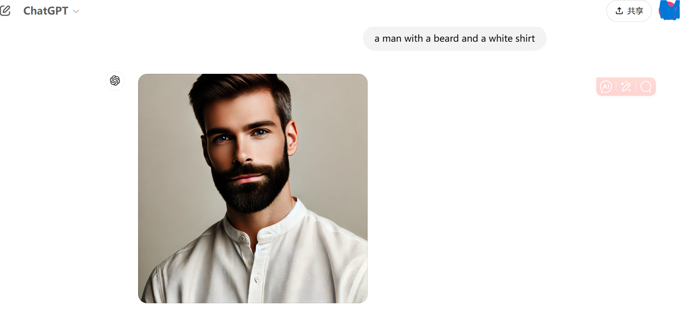

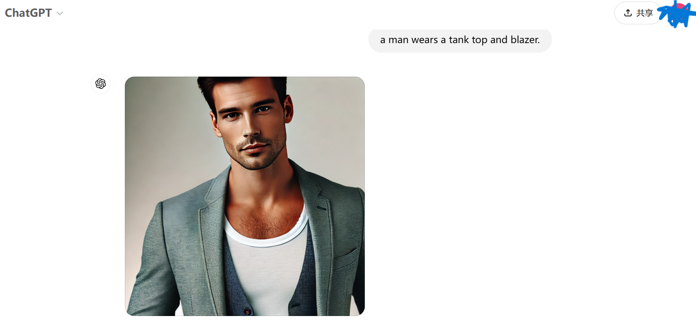

### Personalization

基础模型不能满足个性化的要求，例如ChatGPT-4O每次输出的人脸都不一样。想要模型每次输出特定的人物形象，例如每次都生成Brad Pitt的脸，需要对模型进行微调。

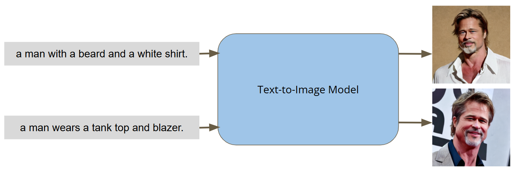

## Achieve Personalization Using LoRA

###  LoRA

使用LoRA（Low-Rank Adaptation）对基础模型进行微调。LoRA是微软在2021年推出的微调方法，它冻结预训练的模型权重，将可训练的秩分解矩阵注入到Transformer架构的每一层，从而大大减少下游任务的可训练参数量。多数情况下，LoRA的性能可与完全微调的模型相媲美，并且不会引入额外的推理时延。

神经网络进行矩阵乘法时，它的权重矩阵是full-rank的。在适配特定任务时，预训练的语言模型具有较低的”内在维度（intrinsic dimension）“，在随机投射的更小子空间上任然可以有效的学习。”内在维度（intrinsic dimension）“指矩阵中存在有效信息的维度，小于等于矩阵的实际维度。受此启发，LoRA假设在设配特定任务时，矩阵权重更新具有较低的内在维度，即对模型微调就是调整这些低秩的内在维度。

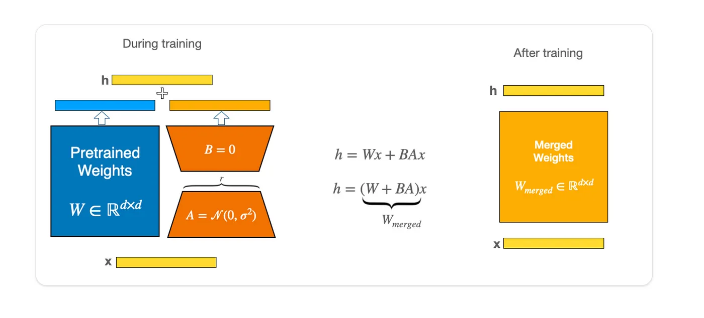

LoRA在原本的矩阵$W\in R^{d\times k}$旁边插入一个并行的权重矩阵$\Delta W \in R^{d \times k}$。因为模型的低秩性，$\Delta W$可被拆分为矩阵$B\in R^{d \times r}$和$A\in R^{r\times k}$，其中$r\ll min(d, k)$，从而实现了极小的参数数量训练LLM。在训练期间，$W$被冻结，不会接受梯度更新，而$A$和$B$包含可训练的参数会被更新。$W$和$\Delta W$接受相同的输入$x$，训练完成后各自的输出向量按位置相加，因此不会产生额外的推理时间，如下式所示：
$$
h = W_0 x + \Delta W x = W_0 x + BAx
$$
在训练开始的时候，对矩阵$A$进行随机高斯初始化，矩阵$B$使用零矩阵初始化。因为$r$通常是一个非常小的值（实验证明1、2、4、8的效果就非常好），所以LoRA在训练时引入的参数量是非常小的，因此它的训练非常高效，不会带来显著的显存增加。

### Fine-tuning with LoRA

使用LoRA微调基础模型，获得额外的personalization能力。

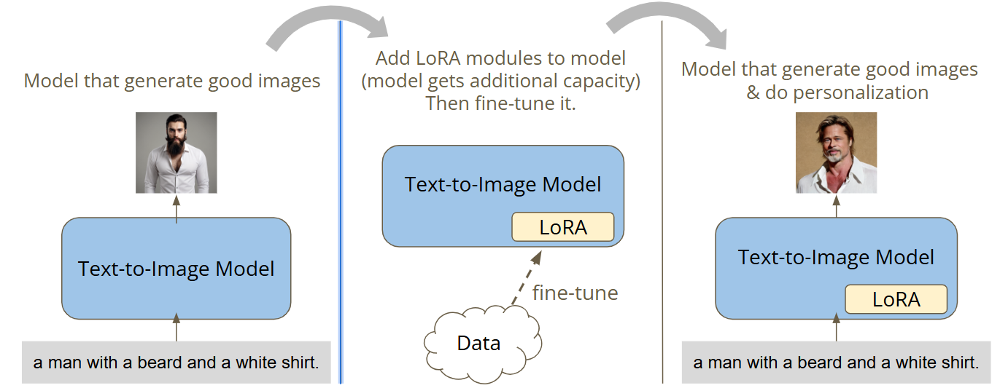

## Goal of This Homework

使用同一个人的面部图片微调Stable Diffusion模型，使它生成面孔一致的图片。

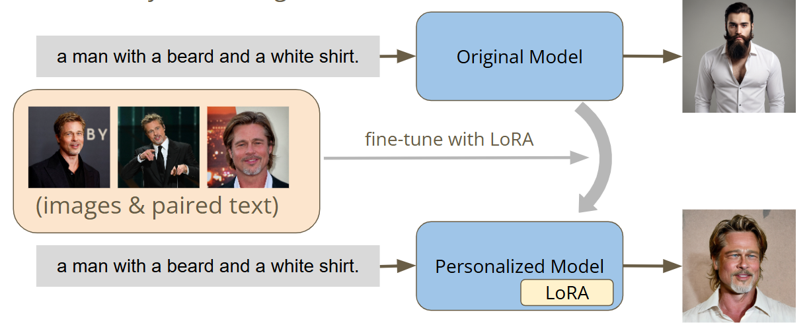

原始的Stable Diffusion模型每次产生的图片人脸都不一样。我们使用Brad Pitt的图片和对应的文本描述微调原始模型，使它产生的图片都是Brad Pitt的脸。

给定充分的训练时间，Stable Diffusion生成的图片将会拥有同一个人的脸。

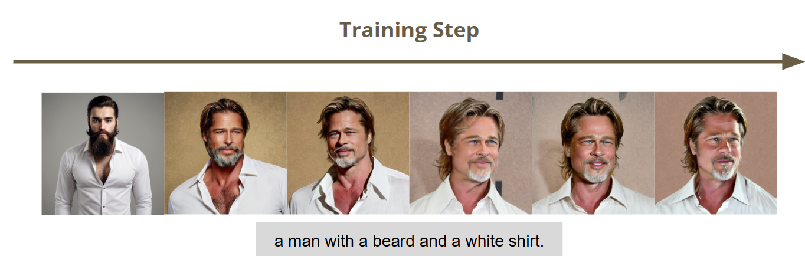

## Evaluation

将给定的prompt输入微调后的模型生成图片，最终的得分将会从三个方面进行评估：

- 图片是否与训练数据相似？
- 图片和文字是否匹配？
- 图片是否包含人脸？

## Task Introduction

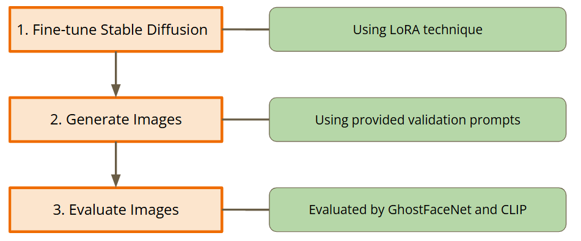

## Step 1. Fine-tune Stable Diffusion

Stable Diffusion是一个text-to-image潜在扩散([Latent Diffusion](https://arxiv.org/abs/2112.10752))模型，由[CompVis](https://github.com/CompVis)、[Stability AI](https://stability.ai/)和[LAION](https://laion.ai/)的研究人员和工程师共同创建。它使用512x512大小的图片训练，数据集是[LAION-5B](https://laion.ai/blog/laion-5b/)的子集。LAION-5B是现存最大可自由访问的多模态数据库。Latent Diffusion有三个主要组成部分：

1. An autoencoder(VAE);
2. A U-Net;
3. A text-encoder, e.g. CLIP's Text Encoder;

在Stable Diffusion模型基础上进行微调，以实现个性化的需求。使用Hugging Face `stablediffusionapi/cyberrealistic-41`模型作为base model；训练数据为100张Brad Pitt的照片和对应的文本描述。如下图所示，照片和文本描述成对出现，具有相同的文件名。

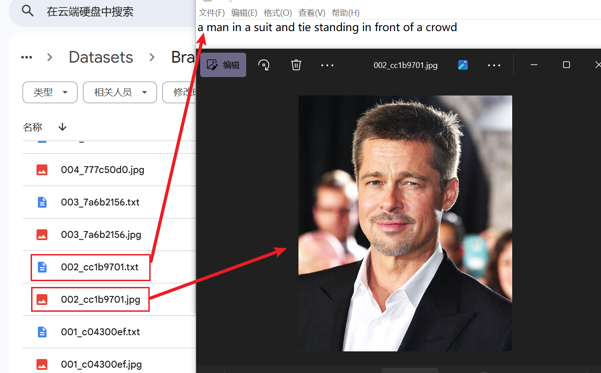


### 安装必要的库：

```python
# Install the required packages
os.chdir(root_dir)
!pip -q install timm==1.0.7
!pip -q install fairscale==0.4.13
!pip -q install transformers==4.41.2
!pip -q install requests==2.32.3
!pip -q install accelerate==0.31.0
!pip -q install diffusers==0.29.1
!pip -q install einop==0.0.1
!pip -q install safetensors==0.4.3
!pip -q install voluptuous==0.15.1
!pip -q install jax==0.4.33
!pip -q install peft==0.11.1
!pip -q install deepface==0.0.92
!pip -q install tensorflow==2.17.0
!pip -q install keras==3.2.0
```

### 导入必要的包：

```python
#@markdown ##  Import necessary packages
#@markdown It is recommmended NOT to change codes in this cell.
import argparse
import logging
import math
import os
import random
import glob
import shutil
from pathlib import Path
import numpy as np
import torch
import torch.nn.functional as F
import torch.utils.checkpoint
import transformers

# Python Imaging Library（PIL）图像处理
from PIL import Image

# 图像处理
from torchvision import transforms
from torchvision.utils import save_image

# 显示进度条
from tqdm.auto import tqdm

# Parameter-Efficient Fine-tuning(PEFT)库
from peft import LoraConfig
from peft.utils import get_peft_model_state_dict

# Hugging Face transformers
from transformers import AutoProcessor, AutoModel, CLIPTextModel, CLIPTokenizer

# Hugging Face Diffusion Model库
import diffusers
from diffusers import AutoencoderKL, DDPMScheduler, DiffusionPipeline, StableDiffusionPipeline, UNet2DConditionModel
from diffusers.optimization import get_scheduler
from diffusers.utils import convert_state_dict_to_diffusers
from diffusers.training_utils import compute_snr
from diffusers.utils.torch_utils import is_compiled_module

# 面部检测
from deepface import DeepFace

# OpenCV
import cv2
```

### 参数设置

```python
output_folder = os.path.join(project_dir, "logs") # 存放model checkpoints跟validation結果的資料夾
seed = 1126 # random seed
train_batch_size = 2 # training batch size
resolution = 512 # Image size
weight_dtype = torch.bfloat16 # 模型权重的数据类型是bfloat16
snr_gamma = 5 # Signal-to-Noise Ratio(SNR)信噪比缩放因子

## Important parameters for fine-tuning Stable Diffusion
pretrained_model_name_or_path = "stablediffusionapi/cyberrealistic-41"
lora_rank = 32 # r(rank)
lora_alpha = 16 # Lora的alpha参数

# 学习率
learning_rate = 1e-4 #@param {type:"number"}
unet_learning_rate = learning_rate
text_encoder_learning_rate = learning_rate
lr_scheduler_name = "cosine_with_restarts" # 使用Cosine Annealing with Restarts学习率调度方法
lr_warmup_steps = 100 # 初始预热步数

# 最大训练步数
max_train_steps = 200 

# 验证集数据
validation_prompt = "validation_prompt.txt"
validation_prompt_path = os.path.join(prompts_folder, validation_prompt)
validation_prompt_num = 3 #@param {type:"slider", min:1, max:5, step:1}
validation_step_ratio = 1 #@param {type:"slider", min:0, max:1, step:0.1}
with open(validation_prompt_path, "r") as f:
    validation_prompt = [line.strip() for line in f.readlines()]
```

### 设置LoRA Config

> 原版代码导入了`peft`并设置了`lora_rank`和`lora_alpha`参数，但是没有真正使用LoRA作微调。出于学习的目的，笔者改写了源代码，提供一版使用LoRA微调的代码，供大家学习交流。

Stable Diffusion模型包含三个组件：CLIP、U-net、VAE。参数量分布和占比为：
[来源](https://forums.fast.ai/t/stable-diffusion-parameter-budget-allocation/101515)

| 组件      | 参数量 | 文件大小  |  占比 |
| ----------- | ----------- |----------- |----------- |
| CLIP      | 123,060,480 |  492 MB  |  12%  |
|  VAE  | 83,653,863 |  335 MB  |  8%  |
| U-net      | 859,520,964 |  3.44 GB  |  80%  |
| Total      | 1,066,235,307 | 4.27 GB |  100%  |

U-net是最核心的组件，CLIP相对也比较重要。因此，我们选择U-net和CLIP的Attention模块进行微调。

> LoRA的核心思想是通过低秩分解降低大规模模型的参数更新需求，从而减少训练成本。其数学形式为：
> $$
> W' = W + \Delta W
> $$
> 其中：
>
> - $W$：原始权重矩阵（冻结，不更新）；
> - $\Delta W$：通过低秩分解获得的矩阵，$\Delta W = AB$
>   - $A$：低秩矩阵，形状为$(d, r)$；
>   - $B$：低秩矩阵，形状为$(r,d)$；
>   - $r$：秩，远小于$d$。
>
> 在LoRA中，直接使用低秩矩阵$AB$更新$\Delta W $有时会导致以下问题：
>
> 1. **不稳定的训练：**如果$AB$的值范围过大，与原始权重$W$相比可能导致数值不稳定，模型难以收敛；
> 2. **更新幅度过大：**如果没有约束，$AB$的影响可能过强，导致模型偏离预训练权重；
> 3. **无法灵活调节：**不同任务对参数调整的灵敏性不同，有时需要更大或更小的权重贡献。
>
> 为了解决这些问题，LoRA引入了一个缩放因子$\alpha$，控制$\Delta W$的影响：
> $$
> W' = W + \frac \alpha rAB
> $$
>
> - $\alpha$ ：缩放因子，即`lora_alpha`，用于调节$AB$对总权重更新的贡献；
> - $r$：低秩矩阵的秩，用于规范化。
>
> 通过缩放因子$\alpha$，可以有效平衡原始权重$W$和LoRA矩阵$AB$的贡献。

使用Hugging Face的[PEFT(Parameter-Efficient Fine-Tuning)](https://huggingface.co/docs/peft/v0.13.0/en/index)实现LoRA微调👇，首先定义`LoraConfig`:

```python
# Stable Diffusion LoRA设置
lora_config = LoraConfig(
    r=lora_rank, # 低秩矩阵的秩
    lora_alpha=lora_alpha, # 缩放因子
    target_modules=[
        "q_proj", "v_proj", "k_proj", "out_proj",  # 指定Text encoder(CLIP)的LoRA应用对象（用于调整注意力机制中的投影矩阵）
        "to_k", "to_q", "to_v", "to_out.0"  # 指定UNet的LoRA应用对象（用于调整UNet中的注意力机制）
    ], # 应用LoRA的模块名称
    lora_dropout=0 # LoRA层的dropout概率
)
```

target_modules指定模型结构中应用LoRA机制的模块名称。如果不指定，将根据模型结构选择模块。

### 应用LoRA

为了将LoRA应用到Stable Diffusion的Attention模块，我们需要自己搭建Stable Diffusion模型框架。

使用Hugging Face的[diffusers](https://colab.research.google.com/github/huggingface/notebooks/blob/main/diffusers/diffusers_intro.ipynb#scrollTo=QQXXMLKkCbUJ)库实现微调Stable Diffusion，diffusers的核心API可分为三个组成部分：

1. **Pipeline（管道）**：pipeline是diffusers库中用于构建和运行扩散系统的高级接口。它将模型（model）和调度器（scheduler）等组件打包在一起，使得用户可以方便地进行推理和图像生成。pipeline通常包含多个组件，如特征提取器、安全检查器、文本编码器、分词器、UNet模型、VAE模型和调度器等。
2. **Model（模型）**：model在扩散模型中主要指的是UNet模型（如UNet2DModel）和VAE模型（如AutoencoderKL）。UNet负责在每个时间步预测噪声残差，而VAE用于将图像编码到潜在的空间并进行解码。这些模型是执行扩散过程的核心，负责生成和处理图像数据。
3. **Scheduler（调度器）**：scheduler控制着扩散过程中的时间步和噪声调度。它根据模型预测的噪声残差来更新图像，逐步从噪声图像恢复出清晰的图像。不同的scheduler实现了不同的扩散算法，如DDPM、DDIM、PNDM等，它们决定了噪声如何被添加和去除。

**区别：**

- pipeline提供了一个完整的工作流程，方便用户直接使用预训练模型进行推理。
- model是执行生成任务的具体神经网络，负责图像的生成和处理。
- scheduler是控制生成过程中时间步和噪声策略的算法，它与model紧密协作，但本身不包含模型权重。

**联系：**

- pipeline通常包含一个或多个model和一个scheduler，它们共同工作以实现图像的生成。
- model的输出依赖于scheduler提供的时间步信息，而scheduler的行为则由model的输出指导。
- 用户可以根据需要更换pipeline中的scheduler或model，以适应不同的应用场景或优化性能。

#### 使用diffusers创建自定义pipeline

创建自定义pipeline是`diffusers`的高级用法，可以灵活的替换VAE或scheduler等组件。预训练模型`stablediffusionapi/cyberrealistic-41`包含组成diffusion pipeline的完整组件，它们存储在以下文件夹中：

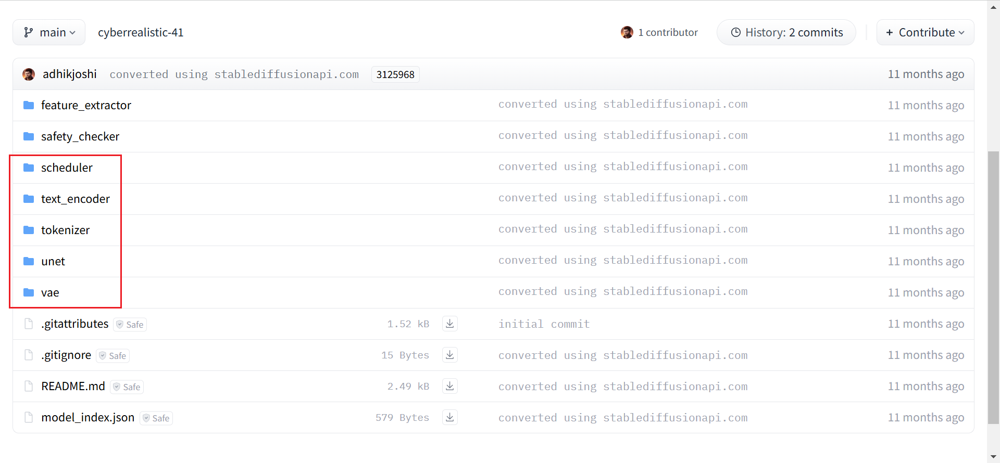

- scheduler：在训练过程中逐步向图像中添加噪声；
- text_encoder：将prompt的token转换为UNet可以理解的embedding表示；
- tokenizer：将输入的prompt转化为token；
- unet：训练过程中，生成图像的潜在表示的模型；
- vae：autoencoder模块，将潜在表示解码为真实图片。

我们可以向`from_pretrained()`方法指定`subfolder`参数从文件夹中加载相应组件。

```python
noise_scheduler = DDPMScheduler.from_pretrained(pretrained_model_name_or_path, subfolder="scheduler")
    
    # CLIP模型的分词器，用于将文本字符串转换为token id序列
    tokenizer = CLIPTokenizer.from_pretrained(
        pretrained_model_name_or_path,
        subfolder="tokenizer"
    )

    # CLIPTextModel是CLIP模型的文本编码器部分，用于将文本转换为嵌入表示
    text_encoder = CLIPTextModel.from_pretrained(
        pretrained_model_name_or_path,
        torch_dtype=weight_dtype,
        subfolder="text_encoder"
    )

    # AutoencoderKL是一个VAE模型，用于将图像编码到潜在空间
    vae = AutoencoderKL.from_pretrained(
        pretrained_model_name_or_path,
        subfolder="vae"
    )

    # UNet2DConditionModel是一个用于扩散模型的U-Net模型，用于在生成过程中预测噪声
    unet = UNet2DConditionModel.from_pretrained(
        pretrained_model_name_or_path,
        torch_dtype=weight_dtype,
        subfolder="unet"
    )
```

使用`peft`库的`get_peft_model()`将LoRA集成到Stable Diffusion的CLIP和U_net模块。

```python
# 将LoRA集成到text_encoder和unet
    text_encoder = get_peft_model(text_encoder, lora_config)
    unet = get_peft_model(unet, lora_config)
# 打印可训练参数
    text_encoder.print_trainable_parameters()
    unet.print_trainable_parameters()
```

trainable params: 2,359,296 || all params: 125,419,776 || trainable%: 1.8811 

trainable params: 6,377,472 || all params: 865,898,436 || trainable%: 0.7365

使用LoRA后，需训练的参数不到原来的2%。

定义`prepare_lora_model()`函数封装包含LoRA层的完整Stable Diffusion模型：

```python
def prepare_lora_model(pretrained_model_name_or_path="runwayml/stable-diffusion-v1-5", model_path=None):
    """
    (1) Goal:
        - This function is used to get the whole stable diffusion model with lora layers and freeze non-lora parameters, including Tokenizer, Noise Scheduler, UNet, Text Encoder, and VAE

    (2) Arguments:
        - pretrained_model_name_or_path: str, model name from Hugging Face
        - model_path: str, path to pretrained model.

    (3) Returns:
        - output: Tokenizer, Noise Scheduler, UNet, Text Encoder, and VAE

    """
    noise_scheduler = DDPMScheduler.from_pretrained(pretrained_model_name_or_path, subfolder="scheduler")
    tokenizer = CLIPTokenizer.from_pretrained(
        pretrained_model_name_or_path,
        subfolder="tokenizer"
    )
    text_encoder = CLIPTextModel.from_pretrained(
        pretrained_model_name_or_path,
        torch_dtype=weight_dtype,
        subfolder="text_encoder"
    )
    vae = AutoencoderKL.from_pretrained(
        pretrained_model_name_or_path,
        subfolder="vae"
    )
    unet = UNet2DConditionModel.from_pretrained(
        pretrained_model_name_or_path,
        torch_dtype=weight_dtype,
        subfolder="unet"
    )

    # 将LoRA集成到text_encoder和unet
    text_encoder = get_peft_model(text_encoder, lora_config)
    unet = get_peft_model(unet, lora_config)

    # 打印可训练参数
    text_encoder.print_trainable_parameters()
    unet.print_trainable_parameters()


    # text_encoder = torch.load(os.path.join(model_path, "text_encoder.pt"))
    # unet = torch.load(os.path.join(model_path, "unet.pt"))

    # 冻结vae参数
    vae.requires_grad_(False)

    unet.to(DEVICE, dtype=weight_dtype)
    vae.to(DEVICE, dtype=weight_dtype)
    text_encoder.to(DEVICE, dtype=weight_dtype)
    return tokenizer, noise_scheduler, unet, vae, text_encoder
```

### 准备微调所需的数据集、LoRA模型和优化器

**加载带LoRA层的Stable Diffusion模型**

```python
tokenizer, noise_scheduler, unet, vae, text_encoder = prepare_lora_model(pretrained_model_name_or_path, model_path)
```

**创建优化器**

```python
def prepare_optimizer(unet, text_encoder, unet_learning_rate=5e-4, text_encoder_learning_rate=1e-4):
    """
    (1) Goal:
        - This function is used to feed trainable parameters from UNet and Text Encoder in to optimizer each with different learning rate

    (2) Arguments:
        - unet: UNet2DConditionModel, UNet from Hugging Face
        - text_encoder: CLIPTextModel, Text Encoder from Hugging Face
        - unet_learning_rate: float, learning rate for UNet
        - text_encoder_learning_rate: float, learning rate for Text Encoder

    (3) Returns:
        - output: Optimizer

    """
    # 筛选UNet模型中需要梯度的参数
    unet_lora_layers = list(filter(lambda p: p.requires_grad, unet.parameters()))
    # 筛选text_encoder中需要梯度的参数
    text_encoder_lora_layers = list(filter(lambda p: p.requires_grad, text_encoder.parameters()))

    # 配置可训练参数列表
    trainable_params = [
        {"params": unet_lora_layers, "lr": unet_learning_rate},
        {"params": text_encoder_lora_layers, "lr": text_encoder_learning_rate}
    ]

    # 创建优化器
    optimizer = torch.optim.AdamW(
        trainable_params,
        lr=unet_learning_rate,
    )
    return optimizer

optimizer = prepare_optimizer(
    unet,
    text_encoder,
    unet_learning_rate,
    text_encoder_learning_rate
)
```

**创建学习率调度器**

```python
lr_scheduler = get_scheduler(
    lr_scheduler_name,
    optimizer=optimizer,
    num_warmup_steps=lr_warmup_steps,
    num_training_steps=max_train_steps,
    num_cycles=3
)
```

**准备数据集**

```python
class Text2ImageDataset(torch.utils.data.Dataset):
    """
    (1) Goal:
        - This class is used to build dataset for finetuning text-to-image model

    """
    def __init__(self, images_folder, captions_folder, transform, tokenizer):
        """
        (2) Arguments:
            - images_folder: str, path to images
            - captions_folder: str, path to captions
            - transform: function, turn raw image into torch.tensor
            - tokenizer: CLIPTokenize, turn sentences into word ids
        """
        self.image_paths = []
        for ext in IMAGE_EXTENSIONS:
            self.image_paths.extend(glob.glob(f"{images_folder}/*{ext}"))
        self.image_paths = sorted(self.image_paths)

        # 遍历图像路径，使用DeepFace提取面部特征嵌入
        self.train_emb = torch.tensor([DeepFace.represent(img_path, detector_backend="ssd", model_name="GhostFaceNet", enforce_detection=False)[0]['embedding'] for img_path in self.image_paths])
        caption_paths = sorted(glob.glob(f"{captions_folder}/*txt"))
        captions = []
        for p in caption_paths:
            with open(p, "r") as f:
                captions.append(f.readline())
        # 将文本转化为token
        inputs = tokenizer(
            captions, max_length=tokenizer.model_max_length, padding="max_length", truncation=True, return_tensors="pt"
        )
        self.input_ids = inputs.input_ids
        self.transform = transform

    def __getitem__(self, idx):
        img_path = self.image_paths[idx]
        input_id = self.input_ids[idx]
        try:
            image = Image.open(img_path).convert("RGB")
            # convert to tensor temporarily so dataloader will accept it
            tensor = self.transform(image)
        except Exception as e:
            print(f"Could not load image path: {img_path}, error: {e}")
            return None


        return tensor, input_id

    def __len__(self):
        return len(self.image_paths)

dataset = Text2ImageDataset(
    images_folder=images_folder,
    captions_folder=captions_folder,
    transform=train_transform,
    tokenizer=tokenizer,
)

# 自定义批处理函数，将多个样本（examples）组合成一个batch
def collate_fn(examples):
    pixel_values = []
    input_ids = []
    for tensor, input_id in examples:
        pixel_values.append(tensor)
        input_ids.append(input_id)

    # 图像tensor堆叠成一个多维tensor
    pixel_values = torch.stack(pixel_values, dim=0).float()
    # input_ids堆叠成一个多维tensor
    input_ids = torch.stack(input_ids, dim=0)
    return {"pixel_values": pixel_values, "input_ids": input_ids}

# 使用pytorch DataLoader加载数据集
train_dataloader = torch.utils.data.DataLoader(
    dataset,
    shuffle=True,
    collate_fn=collate_fn,
    batch_size=train_batch_size,
    num_workers=8,
)
```

### 开始微调

训练的损失函数采用[Min-SNR](https://arxiv.org/abs/2303.09556)（最小信噪比加权）策略，以加快扩散模型收敛。

Denoising diffusion model是图像生成的主流方法，然而，训练这些模型往往存在收敛缓慢的问题。Hang等人发现收敛缓慢的部分原因是由于时间步间优化方向冲突导致的。为了解决这个问题，他们将扩散模型的训练视为多任务学习（multi-task learning）问题，引入$Min-SNR-\gamma$方法。该方法更具被限制的信噪比调整时间步的损失权重，有效地平衡了时间步之间的冲突，收敛速度比传统方法快3.4倍。

微调模型并保存中间检查点，训练循环如下：

```python
global_step = 0
num_epochs = math.ceil(max_train_steps / len(train_dataloader))
validation_step = int(max_train_steps * validation_step_ratio)
best_face_score = float("inf")
for epoch in range(num_epochs):
    torch.cuda.empty_cache()
    unet.train()
    text_encoder.train()
    for step, batch in enumerate(train_dataloader):
        if global_step >= max_train_steps:
            break

        # 使用vae将图像编码为latent representation
        latents = vae.encode(batch["pixel_values"].to(DEVICE, dtype=weight_dtype)).latent_dist.sample()
        latents = latents * vae.config.scaling_factor

        # Sample noise that we'll add to the latents
        noise = torch.randn_like(latents)
        bsz = latents.shape[0]
        timesteps = torch.randint(0, noise_scheduler.config.num_train_timesteps, (bsz,), device=latents.device)
        timesteps = timesteps.long()
        noisy_latents = noise_scheduler.add_noise(latents, noise, timesteps)

        # Get the text embedding for conditioning
        encoder_hidden_states = text_encoder(batch["input_ids"].to(latents.device), return_dict=False)[0]
        if noise_scheduler.config.prediction_type == "epsilon":
            target = noise
        elif noise_scheduler.config.prediction_type == "v_prediction":
            target = noise_scheduler.get_velocity(latents, noise, timesteps)

        # 输入噪声、时间步、text embedding，使用unet进行预测
        model_pred = unet(noisy_latents, timesteps, encoder_hidden_states, return_dict=False)[0]
        if not snr_gamma: # 不使用snr_gamma
            loss = F.mse_loss(model_pred.float(), target.float(), reduction="mean") # 标准均方误差损失函数
        else: # 使用snr_gamma，基于信噪比对损失进行加权
            snr = compute_snr(noise_scheduler, timesteps) #计算给定timestep的snr值
            mse_loss_weights = torch.stack([snr, snr_gamma * torch.ones_like(timesteps)], dim=1).min(
                dim=1
            )[0] #使用snr和snr_gamma计算每个timestep的损失权重
            if noise_scheduler.config.prediction_type == "epsilon": # 噪声预测
                mse_loss_weights = mse_loss_weights / snr # 降低权重随信噪比的变化
            elif noise_scheduler.config.prediction_type == "v_prediction": # 速度预测
                mse_loss_weights = mse_loss_weights / (snr + 1) # # 进一步平滑调整权重

            loss = F.mse_loss(model_pred.float(), target.float(), reduction="none") # 计算逐元素的均方误差
            loss = loss.mean(dim=list(range(1, len(loss.shape)))) * mse_loss_weights # 对非批次维度取均值，得到每个样本的损失，乘以对应时间步的加权因子
            loss = loss.mean() # 对所有样本的加权损失求平均值，作为最终损失值
        
        # 反向传播
        loss.backward() # 计算梯度
        optimizer.step() # 更新模型参数
        lr_scheduler.step() # 更新学习率
        optimizer.zero_grad() # 梯度清零
        progress_bar.update(1) # 更新进度条
        global_step += 1 # 更新全局步数

        # 验证模型性能
        if global_step % validation_step == 0 or global_step == max_train_steps:
            # 保存当前检查点
            save_path = os.path.join(output_folder, f"checkpoint-last")
            unet_path = os.path.join(save_path, "unet.pt")
            text_encoder_path = os.path.join(save_path, "text_encoder.pt")
            print(f"Saving Checkpoint to {save_path} ......")
            os.makedirs(save_path, exist_ok=True)
            torch.save(unet, unet_path)
            torch.save(text_encoder, text_encoder_path)
            save_path = os.path.join(output_folder, f"checkpoint-{global_step + 1000}")
            os.makedirs(save_path, exist_ok=True)

            # 评估模型性能
            face_score, clip_score, mis = evaluate(
                pretrained_model_name_or_path=pretrained_model_name_or_path,
                weight_dtype=weight_dtype,
                seed=seed,
                unet_path=unet_path,
                text_encoder_path=text_encoder_path,
                validation_prompt=validation_prompt[:validation_prompt_num],
                output_folder=save_path,
                train_emb=dataset.train_emb
            )
            print("Step:", global_step, "Face Similarity Score:", face_score, "CLIP Score:", clip_score, "Faceless Images:", mis)
            if face_score < best_face_score: # 保存当前最佳结果
                best_face_score = face_score
                save_path = os.path.join(output_folder, f"checkpoint-best")
                unet_path = os.path.join(save_path, "unet.pt")
                text_encoder_path = os.path.join(save_path, "text_encoder.pt")
                os.makedirs(save_path, exist_ok=True)
                torch.save(unet, unet_path)
                torch.save(text_encoder, text_encoder_path)
print("Fine-tuning Finished!!!")
```

## Step 2. Generate Images

使用验证集prompt和fine tune最终得到的模型生成图片，用于验证的prompt如下：

```tex
A man in a black hoodie and khaki pants.
A man sports a red polo and denim jacket.
A man wears a blue shirt and brown blazer.
A man dons a white button-up and cardigan.
A man in a striped shirt and leather jacket.
A man wears a green sweater and gray vest.
A man sports a black suit and tie.
A man in a denim shirt and bomber jacket.
A man wears a plaid flannel and puffer vest.
A man dons a hoodie and windbreaker.
A man in a V-neck sweater and coat.
A man wears a checkered shirt and trench coat.
A man in a graphic tee and sport coat.
A man sports a hoodie and quilted jacket.
A man wears a button-up and suede jacket.
A man in a knit sweater and leather vest.
A man dons a pullover and duffle coat.
A man wears a henley shirt and parka.
A man in a zip-up hoodie and blazer.
A man sports a chambray shirt and overcoat.
A man wears a crewneck sweater and bomber.
A man in a long-sleeve tee and pea coat.
A man dons a polo shirt and varsity jacket.
A man wears a patterned shirt and raincoat.
A man in a mock neck and moto jacket.
```

加载最后一个检查点`checkpoint-last`作为最终的模型进行推理。使用`def evaluate()`函数生成图片和评分。

```python
torch.cuda.empty_cache()
checkpoint_path = os.path.join(output_folder, f"checkpoint-last") # 設定使用哪個checkpoint inference
unet_path = os.path.join(checkpoint_path, "unet.pt")
text_encoder_path = os.path.join(checkpoint_path, "text_encoder.pt")
inference_path = os.path.join(project_dir, "inference")
os.makedirs(inference_path, exist_ok=True)
train_image_paths = []
for ext in IMAGE_EXTENSIONS:
    train_image_paths.extend(glob.glob(f"{images_folder}/*{ext}"))
train_image_paths = sorted(train_image_paths)
train_emb = torch.tensor([DeepFace.represent(img_path, detector_backend="ssd", model_name="GhostFaceNet", enforce_detection=False)[0]['embedding'] for img_path in train_image_paths])

face_score, clip_score, mis = evaluate(
    pretrained_model_name_or_path=pretrained_model_name_or_path,
    weight_dtype=weight_dtype,
    seed=seed,
    unet_path=unet_path,
    text_encoder_path=text_encoder_path,
    validation_prompt=validation_prompt,
    output_folder=inference_path,
    train_emb=train_emb,
)
print("Face Similarity Score:", face_score, "CLIP Score:", clip_score, "Faceless Images:", mis)
```

最终生成的图片都是Brad Pitt的脸配上不同的衣服。

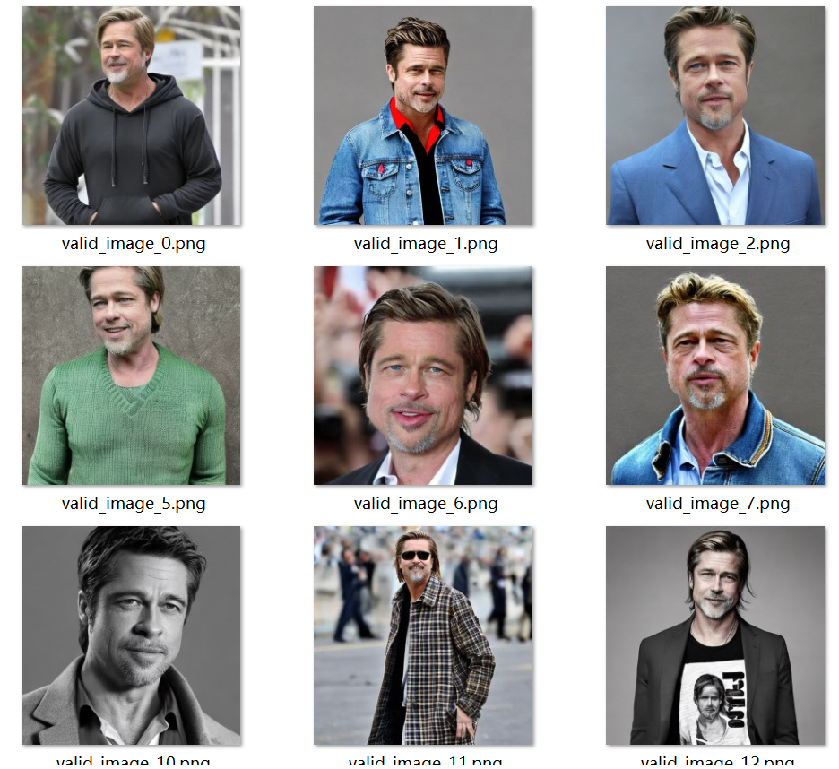

## Step 3. Evaluate Images

### Face Distance Score

对于每张生成的人脸，计算它与所有训练图片的平均距离，然后对所有生成的图片取平均。人脸的距离使用神经网络[GhostFaceNet](https://github.com/HamadYA/GhostFaceNets)计算。
$$
F(D_G,D_T) = \frac{1}{\Vert D_G \Vert \Vert D_T \Vert}\sum_{d_G \in D_G}\sum_{d_T \in D_T}f(d_G,d_T)
$$
其中，$D_G$是生成的人脸，$D_T$是训练数据，$f(*)$是GhostFaceNet。

我们要生成Brad Pitt的脸，因此$F(D_G,D_T)$越小越好。

### CLIP Score

[CLIP](https://github.com/openai/CLIP) Score可以衡量文本和图像之间的相似度，得分越高相关性越大。CLIP模型使用`openai/clip-vit-base-patch32`。

定义评估函数，计算图片的相似性以及文本-图像的匹配程度。

```python
def evaluate(pretrained_model_name_or_path, weight_dtype, seed, unet_path, text_encoder_path, validation_prompt, output_folder, train_emb):
    """
    (1) Goal:
        - This function is used to evaluate Stable Diffusion by loading UNet and Text Encoder from the given path and calculating face similarity, CLIP score, and the number of faceless images.

    (2) Arguments:
        - pretrained_model_name_or_path: str, model name from Hugging Face
        - weight_dtype: torch.type, model weight type
        - seed: int, random seed
        - unet_path: str, path to UNet model checkpoint
        - text_encoder_path: str, path to Text Encoder model checkpoint
        - validation_prompt: list, list of str storing texts for validation
        - output_folder: str, directory for saving generated images
        - train_emb: tensor, face features of training images

    (3) Returns:
        - output: face similarity, CLIP score, the number of faceless images

    """
    pipeline = DiffusionPipeline.from_pretrained(
        pretrained_model_name_or_path,
        torch_dtype=weight_dtype,
        safety_checker=None,
    )
    pipeline.unet = torch.load(unet_path)
    pipeline.text_encoder = torch.load(text_encoder_path)
    pipeline = pipeline.to(DEVICE)
    clip_model_name = "openai/clip-vit-base-patch32"
    clip_model = AutoModel.from_pretrained(clip_model_name)
    clip_processor = AutoProcessor.from_pretrained(clip_model_name)

    # run inference
    with torch.no_grad():
        generator = torch.Generator(device=DEVICE) # 创建一个新的伪随机数生成器
        generator = generator.manual_seed(seed) # 设置随机数种子
        face_score = 0
        clip_score = 0
        mis = 0
        print("Generating validaion pictures ......")
        images = []
        for i in range(0, len(validation_prompt), 4): # 遍历validation_prompt，每次处理4个提示
            # 使用pipeline根据提示生成图像，添加到images列表中
            images.extend(pipeline(validation_prompt[i:min(i + 4, len(validation_prompt))], num_inference_steps=30, generator=generator).images)
        
        # 计算面部相似度和CLIP分数
        print("Calculating validaion score ......")
        valid_emb = []
        for i, image in enumerate(tqdm(images)):
            torch.cuda.empty_cache()
            save_file = f"{output_folder}/valid_image_{i}.png"
            image.save(save_file) # 将生成的图像保存到指定目录
            opencvImage = cv2.cvtColor(np.array(image), cv2.COLOR_RGB2BGR) # 使用OpenCV的cv2Color函数将图像从RGB颜色空间转化为BGR颜色空间
            emb = DeepFace.represent( # 使用DeepFace库提取面部特征嵌入
                opencvImage,
                detector_backend="ssd",
                model_name="GhostFaceNet",
                enforce_detection=False,
            )
            if emb == [] or emb[0]['face_confidence'] == 0: # 统计无法检测到面部的图片
                mis += 1
                continue
            # 计算CLIP分数，评估图片与文本的匹配程度
            emb = emb[0]
            inputs = clip_processor(text=validation_prompt[i], images=image, return_tensors="pt") # 处理CLIP模型的输入，输入文本和图像，返回适合模型输入的格式
            with torch.no_grad():
                outputs = clip_model(**inputs) # 使用CLIP模型，计算文本和图像的相似度
            sim = outputs.logits_per_image # 提取相似度分数
            clip_score += sim.item() # tensor转为数值
            valid_emb.append(emb['embedding'])
        if len(valid_emb) == 0:
            return 0, 0, mis
        valid_emb = torch.tensor(valid_emb)
        valid_emb = (valid_emb / torch.norm(valid_emb, p=2, dim=-1)[:, None]).cuda() # 归一化处理
        train_emb = (train_emb / torch.norm(train_emb, p=2, dim=-1)[:, None]).cuda()
        face_score = torch.cdist(valid_emb, train_emb, p=2).mean().item() # 计算距离
        # face_score = torch.min(face_score, 1)[0].mean()
        clip_score /= len(validation_prompt) - mis # 计算平均相似度
    return face_score, clip_score, mis
```

## Results

**训练200个step:**

Step: 200 Face Similarity Score: 1.1819632053375244 CLIP Score: 30.577381134033203 Faceless Images: 0

Face Similarity Score: 1.2155983448028564 CLIP Score: 30.146756172180176 Faceless Images: 1

**训练2000个step:** 结果略微提升，但不明显

Step: 2000 Face Similarity Score: 1.1477864980697632 CLIP Score: 30.112869262695312 Faceless Images: 0

Face Similarity Score: 1.1696956157684326 CLIP Score: 29.713413848876954 Faceless Images: 0

## Link

[完整代码](https://colab.research.google.com/drive/1ue6knQcAEJB3kTv8DqSq-nBCYv-gES2d#scrollTo=3Kuc0_PcHW48)

## Reference

1. [Stable Diffusion with 🧨 Diffusers](https://huggingface.co/blog/stable_diffusion#stable-diffusion-with-%F0%9F%A7%A8-diffusers)

2. [Diffusers](https://colab.research.google.com/github/huggingface/notebooks/blob/main/diffusers/diffusers_intro.ipynb#scrollTo=aCH4p1dtyaXX)

3. [Training with Diffusers](https://colab.research.google.com/gist/anton-l/f3a8206dae4125b93f05b1f5f703191d/diffusers_training_example.ipynb)

4. [Understanding pipelines, models and schedulers](https://colab.research.google.com/github/huggingface/notebooks/blob/main/diffusers_doc/en/pytorch/write_own_pipeline.ipynb#scrollTo=SwW8Va1frhDF)

5. [Efficient Diffusion Training via Min-SNR Weighting Strategy](https://arxiv.org/abs/2303.09556)

   

