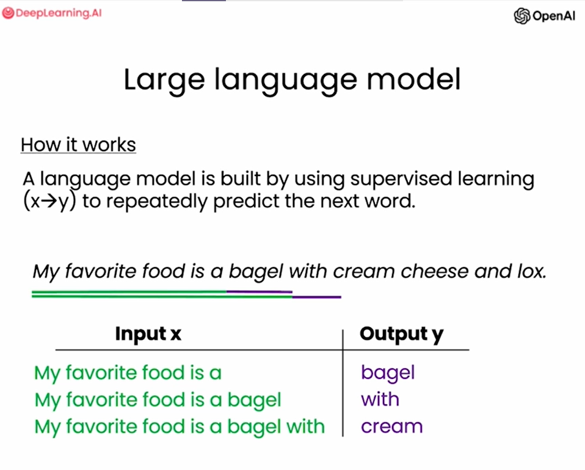
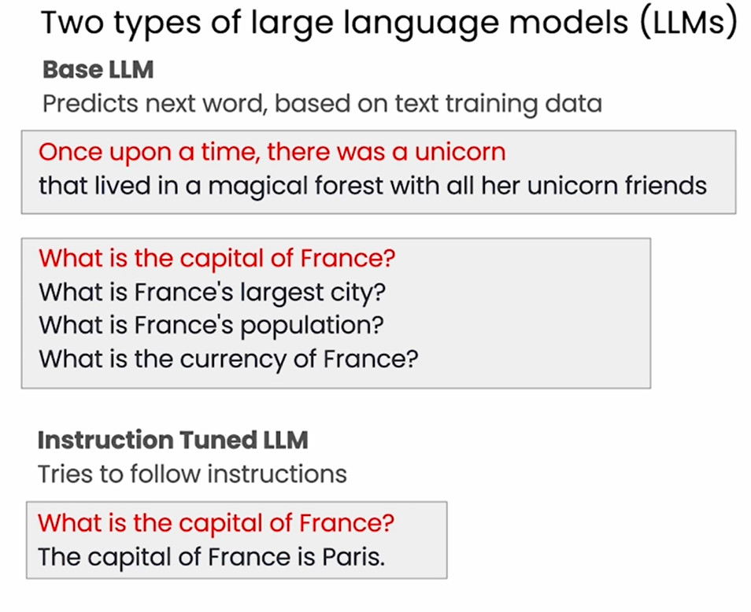
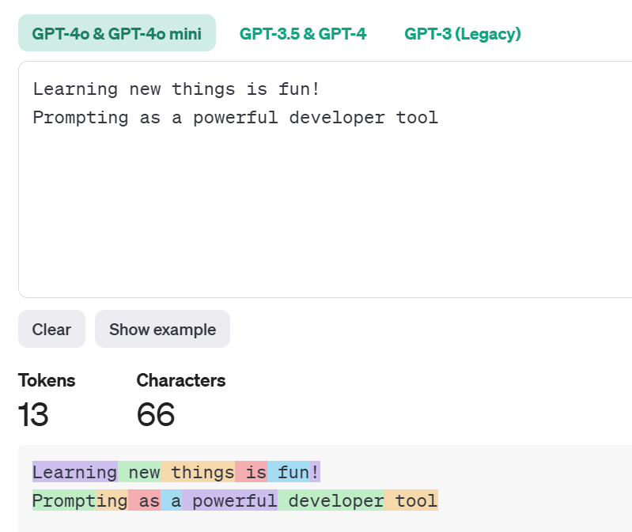

本课程是吴恩达与OpenAI、Hugging Face、LangChain等机构联合打造，面向开发者的LLM系列课程第二讲——使用 ChatGPT API 构建系统，由OpenAI的Isa Fulford和吴恩达合作授课。

## 课程链接

[Building Systems with the ChatGPT API](https://www.deeplearning.ai/short-courses/building-systems-with-chatgpt/)

>建议大家直接看DeepLearning.AI上的英文原版，配合官方提供的Jupyter Notebook效果更佳。B站上的翻译稀烂，不建议看，可能会造成误导。
>
>友情提示：Isa的语速超快，还是英国口音，real难懂，实在听不懂就降低倍速吧。

## 概述

ChatGPT具有强大的语言问答能力，已经成为人们日常必不可少的得力助手。OpenAI通过API将ChatGPT强大的能力开放给开发者，方便我们自由的搭建各种各样的系统。如何基于ChatGPT API搭建完整、高效、安全的系统是具有挑战性的，本课程提供了工程上的最佳实践。

本课程在 [**ChatGPT Prompt Engineering for Developers**](https://www.deeplearning.ai/short-courses/chatgpt-prompt-engineering-for-developers/)的基础上，进一步介绍如何使用ChatGPT API搭建系统，包括：

- 使用LLM高效构建multi-step system；
- 学习使用多级提示将复杂任务拆分为一系列子任务；
- 评估LLM输入和输出的安全性，准确性和相关性。

通过本课程，你将学习如何使用LLM的链式调用来自动化复杂的工作流，构建与completion交互的prompt链、与completion和新prompt交互的系统，以及集成前述所有技术的客服聊天机器人。并将这些技能应用于实际场景中，包括将用户的查询分类为与聊天代理的响应相匹配、评估用户查询的安全性以及处理需要多步推理的任务链。

## Introduction

本课程介绍使用LLM构建复杂应用的最佳实践。以客服聊天机器人为例，讲解如何使用prompt链调用LLM，实现复杂的问答与推理功能。我们将讨论prompt分类、推理技巧、系统输出评估等关键问题。

## Language Models, the Chat Format and Tokens

### Language Model

语言模型使用监督学习的方式构建，用来不断的预测下一个’词‘。



LLM主要可分为两类：Base LLM和Instruction Tuned LLM。



Base LLM基于训练数据预测下一个’词‘，它的输出很可能不符合人类的习惯，只是基于它看过的训练资料作预测而已。Instruction Tuned LLM输出符合人类习惯的回答。例如，输入同样的prompt“What is the capital of France?”，Base LLM的训练资料中如果恰好有关于France的问题，那它可能会输出"What is France's largest city?......"一系列问题。显然，我们期望的答案并不是这样，期望LLM告诉我们"The capital of France is Paris."。

**如何将Base LLM转化为Instruction Tuned LLM?**

微调（Fine Tune）和基于人类反馈的强化学习（RLHF）。

### Tokens

LLM每次预测的严格来说不是一个词，而是一个token。Token是模型处理和生成语言的基本单元，对于一个句子，模型使用tokenizer将其划分为一个个token才能处理。如下图，ChatGPT的tokenizer将句子划分为tokens：



### Chat Format

语言模型有专门的”提问格式“，更好地发挥其理解和回答问题的能力。


- **system**：设定Assistant的行为，通常一个会话开始的第一个消息是System Message；
- **assistent**：用来构建系统的模型，用户向它输入prompt，它返回给用户response；
- **user**：向Assistant发起指令，即prompt；

## Classification

对客户请求进行分类，以便处理不同的情况。

[Evaluate Inputs: Classification](https://learn.deeplearning.ai/courses/chatgpt-building-system/lesson/3/classification)

```python
delimiter = "####"
system_message = f"""
You will be provided with customer service queries. \
The customer service query will be delimited with \
{delimiter} characters.
Classify each query into a primary category \
and a secondary category. 
Provide your output in json format with the \
keys: primary and secondary.

Primary categories: Billing, Technical Support, \
Account Management, or General Inquiry.

Billing secondary categories:
Unsubscribe or upgrade
Add a payment method
Explanation for charge
Dispute a charge

Technical Support secondary categories:
General troubleshooting
Device compatibility
Software updates

Account Management secondary categories:
Password reset
Update personal information
Close account
Account security

General Inquiry secondary categories:
Product information
Pricing
Feedback
Speak to a human

"""
user_message = f"""\
I want you to delete my profile and all of my user data"""
messages =  [  
{'role':'system', 
 'content': system_message},    
{'role':'user', 
 'content': f"{delimiter}{user_message}{delimiter}"},  
] 
response = get_completion_from_messages(messages)
print(response)
```

在`system_message`中告诉LLM"Classify each query into a primary category and a secondary category."，随后列出"Primary categories"和"Secondary categories"的详细内容。`user_message`表示客户任务，跟`system_message`组成完整的message传入API。

```python
user_message = f"""\
I want you to delete my profile and all of my user data"""
```

```json
{
  "primary": "Account Management",
  "secondary": "Close account"
}  
```

```python
user_message = f"""\
Tell me more about your flat screen tvs"""
```

```json
{
  "primary": "Account Management",
  "secondary": "Close account"
}  
```

## Moderation

在需要用户输入的系统，如何确保用户负责任的使用系统，不要滥用系统是非常重要的。本节将介绍如何使用OpenAI的Moderation API进行内容审查，以及如何防止/检测提示注入（Prompt injections）。

### Moderation API

使用Moderation API对用户的输入进行审核，该接口用于确保用户输入的内容符合 OpenAI 的使用规定。Moderation API可检测出harassment、hate、illicit等类型的内容，详情参见[OpenAI Moderation API](https://platform.openai.com/docs/guides/moderation)。


