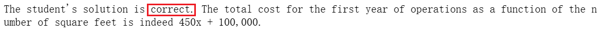
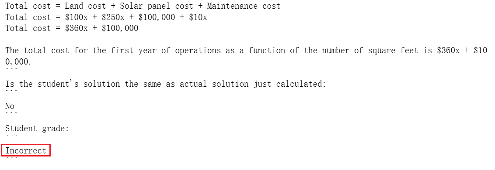
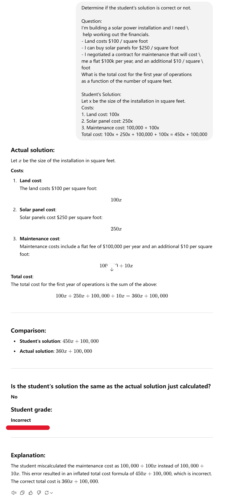
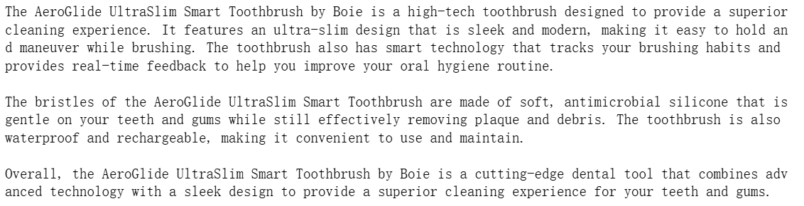
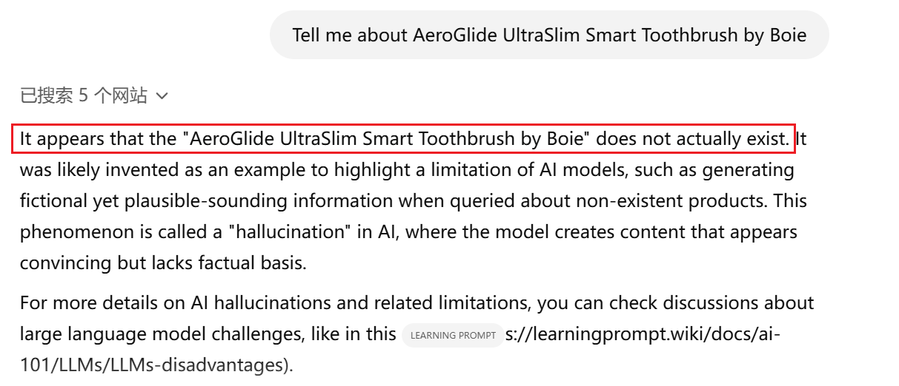

本课程是吴恩达与OpenAI、Hugging Face、LangChain等机构联合打造，面向开发者的LLM系列课程第一讲——面向开发者的ChatGPT Prompt Engineering，由OpenAI的Isa Fulford和吴恩达合作授课。

## 课程链接

[ChatGPT Prompt Engineering for Developers](https://www.deeplearning.ai/short-courses/chatgpt-prompt-engineering-for-developers/)

> 建议大家直接看DeepLearning.AI上的英文原版，配合官方提供的Jupyter Notebook效果更佳。B站上的翻译稀烂，不建议看，可能会造成误导。
>
> 友情提示：Isa的语速超快，还是英国口音，real难懂，实在听不懂就降低倍速吧。

## 概述

在自然语言处理和人工智能领域，Prompt是指提供给模型（特别是语言模型，如GPT-3、GPT-4、BERT等）的一段输入文本，用来引导模型进行特定任务的生成或推理。它是模型与用户之间的桥梁，用户通过设计合适的Prompt来获取所需的输出。Prompt Engineering（提示工程）指设计、优化和调整输入提示以便引导模型生成所需的输出。

在本课程中，你将学习如何使用LLM快速构建新的强大的应用程序。Isa Fulford和吴恩达将描述LLM的工作原理，提供Prompt Engineering的最佳实践，并将LLM api应用在总结（例如，为简洁而总结用户评论）、推断（例如，情感分类，主题提取）、转换文本（例如，翻译，拼写和语法纠正）和扩展（例如，自动写电子邮件）任务上。

此外，你将学习编写有效prompt的两个原则，如何系统的设计好的prompt以及如何自定义聊天机器人。

## Prompting Principles

- **Principle 1**: 编写明确具体的指令；
- **Principle 2**: 给模型时间去思考；

下面分别介绍每个principle使用的具体策略。

### Principle 1

**策略1**：使用分隔符清楚地表示输入的不同部分，例如```, """, <>, <tag></tag>, :等。

```python
text = f"""
You should express what you want a model to do by \ 
providing instructions that are as clear and \ 
specific as you can possibly make them. \ 
This will guide the model towards the desired output, \ 
and reduce the chances of receiving irrelevant \ 
or incorrect responses. Don't confuse writing a \ 
clear prompt with writing a short prompt. \ 
In many cases, longer prompts provide more clarity \ 
and context for the model, which can lead to \ 
more detailed and relevant outputs.
"""
prompt = f"""
Summarize the text delimited by triple backticks \ 
into a single sentence.
```{text}```
"""
```

要总结的文本`text`用三个反引号\```{text}\```分隔开来。

**策略2**：要求模型输出结构化数据，例如JSON、HTML。

```python
prompt = f"""
Generate a list of three made-up book titles along \ 
with their authors and genres. 
Provide them in JSON format with the following keys: 
book_id, title, author, genre.
"""
```

在prompt中明确要求模型输出'in JSON format'。

**策略3**：请模型检查是否满足条件。

```python
text_1 = f"""
Making a cup of tea is easy! First, you need to get some \ 
water boiling. While that's happening, \ 
grab a cup and put a tea bag in it. Once the water is \ 
hot enough, just pour it over the tea bag. \ 
Let it sit for a bit so the tea can steep. After a \ 
few minutes, take out the tea bag. If you \ 
like, you can add some sugar or milk to taste. \ 
And that's it! You've got yourself a delicious \ 
cup of tea to enjoy.
"""
prompt = f"""
You will be provided with text delimited by triple quotes. 
If it contains a sequence of instructions, \ 
re-write those instructions in the following format:

Step 1 - ...
Step 2 - …
…
Step N - …

If the text does not contain a sequence of instructions, \ 
then simply write \"No steps provided.\"

\"\"\"{text_1}\"\"\"
"""
```

如果text中包含一系列的指令，按照以下格式重写这些指令。否则，输出`No steps provided.`

Step 1 - ...
Step 2 - …
…
Step N - …

**策略4：**"Few-shot" prompting。

```python
prompt = f"""
Your task is to answer in a consistent style.

<child>: Teach me about patience.

<grandparent>: The river that carves the deepest \ 
valley flows from a modest spring; the \ 
grandest symphony originates from a single note; \ 
the most intricate tapestry begins with a solitary thread.

<child>: Teach me about resilience.
"""
```

在prompt中先提供少量的例子给模型，然后再向模型提问。

### Principle 2

**策略1：**指定完成任务所需的步骤。

```python
text = f"""
In a charming village, siblings Jack and Jill set out on \ 
a quest to fetch water from a hilltop \ 
well. As they climbed, singing joyfully, misfortune \ 
struck—Jack tripped on a stone and tumbled \ 
down the hill, with Jill following suit. \ 
Though slightly battered, the pair returned home to \ 
comforting embraces. Despite the mishap, \ 
their adventurous spirits remained undimmed, and they \ 
continued exploring with delight.
"""
# example 1
prompt_1 = f"""
Perform the following actions: 
1 - Summarize the following text delimited by triple \
backticks with 1 sentence.
2 - Translate the summary into French.
3 - List each name in the French summary.
4 - Output a json object that contains the following \
keys: french_summary, num_names.

Separate your answers with line breaks.

Text:
```{text}```
"""
```

`Perform the following actions: `明确指出模型需要执行的操作。

**策略2：**让模型得出答案前先给出解决方案。

> 这跟人类的行为很相似。假如让你解一道复杂的数学题，根据题干就直接给出答案是很困难的，往往不能得到正确答案。如果先分析问题，给出问题的解决方案，然后再根据方案求解答案，正确率能提高不少。

```python
prompt = f"""
Determine if the student's solution is correct or not.

Question:
I'm building a solar power installation and I need \
 help working out the financials. 
- Land costs $100 / square foot
- I can buy solar panels for $250 / square foot
- I negotiated a contract for maintenance that will cost \ 
me a flat $100k per year, and an additional $10 / square \
foot
What is the total cost for the first year of operations 
as a function of the number of square feet.

Student's Solution:
Let x be the size of the installation in square feet.
Costs:
1. Land cost: 100x
2. Solar panel cost: 250x
3. Maintenance cost: 100,000 + 100x
Total cost: 100x + 250x + 100,000 + 100x = 450x + 100,000
"""
```

本例让模型（gpt-3.5-turbo）直接判断学生的答案是否正确。事实上，学生的答案是错误的，但是模型却认为是正确的。



我们让模型（gpt-3.5-turbo）先给出自己的解决方案和答案，然后再跟学生的解法做对比。

````python
prompt = f"""
Your task is to determine if the student's solution \
is correct or not.
To solve the problem do the following:
- First, work out your own solution to the problem including the final total. 
- Then compare your solution to the student's solution \ 
and evaluate if the student's solution is correct or not. 
Don't decide if the student's solution is correct until 
you have done the problem yourself.

Use the following format:
Question:
```
question here
```
Student's solution:
```
student's solution here
```
Actual solution:
```
steps to work out the solution and your solution here
```
Is the student's solution the same as actual solution \
just calculated:
```
yes or no
```
Student grade:
```
correct or incorrect
```

Question:
```
I'm building a solar power installation and I need help \
working out the financials. 
- Land costs $100 / square foot
- I can buy solar panels for $250 / square foot
- I negotiated a contract for maintenance that will cost \
me a flat $100k per year, and an additional $10 / square \
foot
What is the total cost for the first year of operations \
as a function of the number of square feet.
``` 
Student's solution:
```
Let x be the size of the installation in square feet.
Costs:
1. Land cost: 100x
2. Solar panel cost: 250x
3. Maintenance cost: 100,000 + 100x
Total cost: 100x + 250x + 100,000 + 100x = 450x + 100,000
```
Actual solution:
"""
````

模型（gpt-3.5-turbo）判定学生的答案是错误的，并给出正确解法。



> 这个策略对gpt-3.5-turbo是有效的，但是gpt-4不需要使用这个策略就能自动输出解题过程和正确答案。
>
> 

### 模型的局限性：幻觉（Hallucinations）

语言模型产生的答案是靠“文字接龙”接出来的，模型并不知道这些“知识”，也不能判断这些“知识”是不是符合现实情况的。如果我们基于虚假的信息向模型提问，它也能产生"像模像样"的答案，这种现象被称为模型的幻觉。

```python
prompt = f"""
Tell me about AeroGlide UltraSlim Smart Toothbrush by Boie
"""
```

'Boie'公司是不存在，但是模型（gpt-3.5-turbo）却煞有介事的介绍起了产品。



我们拿同样的prompt去问gpt-4，gpt-4会告诉我们'Boie'公司和'AeroGlide UltraSlim Smart Toothbrush'都是不存在的。


