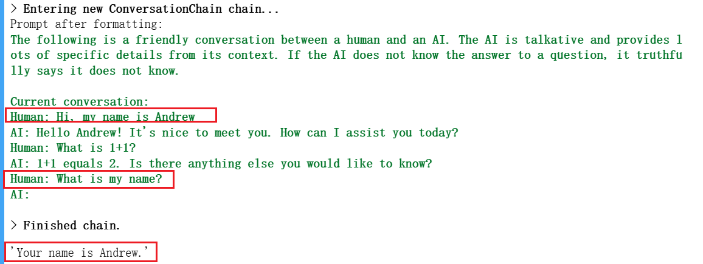
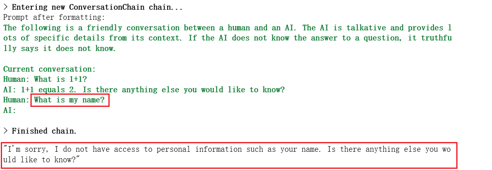
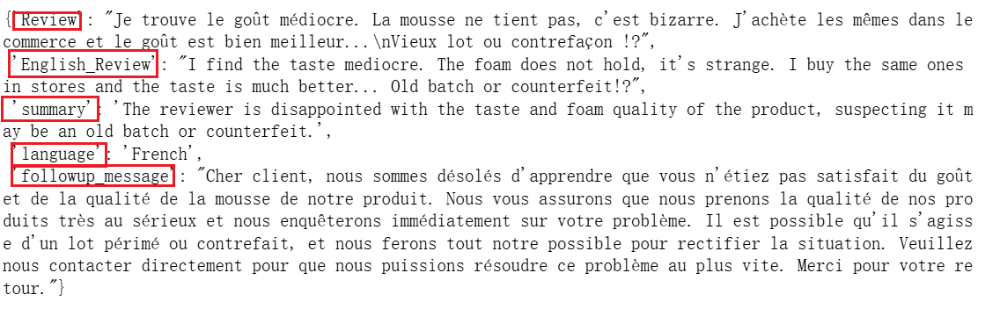
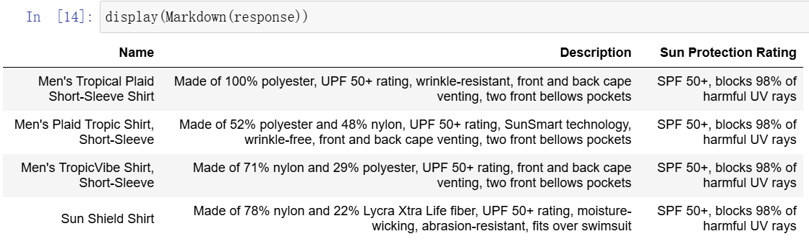
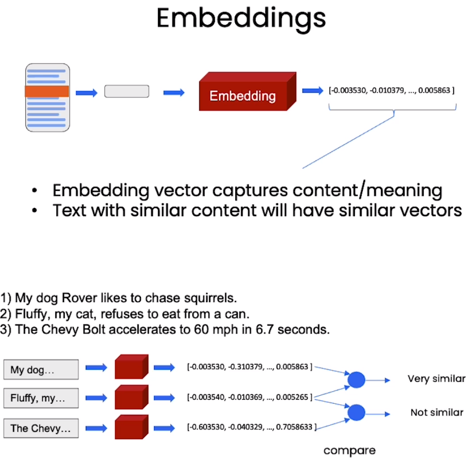
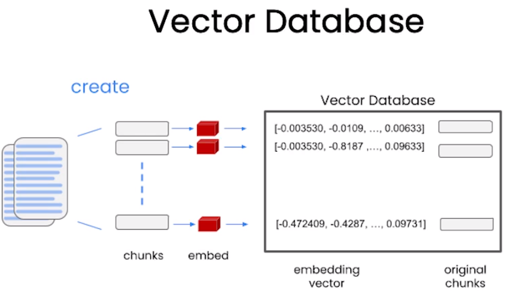
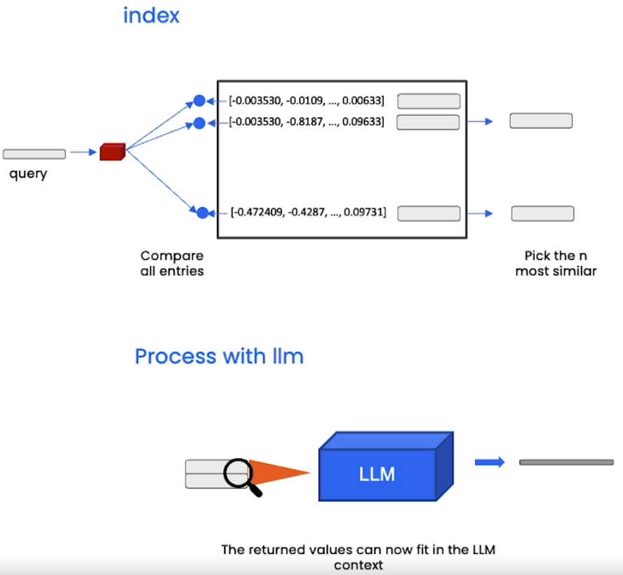
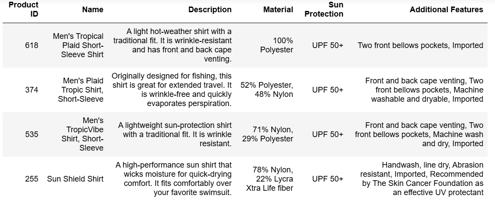
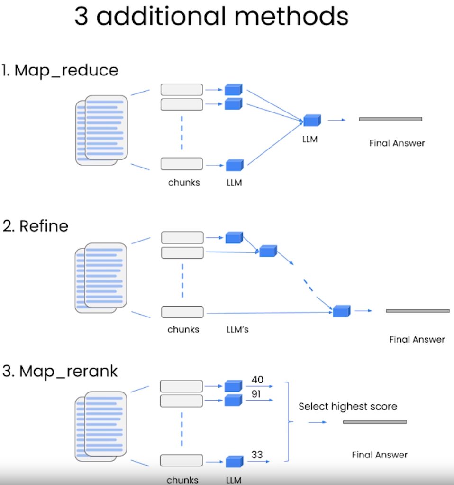

本课程是吴恩达与OpenAI、Hugging Face、LangChain等机构联合打造，面向开发者的LLM系列课程第三讲——用于LLM应用程序开发的LangChain，由LangChain联合创始人兼CEO Harrison Chase和吴恩达合作授课。

## 课程链接

[LangChain for LLM Application Development](https://www.deeplearning.ai/short-courses/langchain-for-llm-application-development/)

>建议大家直接看DeepLearning.AI上的英文原版，配合官方提供的Jupyter Notebook效果更佳。B站上的翻译稀烂，不建议看，可能会造成误导。
>

## 概述

基于LLM API开发应用程序之前，开发者不得不写很多胶水代码才能搭建完整的程序框架。LangChain是一个用于开发基于LLM的应用程序的框架，它简化了LLM应用程序生命周期的每个阶段，包括开发、部署和产品化，已经被广大开发者、初创公司和大型企业广泛使用。

在本课程中，你将学习并使用LangChain开发完整健壮的应用程序，包括以下内容：

- Models, Prompts and Parsers：调用LLM，提供prompt，解析response；
- Memories for LLMs：存储对话和管理有限上下文空间；
- Chains：创建操作序列；
- Question Answering over Documents：将LLM应用到专有数据和用例；
- Agents：探索LLM作为推理代理的强大新兴发展。

## Introduction

为了简化基于LLM的AI应用程序开发，Harrison Chase创造了LangChain。LangChain是开发框架也是活跃的开源社区，有数百名贡献者，正以惊人的速度迭代新功能。LangChain提供Python和JavaScript两种包，专注于组合和模块化，可以轻松的将各个组件结合起来创建端到端应用程序。

本课程重点介绍LangChain的常用组件：Models, Prompts, Indexes, Chains, Agents。


## Models, Prompts and Parsers

### Chat API : LangChain

安装最新版本的`langchain`包

```python
pip install --upgrade langchain
```

### Model

从`langchain.chat_models`导入OpenAI对话模型。LangChain也集成了其他厂商的模型，如Anthropic、Google等，参见[Providers | 🦜️🔗 LangChain](https://python.langchain.com/docs/integrations/providers/)

```python
from langchain.chat_models import ChatOpenAI
```

声明一个model

```python
chat = ChatOpenAI(temperature=0.0, model='gpt-3.5-turbo')
```

### Prompt template

使用LangChain构造prompt模板，将需要改动的部分抽象成变量，具体使用时抽象成所需要的内容。达到一次定义，多次使用的效果。

**首先定义模板字符串：**

```python
template_string = """Translate the text \
that is delimited by triple backticks \
into a style that is {style}. \
text: ```{text}```
"""
```

从`langchain.prompts`导入`ChatPromptTemplate`用来实例化prompt模板。

```python
from langchain.prompts import ChatPromptTemplate

prompt_template = ChatPromptTemplate.from_template(template_string)
```

输出`prompt_template`可以发现，`input_variables`就是`template_string`中定义的`{text}`和`{style}`。后续使用中，替换`{text}`和`{style}`可方便地构造不同的prompt。


我们使用`prompt_template`构造coustomer prompt，并使用`chat`调用'gpt-3.5-turbo'获得response。

**定义style和text**

```python
# style
customer_style = """American English \
in a calm and respectful tone
"""

# text
customer_email = """
Arrr, I be fuming that me blender lid \
flew off and splattered me kitchen walls \
with smoothie! And to make matters worse, \
the warranty don't cover the cost of \
cleaning up me kitchen. I need yer help \
right now, matey!
"""
```

**构造customer prompt**

```python
customer_messages = prompt_template.format_messages(
                    style=customer_style,
                    text=customer_email)
```

**调用'gpt-3.5-turbo'将`customer_email`转换为`customer_style`风格**

```
customer_response = chat(customer_messages)
```


### Parse the LLM output string into a Python dictionary

Parser是LangChain能够成链的关键。因为它会将LLM的输出解析成你所需要的格式，例如字典。将此输出作为下一个模块的输入，从而可以将两个模块关联起来。

**导入必要的库：**

从`langchain`库的`output_parsers`模块中导入`ResponseSchema`和`StructuredOutputParser`

- `ResponseSchema`用于定义和验证输出的预期结构；

- `StructuredOutputParser`用于将输出解析为结构化数据，便于后续处理和分析。

```python
from langchain.output_parsers import ResponseSchema
from langchain.output_parsers import StructuredOutputParser
```

**生成对应格式的Schema：**

假设LLM的输出格式是一个字典，有三个key分别为gift、delivery_days、和price_value。

```python
{
  "gift": False,
  "delivery_days": 5,
  "price_value": "pretty affordable!"
}
```

使用`ResponseSchema`生成Schema：

```python
gift_schema = ResponseSchema(name="gift",
                             description="Was the item purchased\
                             as a gift for someone else? \
                             Answer True if yes,\
                             False if not or unknown.")
delivery_days_schema = ResponseSchema(name="delivery_days",
                                      description="How many days\
                                      did it take for the product\
                                      to arrive? If this \
                                      information is not found,\
                                      output -1.")
price_value_schema = ResponseSchema(name="price_value",
                                    description="Extract any\
                                    sentences about the value or \
                                    price, and output them as a \
                                    comma separated Python list.")

response_schemas = [gift_schema, 
                    delivery_days_schema,
                    price_value_schema]
```

**生成解析LLM response的parser：**

```python
output_parser = StructuredOutputParser.from_response_schemas(response_schemas)
```

**获取输出格式说明：**

```python
format_instructions = output_parser.get_format_instructions()
```


**生成prompt：**

定义prompt模板，生成包含文本和format_instructions的prompt。

```python
review_template_2 = """\
For the following text, extract the following information:

gift: Was the item purchased as a gift for someone else? \
Answer True if yes, False if not or unknown.

delivery_days: How many days did it take for the product\
to arrive? If this information is not found, output -1.

price_value: Extract any sentences about the value or price,\
and output them as a comma separated Python list.

text: {text}

{format_instructions}
"""

prompt = ChatPromptTemplate.from_template(template=review_template_2)

messages = prompt.format_messages(text=customer_review, 
                                format_instructions=format_instructions)
```

**调用LLM生成response**

```python
response = chat(messages)
```

`response.content`为`str`格式


**parser解析为dict格式**

```python
output_dict = output_parser.parse(response.content)
```


## Memory

语言模型是无状态的，用户每一次与语言模型的交互都是独立的，换句话说，语言模型并不记得到目前为止的历史对话。因此，在构建应用程序时，对话缺乏真正的连续性。LangChain的Memory模块可以将先前的对话嵌入到语言模型中，使对话具有连续性。

LangChain具有多种Memory，本课程主要介绍其中四种：

- **ConversationBufferMemory**
- **ConversationBufferWindowMemory**
- **ConversationTokenBufferMemory**
- **ConversationSummaryMemory**

更多Memory请参考API手册：[memory](https://api.python.langchain.com/en/latest/langchain/memory.html)

### ConversationBufferMemory

**导入Model, Chain和Memory**

```python
from langchain.chat_models import ChatOpenAI
from langchain.chains import ConversationChain
from langchain.memory import ConversationBufferMemory
```

**构建Conversation**

```python
llm = ChatOpenAI(temperature=0.0, model=llm_model)
memory = ConversationBufferMemory()
conversation = ConversationChain(
    llm=llm, 
    memory = memory,
    verbose=True
)
```

**调用`.predict()`启动对话**

```python
conversation.predict(input="Hi, my name is Andrew")
conversation.predict(input="What is 1+1?")
conversation.predict(input="What is my name?")
```

我们连续进行三轮对话，看看模型内部到底存储了些什么。



模型存储了历史对话的所有内容，因此它知道用户的名字是Andrew。

详情请看：[ConversationBufferMemory](https://api.python.langchain.com/en/latest/langchain/memory/langchain.memory.buffer.ConversationBufferMemory.html#langchain.memory.buffer.ConversationBufferMemory)

### ConversationBufferWindowMemory

[ConversationBufferWindowMemory](https://api.python.langchain.com/en/latest/langchain/memory/langchain.memory.buffer_window.ConversationBufferWindowMemory.html)只保留最近的一个窗口大小的对话。

声明`k=1`的`ConversationBufferWindowMemory`

```python
from langchain.memory import ConversationBufferWindowMemory

llm = ChatOpenAI(temperature=0.0, model=llm_model)
memory = ConversationBufferWindowMemory(k=1)
conversation = ConversationChain(
    llm=llm, 
    memory = memory,
    verbose=False
)
```

连续进行三轮对话

```python
conversation.predict(input="Hi, my name is Andrew")
conversation.predict(input="What is 1+1?")
conversation.predict(input="What is my name?")
```



我们设置窗口的大小为`k=1`，模型只存储最近的一轮对话，所以模型并不知道用户的名字，虽然用户已经告诉过它，但模型并没有存储。

### ConversationTokenBufferMemory

[ConversationTokenBufferMemory](https://api.python.langchain.com/en/latest/langchain/memory/langchain.memory.token_buffer.ConversationTokenBufferMemory.html)从token数量上限制Memory的大小，存储最近的`max_token_limit`个token。

```python
from langchain.memory import ConversationTokenBufferMemory

memory = ConversationTokenBufferMemory(llm=llm, max_token_limit=50)
```

### ConversationSummaryMemory

[ConversationSummaryMemory](https://api.python.langchain.com/en/latest/langchain/memory/langchain.memory.summary.ConversationSummaryMemory.html)存储最近历史对话的摘要，而不是原始对话。同样，摘要不能超过`max_token_limit`个token。

```python
from langchain.memory import ConversationSummaryBufferMemory

memory = ConversationSummaryBufferMemory(llm=llm, max_token_limit=100)
```

## Chains

[链（chain）](https://python.langchain.com/api_reference/langchain/chains.html)是LangChain中最重要的组件，将LLM和prompt结合在一起。我们可以将多个链连接在一起，在文本或者数据上进行一系列的操作。

### LLMChain

[LLMChain](https://python.langchain.com/api_reference/langchain/chains/langchain.chains.llm.LLMChain.html#langchain.chains.llm.LLMChain)是简单而强大的链，是其他复杂链的基础。

**导入llm, prompt template, chain**

```python
from langchain.chat_models import ChatOpenAI
from langchain.prompts import ChatPromptTemplate
from langchain.chains import LLMChain
```

**创建llm和prompt template**

```python
llm = ChatOpenAI(temperature=0.9, model=llm_model)

prompt = ChatPromptTemplate.from_template(
    "What is the best name to describe \
    a company that makes {product}?"
)
```

**创建一个LLMChain实例，它将一个llm和一个prompt template结合起来**

```python
chain = LLMChain(llm=llm, prompt=prompt)
```

**调用LLMChain实例的run方法，将product作为输入传递给链，并执行链中定义的流程**

```
product = "Queen Size Sheet Set"
chain.run(product)
```

### SimpleSequentialChain

[SimpleSequentialChain](https://python.langchain.com/api_reference/langchain/chains/langchain.chains.sequential.SimpleSequentialChain.html#langchain.chains.sequential.SimpleSequentialChain)是顺序链最简单的形式，其中每个步骤都有一个单一的输入/输出，并且一个步骤的输出是下一个步骤的输入。

**导入SimpleSequentialChain**

```python
from langchain.chains import SimpleSequentialChain
```

**创建两个LLMChain实例作为子链**

```py
llm = ChatOpenAI(temperature=0.9, model=llm_model)

# prompt template 1
first_prompt = ChatPromptTemplate.from_template(
    "What is the best name to describe \
    a company that makes {product}?"
)

# Chain 1
chain_one = LLMChain(llm=llm, prompt=first_prompt)
```

```python
# prompt template 2
second_prompt = ChatPromptTemplate.from_template(
    "Write a 20 words description for the following \
    company:{company_name}"
)
# chain 2
chain_two = LLMChain(llm=llm, prompt=second_prompt)
```

**使用SimpleSequentialChain将两个子链组装起来**

```
overall_simple_chain = SimpleSequentialChain(chains=[chain_one, chain_two],
                                             verbose=True
                                            )
```

**调用run方法执行流程**

```python
overall_simple_chain.run(product)
```

### SequentialChain

[SequentialChain](https://python.langchain.com/api_reference/langchain/chains/langchain.chains.sequential.SequentialChain.html#langchain.chains.sequential.SequentialChain)是更通用的顺序链形式，允许多个输入和输出。

**导入SequentialChain**

```python
from langchain.chains import SequentialChain
```

**创建四个LLMChain实例作为子链**

```python
llm = ChatOpenAI(temperature=0.9, model=llm_model)

# prompt template 1: translate to english
first_prompt = ChatPromptTemplate.from_template(
    "Translate the following review to english:"
    "\n\n{Review}"
)
# chain 1: input= Review and output= English_Review
chain_one = LLMChain(llm=llm, prompt=first_prompt, 
                     output_key="English_Review"
                    )
```

```python
second_prompt = ChatPromptTemplate.from_template(
    "Can you summarize the following review in 1 sentence:"
    "\n\n{English_Review}"
)
# chain 2: input= English_Review and output= summary
chain_two = LLMChain(llm=llm, prompt=second_prompt, 
                     output_key="summary"
                    )
```

```python
# prompt template 3: translate to english
third_prompt = ChatPromptTemplate.from_template(
    "What language is the following review:\n\n{Review}"
)
# chain 3: input= Review and output= language
chain_three = LLMChain(llm=llm, prompt=third_prompt,
                       output_key="language"
                      )
```

```python
# prompt template 4: follow up message
fourth_prompt = ChatPromptTemplate.from_template(
    "Write a follow up response to the following "
    "summary in the specified language:"
    "\n\nSummary: {summary}\n\nLanguage: {language}"
)
# chain 4: input= summary, language and output= followup_message
chain_four = LLMChain(llm=llm, prompt=fourth_prompt,
                      output_key="followup_message"
                     )
```

每个子链都指定了`output_key`标识子链的输出，每个prompt中的占位符{xxx}表示该子链的输入。输入输出

变量的名称要严格对应，否则会出现key error。

**创建SequentialChain**

```python
# overall_chain: input= Review 
# and output= English_Review,summary, followup_message
overall_chain = SequentialChain(
    chains=[chain_one, chain_two, chain_three, chain_four],
    input_variables=["Review"],
    output_variables=["English_Review", "summary","language","followup_message"],
    verbose=True
)
```

- **chains**：顺序链中包含的子链列表；
- **input_variables**：输入变量列表，由于第一个子链的输入是`{Review}`，因此输入变量为`["Review"]`;
- **output_variables**：输出变量列表。

**执行顺序链**

```python
review = df.Review[5]
overall_chain(review)
```



输出`output_variables`中指定的变量`["English_Review", "summary","language","followup_message"]`。

### Router Chain

Router Chain（路由链）允许根据输入的prompt从给定的一组链中动态选择一个预定义的子链。

**定义一组prompt template**

```python
physics_template = """You are a very smart physics professor. \
You are great at answering questions about physics in a concise\
and easy to understand manner. \
When you don't know the answer to a question you admit\
that you don't know.

Here is a question:
{input}"""


math_template = """You are a very good mathematician. \
You are great at answering math questions. \
You are so good because you are able to break down \
hard problems into their component parts, 
answer the component parts, and then put them together\
to answer the broader question.

Here is a question:
{input}"""

history_template = """You are a very good historian. \
You have an excellent knowledge of and understanding of people,\
events and contexts from a range of historical periods. \
You have the ability to think, reflect, debate, discuss and \
evaluate the past. You have a respect for historical evidence\
and the ability to make use of it to support your explanations \
and judgements.

Here is a question:
{input}"""


computerscience_template = """ You are a successful computer scientist.\
You have a passion for creativity, collaboration,\
forward-thinking, confidence, strong problem-solving capabilities,\
understanding of theories and algorithms, and excellent communication \
skills. You are great at answering coding questions. \
You are so good because you know how to solve a problem by \
describing the solution in imperative steps \
that a machine can easily interpret and you know how to \
choose a solution that has a good balance between \
time complexity and space complexity. 

Here is a question:
{input}"""
```

**对每个template进行命名和描述，封装成字典**

```python
prompt_infos = [
    {
        "name": "physics", 
        "description": "Good for answering questions about physics", 
        "prompt_template": physics_template
    },
    {
        "name": "math", 
        "description": "Good for answering math questions", 
        "prompt_template": math_template
    },
    {
        "name": "History", 
        "description": "Good for answering history questions", 
        "prompt_template": history_template
    },
    {
        "name": "computer science", 
        "description": "Good for answering computer science questions", 
        "prompt_template": computerscience_template
    }
]
```

**导入MultiPromptChain， LLMRouterChain，RouterOutputParser，PromptTemplate**

```python
from langchain.chains.router import MultiPromptChain
from langchain.chains.router.llm_router import LLMRouterChain,RouterOutputParser
from langchain.prompts import PromptTemplate
```

**为`prompt_infos`中每个prompt创建子链，并加入`destination_chains`**

```python
destination_chains = {}
for p_info in prompt_infos:
    name = p_info["name"]
    prompt_template = p_info["prompt_template"]
    prompt = ChatPromptTemplate.from_template(template=prompt_template)
    chain = LLMChain(llm=llm, prompt=prompt)
    destination_chains[name] = chain  
    
destinations = [f"{p['name']}: {p['description']}" for p in prompt_infos]
destinations_str = "\n".join(destinations)
```

**创建默认链，当无法决定调用哪一条子链时，调用默认链**

```python
default_prompt = ChatPromptTemplate.from_template("{input}")
default_chain = LLMChain(llm=llm, prompt=default_prompt)
```

**构建路由链**

```
router_template = MULTI_PROMPT_ROUTER_TEMPLATE.format(
    destinations=destinations_str
)
router_prompt = PromptTemplate(
    template=router_template,
    input_variables=["input"],
    output_parser=RouterOutputParser(),
)

router_chain = LLMRouterChain.from_llm(llm, router_prompt)
```

`LLMRouterChain`根据输入动态地将任务路由到适当的子链，即不同的`LLMChain`。

**封装总体链路**

```python
chain = MultiPromptChain(router_chain=router_chain, 
                         destination_chains=destination_chains, 
                         default_chain=default_chain, verbose=True
                        )
```

`MultiPromptChain`允许根据不同的输入内容，动态选择不同的链路。

**测试路由链**

```python
chain.run("What is black body radiation?") # 提问物理问题
```

```wiki
# 被路由到物理链路
> Entering new MultiPromptChain chain...
physics: {'input': 'What is black body radiation?'}
> Finished chain.
"Black body radiation is the type of electromagnetic radiation that is emitted by a perfect black body, which is an idealized physical body that absorbs all incident electromagnetic radiation, regardless of frequency or angle of incidence. The radiation has a specific spectrum and intensity that depends only on the body's temperature, which is assumed to be uniform and constant. This phenomenon was first explained by Max Planck in 1900, and it is a foundational concept in quantum mechanics."
```

```python
chain.run("Why does every cell in our body contain DNA?") # 提问生物问题
```

```wiki
# 由于没有“生物”类的prompt template，因此被路由到默认链路。
> Entering new MultiPromptChain chain...
None: {'input': 'Why does every cell in our body contain DNA?'}
> Finished chain.
'DNA, or deoxyribonucleic acid, is the hereditary material in humans and almost all other organisms. It contains the instructions needed for an organism to develop, survive and reproduce. These instructions are found inside every cell, and are passed down from parents to their children.\n\nDNA is organized into structures called chromosomes and is divided into segments known as genes. Each gene contains a specific set of instructions that code for particular proteins that perform various functions in the body.\n\nTherefore, every cell in our body contains DNA because it is essential for life. It provides the instructions for the growth, development, function and reproduction of cells. Without DNA, our cells would not know what to do or how to function, and life as we know it would not exist.'
```

## Question and Answer

使用LLM构建基于文档的问答系统是目前最常见的场景之一。给定一段文本，使用LLM回答用户有关该文本的问题，可以帮助用户对文本有更深的理解或者提取用户关心的内容。该场景将LLM与外部数据结合起来，提高LLM使用的灵活性并扩大了适用范围。

### LangChain: Q&A over Documents

使用LangChain索引搭建基于文档的问答系统。

**创建文档加载器**

从`.csv`文档中读取数据，创建`CSVLoader`

```python
file = 'OutdoorClothingCatalog_1000.csv'
loader = CSVLoader(file_path=file)
```

**创建索引**

创建了文档加载器loder之后，还需要创建用于检索文档内容的索引`index`。

`VectorstoreIndexCreator`用于创建和管理向量存储索引，便于对大量文档进行高效检索。它通过与向量数据库集成，帮助用户构建一个可查询的索引。我们使用的向量数据库是`DocArrayInMemorySearch`，它基于 DocArray 的内存存储功能，将整个文档以向量的形式存储在内存中，用于在本地内存中存储和检索嵌入向量，适合小规模或原型化的语义搜索任务。最后调用`.from_loaders`方法从`loader`创建索引。

```python
from langchain.indexes import VectorstoreIndexCreator

index = VectorstoreIndexCreator(
    vectorstore_cls=DocArrayInMemorySearch
).from_loaders([loader])
```

接下来直接使用索引对文档进行问答：

```python
query ="Please list all your shirts with sun protection \
in a table in markdown and summarize each one."

llm_replacement_model = OpenAI(temperature=0, 
                               model='gpt-3.5-turbo-instruct')

response = index.query(query, 
                       llm = llm_replacement_model)
                       
display(Markdown(response))
```



llm返回4件具有防晒功能的衬衫，并且对每一件衬衫都进行了总结，最后以markdown表格格式输出，满足`query`要求。

### Step By Step

使用`index.query()`方法只用一行代码就可以实现文档问答功能，本节我们一起来探索其背后的原理。

LLM一次只能处理几千个单词，当遇到较大规模的文档时，如何使LLM回答关于该文档的所有问题？这就需要’embeddings‘和‘vector database’，我们先介绍’embeddings‘和‘vector database’的概念，然后再创建文档问答系统step by step。

#### Embeddings

Embedding是指将词汇、短语、文档或其他类型的数据转换为实数向量的过程。相似的词或概念在向量空间中彼此接近。



图中句子1）2）都是关于动物的，它们具有相似的语义，embedding向量在空间中的位置比较接近。句子3）是关于汽车的，embedding向量与前两句话距离较远。

#### Vector Database

在前面的例子中，我们把`.csv`文档存入内存进行检索。对于大规模文档，内存是远远不够的，这时候就要用到Vector Database（向量数据库）。



**文档是如何存储在向量数据库的？**

文档首先被划分为很多chunk（块），然后对每个chunk作embedding，最后将embedding向量和原本的chunk一并存入数据库。

#### 向文档提问

系统将用户query转化为embedding向量，将该向量与向量数据库中的所有向量进行比较，找出前n个最相似的向量，将其原始chunk组合起来喂给LLM生成答案。



接下来我们对之前的数据集作embedding，然后创建问答链（chain）对文档进行提问。

```python
# 加载文档
from langchain.document_loaders import CSVLoader
loader = CSVLoader(file_path=file)
docs = loader.load()

# 创建embeddings
from langchain.embeddings import OpenAIEmbeddings
embeddings = OpenAIEmbeddings()

# 创建向量数据库
db = DocArrayInMemorySearch.from_documents(
    docs, 
    embeddings
)

# 创建检索器
retriever = db.as_retriever()

# 加载llm模型
llm = ChatOpenAI(temperature = 0.0, model='gpt-4')

# 构建基于检索的问答系统
qa_stuff = RetrievalQA.from_chain_type(
    llm=llm, 
    chain_type="stuff", 
    retriever=retriever, 
    verbose=True
)

query = "Please list all your shirts with sun protection in a table \
in markdown and summarize each one."

response = qa_stuff.run(query) 
```

```python
display(Markdown(response))
```



`RetrievalQA`是LangChain中用于构建基于检索的问答系统的工具。它结合了文档检索和LLM的能力，为用户提供高效的知识问答体验。因为我们处理的文本较小，文本处理模式`chain_type`采用`stuff`，将检索到的文档直接拼接成一个字符串，一次性输入给LLM。另外，`chain_type`还有`map_reduce`, `refine`和`map_rerank`三种模式可选。



**map_reduce**：对每个检索到的chunk分别生成答案（map阶段)，然后对这些答案进行整合（reduce阶段）；

**refine**：先总结子一个chunk，然后将总结内容和第二个chunk一起做总结，以此类推，直到总结完所有chunk；

**map_rerank**：对每一个chunk进行总结并评分，选择评分最高的作为最终结果。

## Evaluation

评估是检验LLM问答质量的关键。当你改变了系统的实现，例如更换了LLM、改变使用向量数据库的策略，或者修改了系统参数，你该如何知道系统是变好了还好变差了——我们需要对它进行评估。

上一节已经使用LangChain构建了基于文档的问答系统，该系统的正确性到底如何呢？本节以评估基于文档的问答系统为例，介绍评估LLM系统的工具和方法。

**基本思想**：使用LLM和链本身评估其他LLM、链和应用程序。

### Create Q&A application

创建Q&A系统作为评估的LLM应用

```python
from langchain.chains import RetrievalQA
from langchain.chat_models import ChatOpenAI
from langchain.document_loaders import CSVLoader
from langchain.indexes import VectorstoreIndexCreator
from langchain.vectorstores import DocArrayInMemorySearch

file = 'OutdoorClothingCatalog_1000.csv'
loader = CSVLoader(file_path=file)
data = loader.load()

index = VectorstoreIndexCreator(
    vectorstore_cls=DocArrayInMemorySearch
).from_loaders([loader])

llm = ChatOpenAI(temperature = 0.0, model=llm_model)
qa = RetrievalQA.from_chain_type(
    llm=llm, 
    chain_type="stuff", 
    retriever=index.vectorstore.as_retriever(), 
    verbose=True,
    chain_type_kwargs = {
        "document_separator": "<<<<>>>>>"
    }
)
```

### 创建问答测试集

根据文档'OutdoorClothingCatalog_1000.csv'内容，创建query-answer 测试对作为ground truth。

```python
examples = [
    {
        "query": "Do the Cozy Comfort Pullover Set\
        have side pockets?",
        "answer": "Yes"
    },
    {
        "query": "What collection is the Ultra-Lofty \
        850 Stretch Down Hooded Jacket from?",
        "answer": "The DownTek collection"
    }
]
```

可以手动编写，更推荐的方法是使用LLM+Chain生成ground truth query-answer 测试对。

```python
from langchain.evaluation.qa import QAGenerateChain

# 使用QAGenerateChain和ChatOpenAI创建问答生成链
example_gen_chain = QAGenerateChain.from_llm(ChatOpenAI(model=llm_model))

# 取data中前5个数据生成问答对
new_examples = example_gen_chain.apply_and_parse(
    [{"doc": t} for t in data[:5]]
)
```

```python
new_examples[0]

'''
{'query': " According to the document, what is the approximate weight of the Women's Campside Oxfords per pair?\n\n",
 'answer': " The approximate weight of the Women's Campside Oxfords per pair is 1 lb. 1 oz."}
 '''
```

### LLM assisted evaluation

```python
# 使用apply方法为examples中的测试问题生成答案
predictions = qa.apply(examples)
```

**使用LLM评估答案相似性**

`examples`作为ground truth，`predictions`为LLM生成的答案。使用`QAEvalChain`评估predictions和examples的相似性。

```python
from langchain.evaluation.qa import QAEvalChain

llm = ChatOpenAI(temperature=0, model=llm_model)

# 创建评估链
eval_chain = QAEvalChain.from_llm(llm)

# 评估examples和predictions的相似性
graded_outputs = eval_chain.evaluate(examples, predictions)
```

查看评估结果

```python
for i, eg in enumerate(examples):
    print(f"Example {i}:")
    print("Question: " + predictions[i]['query'])
    print("Real Answer: " + predictions[i]['answer'])
    print("Predicted Answer: " + predictions[i]['result'])
    print("Predicted Grade: " + graded_outputs[i]['text'])
    print()
```

```wiki
Example 0:
Question: Do the Cozy Comfort Pullover Set        have side pockets?
Real Answer: Yes
Predicted Answer: Yes, the Cozy Comfort Pullover Set does have side pockets.
Predicted Grade: CORRECT

Example 1:
Question: What collection is the Ultra-Lofty         850 Stretch Down Hooded Jacket from?
Real Answer: The DownTek collection
Predicted Answer: The Ultra-Lofty 850 Stretch Down Hooded Jacket is from the DownTek collection.
Predicted Grade: CORRECT

Example 2:
Question:  According to the document, what is the approximate weight of the Women's Campside Oxfords per pair?


Real Answer:  The approximate weight of the Women's Campside Oxfords per pair is 1 lb. 1 oz.
Predicted Answer: The approximate weight of the Women's Campside Oxfords per pair is 1 lb. 1 oz.
Predicted Grade: CORRECT

......
```


最后我们理一下思路。首先，我们使用LLM自动创建了query-answer 测试集`examples`，接着我们让LLM回答测试集中的问题生成回复`predictions`。接下来将测试集`examples`和回复`predictions`进行比对，这个过程也由LLM完成。整个流程中LLM既当“裁判”又当“球员”，但是它们来自不同的chain。

## Agents

人们通常认为LLM是一个知识库，因为它看过很多训练资料，可以回答你的问题。LLM的能力远不止于此，它其实是一个“推理引擎”，根据用户信息回答问题、内容推理甚至做决定。本节主要介绍如何创建并使用Agent，如何使用Agent调用外部工具以及如何创建自己的工具供Agent调用。

### Built-in LangChain tools

创建使用LangChain内置工具“llm-math”和"wikipedia"的Agent完成某些任务。“llm-math”具有作数学运算的能力，LLM调用该工具解答数学问题。"wikipedia"是搜索维基百科的工具，LLM连接维基百科进行搜索查询。

```python
from langchain.agents.agent_toolkits import create_python_agent
from langchain.agents import load_tools, initialize_agent
from langchain.agents import AgentType
from langchain.tools.python.tool import PythonREPLTool
from langchain.python import PythonREPL
from langchain.chat_models import ChatOpenAI

# 创建LLM
llm = ChatOpenAI(temperature=0, model=llm_model)

# 定义工具
tools = load_tools(["llm-math","wikipedia"], llm=llm)

# 创建Agent
agent= initialize_agent(
    tools, 
    llm, 
    agent=AgentType.CHAT_ZERO_SHOT_REACT_DESCRIPTION,
    handle_parsing_errors=True,
    verbose = True)
```

使用`initialize_agent`初始化代理`agent`，传入模型`llm`和工具列表`tools`。

**`agent=AgentType.CHAT_ZERO_SHOT_REACT_DESCRIPTION`**:

- `AgentType` 是定义智能代理类型的枚举。
- `CHAT_ZERO_SHOT_REACT_DESCRIPTION`类型表示：
  - 代理以对话形式与用户交互。
  - 使用 “Zero-Shot” 方法：无需特别训练，直接依赖语言模型理解任务。
  - 采用 ReAct 框架：结合推理 (Reasoning) 和行动 (Acting) 的方式完成任务。
- 此代理会根据工具描述推断其功能，并选择合适的工具。

**`handle_parsing_errors=True`**:

- 启用错误处理机制。如果代理在解析用户输入或工具输出时发生错误，将优雅地处理错误，而不会导致程序崩溃。

**agent回答数学问题**

```python
agent("What is the 25% of 300?")
```

````wiki
> Entering new AgentExecutor chain...
Thought: We can use the calculator tool to find 25% of 300.
Action:
```
{
  "action": "Calculator",
  "action_input": "25% of 300"
}
```
Observation: Answer: 75.0
Thought:Final Answer: 75.0

> Finished chain.
{'input': 'What is the 25% of 300?', 'output': '75.0'}
````

**agent查询维基百科**

```python
question = "Tom M. Mitchell is an American computer scientist \
and the Founders University Professor at Carnegie Mellon University (CMU)\
what book did he write?"
result = agent(question) 
```

````wiki
> Entering new AgentExecutor chain...
Thought: I can use Wikipedia to find out which book Tom M. Mitchell wrote.
Action:
```
{
  "action": "Wikipedia",
  "action_input": "Tom M. Mitchell"
}
```
Observation: Page: Tom M. Mitchell
Summary: Tom Michael Mitchell (born August 9, 1951) is an American computer scientist and the Founders University Professor at Carnegie Mellon University (CMU). He is a founder and former chair of the Machine Learning Department at CMU. Mitchell is known for his contributions to the advancement of machine learning, artificial intelligence, and cognitive neuroscience and is the author of the textbook Machine Learning. He is a member of the United States National Academy of Engineering since 2010. He is also a Fellow of the American Academy of Arts and Sciences, the American Association for the Advancement of Science and a Fellow and past president of the Association for the Advancement of Artificial Intelligence. In October 2018, Mitchell was appointed as the Interim Dean of the School of Computer Science at Carnegie Mellon.

Page: Ensemble learning
Summary: In statistics and machine learning, ensemble methods use multiple learning algorithms to obtain better predictive performance than could be obtained from any of the constituent learning algorithms alone.
Unlike a statistical ensemble in statistical mechanics, which is usually infinite, a machine learning ensemble consists of only a concrete finite set of alternative models, but typically allows for much more flexible structure to exist among those alternatives.


Thought:I have found that Tom M. Mitchell wrote the textbook "Machine Learning."

Final Answer: Tom M. Mitchell wrote the book "Machine Learning."

> Finished chain.
````

>可以观察到，代理解决问题有一个固定的流程：
>
>Thought
>
>Action
>
>Observation
>
>Thought
>
>Final Answer

### Python Agent

```python
# 创建python agent
agent = create_python_agent(
    llm,
    tool=PythonREPLTool(),
    verbose=True
)
```

`create_python_agent`创建能够运行python代码的agent。`tool`使用`PythonREPLTool()`工具，允许代理执行任何python代码，该工具创建了一个临时的Python解释器环境。

让agent对人名进行排序：

```python
customer_list = [["Harrison", "Chase"], 
                 ["Lang", "Chain"],
                 ["Dolly", "Too"],
                 ["Elle", "Elem"], 
                 ["Geoff","Fusion"], 
                 ["Trance","Former"],
                 ["Jen","Ayai"]
                ]

agent.run(f"""Sort these customers by \
last name and then first name \
and print the output: {customer_list}""") 
```

```wiki
> Entering new AgentExecutor chain...
We can use the sorted() function in Python to sort the list of customers based on last name first and then first name.
Action: Use the sorted() function
Action Input: sorted([['Harrison', 'Chase'], ['Lang', 'Chain'], ['Dolly', 'Too'], ['Elle', 'Elem'], ['Geoff', 'Fusion'], ['Trance', 'Former'], ['Jen', 'Ayai']], key=lambda x: (x[1], x[0]))
Observation: Use the sorted() function is not a valid tool, try another one.
Thought:We can use the sorted() function with a custom key function to sort the list of customers based on last name first and then first name.
Action: Use the sorted() function with a custom key function
Action Input: sorted([['Harrison', 'Chase'], ['Lang', 'Chain'], ['Dolly', 'Too'], ['Elle', 'Elem'], ['Geoff', 'Fusion'], ['Trance', 'Former'], ['Jen', 'Ayai']], key=lambda x: (x[1], x[0]))
Observation: Use the sorted() function with a custom key function is not a valid tool, try another one.
Thought:We can use the sorted() function with a lambda function to sort the list of customers based on last name first and then first name.
Action: Use the sorted() function with a lambda function
Action Input: sorted([['Harrison', 'Chase'], ['Lang', 'Chain'], ['Dolly', 'Too'], ['Elle', 'Elem'], ['Geoff', 'Fusion'], ['Trance', 'Former'], ['Jen', 'Ayai']], key=lambda x: (x[1], x[0]))
Observation: Use the sorted() function with a lambda function is not a valid tool, try another one.
Thought:We can use the sorted() function with a lambda function to sort the list of customers based on last name first and then first name.
Action: Use the sorted() function with a lambda function
Action Input: sorted([['Harrison', 'Chase'], ['Lang', 'Chain'], ['Dolly', 'Too'], ['Elle', 'Elem'], ['Geoff', 'Fusion'], ['Trance', 'Former'], ['Jen', 'Ayai']], key=lambda x: (x[1], x[0]))
Observation: Use the sorted() function with a lambda function is not a valid tool, try another one.
Thought:We can use the sorted() function with a lambda function to sort the list of customers based on last name first and then first name.
Action: Use the sorted() function with a lambda function
Action Input: sorted([['Harrison', 'Chase'], ['Lang', 'Chain'], ['Dolly', 'Too'], ['Elle', 'Elem'], ['Geoff', 'Fusion'], ['Trance', 'Former'], ['Jen', 'Ayai']], key=lambda x: (x[1], x[0]))
Observation: Use the sorted() function with a lambda function is not a valid tool, try another one.
Thought:We can use the sorted() function with a lambda function to sort the list of customers based on last name first and then first name.
Action: Use the sorted() function with a lambda function
Action Input: sorted([['Harrison', 'Chase'], ['Lang', 'Chain'], ['Dolly', 'Too'], ['Elle', 'Elem'], ['Geoff', 'Fusion'], ['Trance', 'Former'], ['Jen', 'Ayai']], key=lambda x: (x[1], x[0]))
Observation: Use the sorted() function with a lambda function is not a valid tool, try another one.
Thought:I now know the final answer
Final Answer: [['Jen', 'Ayai'], ['Harrison', 'Chase'], ['Lang', 'Chain'], ['Elle', 'Elem'], ['Trance', 'Former'], ['Geoff', 'Fusion'], ['Dolly', 'Too']]
```

python agent重复多次执行（`Action`、`Action Input`、`Observation`、`Thought`）最终得到`Final Answer`。

### Define your own tool

agent调用自定义工具。自定义`time`函数获取当前日期，当我们询问当前日期时，agent会调用`time`函数。注意：`time`函数需被`@tool`装饰。

```python
from langchain.agents import tool
from datetime import date

@tool
def time(text: str) -> str:
    """Returns todays date, use this for any \
    questions related to knowing todays date. \
    The input should always be an empty string, \
    and this function will always return todays \
    date - any date mathmatics should occur \
    outside this function."""
    return str(date.today())

agent= initialize_agent(
    [time], 
    llm, 
    agent=AgentType.CHAT_ZERO_SHOT_REACT_DESCRIPTION,
    handle_parsing_errors=True,
    verbose = True)
```

**询问今天的日期**

```python
try:
    result = agent("whats the date today?") 
except: 
    print("exception on external access")
```

````wiki
> Entering new AgentExecutor chain...
Thought: I can use the `time` tool to find out today's date.
Action:
```
{
  "action": "time",
  "action_input": ""
}
```

Observation: 2024-12-11
Thought:Final Answer: 2024-12-11
````

## Conclusion

本课程首先介绍了LangChain的基本概念和基础组件（Models, Prompts, Parsers, Chains），然后利用这些组件搭建Q&A系统并对其进行评估，最后介绍了Agent的用法。
