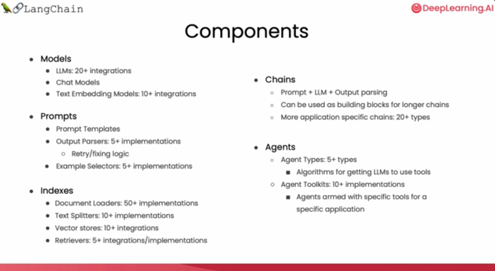
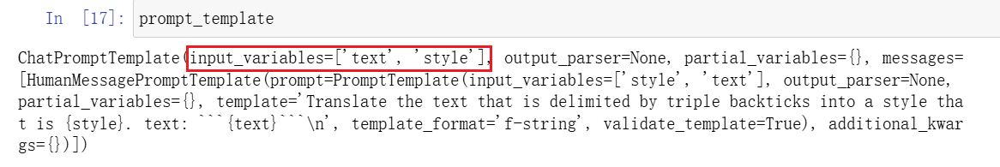
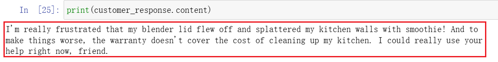
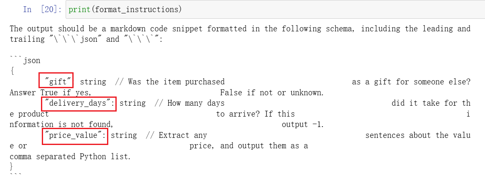
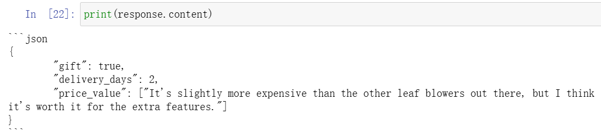
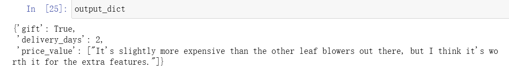

本课程是吴恩达与OpenAI、Hugging Face、LangChain等机构联合打造，面向开发者的LLM系列课程第三讲——用于LLM应用程序开发的LangChain，由LangChain联合创始人兼CEO Harrison Chase和吴恩达合作授课。

## 课程链接

[LangChain for LLM Application Development](https://www.deeplearning.ai/short-courses/langchain-for-llm-application-development/)

>建议大家直接看DeepLearning.AI上的英文原版，配合官方提供的Jupyter Notebook效果更佳。B站上的翻译稀烂，不建议看，可能会造成误导。
>

## 概述

基于LLM API开发应用程序，开发者不得不编写很多胶水代码才能搭建完整的程序框架。LangChain是一个用于开发基于LLM的应用程序的框架，它简化了LLM应用程序生命周期的每个阶段，包括开发、部署和产品化，已经被广大开发者、初创公司和大型企业广泛使用。

在本课程中，你将学习并使用LangChain开发完整健壮的应用程序，包括以下内容：

- Models, Prompts and Parsers：调用LLM，提供prompt，解析response；
- Memories for LLMs：存储对话和管理有限上下文空间；
- Chains：创建操作序列；
- Question Answering over Documents：将LLM应用到专有数据和用例；
- Agents：探索LLM作为推理代理的强大新兴发展。

## Introduction

为了简化基于LLM的AI应用程序开发，Harrison Chase创造了LangChain。LangChain是开发框架也是活跃的开源社区，有数百名贡献者，正以惊人的速度迭代新功能。LangChain提供Python和JavaScript两种包，专注于组合和模块化，可以轻松的将各个组件结合起来创建端到端应用程序。

本课程重点介绍LangChain的常用组件：Models, Prompts, Indexes, Chains, Agents。



## Models, Prompts and Parsers

### Chat API : LangChain

安装最新版本的`langchain`包

```python
pip install --upgrade langchain
```

### Model

从`langchain.chat_models`导入OpenAI对话模型。LangChain也集成了厂商的聊天模型，如Anthropic、Google等，参见[Providers | 🦜️🔗 LangChain](https://python.langchain.com/docs/integrations/providers/)

```python
from langchain.chat_models import ChatOpenAI
```

声明一个model

```python
chat = ChatOpenAI(temperature=0.0, model='gpt-3.5-turbo')
```

### Prompt template

使用LangChain构造prompt模板，将需要改动的部分抽象成变量，具体使用时抽象成所需要的内容。达到一次定义，多次使用的效果。

**首先定义模板字符串：**

```python
template_string = """Translate the text \
that is delimited by triple backticks \
into a style that is {style}. \
text: ```{text}```
"""
```

从`langchain.prompts`导入`ChatPromptTemplate`用来实例化prompt模板。

```python
from langchain.prompts import ChatPromptTemplate

prompt_template = ChatPromptTemplate.from_template(template_string)
```

输出`prompt_template`可以发现，`input_variables`就是`template_string`中定义的`{text}`和`{style}`。后续使用中，替换`{text}`和`{style}`可方便地构造不同的prompt。



我们使用`prompt_template`构造coustomer prompt，并使用`chat`调用'gpt-3.5-turbo'获得response。

**定义style和text**

```python
# style
customer_style = """American English \
in a calm and respectful tone
"""

# text
customer_email = """
Arrr, I be fuming that me blender lid \
flew off and splattered me kitchen walls \
with smoothie! And to make matters worse, \
the warranty don't cover the cost of \
cleaning up me kitchen. I need yer help \
right now, matey!
"""
```

**构造customer prompt**

```python
customer_messages = prompt_template.format_messages(
                    style=customer_style,
                    text=customer_email)
```

**调用'gpt-3.5-turbo'将`customer_email`转换为`customer_style`风格**

```
customer_response = chat(customer_messages)
```



### Parse the LLM output string into a Python dictionary

Parser是LangChain能够成链的关键。因为它会将LLM的输出解析成你所需要的格式，例如字典。将此输出作为下一个模块的输入，从而可以将两个模块关联起来。

**导入必要的库：**

从`langchain`库的`output_parsers`模块中导入`ResponseSchema`和`StructuredOutputParser`

- `ResponseSchema`用于定义和验证输出的预期结构；

- `StructuredOutputParser`用于将输出解析为结构化数据，便于后续处理和分析。

```python
from langchain.output_parsers import ResponseSchema
from langchain.output_parsers import StructuredOutputParser
```

**生成对应格式的Schema：**

假设LLM的输出格式是一个字典，有三个key分别为gift、delivery_days、和price_value。

```python
{
  "gift": False,
  "delivery_days": 5,
  "price_value": "pretty affordable!"
}
```

使用`ResponseSchema`生成Schema：

```python
gift_schema = ResponseSchema(name="gift",
                             description="Was the item purchased\
                             as a gift for someone else? \
                             Answer True if yes,\
                             False if not or unknown.")
delivery_days_schema = ResponseSchema(name="delivery_days",
                                      description="How many days\
                                      did it take for the product\
                                      to arrive? If this \
                                      information is not found,\
                                      output -1.")
price_value_schema = ResponseSchema(name="price_value",
                                    description="Extract any\
                                    sentences about the value or \
                                    price, and output them as a \
                                    comma separated Python list.")

response_schemas = [gift_schema, 
                    delivery_days_schema,
                    price_value_schema]
```

**生成解析LLM response的parser：**

```python
output_parser = StructuredOutputParser.from_response_schemas(response_schemas)
```

**获取输出格式说明：**

```python
format_instructions = output_parser.get_format_instructions()
```



**生成prompt：**

定义prompt模板，生成包含文本和format_instructions的prompt。

```python
review_template_2 = """\
For the following text, extract the following information:

gift: Was the item purchased as a gift for someone else? \
Answer True if yes, False if not or unknown.

delivery_days: How many days did it take for the product\
to arrive? If this information is not found, output -1.

price_value: Extract any sentences about the value or price,\
and output them as a comma separated Python list.

text: {text}

{format_instructions}
"""

prompt = ChatPromptTemplate.from_template(template=review_template_2)

messages = prompt.format_messages(text=customer_review, 
                                format_instructions=format_instructions)
```

**调用LLM生成response**

```python
response = chat(messages)
```

`response.content`为`str`格式



**parser解析为dict格式**

```python
output_dict = output_parser.parse(response.content)
```

