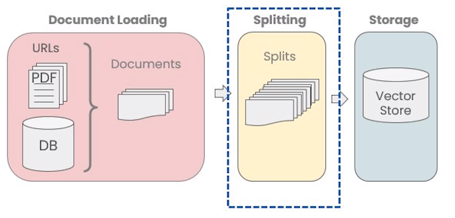
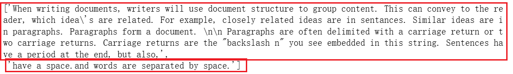
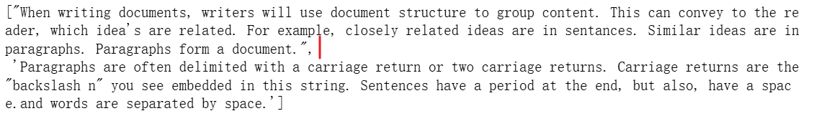
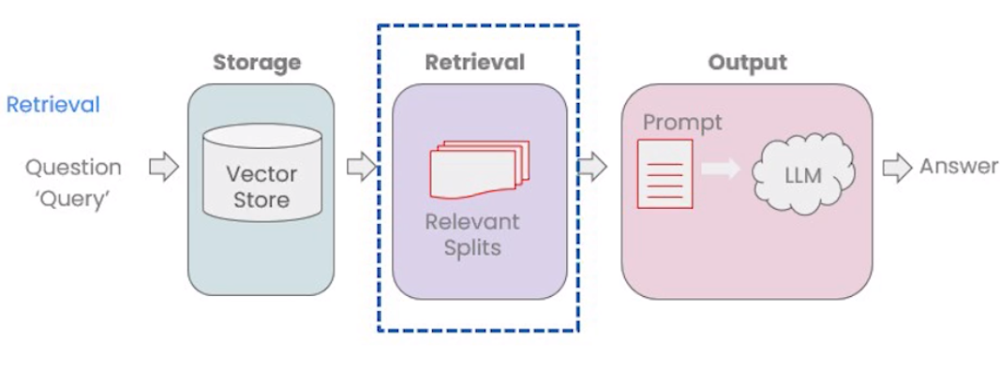
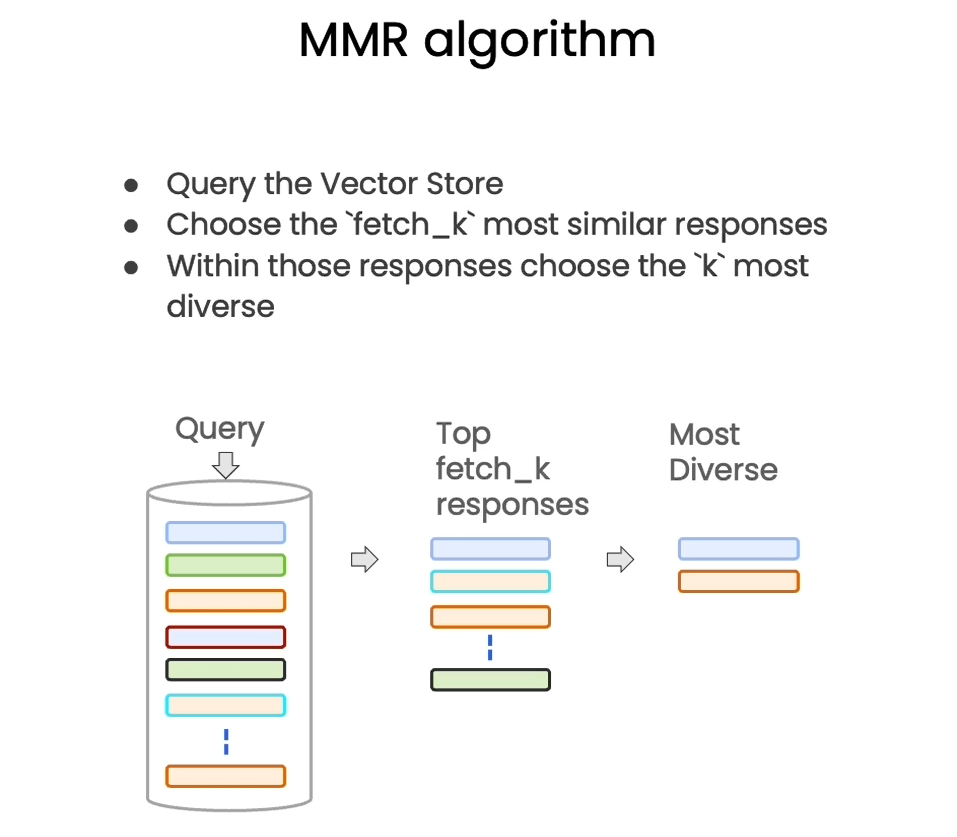
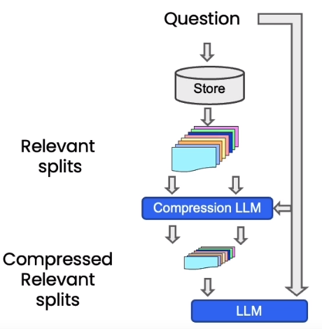
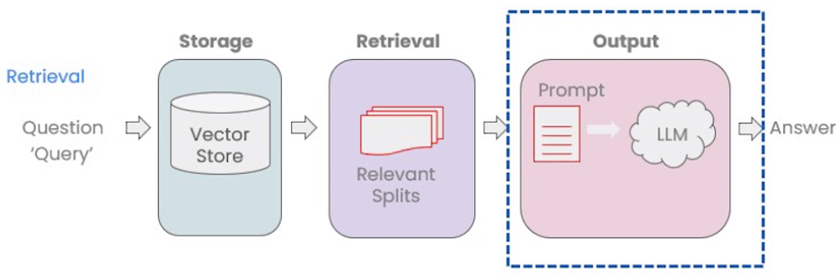
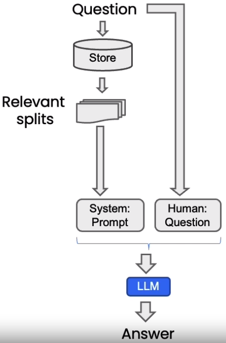

本课程是吴恩达与OpenAI、Hugging Face、LangChain等机构联合打造，面向开发者的LLM系列课程第四讲——LangChain：与你的数据对话，由LangChain联合创始人兼CEO Harrison Chase和吴恩达合作授课。

## 课程链接

[LangChain: Chat with Your Data](https://www.deeplearning.ai/short-courses/langchain-chat-with-your-data/)

>建议大家直接看DeepLearning.AI上的英文原版，配合官方提供的Jupyter Notebook效果更佳。B站上的翻译稀烂，不建议看，可能会造成误导。

## 概述

本课程主要探讨两个主题：（1）Retrieval Augmented Generation (RAG)：一种常见的LLM应用，从外部数据集中检索上下文问答；（2）Chatbot：构建一个聊天机器人，该机器人根据文档内容而不是训练中学到的资料来响应查询。

我们将探讨以下内容：

- Document Loading（文档加载）：学习数据加载的基本知识，了解LangChain提供的80多种不同的数据加载器，访问包括音频和视频在内的多种数据；
- Document Splitting（文档分割）：了解分割数据的最佳实践和注意事项；
- Vector stores and embeddings（向量存储和嵌入）：深入了解embedding的概念，探究在LangChain中集成向量存储的方法；
- Retrieval（检索）：掌握访问和索引向量数据的高级技术，获取比语义查询更相关的信息；
- Question Answering（问答）：建立one-pass问答解决方案；
- Chat（聊天）：使用LangChain构建Chatbot，并学习从对话和数据源中跟踪并选择相关信息；

使用LangChain和LLM构建与数据交互的实用应用程序。

## Introduction

LLM，例如ChatGPT，可以回答很多不同话题的问题，但仅在它的训练资料范围内。LLM不能与你的私有数据或者LLM训练之后出现的数据对话。本课程将要介绍如何使用LLM与你的数据对话。首先，介绍如何使用LangChain文档加载器从各种不同的数据源加载数据；然后概述语义搜索（semantic search），展示并解决其无法覆盖的边界情况；最后使用memory和LLM构建功能齐全的chatbot和你的数据对话。

## Document Loading

为了与你的数据对话，首先需要使用LangChain文档加载器把非结构化的数据处理为标准格式。LangChain提供80+种[文档加载器](https://python.langchain.com/docs/how_to/#document-loaders)，可以从不同的数据源（网站、数据库、YouTube等）加载数据，将数据转换为PDF、CSV、HTML等不同格式。

### PDFs

```python
#! pip install pypdf 

from langchain.document_loaders import PyPDFLoader
loader = PyPDFLoader("docs/cs229_lectures/MachineLearning-Lecture01.pdf")
pages = loader.load()
```

`PyPDFLoader`按页加载，每一页都是一个`Document`，包含文本（page_content）和元数据（metadata）。

```python
page = pages[0]

print(page.page_content[0:500])
```

```wiki
MachineLearning-Lecture01  
Instructor (Andrew Ng):  Okay. Good morning. Welcome to CS229, the machine 
learning class. So what I wanna do today is ju st spend a little time going over the logistics 
of the class, and then we'll start to  talk a bit about machine learning.  
By way of introduction, my name's  Andrew Ng and I'll be instru ctor for this class. And so 
I personally work in machine learning, and I' ve worked on it for about 15 years now, and 
I actually think that machine learning i
```

```python
page.metadata
```

```wiki
{'source': 'docs/cs229_lectures/MachineLearning-Lecture01.pdf', 'page': 0}
```

### YouTube

LangChain可以读取YouTube视频，使用OpenAI Whisper模型将视频转换为文本。

```python
# ! pip install yt_dlp
# ! pip install pydub

from langchain.document_loaders.generic import GenericLoader,  FileSystemBlobLoader
from langchain.document_loaders.parsers import OpenAIWhisperParser
from langchain.document_loaders.blob_loaders.youtube_audio import YoutubeAudioLoader

url="https://www.youtube.com/shorts/13c99EsNt4M"
save_dir="docs/youtube/"
loader = GenericLoader(
    YoutubeAudioLoader([url],save_dir),  # fetch from youtube
#     FileSystemBlobLoader(save_dir, glob="*.m4a"),   #fetch locally
    OpenAIWhisperParser()
)
docs = loader.load()
```

```python
docs[0].page_content[0:500]
```

```wiki
"Welcome to CS229 Machine Learning. Uh, some of you know that this is a class that's taught at Stanford for a long time. And this is often the class that, um, I most look forward to teaching each year because this is where we've helped, I think, several generations of Stanford students become experts in machine learning, got- built many of their products and services and startups that I'm sure, many of you or probably all of you are using, uh, uh, today. Um, so what I want to do today was spend s"
```

### URLs

```python
from langchain.document_loaders import WebBaseLoader

loader = WebBaseLoader("https://github.com/basecamp/handbook/blob/master/titles-for-programmers.md")
docs = loader.load()
```

### Notion

```python
from langchain.document_loaders import NotionDirectoryLoader
loader = NotionDirectoryLoader("docs/Notion_DB")
docs = loader.load()
```

## Document Splitting



数据被加载为标准格式之后，被分割为更小的块（chunk）才能保存在向量数据库中。LangChain文本分割器按照chunk_size（块大小）和chunk_overlap（块间重叠大小）进行分割。

LangChain提供多种分割方式，参见[Text splitters](https://python.langchain.com/docs/concepts/text_splitters/)

### CharacterTextSplitter

[CharacterTextSplitter](https://python.langchain.com/api_reference/text_splitters/character/langchain_text_splitters.character.CharacterTextSplitter.html)基于字符分割文本。

```python
from langchain.text_splitter import CharacterTextSplitter

c_splitter = CharacterTextSplitter(
    chunk_size=26,
    chunk_overlap=4,
    separator = ' '
)

text3 = "a b c d e f g h i j k l m n o p q r s t u v w x y z"
c_splitter.split_text(text3)
```

```wiki
['a b c d e f g h i j k l m', 'l m n o p q r s t u v w x', 'w x y z']
```

> CharacterTextSplitter优先按照`separator`分割，分割后的长度可能超过`chunk_size`。

### RecursiveCharacterTextSplitter

[RecursiveCharacterTextSplitter](https://python.langchain.com/api_reference/text_splitters/character/langchain_text_splitters.character.RecursiveCharacterTextSplitter.html)是LangChain默认的文本分割器，也是推荐的文本分割器。同样基于字符分割，默认的分隔符是列表`["\n\n", "\n", " ", ""]`，以从左至右的顺序依次搜索文档中对应的分隔符进行分割。它基于文本结构将文本自然地组织成段落、句子和单词等层次单位，在拆分中保持语义一致性，适应不同级别的文本粒度。

分别用CharacterTextSplitter和RecursiveCharacterTextSplitter分割一段长文本`some_text`，`len(some_text)=496`。

```python
some_text = """When writing documents, writers will use document structure to group content. \
This can convey to the reader, which idea's are related. For example, closely related ideas \
are in sentances. Similar ideas are in paragraphs. Paragraphs form a document. \n\n  \
Paragraphs are often delimited with a carriage return or two carriage returns. \
Carriage returns are the "backslash n" you see embedded in this string. \
Sentences have a period at the end, but also, have a space.\
and words are separated by space."""
```

```python
c_splitter = CharacterTextSplitter(
    chunk_size=450,
    chunk_overlap=0,
    separator = ' '
)
c_splitter.split_text(some_text)
```



`some_text`在空格处被分割成长度小于chunk_size的两部分。

```python
r_splitter = RecursiveCharacterTextSplitter(
    chunk_size=450,
    chunk_overlap=0, 
    separators=["\n\n", "\n", " ", ""]
)
r_splitter.split_text(some_text)
```



`some_text`在'\n\n'处分割成长度小于chunk_size的两部分。

### TokenTextSplitter

[TokenTextSplitter](https://python.langchain.com/api_reference/text_splitters/base/langchain_text_splitters.base.TokenTextSplitter.html)使用tokenizer将文本分割为token。

```python
from langchain.text_splitter import TokenTextSplitter

text_splitter = TokenTextSplitter(chunk_size=1, chunk_overlap=0)
text1 = "foo bar bazzyfoo"
text_splitter.split_text(text1)
```

```wiki
['foo', ' bar', ' b', 'az', 'zy', 'foo']
```

### MarkdownHeaderTextSplitter

[MarkdownHeaderTextSplitter](https://python.langchain.com/api_reference/text_splitters/markdown/langchain_text_splitters.markdown.MarkdownHeaderTextSplitter.html)根据指定的标题分割Markdown文档。

```python
from langchain.document_loaders import NotionDirectoryLoader
from langchain.text_splitter import MarkdownHeaderTextSplitter

markdown_document = """# Title\n\n \
## Chapter 1\n\n \
Hi this is Jim\n\n Hi this is Joe\n\n \
### Section \n\n \
Hi this is Lance \n\n 
## Chapter 2\n\n \
Hi this is Molly"""

headers_to_split_on = [
    ("#", "Header 1"),
    ("##", "Header 2"),
    ("###", "Header 3"),
]

markdown_splitter = MarkdownHeaderTextSplitter(
    headers_to_split_on=headers_to_split_on
)
md_header_splits = markdown_splitter.split_text(markdown_document)
```

```python
[Document(page_content='Hi this is Jim  \nHi this is Joe', metadata={'Header 1': 'Title', 'Header 2': 'Chapter 1'}),
 Document(page_content='Hi this is Lance', metadata={'Header 1': 'Title', 'Header 2': 'Chapter 1', 'Header 3': 'Section'}),
 Document(page_content='Hi this is Molly', metadata={'Header 1': 'Title', 'Header 2': 'Chapter 2'})]
```

MarkdownHeaderTextSplitter将同一标题下的文本放在同一个chunk，文本对应的标题信息被存储在chunk的metadata中。

MarkdownHeaderTextSplitter基于文档结构感知上下文进行分割，自然的将语义相关的文本划分在同一个chunk。跟Markdown类似，HTML、JSON、Code也有内在的文档结构，可被按照结构分割。

- JSON：[RecursiveJsonSplitter](https://python.langchain.com/docs/how_to/recursive_json_splitter/)，按对象或数组元素分割；

- HTML：[HTMLHeaderTextSplitter](https://python.langchain.com/docs/how_to/HTML_header_metadata_splitter/)，使用标签分割；

- Code：[CodeSplitter](https://python.langchain.com/docs/how_to/code_splitter/)，按函数、类或逻辑块分割；

## Vectorstores and Embeddings


文档分割之后来到向量嵌入和存储环节。本节主要介绍向量嵌入和存储的基本概念，指出向量数据库相似性搜索可能出现的失败模式。向量嵌入和存储的基本概念参见[Embeddings](https://aaricis.github.io/posts/LangChain-for-LLM-Application-Development/#embeddings)和[Vectorstores](https://aaricis.github.io/posts/LangChain-for-LLM-Application-Development/#vector-database)。

### Document Loading and Splitting

我们加载吴恩达老师机器学习课程cs229的pdf讲义并进行分割。

```python
from langchain.document_loaders import PyPDFLoader

# Load PDF
loaders = [
    # Duplicate documents on purpose - messy data
    PyPDFLoader("docs/cs229_lectures/MachineLearning-Lecture01.pdf"),
    PyPDFLoader("docs/cs229_lectures/MachineLearning-Lecture01.pdf"),
    PyPDFLoader("docs/cs229_lectures/MachineLearning-Lecture02.pdf"),
    PyPDFLoader("docs/cs229_lectures/MachineLearning-Lecture03.pdf")
]
docs = []
for loader in loaders:
    docs.extend(loader.load())
    
# Split
from langchain.text_splitter import RecursiveCharacterTextSplitter
text_splitter = RecursiveCharacterTextSplitter(
    chunk_size = 1500,
    chunk_overlap = 150
)

splits = text_splitter.split_documents(docs)
```

### Embeddings

```python
from langchain.embeddings.openai import OpenAIEmbeddings
embedding = OpenAIEmbeddings()
```

### Vectorstores

加载向量数据库[Chroma](https://www.trychroma.com/)。Chroma是一个开源的AI原生嵌入式数据库，主要用于存储和查询向量数据。

```python
# ! pip install chromadb

from langchain.vectorstores import Chroma

persist_directory = 'docs/chroma/'
!rm -rf ./docs/chroma  # remove old database files if any
vectordb = Chroma.from_documents(
    documents=splits,
    embedding=embedding,
    persist_directory=persist_directory
)
```

### Failure modes

```python
question = "what did they say about matlab?"
docs = vectordb.similarity_search(question,k=5)
```

要求向量数据库搜索5个相关的答案。由于加载数据时加载了两次'docs/cs229_lectures/MachineLearning-Lecture01.pdf'，因此当用户问题与'docs/cs229_lectures/MachineLearning-Lecture01.pdf'内容相关时，向量数据库会返回重复答案。

```python
docs[0]
```

```wiki
Document(page_content='those homeworks will be done in either MATLA B or in Octave, which is sort of — I \nknow some people call it a free ve rsion of MATLAB, which it sort  of is, sort of isn\'t.  \nSo I guess for those of you that haven\'t s een MATLAB before, and I know most of you \nhave, MATLAB is I guess part of the programming language that makes it very easy to write codes using matrices, to write code for numerical routines, to move data around, to \nplot data. And it\'s sort of an extremely easy to  learn tool to use for implementing a lot of \nlearning algorithms.  \nAnd in case some of you want to work on your  own home computer or something if you \ndon\'t have a MATLAB license, for the purposes of  this class, there\'s also — [inaudible] \nwrite that down [inaudible] MATLAB — there\' s also a software package called Octave \nthat you can download for free off the Internet. And it has somewhat fewer features than MATLAB, but it\'s free, and for the purposes of  this class, it will work for just about \neverything.  \nSo actually I, well, so yeah, just a side comment for those of you that haven\'t seen \nMATLAB before I guess, once a colleague of mine at a different university, not at \nStanford, actually teaches another machine l earning course. He\'s taught it for many years. \nSo one day, he was in his office, and an old student of his from, lik e, ten years ago came \ninto his office and he said, "Oh, professo r, professor, thank you so much for your', metadata={'source': 'docs/cs229_lectures/MachineLearning-Lecture01.pdf', 'page': 8})
```

```python
docs[1]
```

```wiki
Document(page_content='those homeworks will be done in either MATLA B or in Octave, which is sort of — I \nknow some people call it a free ve rsion of MATLAB, which it sort  of is, sort of isn\'t.  \nSo I guess for those of you that haven\'t s een MATLAB before, and I know most of you \nhave, MATLAB is I guess part of the programming language that makes it very easy to write codes using matrices, to write code for numerical routines, to move data around, to \nplot data. And it\'s sort of an extremely easy to  learn tool to use for implementing a lot of \nlearning algorithms.  \nAnd in case some of you want to work on your  own home computer or something if you \ndon\'t have a MATLAB license, for the purposes of  this class, there\'s also — [inaudible] \nwrite that down [inaudible] MATLAB — there\' s also a software package called Octave \nthat you can download for free off the Internet. And it has somewhat fewer features than MATLAB, but it\'s free, and for the purposes of  this class, it will work for just about \neverything.  \nSo actually I, well, so yeah, just a side comment for those of you that haven\'t seen \nMATLAB before I guess, once a colleague of mine at a different university, not at \nStanford, actually teaches another machine l earning course. He\'s taught it for many years. \nSo one day, he was in his office, and an old student of his from, lik e, ten years ago came \ninto his office and he said, "Oh, professo r, professor, thank you so much for your', metadata={'source': 'docs/cs229_lectures/MachineLearning-Lecture01.pdf', 'page': 8})
```

docs[0]和docs[1]内容完全一致。

**另一个失败的场景**，要求只在Lecture03中搜索答案：

```python
question = "what did they say about regression in the third lecture?"
docs = vectordb.similarity_search(question,k=5)
for doc in docs:
    print(doc.metadata)
```

```wiki
{'source': 'docs/cs229_lectures/MachineLearning-Lecture03.pdf', 'page': 0}
{'source': 'docs/cs229_lectures/MachineLearning-Lecture03.pdf', 'page': 14}
{'source': 'docs/cs229_lectures/MachineLearning-Lecture02.pdf', 'page': 0}
{'source': 'docs/cs229_lectures/MachineLearning-Lecture03.pdf', 'page': 6}
{'source': 'docs/cs229_lectures/MachineLearning-Lecture01.pdf', 'page': 8}
```

返回答案中包含Lecture01和Lecture02的内容，不满足问题要求。

## Retrieval



检索（Retrieval）是检索增强生成（Retrieval Augmented Generation，RAG）的核心，指根据用户的问题去向量数据库中搜索与问题相关的文档内容。当我们访问和查询向量数据库时可能会运用到以下技术：

- 基本语义相似度（Basic semantic similarity）
- 最大边际相关性（Maximum marginal relevance，MMR）
- 过滤元数据
- LLM辅助检索

本节将介绍几种检索方法，以及解决前述’Failure modes‘的技巧。

### Similarity Search

```python
from langchain.vectorstores import Chroma
from langchain.embeddings.openai import OpenAIEmbeddings

embedding = OpenAIEmbeddings()
texts = [
    """The Amanita phalloides has a large and imposing epigeous (aboveground) fruiting body (basidiocarp).""",
    """A mushroom with a large fruiting body is the Amanita phalloides. Some varieties are all-white.""",
    """A. phalloides, a.k.a Death Cap, is one of the most poisonous of all known mushrooms.""",
]
smalldb = Chroma.from_texts(texts, embedding=embedding)
```

```python
question = "Tell me about all-white mushrooms with large fruiting bodies"
smalldb.similarity_search(question, k=2)
```

```wiki
Document(page_content='A mushroom with a large fruiting body is the Amanita phalloides. Some varieties are all-white.', metadata={}),
 Document(page_content='The Amanita phalloides has a large and imposing epigeous (aboveground) fruiting body (basidiocarp).', metadata={})
```

相似性搜索`similarity_search`返回两个文档，是`texts`的第一句和第二句。它们都与用户问题有关，且含义非常相近，其实只返回其中一句足以满足要求。

### Addressing Diversity: Maximum marginal relevance

Similarity Search可以返回与问题相关的文档，但是不能避免返回的文档中存在语义重复，造成资源浪费。我们使用MMR作相同的检索：

```python
smalldb.max_marginal_relevance_search(question,k=2, fetch_k=3)
```

```wiki
Document(page_content='A mushroom with a large fruiting body is the Amanita phalloides. Some varieties are all-white.', metadata={}),
 Document(page_content='A. phalloides, a.k.a Death Cap, is one of the most poisonous of all known mushrooms.', metadata={})
```

`max_marginal_relevance_search`返回了`texts`的第一句和第三句。第一句与用户问题强相关，第三句相关性较弱但增加了答案的多样性。

最大边际相关（Maximum Marginal Relevance）是实现多样性检索的常用算法。



MMR平衡结果的相关性（relevance）和多样性（diversity），以避免返回内容冗余的结果。MMR 的公式如下：
$$
MMR(D_i) = \lambda \cdot Rel(D_i, Q) - (1 - \lambda) \cdot \mathop{max}\limits_{D_j\in S}Sim(D_i, D_j)
$$
其中：

- $D_i$：候选文档或结果；
- $Q$：查询；
- $S$：已选文档的集合；
- $Rel(D_i, Q)$：文档$D_i$与查询$Q$的相关性分数；
- $Sim(D_i, D_j)$：文档$D_i$与集合$S$中文档$D_j$的相似度；
- $\lambda$：平衡相关性和多样性的超参数，范围$[0, 1]$。

LangChain `max_marginal_relevance_search`函数使用MMR算法初步检索`fetch_k`个文档，选择前`k`个返回。

[Failure modes](#failure-modes)中使用`similarity_search`搜索cs229课程pdf，向量数据库的返回中包含重复答案。我们使用`max_marginal_relevance_search`来消除重复内容，提升回答的多样性。

```python
question = "what did they say about matlab?"
docs_mmr = vectordb.max_marginal_relevance_search(question,k=3)
```

### Addressing Specificity: working with metadata

[Failure modes](#failure-modes)中要求只在Lecture03中搜索答案，但是结果中额外包含Lecture01和Lecture02的内容。我们可以通过过滤元数据的方式实现精准搜索，从而解决这个问题。

```python
question = "what did they say about regression in the third lecture?"

docs = vectordb.similarity_search(
    question,
    k=3,
    filter={"source":"docs/cs229_lectures/MachineLearning-Lecture03.pdf"}
)

for d in docs:
    print(d.metadata)
```

```wiki
{'source': 'docs/cs229_lectures/MachineLearning-Lecture03.pdf', 'page': 0}
{'source': 'docs/cs229_lectures/MachineLearning-Lecture03.pdf', 'page': 14}
{'source': 'docs/cs229_lectures/MachineLearning-Lecture03.pdf', 'page': 4}
```

设置`filter`过滤条件后，返回的三个答案都是基于Lecture03的。

### Addressing Specificity: working with metadata using self-query retriever

`filter`中的过滤条件是手动设置的，有没有方法可以准确识别问题中的语义从而实现元数据自动过滤呢？LangChain提供[SelfQueryRetriever](https://python.langchain.com/docs/how_to/self_query/)解决这个问题，它使用LLM提取query和filter。

```python
from langchain.llms import OpenAI
from langchain.retrievers.self_query.base import SelfQueryRetriever
from langchain.chains.query_constructor.base import AttributeInfo

# 定义元数据过滤条件
metadata_field_info = [
    AttributeInfo(
        name="source",
        description="The lecture the chunk is from, should be one of `docs/cs229_lectures/MachineLearning-Lecture01.pdf`, `docs/cs229_lectures/MachineLearning-Lecture02.pdf`, or `docs/cs229_lectures/MachineLearning-Lecture03.pdf`",
        type="string",
    ),
    AttributeInfo(
        name="page",
        description="The page from the lecture",
        type="integer",
    ),
]

document_content_description = "Lecture notes"
llm = OpenAI(model='gpt-3.5-turbo-instruct', temperature=0)
retriever = SelfQueryRetriever.from_llm(
    llm,
    vectordb,
    document_content_description,
    metadata_field_info,
    verbose=True
)
```

`metadata_field_info`参数用于描述元数据中的字段及其类型和含义。这个参数的设置对检索器如何解析查询并匹配元数据非常关键。根据`metadata_field_info`信息，LLM会自动从用户问题中提取query和filter，然后向量数据库基于这两项去搜索相关内容。

```python
question = "what did they say about regression in the third lecture?"
docs = retriever.get_relevant_documents(question)
```

LLM提取query和filter，query='regression'来自用户问题，filter是LLM根据metadata_field_info和用户问题设定的过滤条件。

```
query='regression' filter=Comparison(comparator=<Comparator.EQ: 'eq'>, attribute='source', value='docs/cs229_lectures/MachineLearning-Lecture03.pdf') limit=None
```

```python
for d in docs:
    print(d.metadata)
```

```
{'source': 'docs/cs229_lectures/MachineLearning-Lecture03.pdf', 'page': 14}
{'source': 'docs/cs229_lectures/MachineLearning-Lecture03.pdf', 'page': 0}
{'source': 'docs/cs229_lectures/MachineLearning-Lecture03.pdf', 'page': 10}
{'source': 'docs/cs229_lectures/MachineLearning-Lecture03.pdf', 'page': 10}
```

返回内容均来自Lecture03，满足要求。

### Additional tricks: compression

另一种提高检索文档质量的方法是压缩。向量数据库会返回与问题相关的chunk中的所有内容，其中包含大量不相关的信息。LangChain提供[ContextualCompressionRetriever](https://api.python.langchain.com/en/latest/retrievers/langchain.retrievers.contextual_compression.ContextualCompressionRetriever.html)对返回的完整chunk进行压缩，提取与用户问题相关的内容。可以有效提升输出质量，减少计算资源的浪费。



```python
from langchain.retrievers import ContextualCompressionRetriever
from langchain.retrievers.document_compressors import LLMChainExtractor

# Wrap our vectorstore
llm = OpenAI(temperature=0, model="gpt-3.5-turbo-instruct")
compressor = LLMChainExtractor.from_llm(llm)

compression_retriever = ContextualCompressionRetriever(
    base_compressor=compressor,
    base_retriever=vectordb.as_retriever()
)

question = "what did they say about matlab?"
compressed_docs = compression_retriever.get_relevant_documents(question)
```

我们定义了压缩器`LLMChainExtractor`，负责从向量数据库返回的chunk中提取信息。`ContextualCompressionRetriever`有两个参数，一个是压缩器`LLMChainExtractor`实例，另一个是vectordb检索器。

### Other types of retrieval

vectordb并不是LangChain唯一的检索器，LangChain还提供了其他检索文档的方式，例如TF-IDF、SVM。

## Question Answering

本节介绍检索增强生成（Retrieval Augmented Generation，RAG）的最后一个阶段Output。



在Output阶段，我们会将检索（Retrieval）阶段获得的chunk，连同用户的问题一起喂给LLM，最后由LLM返回最后的答案。



### RetrievalQA chain

加载向量数据库、设置用户问题、创建llm。

```python
from langchain.vectorstores import Chroma
from langchain.embeddings.openai import OpenAIEmbeddings
persist_directory = 'docs/chroma/'
embedding = OpenAIEmbeddings()
vectordb = Chroma(persist_directory=persist_directory, embedding_function=embedding)

question = "What are major topics for this class?"

from langchain.chat_models import ChatOpenAI
llm = ChatOpenAI(model_name=llm_name, temperature=0)
```

使用`RetrievalQA`和LLM创建一个问答链。

```python
from langchain.chains import RetrievalQA

qa_chain = RetrievalQA.from_chain_type(
    llm,
    retriever=vectordb.as_retriever()
)
```

使用问答链处理一个查询问题，并返回结果。

```python
result = qa_chain({"query": question})
result["result"]
```

```wiki
The major topics for this class include machine learning, statistics, and algebra. Additionally, there will be discussions on extensions of the material covered in the main lectures.
```

为了让RetrievalQA给出格式化答案，我们创建一个prompt，告诉LLM应该输出什么样的答案。

```python
from langchain.prompts import PromptTemplate

# Build prompt
template = """Use the following pieces of context to answer the question at the end. If you don't know the answer, just say that you don't know, don't try to make up an answer. Use three sentences maximum. Keep the answer as concise as possible. Always say "thanks for asking!" at the end of the answer. 
{context}
Question: {question}
Helpful Answer:"""
QA_CHAIN_PROMPT = PromptTemplate.from_template(template)
```

```python
# Run chain
qa_chain = RetrievalQA.from_chain_type(
    llm,
    retriever=vectordb.as_retriever(),
    return_source_documents=True,
    chain_type_kwargs={"prompt": QA_CHAIN_PROMPT}
)
```

`return_source_documents=True`：这个参数指示 `RetrievalQA` 实例在返回结果时，除了答案外，还应该返回源文档。

`chain_type_kwargs`：一个字典，包含了传递给特定链类型的额外参数。

- `"prompt": QA_CHAIN_PROMPT`：在这个字典中，`"prompt"` 键指定了用于问答链的提示模板。`QA_CHAIN_PROMPT` 包含了用于生成答案的提示文本。

```python
question = "Is probability a class topic?"
result = qa_chain({"query": question})
result["result"]
```

```wiki
'Yes, probability is a class topic as the instructor assumes familiarity with basic probability and statistics. Thanks for asking!'
```

`qa_chain`根据prompt template给出简洁的答案，并且按照prompt template的要求在末尾加了结束语“Thanks for asking!”。

### RetrievalQA chain types

RetrievalQA的`chain_type`参数默认为`stuff`，还有`map_reduce`, `refine`和`map_rerank`三种模式可选。

详见[chain_type]([LangChain for LLM Application Development | Kaige Zhang](https://aaricis.github.io/posts/LangChain-for-LLM-Application-Development/#向文档提问))

### RetrievalQA limitations

`qa_chain`不能保存对话历史记录。

```python
qa_chain = RetrievalQA.from_chain_type(
    llm,
    retriever=vectordb.as_retriever()
)
```

首先提问“Is probability a class topic?”，`qa_chain`给出回答。

```python
question = "Is probability a class topic?"
result = qa_chain({"query": question})
result["result"]
```

```wiki
Yes, probability is a class topic in the course being described. The instructor assumes familiarity with basic probability and statistics.
```

然后接着追问"why are those prerequesites needed?"，`qa_chain`给出与'probability'毫不相干的回答，可见`qa_chain`对之前的对话完全没有记忆。

```python
question = "why are those prerequesites needed?"
result = qa_chain({"query": question})
result["result"]
```

```wiki
The prerequisites for the class are needed because the course assumes that all students have a basic knowledge of computer science and computer skills. This foundational knowledge is essential for understanding the concepts and materials covered in the class, such as big-O notation and basic computer principles.
```

## Chat

至此我们已经构建了一个问答机器人，实现了对数据的问答功能。但美中不足的是，仅仅通过RetrievalQA构建的问答机器人只能回答当前问题，无法参考上下文给出答案，因为它没有记忆。本节就来解决这个问题，通过给机器人添加记忆（Memory）模块，赋予它记忆力，实现真正的连贯性聊天。

### Memory

使用`ConversationBufferMemory`创建记忆模块。LangChain memory介绍详见[memory]([LangChain for LLM Application Development | Kaige Zhang](https://aaricis.github.io/posts/LangChain-for-LLM-Application-Development/#memory))。

```python
from langchain.memory import ConversationBufferMemory
memory = ConversationBufferMemory(
    memory_key="chat_history",
    return_messages=True
)
```

### ConversationalRetrievalChain

`ConversationalRetrievalChain`结合了上下文管理和基于检索的问答，旨在处理包含聊天历史记录的对话链路。

```python
from langchain.chains import ConversationalRetrievalChain
retriever=vectordb.as_retriever()
qa = ConversationalRetrievalChain.from_llm(
    llm,
    retriever=retriever,
    memory=memory
)
```

```python
question = "Is probability a class topic?" # 概率是一门课的主题吗？
result = qa({"question": question})
result['answer']
```

```wiki
Yes, probability is a class topic in the course being described. The instructor assumes familiarity with basic probability and statistics.
```

```python
question = "why are those prerequesites needed?" # 为什么需要先修课程？
result = qa({"question": question})
```

```wiki
Familiarity with basic probability and statistics is assumed as prerequisites for the course because the course will involve concepts and applications that rely on probability theory and statistical analysis. Understanding these fundamental concepts is essential for grasping the more advanced topics that will be covered in the course.
```

第一个问题是有关“probability”的，紧接着第二个回答解释了“probability”为什么是先修课程。两个问答在内容上是连贯的，因为ConversationalRetrievalChain回答第二个问题时已经知道第一个问题的上下文。

### Create a chatbot

结合Panel和Param搭建RAG系统，实现可交互的Chatbot：

- [详见](https://learn.deeplearning.ai/courses/langchain-chat-with-your-data/lesson/7/chat)

## Conclusion

本课程介绍了如何使用LangChain访问私有数据，并建立个性化的问答系统。按照RAG工作流的顺序，分别讨论了：文档加载、文档分割、存储、检索和输出五大环节。最后创建了一个完全功能的、端到端的聊天机器人。
