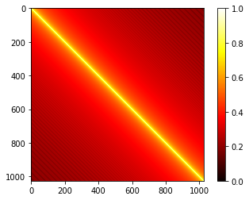
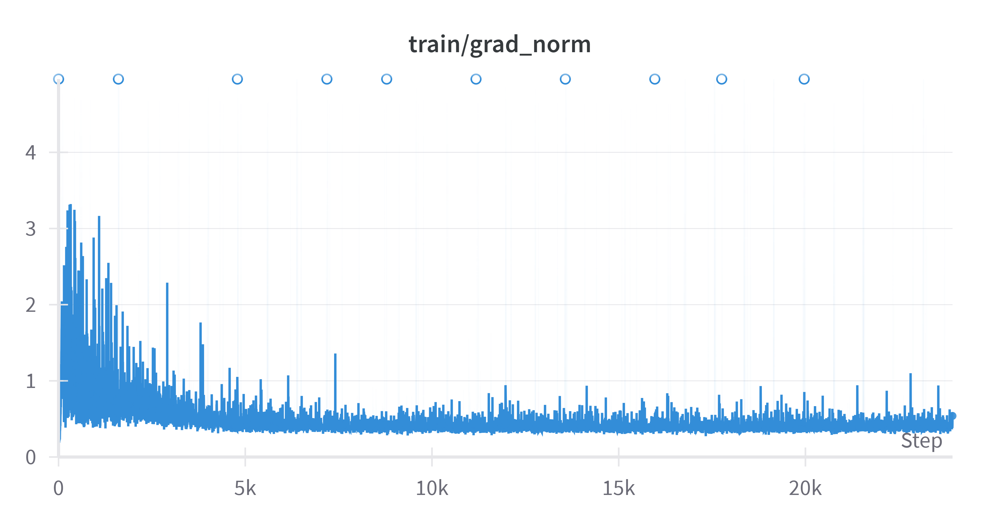

## Objective

- 使用seq2seq架构解决输入输出不定长问题。

## Task Description

Machine Translation（机器翻译）：将英文翻译为繁体中文。

e.g: Thank you so much, Chris. -> 非常謝謝你，克里斯。

## Dataset 

- Paired data（成对数据）
  - TED2020: TED talks with transcripts translated by a global community of volunteers to more than 100 language；
  - We will use (en, zh-tw) aligned pairs；
- Monolingual data （单语言数据）
  - More TED talks in traditional Chinese；

## Evaluation

BLEU(Bilingual Evaluation Understudy)，即双语评估替补，所谓替补就是代替人类评估机器翻译的结果。Bleu Score用于衡量机器翻译的质量，取值范围是[0, 1]，越接近1表示翻译质量越好。

> 原文：[BLEU: a Method for Automatic Evaluation of Machine Translation](https://aclanthology.org/P02-1040.Pdf)

BLEU 的**核心思想**是基于 **n-gram 匹配**：

- **n-gram** 是指连续的 n 个单词或字符，n可以是1、2、3......

  - 1-gram：也称unigram，指单个词语；

  - 2-gram：也称bigram，指两个连续的词语组合；

  - 3-gram：也称trigram，指三个连续的词语组合；

    ......

- BLEU 通过计算候选翻译和参考翻译之间的 n-gram 重叠程度来评估翻译质量。

### 计算步骤

（1）**计算n-gram精度（Precision）**

- 对于每个n-gram(通常 n=1, 2, 3, 4)，计算候选翻译中与参考翻译匹配的n-gram数量；
- 将匹配的n-gram数量除以候选翻译中总的n-gram数量，得到n-gram精度。

（2）**引入brevity penalty（简短惩罚）**
$$
BP = 
\begin{cases}
1 \quad if \quad c > r\\
e^{(1-r/c)} \quad if \quad c \leq r
\end{cases}
$$

​	其中：$c$是候选翻译的长度，$r$是参考翻译的长度。

- BP 的作用在于，如果输出一个非常短的句子，那很容易得到 Bleu score 的高分，所以我们要防止这个情况的出现；
- BP 在机器翻译长度大于人类翻译长度的时候取值为 1，否则产生惩罚。


（3）**计算BLEU分数**

- BLEU分数是n-gram精度的几何平均值，乘以简短惩罚因子；

$$
BLUE = BP\cdot exp(\sum_{n=1}^N w_nlogp_n)
$$

​	其中：$BP$是简短惩罚因子，$p_n$是n-gram精度，$w_n$是n-gram的权重（通常$$w_n = 1/N$$），$N$是n-gram的最大长度（通常$$N=4$$）。

## 思路

PS: 本次作业的提交平台为JudgeBoi，非台大的学生不能提交。出于学习的目的，代码仅实现hints，但是最终的效果不能保证。

### Simple Baseline(score>14.58)

验证集BLEU = 16.24。

直接跑一遍Simple Code。

### Medium Baseline(score>18.04)
验证集BLEU = 18.16855。

- 增加学习率调度

```python
import math

def get_rate(d_model, step_num, warmup_step):
    # TODO: Change lr from constant to the equation shown above
    # lr = 0.001
    lr = math.pow(d_model, -0.5) * min(math.pow(step_num, -0.5), step_num * math.pow(warmup_step, -1.5))
    return lr
```


- 增大训练的epoch数量；
```python
max_epoch=30
```

### Strong Baseline(score>25.20)
验证集BLEU = 26.36

encoder、decoder从RNN换成Transformer，并调参。

```python
# encoder = RNNEncoder(args, src_dict, encoder_embed_tokens)
# decoder = RNNDecoder(args, tgt_dict, decoder_embed_tokens)
encoder = TransformerEncoder(args, src_dict, encoder_embed_tokens)
decoder = TransformerDecoder(args, tgt_dict, decoder_embed_tokens)
```
参考论文[Attention is all you need](https://arxiv.org/abs/1706.03762)Table 3  transformer-base设置超参数。

```python
arch_args = Namespace(
    encoder_embed_dim=512,
    encoder_ffn_embed_dim=2048,
    encoder_layers=4,
    decoder_embed_dim=512,
    decoder_ffn_embed_dim=2048,
    decoder_layers=4,
    share_decoder_input_output_embed=True,
    dropout=0.3,
)
```

### Boss Baseline(score>29.13)

验证集BLEU = 29.18

实现Back-Translation。
Back-Translation是机器翻译领域的一种技术，主要用于数据增强（Data Augmentation）、质量评估或改进翻译模型。
本作业中我们需要交换实验配置 config 中的 source_lang 和 target_lang，并修改 savedir，训练一个 back-translation 模型后再修改回原来的 config。具体步骤为：

- 交换config 中的 source_lang 和 target_lang，训练一个汉译英模型；
- 加载中文语料`ted_zh_corpus.deduped.gz`,使用汉译英模型推理获得对应的英文翻译；
- 将获得的数据整合到`./DATA/data-bin/ted2020_with_mono`目录下；
- 还原config 中的 source_lang 和 target_lang，修改datadir和savedir重新训练模型；

实验中统一epoch=30。

## Code

[验证集过Boss Baseline](https://github.com/Aaricis/Hung-yi-Lee-ML2022/tree/main/HW5)

## Dataset

https://github.com/Aaricis/Hung-yi-Lee-ML2022/releases/tag/v0.1

## Report

- **Problem 1:** 

  **Visualize the similarity between different pairs of positional embedding and briefly explain the result.** 

  Transformer并行处理每一个token，缺乏对token顺序的感知。Positional Embedding为每个token添加位置信息，使模型能够区分不同位置的token。位置编码与token的嵌入向量相加，作为模型的输入。

  邻近位置的embedding相关性更强。使用 Cosine Similarity衡量Positional Embedding两两之间的相似性。把这段代码加到prediction之后即可。

  ```python
  from torch.nn.functional import cosine_similarity as cs
  pos_emb = model.decoder.embed_positions.weights.cpu().detach()
  print('Size of pos_emb', pos_emb.size())
  sim = cs(pos_emb.unsqueeze(1), pos_emb.unsqueeze(0), dim=2)
  
  # 绘制位置向量的余弦相似度矩阵的热力图
  plt.imshow(sim, cmap="hot", vmin=0, vmax=1)
  plt.colorbar()
  
  plt.show()
  ```

  

- **Problem 2:** 

  **Clip gradient norm and visualize the changes of gradient norm in different steps. Circle two places with gradient explosion.**

  RNN的error surface是十分粗糙的，训练过程中会出现梯度爆炸情况。我们使用`torch.nn.utils.clip_grad_norm_()`作梯度裁剪，防止梯度爆炸。其返回值是 **裁剪前所有参数的梯度的范数**。

  ```python
  clip_norm=1.0 # 梯度的最大范数。如果梯度的范数超过该值，则按比例缩放梯度。
  gnorm = nn.utils.clip_grad_norm_(model.parameters(), config.clip_norm)
  ```

  只需将 ·`use_wandb`设为 `True `，即可在 wandb 上查看。

  ```python
  use_wandb=True
  ```

  

## Reference

[Metric评价指标-机器翻译指标之BLEU - 知乎](https://zhuanlan.zhihu.com/p/350596071)

[BLEU Score(吴恩达)](http://link.zhihu.com/?target=https%3A//www.bilibili.com/video/BV1F4411y7BA%3Fp%3D28%26vd_source%3D4916fa2b08e3354fac9a50cf705eed4a)

[Positional Encoding in Transformers - GeeksforGeeks](https://www.geeksforgeeks.org/positional-encoding-in-transformers/)

[Transformer 中的 positional embedding - 知乎](https://zhuanlan.zhihu.com/p/359366717)

