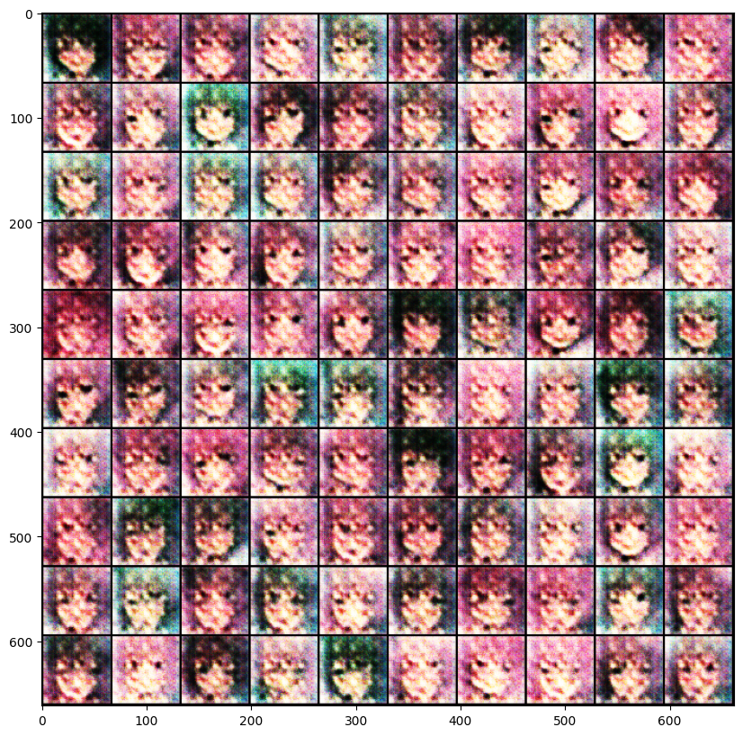
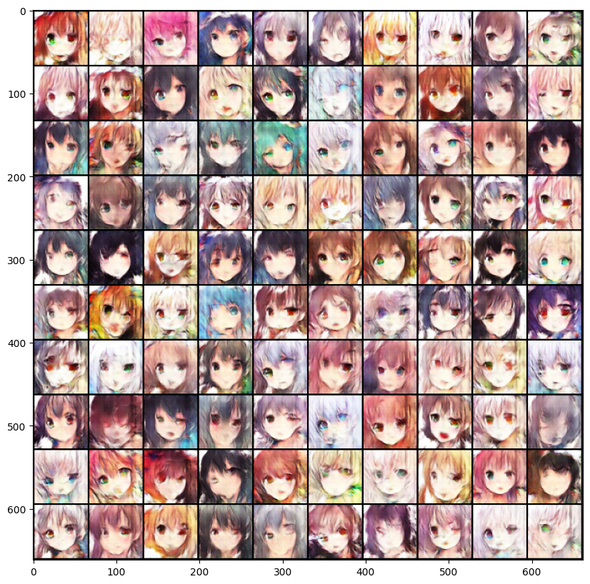
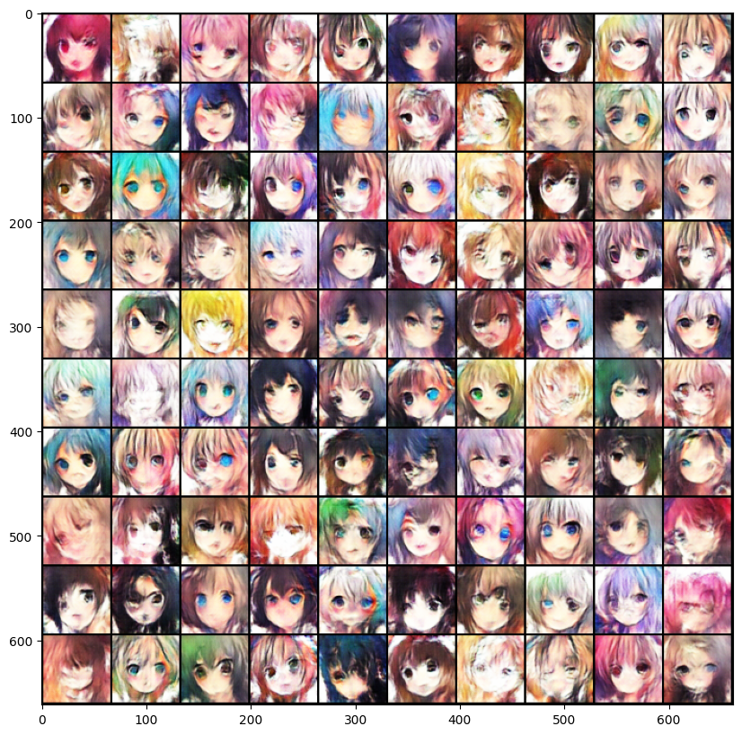
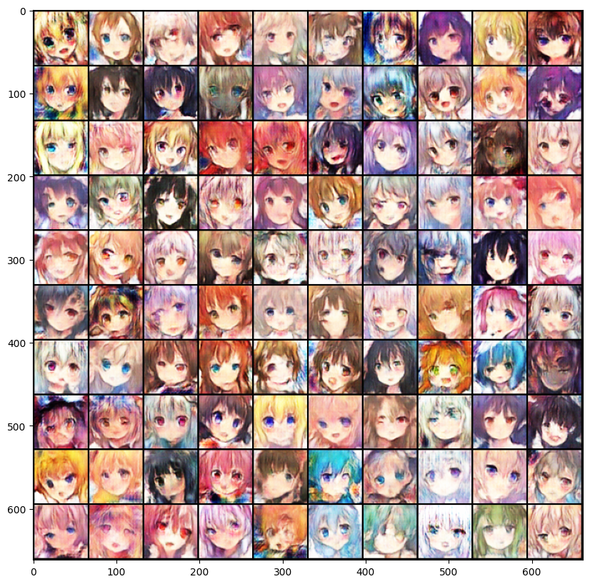
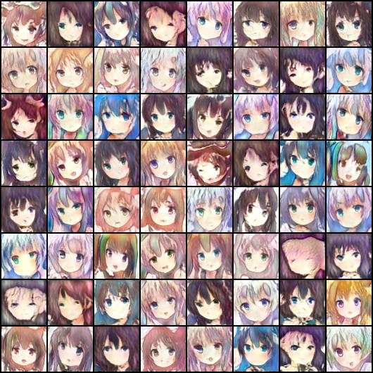
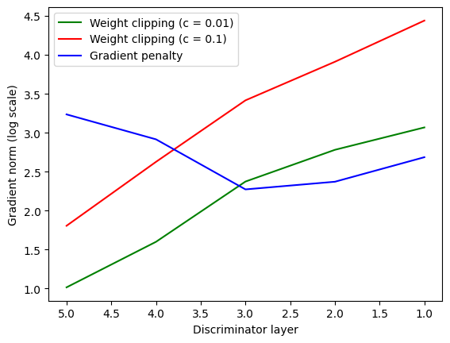

## Task Introduction

- 输入一个随机数，生成1000张Anime face的图片；
- 使用GAN实现。

## Dataset

[Crypko](https://crypko.ai/)是可以生成自己的Anime face的网站，助教爬取了71314张图片作为训练数据。

## Evaluation Metrics

### FID (Frechet Inception Distance) 

**FID（Frechet Inception Distance）** 是一种用于评估 **生成模型**（如GAN、VAE）生成图像质量的指标，通过比较生成图像与真实图像的统计特征差异来衡量两者的相似性。

**核心思想**：计算生成图像和真实图像在特征空间中的分布距离，距离越小，生成图像质量越高。

**计算步骤**：

- 特征提取：使用预训练的Inception模型，提取真实图像和生成图像的特征；

- 计算统计量：分别计算真实图像和生成图像特征的均值和协方差矩阵；

- 根据公式计算FID：
  $$
  \text{FID} = \|\mu_r - \mu_g\|^2 + \text{Tr}\left(\Sigma_r + \Sigma_g - 2 \sqrt{\Sigma_r \Sigma_g}\right)
  $$

  - $\mu_r$，$\mu_g$：真实图像和生成图像在Inception特征空间的均值向量。
  - $\Sigma_r$，$\Sigma_g$：真实图像和生成图像的协方差矩阵。
  - $Tr$：矩阵的迹。

### AFD (Anime face detection)

  检测生成的1000张图像中有多少张是Anime face，计算占比，越高越好。

## 思路

### Simple Baseline(FID ≤ 30000, AFD ≥ 0)

跑一遍Sample Code。

FID: 396.80337487215184

AFD: 0.085



### Medium Baseline (FID ≤ 12000, AFD ≥ 0.4)
FID: 184.41336801146772

AFD: 0.573

- 修改`n_epoch`，`n_critic`：
```python
"n_epoch": 50,
"n_critic": 2
```
- 训练GAN容易发生梯度爆炸，因此引入梯度裁剪：
```python
import torch.nn.utils as utils
utils.clip_grad_norm_(self.D.parameters(), max_norm=1.0)
utils.clip_grad_norm_(self.G.parameters(), max_norm=1.0)
```




### Strong Baseline(FID ≤ 10000, AFD ≥ 0.5)

#### WGAN

FID: 166.73857250731453

AFD: 0.65
- 去除梯度裁剪；
- 从Discriminator中移除最后一个Sigmiod层；
- 修改loss函数loss_D、loss_G；
```python
loss_D = -torch.mean(r_logit) + torch.mean(f_logit)
loss_G = -torch.mean(self.D(f_imgs))
```
- 训练Discriminator时，进行权重裁剪：
```python
for p in self.D.parameters():
    p.data.clamp_(-self.config["clip_value"], self.config["clip_value"])
```
- 使用RMSProp optimizer;
```python
self.opt_D = torch.optim.RMSprop(self.D.parameters(), lr=self.config["lr"])
self.opt_G = torch.optim.RMSprop(self.G.parameters(), lr=self.config["lr"])
```
- config中添加clip_value项;
```python
config = {
    "model_type": "WGAN",
    "batch_size": 64,
    "lr": 1e-4,
    "n_epoch": 50,
    "n_critic": 2,
    "z_dim": 100,
    "workspace_dir": workspace_dir, # define in the environment setting
    "clip_value": 1.0
}
```
训练下来发现效果不稳定，FID、AFD略有提升。



#### WGAN-GP
FID: 169.90538676508262

AFD: 0.68

在WGAN的基础上：
- 用gradient penalty代替权重裁剪；
```python
def gp(self, r_imgs, f_imgs):
    Tensor = torch.cuda.FloatTensor
    alpha = Tensor(np.random.random((r_imgs.size(0), 1, 1, 1)))
    interpolates = (alpha*r_imgs + (1 - alpha)*f_imgs).requires_grad_(True)
    d_interpolates = self.D(interpolates)
    fake = Variable(Tensor(r_imgs.shape[0]).fill_(1.0), requires_grad=False)
    gradients = autograd.grad(
        outputs=d_interpolates,
        inputs=interpolates,
        grad_outputs=fake,
        create_graph=True,
        retain_graph=True,
        only_inputs=True,
    )[0]

    gradients = gradients.view(gradients.size(0), -1)
    gradient_penalty = ((gradients.norm(1, dim=1) - 1)**2).mean()
    return gradient_penalty
```
- 修改loss函数loss_D；
```python
gradient_penalty = self.gp(r_imgs, f_imgs)
loss_D = -torch.mean(r_logit) + torch.mean(f_logit) + gradient_penalty
```

- `nn.InstanceNorm2d`代替`nn.InstanceNorm2d`；
```python
def conv_bn_lrelu(self, in_dim, out_dim):
    return nn.Sequential(
        nn.Conv2d(in_dim, out_dim, 4, 2, 1),
        # nn.BatchNorm2d(out_dim),
        nn.InstanceNorm2d(out_dim),
        nn.LeakyReLU(0.2),
    )
```

相比GAN和WGAN，训练稳定了很多，可以观察到Anime face从杂讯中慢慢生成出来。



### Boss Baseline(FID ≤ 9000, AFD ≥ 0.6)
直接使用[stylegan2-pytorch](https://github.com/lucidrains/stylegan2-pytorch)训练并生成图片。

```python
!pip install stylegan2_pytorch==1.9.0
```

默认的`num-train-steps`为150000。实测Kaggle最多只能运行12h，约4000个step，生成图片的效果并不是很好。有条件的同学可以尝试训练10000个step再生成图片，应该能获得不错的效果。

```python
# 训练
!stylegan2_pytorch \
    --data ./faces \
    --name my_stylegan2 \
    --image-size 64 \
    --batch-size 64 \
    --save-every 200 \
    --num-train-steps 4000
# 推理
!stylegan2_pytorch \
    --name my_stylegan2 \
    --generate \
    --num_generate 16 \
    --results-dir ./output
```

stylegan2_pytorch `--generate` 默认会把生成图拼成一个图像网格，不是单张图片，需要自行切片。
```python
temp_dataset = get_dataset(os.path.join("./output", 'default'))
for i in range(len(temp_dataset)):
    torchvision.utils.save_image(temp_dataset[i], os.path.join("./output", f'{i+1}.jpg'))
```



## Code

[双过Boss Baseline](https://github.com/Aaricis/Hung-yi-Lee-ML2022/blob/main/HW6/ML_HW6.ipynb)

## Report
**1. Describe the difference between WGAN and GAN, list at least two differences.**

- WGAN的Discriminator不使用Sigmoid;
- WGAN的损失函数不再使用BCE Loss，Discriminator的loss为真实样本与生成样本的分数差，Generator的loss为Discriminator对生成样本的评分；
- WGAN强制裁剪Discriminator的权重到$$[-c, c]$$来满足Lipschitz约束。 

**2. Please plot the “Gradient norm” result.**

WGAN存在梯度爆炸/消失的问题，WGAN-GP通过增加梯度惩罚（ GP，Gradient Penalty），从而使梯度更加稳定。

在Discriminator梯度更新之后，收集每个layer的梯度。

```python
for name, param in self.D.named_parameters():
    if 'weight' in name and param.grad is not None:
        print(f"{name} grad norm: {param.grad.norm().item()}")

```

实验使用的Discriminator为5层，横坐标为layer序号，纵坐标为梯度取log之后的结果。Weight clipping随着层次的加深，梯度剧烈下降，总体表现为梯度爆炸到梯度消失。Gradient penalty梯度变化相对平稳。



## Reference

[李宏毅2022机器学习HW6解析 - 知乎](https://zhuanlan.zhihu.com/p/499841929)
