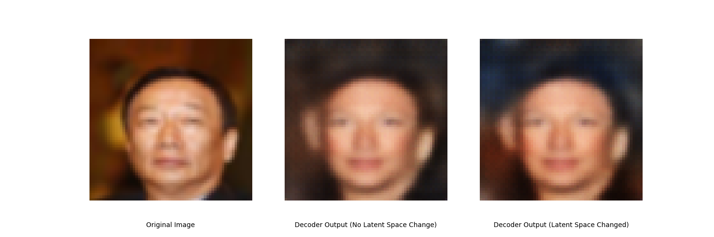
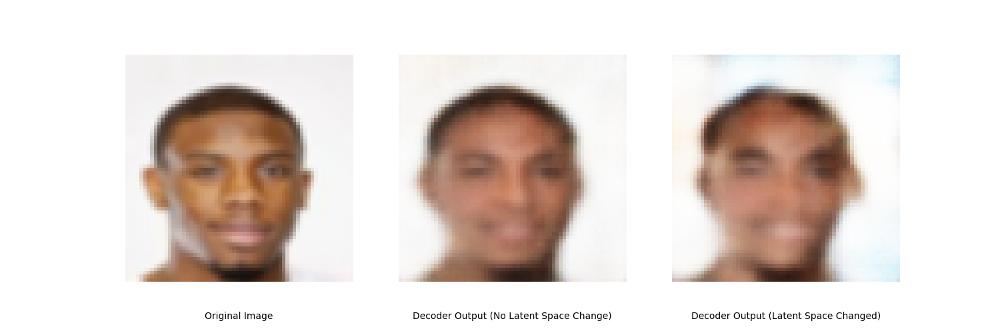
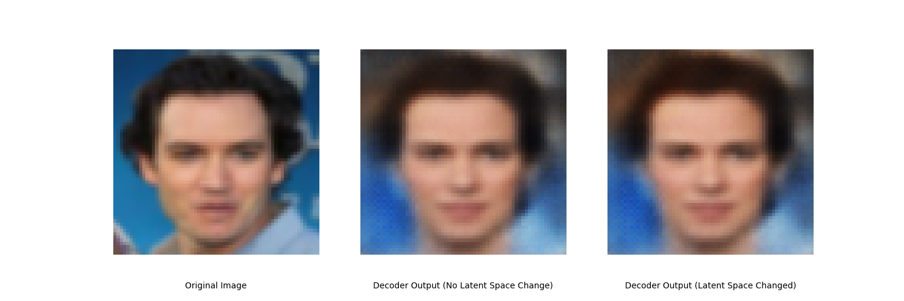

## Task Introduction

本次作业是无监督异常检测(Unsupervised anomaly detection)，训练一个模型检测输入图像是否与训练数据相似。

## Data

- Training data

  - 100000 human faces

- Testing data

  - About 10000 from the same distribution with training data (label 0)
  - About 10000 from another distribution (anomalies, label 1)

- Format

  - data/

    |----- trainingset.npy 

    |----- testingset.npy

  - Shape: (#image, 64, 64, 3) for each .npy file

## Methodology

- 训练一个Autoencoder，使输入输出的图片越相似越好，即重构误差小；
- 在推理阶段，我们使用输入输出图片的重构误差作为异常检测的分数（anomaly score）；
  - Anomaly score可以被看作图片异常的程度；
  - 来自模型没见过的分布的图像具有较高的重构误差。

## Evaluation

Kaggle上使用**ROC AUC score**评估最终模型对异常样本和正常样本的区分能力。

- **ROC 曲线**（Receiver Operating Characteristic Curve）展示了在不同阈值下，**真正例率 (True Positive Rate)** 和 **假正例率 (False Positive Rate)** 的关系。

- **AUC**（Area Under Curve）就是 ROC 曲线下的面积，表示模型区分正常/异常的能力。

  - AUC = 1：完美分类

  - AUC = 0.5：随机猜

  - AUC < 0.5：比随机还差

## 思路

### Simple Baseline(AUC>0.53150)

Score: 0.66919 Private score: 0.67148

模型结构使用CNN

```python
model_type = 'cnn'
```

### Medium Baseline (AUC>0.73171)
Score: 0.75342
Private score: 0.74911

Adjust model structure：

助教提供了CNN，VAE和FCN三个模型，虽然前面两个看起来很牛，实际跑下来FCN效果最好。

```python
model_type = 'fcn'
```
调整`fcn_autoencoder`架构

```python
class fcn_autoencoder(nn.Module):
    def __init__(self):
        super(fcn_autoencoder, self).__init__()
        self.encoder = nn.Sequential(
            nn.Linear(64 * 64 * 3, 1024),
            nn.ReLU(),
            nn.Linear(1024, 512),
            nn.ReLU(),
            nn.Linear(512, 256),
            nn.ReLU(),
            nn.Linear(256, 64),
            nn.ReLU(),
            nn.Linear(64, 10)
        )
        self.decoder = nn.Sequential(
            nn.Linear(10, 64),
            nn.ReLU(),
            nn.Linear(64, 256),
            nn.ReLU(),
            nn.Linear(256, 512),
            nn.ReLU(),
            nn.Linear(512, 1024),
            nn.ReLU(),
            nn.Linear(1024, 64 * 64 * 3),
            nn.Tanh()
        )
    def forward(self, x):
      x = self.encoder(x)
      x = self.decoder(x)
      return x
```

### Strong Baseline (AUC>0.76739)
Score: 0.77350
Private score: 0.77118

助教建议使用多编码器自动编码器结构（Multi-Encoder Autoencoder），同时推荐了一篇论文***Multi-Encoder Towards Effective Anomaly Detection in Videos***。论文提出Multi-Encoder Single-Decoder network(MESDnet)架构：
- 采用运动编码器和内容编码器分别对视频的运动和内容进行分解，然后concat不同编码器的输出再输入解码器。
- 解码器同时利用多流编码器的运动和内容特征，观察对视频帧的重构误差的方式检测异常。
- 为了防止池化操作后的信息丢失，MESDnet采用残差连接来传输从编码器到解码器的信息。

我尝试了多种编码器组合，包括CNN、FCN、VAE，并测试了CNN和FCN解码器，最终效果都不能超过Strong Baseline。下面提供MESDnet的一种代码实现，供学习交流。

如有大佬实现这个路数成功了，请dd我！！！

```python
import torch
import torch.nn as nn
import torch.nn.functional as F

class ResidualBlock(nn.Module):
    """残差块用于解码器"""
    def __init__(self, in_c, out_c):
        super().__init__()
        self.conv = nn.Sequential(
            nn.Conv2d(in_c, out_c, 3, 1, 1),
            nn.BatchNorm2d(out_c),
            nn.LeakyReLU(0.2),
            nn.Conv2d(out_c, out_c, 3, 1, 1),
            nn.BatchNorm2d(out_c)
        )
        self.shortcut = nn.Conv2d(in_c, out_c, 1) if in_c != out_c else nn.Identity()

    def forward(self, x):
        return F.leaky_relu(self.conv(x) + self.shortcut(x), 0.2)

class FeatureFusion(nn.Module):
    """特征融合模块(带注意力机制)"""
    def __init__(self, channels=48):
        super().__init__()
        self.attention = nn.Sequential(
            nn.Conv2d(channels*3, channels*3, 1),
            nn.ReLU(),
            nn.Conv2d(channels*3, channels*3, 1),
            nn.Sigmoid()
        )

    def forward(self, fcn, cnn, vae):
        concat = torch.cat([fcn, cnn, vae], dim=1)
        weights = self.attention(concat)
        return fcn * weights[:,:48] + cnn * weights[:,48:96] + vae * weights[:,96:144]

class FCN_Encoder(nn.Module):
    """增强版FCN编码器"""
    def __init__(self):
        super().__init__()
        self.net = nn.Sequential(
            nn.Linear(64*64*3, 2048),
            nn.BatchNorm1d(2048),
            nn.LeakyReLU(0.2),
            nn.Linear(2048, 1024),
            nn.BatchNorm1d(1024),
            nn.LeakyReLU(0.2),
            nn.Linear(1024, 512),
            nn.BatchNorm1d(512),
            nn.LeakyReLU(0.2),
            nn.Linear(512, 256),
            nn.BatchNorm1d(256),
            nn.LeakyReLU(0.2),
            nn.Linear(256, 64),
            nn.BatchNorm1d(64),
            nn.LeakyReLU(0.2),
            nn.Linear(64, 10)
        )

    def forward(self, x):
        return self.net(x)

class CNN_Encoder(nn.Module):
    """CNN编码器(带残差连接)"""
    def __init__(self):
        super().__init__()
        self.net = nn.Sequential(
            nn.Conv2d(3, 12, 4, 2, 1),
            nn.BatchNorm2d(12),
            nn.LeakyReLU(0.2),
            nn.Conv2d(12, 24, 4, 2, 1),
            nn.BatchNorm2d(24),
            nn.LeakyReLU(0.2),
            ResidualBlock(24, 48),
            nn.Conv2d(48, 48, 4, 2, 1),
            nn.BatchNorm2d(48),
            nn.LeakyReLU(0.2))

    def forward(self, x):
        return self.net(x)

class VAE_Encoder(nn.Module):
    """改进的VAE编码器"""
    def __init__(self):
        super().__init__()
        self.encoder = nn.Sequential(
            nn.Conv2d(3, 12, 4, 2, 1),
            nn.BatchNorm2d(12),
            nn.LeakyReLU(0.2),
            nn.Conv2d(12, 24, 4, 2, 1),
            nn.BatchNorm2d(24),
            nn.LeakyReLU(0.2))

        self.fc_mu = nn.Conv2d(24, 48, 4, 2, 1)
        self.fc_logvar = nn.Conv2d(24, 48, 4, 2, 1)

    def encode(self, x):
        h = self.encoder(x)
        return self.fc_mu(h), self.fc_logvar(h)

    def reparametrize(self, mu, logvar):
        std = logvar.mul(0.5).exp_()
        eps = torch.randn_like(std)
        return mu + eps * std

    def forward(self, x):
        mu, logvar = self.encode(x)
        z = self.reparametrize(mu, logvar)
        return z, mu, logvar


class MultiEncoderAutoencoder(nn.Module):
    """优化后的多编码器自编码器"""
    def __init__(self):
        super().__init__()
        self.encoder_fcn = FCN_Encoder()
        self.encoder_cnn = CNN_Encoder()
        self.encoder_vae = VAE_Encoder()

        # 改进的FCN特征映射
        self.fcn_to_feature = nn.Sequential(
            nn.Linear(10, 128),
            nn.LeakyReLU(0.2),
            nn.Linear(128, 256),
            nn.LeakyReLU(0.2),
            nn.Linear(256, 48*8*8),
            nn.LeakyReLU(0.2))

        # 特征融合模块 - 修改为输出144通道
        self.feature_fusion = nn.Sequential(
            nn.Conv2d(48*3, 144, 1),  # 使用1x1卷积调整通道数
            nn.BatchNorm2d(144),
            nn.LeakyReLU(0.2))

        # 改进的解码器
        self.decoder = nn.Sequential(
            ResidualBlock(144, 128),
            nn.ConvTranspose2d(128, 128, 4, 2, 1),
            nn.BatchNorm2d(128),
            nn.LeakyReLU(0.2),

            ResidualBlock(128, 64),
            nn.ConvTranspose2d(64, 64, 4, 2, 1),
            nn.BatchNorm2d(64),
            nn.LeakyReLU(0.2),

            ResidualBlock(64, 32),
            nn.ConvTranspose2d(32, 32, 4, 2, 1),
            nn.BatchNorm2d(32),
            nn.LeakyReLU(0.2),

            nn.Conv2d(32, 3, 3, 1, 1),
            nn.Tanh())

    def forward(self, x):
        x_fcn, x_cnn, x_vae = x.clone(), x.clone(), x.clone()
        x_fcn = x_fcn.view(x_fcn.shape[0], -1)

        # 各编码器前向传播
        z_fcn = self.encoder_fcn(x_fcn)
        z_cnn = self.encoder_cnn(x_cnn)
        z_vae, mu, logvar = self.encoder_vae(x_vae)

        # FCN特征映射
        z_fcn_feat = self.fcn_to_feature(z_fcn).view(-1, 48, 8, 8)

        # 特征拼接和通道调整
        concat_feat = torch.cat([z_fcn_feat, z_cnn, z_vae], dim=1)  # [bs, 144, 8, 8]
        fused_feat = self.feature_fusion(concat_feat)  # 保持144通道

        # 解码
        recon = self.decoder(fused_feat)
        return recon, mu, logvar, z_fcn, z_cnn


# 自定义损失函数
def multi_encoder_loss(recon_x, x, mu, logvar, z_fcn, z_cnn):
    # 重建损失
    recon_loss = F.mse_loss(recon_x, x, reduction='sum')

    # KL散度
    kld_loss = -0.5 * torch.sum(1 + logvar - mu.pow(2) - logvar.exp())

    # 编码器一致性损失
    fcn_mean = z_fcn.mean(dim=[2,3])
    cnn_mean = z_cnn.mean(dim=[2,3])
    consistency_loss = F.mse_loss(fcn_mean, cnn_mean)

    return recon_loss + 0.1*kld_loss + 0.05*consistency_loss
```
受Medium Baseline的启发，继续调整FCN模型的结构，达到Strong Baseline。

```python
# Strong Baseline
class FcnAutoencoder(nn.Module):
    def __init__(self):
        super(FcnAutoencoder, self).__init__()
        self.encoder = nn.Sequential(
            nn.Linear(64 * 64 * 3, 2048),
            nn.ReLU(),
            nn.Linear(2048, 1024),
            nn.ReLU(),
            nn.Linear(1024, 512),
            nn.ReLU(),
            nn.Linear(512, 256),
            nn.ReLU(),
            nn.Linear(256, 128),
           
        )
        
        self.decoder = nn.Sequential(
            nn.Linear(128, 256),
            nn.ReLU(),
            nn.Linear(256, 512),
            nn.ReLU(),
            nn.Linear(512, 1024),
            nn.ReLU(),
            nn.Linear(1024, 2048),
            nn.ReLU(),
            nn.Linear(2048, 64 * 64 * 3),
            nn.Tanh())

    def forward(self, x):
        x = self.encoder(x)
        x = self.decoder(x)
        return x
```


### Boss Baseline (AUC>0.80072)

**有两个解法：**

**resnet + noise + classifier:** Score: 0.80114 Private score: 0.80752

**fcn:** Score: 0.82865 Private score: 0.83038

#### resnet + noise + classifier
根据助教提示，在原本的Autoencoder架构基础上添加随机噪声和额外的分类器。

Encoder采用resnet18去除全连接层的简化版，Decoder采用反卷积+残差实现，图像分类器采用卷积神经网络。


```python
import torch
import torch.nn as nn
import torch.nn.functional as F
from torchvision.models import resnet18

# 基础残差块（简化版）
class BasicBlock(nn.Module):
    def __init__(self, in_ch, out_ch, stride=1):
        super().__init__()
        self.conv1 = nn.Conv2d(in_ch, out_ch, 3, stride, 1, bias=False)
        self.bn1 = nn.BatchNorm2d(out_ch)
        self.conv2 = nn.Conv2d(out_ch, out_ch, 3, 1, 1, bias=False)
        self.bn2 = nn.BatchNorm2d(out_ch)
        self.shortcut = nn.Sequential()
        if stride != 1 or in_ch != out_ch:
            self.shortcut = nn.Sequential(
                nn.Conv2d(in_ch, out_ch, 1, stride, bias=False),
                nn.BatchNorm2d(out_ch)
            )

    def forward(self, x):
        out = F.relu(self.bn1(self.conv1(x)))
        out = self.bn2(self.conv2(out))
        out += self.shortcut(x)
        return F.relu(out)

# Encoder：修改版ResNet18（去全连接层）
class ResNetEncoder(nn.Module):
    def __init__(self, latent_dim=256):
        super().__init__()
        resnet = resnet18(pretrained=False)
        self.encoder = nn.Sequential(
            resnet.conv1,    # 64x32x32 (for 64x64 input)
            resnet.bn1,
            resnet.relu,
            resnet.maxpool,  # 64x16x16
            resnet.layer1,   # 64x16x16
            resnet.layer2,   # 128x8x8
            resnet.layer3,   # 256x4x4
            resnet.layer4    # 512x2x2
        )
        self.fc = nn.Linear(512*2*2, latent_dim)

    def forward(self, x):
        feat = self.encoder(x)
        z = self.fc(feat.view(x.size(0), -1))
        return z

# Decoder：对称结构（使用反卷积）
class ResNetDecoder(nn.Module):
    def __init__(self, latent_dim=256):
        super().__init__()
        self.fc = nn.Linear(latent_dim, 512*2*2)
        self.decoder = nn.Sequential(
            nn.ConvTranspose2d(512, 256, 4, 2, 1),  # 2→4
            nn.BatchNorm2d(256),
            nn.ReLU(True),
            BasicBlock(256, 128),
            nn.ConvTranspose2d(128, 128, 4, 2, 1),  # 4→8
            nn.BatchNorm2d(128),
            nn.ReLU(True),
            BasicBlock(128, 64),
            nn.ConvTranspose2d(64, 64, 4, 2, 1),    # 8→16
            nn.BatchNorm2d(64),
            nn.ReLU(True),
            nn.ConvTranspose2d(64, 32, 4, 2, 1),    # 16→32
            nn.BatchNorm2d(32),
            nn.ReLU(True),
            nn.ConvTranspose2d(32, 3, 4, 2, 1),     # 32→64
            nn.Tanh()
        )

    def forward(self, z):
        out = self.fc(z).view(-1, 512, 2, 2)
        return self.decoder(out)

# 图像分类器：判断图像是真图 or 假图（输出 logits）
class ImageClassifier(nn.Module):
    def __init__(self, in_channels=3):
        super().__init__()
        self.net = nn.Sequential(
            nn.Conv2d(in_channels, 32, 3, 2, 1),  # 64 -> 32
            nn.BatchNorm2d(32),
            nn.ReLU(),
            nn.Conv2d(32, 64, 3, 2, 1),           # 32 -> 16
            nn.BatchNorm2d(64),
            nn.ReLU(),
            nn.Conv2d(64, 128, 3, 2, 1),          # 16 -> 8
            nn.BatchNorm2d(128),
            nn.ReLU(),
            nn.AdaptiveAvgPool2d((1, 1)),
            nn.Flatten(),
            nn.Linear(128, 2)  # 输出真假二分类
        )

    def forward(self, x):
        return self.net(x)

# Autoencoder 总体结构 + 分类器
class ResNetAutoencoder(nn.Module):
    def __init__(self, latent_dim=256):
        super().__init__()
        self.encoder = ResNetEncoder(latent_dim)
        self.decoder = ResNetDecoder(latent_dim)
        self.classifier = ImageClassifier()

    def forward(self, x):
        z = self.encoder(x)
        recon = self.decoder(z)

        noise = torch.randn_like(z) * 0.1
        z_noise = z + noise
        recon_noise = self.decoder(z_noise)

        # 图像真假分类
        logits_recon = self.classifier(recon)
        logits_recon_noise = self.classifier(recon_noise)

        return recon, recon_noise, logits_recon, logits_recon_noise
```
损失函数需针对Autoencoder和图片分类器分别设计。Autoencoder重建loss使用`MSELoss`，图片分类器loss使用`BCEWithLogitsLoss`。

```python
import torch.nn.functional as F

def loss_fn(x, recon, recon_noise, clf_logits_real, clf_logits_fake, weight_recon=1.0, weight_clf=0.1):
    """
    Parameters:
        recon:       解码器重建的正常图像
        recon_noise: 解码器重建的扰动图像
        x:           原始输入图像
        clf_logits_real: 分类器对 recon 的输出（logits）
        clf_logits_fake: 分类器对 recon_noise 的输出（logits）
    """

    # 重建损失（主任务）
    recon_loss = F.mse_loss(recon, x)

    # 分类损失（使用 BCEWithLogitsLoss）
    bce_loss = nn.BCEWithLogitsLoss()
    real_labels = torch.ones_like(clf_logits_real)
    fake_labels = torch.zeros_like(clf_logits_fake)
    clf_loss = bce_loss(clf_logits_real, real_labels) + bce_loss(clf_logits_fake, fake_labels)

    # 总损失
    total_loss = weight_recon * recon_loss + weight_clf * clf_loss
    return total_loss, recon_loss, clf_loss
```

#### fcn
继续加宽fcn

```python
# Boss Baseline
class FcnAutoencoder(nn.Module):
    def __init__(self):
        super(FcnAutoencoder, self).__init__()

        self.encoder = nn.Sequential(
            nn.Linear(64 * 64 * 3, 4096),
            nn.BatchNorm1d(4096),
            nn.PReLU(),
            nn.Linear(4096, 2048),
            nn.BatchNorm1d(2048),
            nn.PReLU(),
            nn.Linear(2048, 1024),
            nn.BatchNorm1d(1024),
            nn.PReLU(),
            nn.Linear(1024, 256),
            nn.BatchNorm1d(256),
            nn.PReLU(),
            nn.Linear(256, 128)
        )

        self.decoder = nn.Sequential(
            nn.Linear(128, 256),
            nn.BatchNorm1d(256),
            nn.PReLU(),
            nn.Linear(256, 1024),
            nn.BatchNorm1d(1024),
            nn.PReLU(),
            nn.Linear(1024, 2048),
            nn.BatchNorm1d(2048),
            nn.PReLU(),
            nn.Linear(2048, 4096),
            nn.BatchNorm1d(4096),
            nn.PReLU(),
            nn.Linear(4096, 64 * 64 * 3),
            nn.Tanh()
        )
    def forward(self, x):
        x = self.encoder(x)
        x = self.decoder(x)
        return x
```
#### 训练策略
使用lr scheduler

```python
from transformers import get_cosine_schedule_with_warmup

# total training steps     
total_steps = len(train_dataloader) * num_epochs   
num_warmup_steps= int(1.15 * 0.1 * total_steps)     
scheduler = get_cosine_schedule_with_warmup(optimizer, num_warmup_steps=num_warmup_steps, num_training_steps=total_steps)    
```

#### 图像裁剪
增加面部所占区域的大小，从而扩大ROI并提高准确性。
```python
self.transform = transforms.Compose([
            transforms.Lambda(lambda x: x.to(torch.float32)),
            transforms.Resize((256, 256)),
            transforms.CenterCrop((196, 196)),
            transforms.Resize((64, 64)),
            transforms.Lambda(lambda x: 2. * x / 255. - 1.),  # Normalize to [-1, 1]
        ])
```

## Code

[双过Boss Baseline](https://github.com/Aaricis/Hung-yi-Lee-ML2022/blob/main/HW8/ML2022Spring_HW8.ipynb)

## Report

**1. Make a brief introduction about variational autoencoder (VAE). List one advantage comparing with vanilla autoencoder and one problem of VAE.** 

VAE是一种结合了深度学习和概率图模型的生成模型，能够学习数据的潜在表示并生成新样本。

**优点：**

生成能力强，能够通过学习数据的潜在分布生成新的样本，生成的数据具有多样性和合理性。

**缺点：**

与GAN相比，VAE生成的样本往往更模糊，因为其目标是最小化重构误差，而不是直接优化生成样本的视觉质量。

**2. Train a fully connected autoencoder and adjust at least two different element of the latent representation. Show your model architecture, plot out the original image, the reconstructed images for each adjustment and describe the differences.**

```python
import random
import torch
import matplotlib.pyplot as plt
from torchvision import transforms

# Select a random sample from the training dataset
sample = train_dataset[random.randint(0, 100000)]
sample = sample.reshape(1, 3, 64, 64)

# Initialize the autoencoder model
model = ResNetAutoencoder()

# Load the pre-trained model weights
model_path = '/kaggle/input/hw8-model/last_model_resnet.pt'
model = torch.load(model_path, weights_only=False)

# Set the model to evaluation mode
model.eval()

with torch.no_grad():
    img = sample.cuda() # Move the image to the GPU

    # Clone the original image for later visualization
    original_img = img.clone().cpu().reshape(3, 64, 64)

    x = model.encoder(img)
    output = model.decoder(x) # Obtain the latent representation
    output = output.reshape(3, 64, 64)

    # Modify the first few dimensions of the latent space for experimentation
    x_v1 = x.clone()
    for i in range(4):  # Modify the first four dimensions
        x_v1[0][i] *= 5
    output_v1 = model.decoder(x_v1)
    output_v1 = output_v1.reshape(3, 64, 64)

# Reshape the sample back to its original dimensions
sample = sample.reshape(3, 64, 64)

# Create the plot to visualize the original and reconstructed images
fig, axes = plt.subplots(nrows=1, ncols=3, figsize=(15, 5))

# Plot the original image
axes[0].imshow(transforms.ToPILImage()((original_img + 1) / 2))  # Normalize for display
axes[0].axis('off')
axes[0].annotate('Original Image', xy=(0.5, -0.15), xycoords='axes fraction', ha='center', va='center')

# Plot the decoder output without latent space modification
axes[1].imshow(transforms.ToPILImage()((output + 1) / 2))
axes[1].axis('off')
axes[1].annotate('Decoder Output (No Latent Space Change)', xy=(0.5, -0.15), xycoords='axes fraction', ha='center', va='center')

# Plot the decoder output with modified latent space
axes[2].imshow(transforms.ToPILImage()((output_v1 + 1) / 2))
axes[2].axis('off')
axes[2].annotate('Decoder Output (Latent Space Changed)', xy=(0.5, -0.15), xycoords='axes fraction', ha='center', va='center')

plt.savefig("report2_2.png")  # 文件名 + 扩展名
plt.show()  
```







比较发现，潜空间改变可以影响生成的图片，如上图的肤色和背景的变化。

## Reference

[一文详解ROC曲线和AUC值 - 知乎](https://zhuanlan.zhihu.com/p/616190701)

[李宏毅2022机器学习HW8解析 - 知乎](https://zhuanlan.zhihu.com/p/529030465)

[Autoencoder（李宏毅）机器学习 2023 Spring HW8 - 知乎](https://zhuanlan.zhihu.com/p/10356018848)
