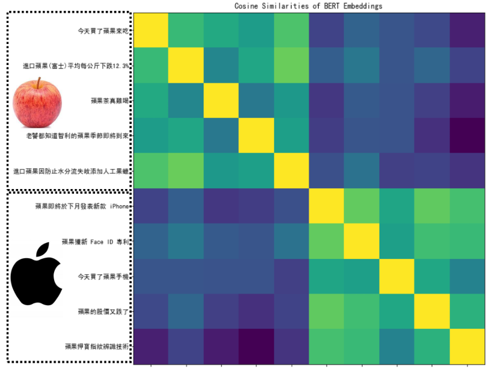
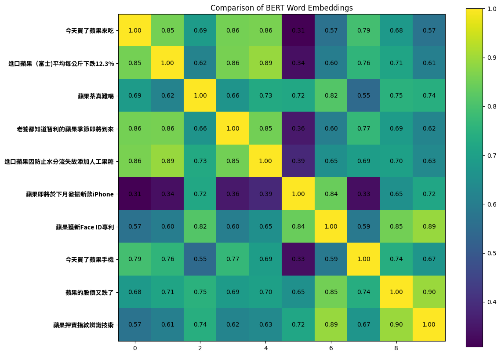
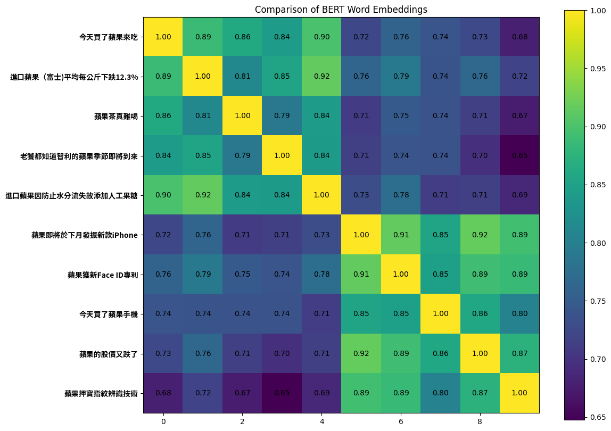

## Topic I: CNN explanation

CNN的可解释性，该部分使用了5个方法：

- Lime package 
- Saliency map
- Smooth Grad
- Filter Visualization
- Integrated Gradients

### Lime

Local Interpretable Model-Agnostic Explanations (LIME)：一种解释任何机器学习分类器预测的技术。

对一个图像分类模型的预测进行**可视化解释**，LIME 会告诉我们**图像中哪些区域最影响模型对某一类别的判断**。

### Saliency Map

Saliency Map 是一种用于解释深度学习模型（尤其是CNN）决策的可视化技术，通过计算输入图像中每个像素对模型预测结果的**梯度**或**敏感度**，标识出对分类影响最大的区域。

**Saliency Map 基于一个直观假设：**

> **如果轻微改变某个像素的值会显著影响模型输出的概率，则该像素对模型的决策很重要。**

通过计算输出类别概率相对于输入图像的梯度，生成热力图（越亮的区域表示重要性越高）。

### Smooth Grad

Smooth Grad是一种用于增强**Saliency Map（显著图）**可视化效果的噪声扰动技术，旨在解决原始梯度方法生成的显著图存在噪声敏感和稀疏性问题。其核心思想是通过对输入添加多次随机噪声并平均梯度，生成更平滑、更鲁棒的特征重要性图。

### Filter Visualization

Filter可视化包含两个方面：

- Filter activation：观察图片中哪些位置会activate该filter；
- Filter visualization：找出怎样的图片可以最大程度的activate该filter；

### Integrated Gradients

通过计算输入特征对模型预测的累积梯度贡献，量化每个特征的重要性。具体的：

1. **选择基线**：如全零张量或数据集均值；
2. **定义路径**：从基线 $x'$ 到输入 $x$ 的线性插值；
3. **计算梯度**：在路径上采样点，计算模型输出对输入的梯度；
4. **积分求和**：加权平均梯度，乘以输入与基线的差值。

## Topic II: BERT explanation

Bert的可解释性，该部分使用了3个方法：

- Attention Visualization 
- Embedding Visualization 
- Embedding analysis

### Attention Visualization

使用[Exbert](https://huggingface.co/exbert/)可视化Bert的注意力机制。

### Embedding Visualization

- 输入question和context，让Bert作问答；

- 使用PCA（Principal Component Analysis）可视化Bert层的embedding。

### Embedding Analysis

将不同的句子输入Bert，计算Bert输出的各embedding间的距离（欧几里得距离或余弦相似度），画出热力图。

## Questions

### Q1 Lime 

0.3 分數

請觀察圖片編號2，包含了中央的⽜奶瓶與左下⾓的草莓。在使⽤ Lime 套件之 後的結果中，請問圖片中的這兩個部分怎麼影響 model 做出分類？ Please observe picture number 2, which contains the milk bottle in the center and the  strawberry in the lower-left corner. In the results after using the Lime package, how  do these two parts of the picture affect the classification of the model? 

- [x] 左下⾓的草莓為主要的負相關 / The strawberry in the lower-left corner is the main negative correlation 

- [ ] 中央的⽜奶瓶為主要的正相關 / The milk bottle in the center is the main positive correlation 

- [ ] 左下⾓的草莓為主要的正相關 / The strawberry in the lower-left corner is the main positive correlation 

- [ ] 中央的⽜奶瓶為主要的負相關 / The milk bottle in the center is the main negative correlation

### Q2 Lime 

0.3 分數 

請問 Lime 套件的顏⾊代表什麼意義？（選兩個選項） What does the color of the Lime package mean? (Choose two options) 

- [x] 紅⾊代表負相關 / Red represents the negative correlation 

- [ ] 綠⾊代表負相關 / Green represents the negative correlation 

- [ ] 紅⾊代表正相關 / Red means the positive correlation 

- [x] 綠⾊代表正相關 / Green means the positive correlation

### Q3 Lime 

0.3 分數 

請問 Lime 套件是如何找出圖片各個部分對於物件辨識模型的相關性？ How does the Lime package discover the correlation between each part of the picture  with the model’s judgment? 

- [ ] 加入 noise 觀察輸出結果的改變 / Adding noise to observe the difference in the outputs of the model 

- [ ] 根據圖片中各個部分的顏⾊ / According to the colors in each part of the picture 

- [x] 將圖片切成⼩塊觀察模型判斷的變化 / Slice the pictures into small components to observe the difference in the model’s judgment 

- [ ] 根據Loss對圖片的偏微分值 / According to the partial differential value of the loss to the picture

### Q4 Lime 

0.3 分數 

請觀察圖片編號 3 使⽤ Lime 套件的結果，請問何者正確？ Please observe the result of using the Lime package for picture number 3. Which  option is correct? 

- [ ] 蛋糕對於 model 來說完全是負相關的依據 / The cake is completely negatively related to the model 

- [ ] 蛋糕對於 model 來說完全是正相關的依據 / The cake is completely positively related to the model 

- [ ] 蛋糕不是 model 的判斷依據 / The cake is not the basis for the judgment of the model 

- [x] 有⼀部分蛋糕對於 model 來說是正相關，有些則是負相關 / Some part of the cake is positively correlated to the model, and some part is negatively correlated

### Q5 Saliency Map 

0.3 分數 

請問在畫 Saliency Map 時，為何要對每張圖片的 gradient 做 normalization? When drawing the Saliency Map, why do we need to normalize each image’s  gradient? 

- [ ] 增加不同圖片之間 gradient scale 不同的影響 / Increase the effect of the gradient scale between different pictures 

- [ ] 有沒有做都沒有影響 / It doesn’t matter whether we do it or not 

- [ ] 讓 Saliency 分布更為顯著 / Make saliency distribution more significant 

- [x] 降低不同圖片之間 gradient scale 不同的影響 / Reduce the effect of the gradient scale between different pictures 讓 Saliency 

- [ ] 分布更為均勻 / Make saliency distribution more even

### Q6 Saliency Map

Map 0.3 分數 

請問圖片編號 8 的 Saliency map 中，紅點分布的情況最接近下列何者？ In the Saliency map of picture number 8, which of the following is closest to the  distribution of red dots? 

- [x] 明顯分布於圖片中⽣⿂片的位置 / Obviously distributed in the position of the sashimi in the picture 

- [ ] 明顯分布於圖片中桌⼦的位置 / Obviously distributed in the position of the table in the picture 

- [ ] 明顯分布於圖片中筷⼦的位置 / Obviously distributed in the position of the chopsticks in the picture 

- [ ] 明顯分布於圖片中盤⼦的位置 / Obviously distributed in the position of the plate in the picture

### Q7 Saliency Map 

0.3 分數 

請問 Saliency Map 是將下列何者具象化？ Which of the following does Saliency Map visualize? 

- [x] Loss 對 input tensor 的偏微分值 / The partial differential value of loss to input tensor 

- [ ] Loss 對 model parameter 的偏微分值 / The partial differential value of loss to model parameter 
- [ ] Input tensor 對 loss 的偏微分值 / The partial differential value of input tensor to loss 
- [ ] Model parameter 對 loss 的偏微分值 / The partial differential value of model parameter to loss

### Q8 Saliency Map 

0.3 分數 

請問圖片編號 1 的 Saliency Map 中，紅點的分佈最像下列哪⼀種？ In the Saliency map of picture number 1, which of the following is closest to the  distribution of red dots? 

- [ ] ⾓錐體 Pyramid 

- [ ] 圓球體 Round sphere 

- [x] 立⽅體 Cube 

- [ ] 圓柱體 Cylinder 
- [ ] 四⾯體 Tetrahedron

### Q9 Saliency Map

Map 0.3 分數 

請問哪⼀張圖片使⽤ Lime 套件的結果正相關分布與 Saliency Map 最明顯的不 同？ Which picture has the most significant difference between the positive correlation  distribution using the Lime package and Saliency Map? 

- [ ] 圖片編號 7 picture number 7 
- [ ] 圖片編號 6 picture number 6 
- [ ] 圖片編號 4 picture number 4 
- [ ] 圖片編號 8 picture number 8 
- [x] 圖片編號 5 picture number 5

### Q10 Smooth Grad 

0.3 分數 

請問 Smooth Grad 是藉由甚麼⽅式解釋 model 的判斷？ How does Smooth Grad explain the model’s judgment? 

- [ ] 平均多張不同圖片的結果以觀察 model 的輸出 / Average the results of multiple different pictures to observe the output of the model 
- [ ] 隨機加入 noise 觀察 model 的輸出結果改變 / Randomly add noise to observe the changes in the output of the model 
- [ ] 平均多張不同圖片的結果以觀察 model 產⽣的 Saliency Map / Average the results of multiple different pictures to observe the Saliency Map generated by the model 
- [x] 隨機加入 noise 觀察 model 產⽣的 Saliency Map / Randomly add noise to observe the Saliency Map generated by the model

### Q11 Smooth Grad 

0.3 分數 

請比較 Saliency Map 與 Smooth Grad 產⽣的結果，下列何者正確？ Please compare the results produced by the Saliency Map and Smooth Grad. Which  of the following is correct? 

- [ ] 圖片編號 2 的 Saliency Map 和 Smooth Grad 強調的位置相同 / The Saliency Map of the picture number 2 is the same as the prominent position of Smooth Grad 
- [ ] 整體來說，Saliency Map 強調的部分更能清楚地呈現圖片中食物的位置 / Overall, the highlighted part of Saliency Map can present the position of the food in the picture more clearly 
- [x] 整體來說，Smooth Grad 強調的部分更能清楚地呈現圖片中食物的位置 / Overall, the highlighted part of Smooth Grad can present the position of the food in the picture more clearly 
- [ ] 圖片編號 4 的 Saliency Map 和 Smooth Grad 強調的位置不同 / The Saliency Map of the picture number 4 is different from the prominent position of Smooth Grad

### Q12 Smooth Grad 

0.3 分數 

請問在 Smooth Grad 計算完成後，沒有使⽤ normalization 會造成什麼結果？ After the calculation of Smooth Grad, what will happen if normalization is not used? 

- [x] 無法觀察到亮點部位 / Cannot observe bright spots 
- [ ] 亮點變暗，暗點變亮 / Bright spots darken, dark spots brighten 
- [ ] 產⽣亮點的區域不同 / The areas where the bright spots are generated are different 
- [ ] 食物的輪廓更加清楚 / The outline of the food is clearer 
- [ ] 與有使⽤ normalization 的結果⼀樣 / The same as the result of using normalization

### Q13 Smooth Grad 

0.3 分數 

請觀察圖片編號 7 的 Smooth Grad 結果，下列何者正確？ Please observe the Smooth Grad result of picture number 7. Which of the following  is correct? 

- [ ] 亮點主要為盤⼦ / The highlight is mainly the plate 
- [x] 亮點主要為麵 / The highlight is mainly the noodle 
- [ ] 亮點主要為青菜 / The highlight is mainly the vegetable 
- [ ] 亮點主要為米腸 / The highlight is mainly the rice sausage

### Q14 Filter Explanation 

0.3 分數 

請觀察圖片編號 2 在 cnnid=15, filterid=0 的 filter activation 結果，請問圖片中的哪部分最不能 activate 這個 filter？ Please observe the result of filter activation with picture number 2 at cnnid=15, and  filterid=0. Which part of the picture can not activate the filter most? 

- [ ] ⽜奶瓶輪廓 / the contour of the milk bottle 
- [ ] 陰影 / shadow 
- [ ] 草莓 / strawberry 
- [x] 背景 / background

### Q15 Filter Explanation 

0.3 分數 

請觀察較靠近輸出端與較靠近輸入端的 CNN layer 的 filter activation 有什麼差 異？(選 2 個選項) Please observe the difference between the filter activation of the CNN layer closer to  the output and that closer to the input? (Choose two options) 

- [ ] 兩者 activate 的位置幾乎不同 / The position of activation is almost different 
- [x] 靠近輸出端的比較模糊 / The filter activation closer to the output is vaguer 
- [x] 兩者 activate 的位置⼤致相似 / The position of activation is roughly similar 
- [ ] 靠近輸出端的比較清晰 / The filter activation closer to the output is clearer

### Q16 Fiter Explanation 

0.3 分數 

Filter Explanation 中我們觀察了哪些情況？(選 2 個選項) What have we observed in Filter Explanation? (Choose two options) 

- [ ] 哪⼀層 filter 最容易被特定的圖片 activate / Which layer of the filter is most likely to be activated by a specific picture 
- [ ] 哪⼀層 filter 對判斷食物種類最有幫助 / Which level of filter is most helpful for judging the type of food 
- [x] 什麼樣的圖片最容易 activate 特定的 filter / What kind of picture is the easiest to activate a specific filter 
- [x] 圖片的哪些位置會 activate 特定的 filter / Which parts of the picture activate a specific filter

### Q17 Filter Explanation 

0.3 分數 

請問我們觀察 cnnid=21 的 filter visualization，是觀察 model 的哪⼀種 layer 的 輸出？ When we observe the filter visualization with cnnid=21, what kind of layer output of  the model are we observing? 

- [ ] Conv2d() 
- [ ] Linear() 
- [ ] MaxPool2d() 
- [ ] ReLU() 
- [x] BatchNorm2d()

### Q18 Integrated Gradient 

0.3 分數 請問在使⽤ Integrated Gradient ⽅法時把 generate_images_on_linear_path 的 steps  調得更⼤，結果會產⽣什麼差異？ What difference in the results will be made if the steps of generate_images_on_linear_path are tuned larger when using the Integrated Gradient  method？ 

- [ ] 觀察不到亮點 / No bright spots are observed 
- [x] 沒有顯著差異 / No significant difference 
- [ ] 亮點隨機出現 / Bright spots appear randomly 
- [ ] 亮點變暗，暗點變亮 / Bright spots darken, dark spots brighten

### Q19 Integrated Gradient 

0.3 分數 

請問 Integrated Gradient 中 generate_images_on_linear_path 這個函數的功能為何？ What is the functionality of generate_images_on_linear_path in Integrated Gradient? 

- [x] 在原圖片與 baseline 之間產⽣連續的 samples / Generate continuous samples between the original picture and the baseline 
- [ ] 根據原圖片產⽣新的⼀群隨機圖片 / Generate a new group of random pictures based on the original picture 
- [ ] 把原圖片線性平移產⽣⼀張新圖片 / Linearly translate the original picture to generate a new picture 
- [ ] 根據原圖片產⽣⼀張 baseline 的圖片 / Generate a baseline picture based on the original picture

### Q20 Integrated Gradient 

0.3 分數 

請觀察圖片編號 3 Integrated Gradient 的結果，請問 model 判斷的依據可能是哪些pixels？ Please observe the result of picture number 3 in Integrated Gradient. What pixels  may be the basis for model judgment? 

- [ ] 桌⼦ / table 
- [ ] 盤⼦ / plate 
- [ ] 叉⼦ / fork 
- [x] 蛋糕 / cake

### Q21 Attention Visualization 

0.4 分數 

請使⽤網站 https://exbert.net/exBERT.html 及模型 [bert-based-cased] 分析以下句 ⼦： The police officer is popular with the residents because she is very generous and  kind. 對於模型中12層，每層中的第12個attention head (i.e. layer 1 head 12, layer 2 head  12, layer 3 head 12, …, layer 12 head 12)，下列哪⼀個功能可能存在？(可能超過 ⼀個答案) Please use the website https://exbert.net/exBERT.html and the model “bert-based cased” to visualize the sentence “The police officer is popular with the residents  because she is very generous and kind.”  For attention head 12 across all 12 layers in the model (i.e. layer 1 head 12, layer 2  head 12, layer 3 head 12, …, layer 12 head 12), which of the following  functionalities is most likely to exist? (maybe more than one answer)

- [x] Attend to special token 
- [x] Attend to the next token 
- [x] Attend to the period (句號) 
- [x] Attend to the same token 
- [x] Attend to the previous token

### Q22 Attention Visualization 

0.4 分數 

請使⽤網站 https://exbert.net/exBERT.html 及模型 [bert-based-cased] 分析以下句 ⼦： The police officer is popular with the residents because she is very generous and  kind. 在 [officer] ⼀字被蓋掉，換成 [MASK] token 的情況下，搜尋 [Wizard of Oz] 中 與 [MASK] 最相似的embedding。請問模型從哪⼀層開始成功預測被蓋掉的字的詞性？(成功預測的定義是50個字中最常出現的詞性與被蓋掉的字詞性相同) Please use the website https://exbert.net/exBERT.html and the model “bert-based cased” to visualize the sentence “The police officer is popular with the residents  because she is very generous and kind.”  Mask the word “officer” and search in the corpus “Wizard of Oz” for embeddings  most similar to the masked token “[MASK]”. After which layer does the model  successfully predict part of speech of the masked word? (the definition of predict  successfully is that the most frequent part of search among the 50 words is the same  as the masked word) 

- [ ] Layer 10 
- [x] Layer 12 
- [ ] Layer 11 
- [ ] Layer 9 
- [ ] Layer 7 
- [ ] Layer 8

### Q23 Attention Visualization 

0.4 分數 

請使⽤網站 https://exbert.net/exBERT.html 及模型 [bert-based-cased] 分析以下句 ⼦： The police officer is popular with the residents because she is very generous and  kind. Please use the website https://exbert.net/exBERT.html and the model “bert-based cased” to visualize the sentence “The police officer is popular with the residents  because she is very generous and kind.”

#### Q23.1 Attention Visualization 

0.2 分數 當句⼦中的 [she] 被蓋掉，模型在蓋掉的地⽅預測哪⼀個字？ Which token does the model predict in the masked position if “she” in the sentence is  masked? 

- [ ] she 
- [x] he 
- [ ] it

#### Q23.2 Attention Visualization 

0.2 分數 

在句⼦中的 [she] 被蓋掉的情況下，如果把句⼦中的 [officer] 也蓋掉，在 [she]  的位置預測 [he] 的機率減少了多少？ By how much does the probability of predicting “he” in the position of “she”  decrease when “officer” is also masked? (“she” is masked during the comparison) 

- [x] 0.81 
- [ ] 0.99 
- [ ] 0.18 
- [ ] 0.01

### Q24 Attention Visualization 

0.4 分數 

請使⽤網站 https://exbert.net/exBERT.html 及模型 [bert-based-cased] 分析以下句 ⼦： The police officer is popular with the residents because she is very generous and  kind. 下列哪⼀個attention head可能有指代消解的功能？ (指代消解的例⼦：湯姆喜歡珍妮，因為她很可愛。她指的是珍妮) Please use the website https://exbert.net/exBERT.html and the model “bert-based cased” to visualize the sentence “The police officer is popular with the residents  because she is very generous and kind.” Which of the following attention head may have the functionality of coreference  resolution? (example of coreference resolution: Tom likes Jennie because she is cute. She refers  to Jennie) 

- [ ] Layer 6 head 10 
- [ ] Layer 8 head 10 
- [x] Layer 5 head 10 
- [ ] Layer 4 head 10 
- [ ] Layer 7 head 10 

### Q25 Embedding Visualization 

0.4 分數 

在模型的哪⼀層中，答案的 embedding 與其他 embedding 離最遠？ In which layer of the model, the embedding of the answer is the furthest away from  the other embeddings? 

- [x] Layer 11 
- [ ] Layer 5 
- [ ] Layer 8 
- [ ] Layer 2

### Q26 Embedding Visualization 

0.4 分數 

模型中的哪幾層可能在負責[在文章中尋找與問題有關的資訊]？ Which layers of the model may perform the step “Matching questions with relevant  information in context”? 

- [ ] Layer 1 to 3 
- [ ] Layer 10 to 12 
- [ ] Layer 4 to 6 
- [x] Layer 7 to 9

### Q27 Embedding Visualization 

0.4 分數 

模型中的哪幾層可能在負責[將類似的文字分群(根據文字在文章中的關係)]？ Which layers of the model may perform the step “Clustering similar words together  (based on the relation of words in context)? 

- [ ] Layer 1 to 3 
- [x] Layer 4 to 6 
- [ ] Layer 10 to 12 
- [ ] Layer 7 to 9

### Q28 Embedding Analysis 

0.4 分數 

請找出作業投影片中的圖片(也是老師上課投影片的圖片)是如何⽣成的。 Please reproduce the picture in the homework slide (which is also the picture in the  professor’s slide)



#### Q28.1 Embedding Analysis 

0.2 分數 

圖片使⽤的比較指標是？ Which metric is used for comparison? 

- [ ] 歐⽒距離 / Euclidean distance 
- [x] 餘弦相似度 / Cosine similarity

#### Q28.2 Embedding Analysis 

0.2 分數 

圖片在比較哪⼀個字/詞的 Embedding? (註：正確答案的圖片顏⾊會幾乎相同) Which word/phrase is used for comparison? (For the correct answer, the colors of the  image are nearly the same) 

- [ ] 蘋的embedding / Embedding of 蘋 only 
- [ ] 蘋果的embedding / Embedding of 蘋果 
- [x] 果的embedding / Embedding of 果 only

`METRIC`使用余弦相似度，选择每个句子中要比较embedding的字`select_word_index`

```python
METRIC = cosine_similarity
```

```python
# the indexes for 蘋
select_word_index = [4, 2, 0, 8, 2, 0, 0, 4, 0, 0]
```




```python
# the indexes for 果
select_word_index = [5, 3, 1, 9, 3, 1, 1, 5, 1, 1]
```




***因为果的embedding热力图与助教投影片中的图片相同，所以选择“果的embedding / Embedding of 果 only”选项。***

### Q29 Embedding Analysis 

0.4 分數 

使⽤餘弦相似度或歐⽒距離作為比較的指標。請比較句⼦ [今天買了蘋果⼿機]  和 [蘋果獲得新Face ID專利] 中，兩個[果]字的相似度。請問 Embedding 從第 1  層到第 11 層(請忽略最後⼀層)，相似度的趨勢為何？ Use the metric “Cosine similarity” or “Euclidean distance” for comparison. Compare  the word embedding of [果] in the sentence [今天買了蘋果⼿機] and that in the  sentence [蘋果獲得新Face ID專利]. What is the trend of similarity from embedding  output from layer 1 to layer 11? (please exclude the last layer) 

- [ ] 先升後跌 / Increase, then decrease 
- [x] 先跌後升 / Decrease, then increase 
- [ ] 下跌 / Decrease 
- [ ] 上升 / Increase

### Q30 Embedding Analysis 

0.4 分數 

使⽤餘弦相似度或歐⽒距離做比較的指標。請問在第 0 層(input embedding)， 不同句⼦中的[果]⼀字之間的相似度，與下列何者有關？(可能有超過⼀個答 案) Which of the following(s) affects the similarity of [果] between different sentences at  the embedding output in layer 0? (maybe more than one answer)

- [x] 果在句⼦中的位置position of 果 in sentences 
- [ ] 果所在句⼦的⻑度 length of sentences 
- [ ] 果在句⼦中的意思contextual meaning of 果 in sentences 
- [ ] 果在句⼦中出現的次數occurrence of 果 in sentences

## Code

[作业代码](https://github.com/Aaricis/Hung-yi-Lee-ML2022/tree/main/HW9)