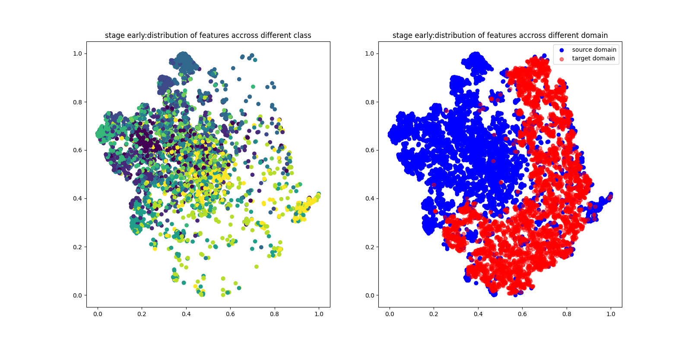
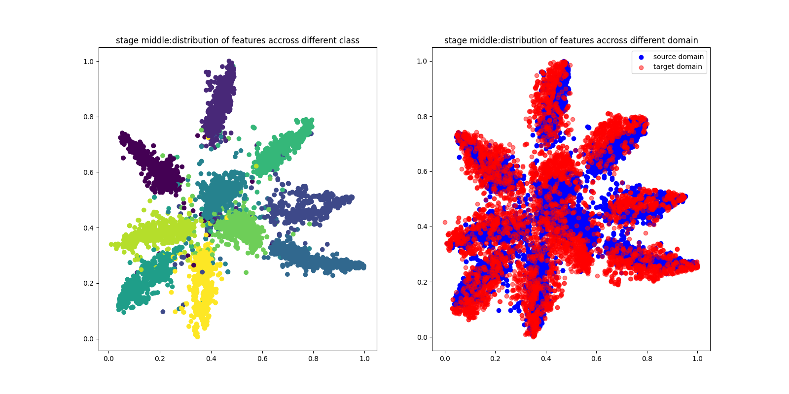
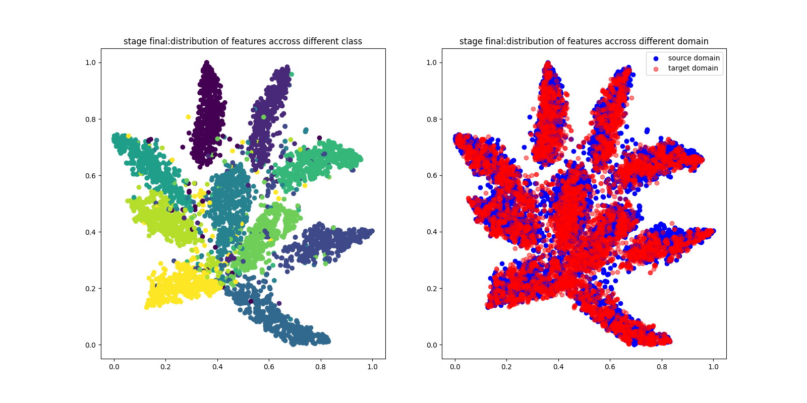

## Task Description

本次作业的主题是**Domain Adaptation**，即**领域自适应**。

假设你要执行与真实3D场景相关的任务，但是真实环境3D图像很难标记并且价格昂贵，而模拟图像（例如GTA-5上的模拟场景）易于标记。如果将模拟图像作为训练集，真实环境图像作为测试集，这样作会有什么问题？

模型会将真实环境图像识别为“异常”，因为训练数据和测试数据来自不同的domain。

如何解决这个问题哪？需要进行**Domain Shift**，我们旨在找到一个特征提取器，它接收输入数据并输出特征空间。这个特征提取器能够滤掉domain相关的信息，只保留不同domain之间共享的特征（[详情参见课程录影](https://youtu.be/Mnk_oUrgppM)）。

**具体的任务是**：给定真实图像（with labels）和涂鸦图像（without labels），使用Domain Adaptation技术预测手绘图像的label。

## Dataset

- Label: 10 classes (numbered from 0 to 9). 
- Training : 5000 (32, 32) RGB real images (with label). 
- Testing : 100000 (28, 28) gray scale drawing images.

## Data Format

Unzip real_or_drawing.zip, the data format is as below: 

- real_or_drawing/ 
  - train_data/ 
    - 0/ 
      - 0.bmp, 1.bmp … 499.bmp 
    - 1/ 
      - 500.bmp, 501.bmp … 999.bmp 
    - … 9/ 
  - test_data/
    - 0/ 
      - 00000.bmp
      - 00001.bmp 
      - … 99999.bmp

## 思路

### Simple Basline(acc ≥ 0.44616)

Score: 0.49334 Private score: 0.49798

跑一遍Sample Code。

### Medium Baseline(acc≥0.64576)

Score: 0.75684 Private score: 0.75626

根据助教提示，我们调整`lamb`的值并训练更多epoch。实作中随着epoch的增加动态调整`lamb`的值，总共训练800个epoch。

在训练领域自适应网络（Domain Adversarial Neural Network, DaNN）时，$\lambda$（lambda）参数控制**领域对抗损失**（Domain Adversarial Loss）和**分类损失**（Classification Loss）之间的**平衡**，其选择直接影响模型的迁移效果。

**$\lambda$参数的作用：**
- **$\lambda$越大：**强调领域对齐（强制源域和目标域特征分布一致），但可能损害源域的分类性能；
- **$\lambda$越小：**更关注源域的分类性能，但领域适应效果可能不足；
- **理想情况：**$\lambda$需要动态调整，初期关注分类，后期逐步加强领域对齐；

**动态调整$\lambda$:**

$\lambda$渐进式增长，训练初期$\lambda$较小，后期逐渐增大（模拟“先学习分类，再适应领域”）。
- 公式：
$$
\lambda_p = \frac{2}{1 + e^{-\gamma . p}} - 1
$$
其中，$p$为训练进度，$p = 当前epoch/总epoch$，$\gamma$控制增长速率，如$\gamma = 10$。

```python
# 动态调整λ
def get_lambda(epoch, max_epochs, gamma=10):
    p = epoch / max_epochs
    return (2. / (1. + np.exp(-gamma * p))) - 1.
# train 800 epochs
max_epochs = 800
for epoch in range(max_epochs):
    lamb = get_lambda(epoch, max_epochs)

    train_D_loss, train_F_loss, train_acc = train_epoch(source_dataloader, target_dataloader, lamb=lamb)

    torch.save(feature_extractor.state_dict(), f'extractor_model.bin')
    torch.save(label_predictor.state_dict(), f'predictor_model.bin')

    print('epoch {:>3d}: train D loss: {:6.4f}, train F loss: {:6.4f}, acc {:6.4f}'.format(epoch, train_D_loss, train_F_loss, train_acc))
```

### Strong Baseline(acc≥0.75840)

Score: 0.77962

Private score: 0.78094

在Medium Baseline基础上训练更多epoch，实作中训练1000个epoch，其余不变。

```python
max_epochs = 1000
```


### Boss Baseline (acc ≥0.80640)

Score: 0.82852 Private score: 0.82592

根据助教建议采用其他更高级的对抗训练方法，实作中使用DIRT-T。

DIRT-T来自论文[*A DIRT-T Approach to Unsupervised Domain Adaptation*](https://arxiv.org/abs/1802.08735)，是一种无监督领域自适应(**UDA**)方法。文章提出两阶段算法：**VADA**(Virtual Adversarial Domain Adaptation)和**DIRT-T**(Decision-boundary Iterative Refinement Training with a Teacher)。

在无监督领域自适应中，我们有：
- **源域（source domain）$D_s = \{(x_i^s, y_i^s)\}$**：有标签；
- **目标域（target domain）$D_t = \{x_i^t\}$**：无标签；

目标是，利用源域的监督信号，使模型在目标域上表现良好。

**现有UDA方法的问题：**

- 特征对齐约束弱：高容量神经网络即便对齐分布，仍可能表现不佳。

- 非保守适应（non-conservative adaptation）：目标域的最优分类边界不一定和源域一致，源域训练可能误导模型。

- 缺乏对目标域结构的利用：尤其是没有显式利用“决策边界不应穿过高密度区域”这一结构性假设。

#### VADA：Virtual Adversarial Domain Adaptation
VADA利用VAT（Virtual Adversarial Training）和条件熵最小化，增强模型对目标域输入结构的敏感性。

损失函数：
$$
L_{VADA} = L_{src}+\lambda_{t}\cdot L_{VAT}^t+\lambda_{c}\cdot L_{ent}^t + \lambda_d \cdot L_{align}
$$
其中：
- $L_{src}$：源域交叉熵；
- $L_{VAT}^t$：目标域VAT损失（扰动一致性）；
- $L_{ent}^t$：目标域条件熵损失（鼓励确定性）；
- $L_{align}$：源-目标域对齐损失；

#### DIRT-T：Decision-boundary Iterative Refinement Training with a Teacher
在VADA基础上，DIRT-T更进一步专注于目标域自训练。

损失函数：
$$
L_{DIRT-T} = D_{KL}(f_\theta(x_t)||f_{\hat \theta}(x_t)) + \lambda \cdot L_{VAT}^t
$$

其中：
- $f_\theta$：当前学生模型；
- $f_{\hat \theta}$：当前教师模型（前一轮模型或者EMA）；
- $KL$：鼓励当前模型保持一致性，但允许微调决策边界；
- $L_{VAT}^t$：保持鲁棒性。

#### 训练流程总结
1. 预训练阶段（VADA）：

     - 用源域标签和目标域无标签训练一个基本模型；


     - 输出初步决策边界。

2. 边界精化阶段（DIRT-T）：

     - 使用KL散度和目标域输入自训练，微调边界；


     - 每一步用之前的模型作为 teacher，进行迭代 refinement。


实作中借鉴了DIRT-T的思想，将Strong Baseline获得的模型充当VADA模型（不是严格的VADA模型），DIRT-T训练阶段使用Teacher-Student策略进行UDA训练阶段中目标域的自监督微调。代码如下：


```python
# Initialize models
feature_extractor = FeatureExtractor().cuda()
label_predictor = LabelPredictor().cuda()
feature_extractor.load_state_dict(torch.load(f'/kaggle/input/hw11-dirt-t/extractor_model.bin'))
label_predictor.load_state_dict(torch.load(f'/kaggle/input/hw11-dirt-t/predictor_model.bin'))

class_criterion = nn.CrossEntropyLoss()

optimizer_F = optim.Adam(feature_extractor.parameters())
optimizer_C = optim.Adam(label_predictor.parameters())

pseudo_threshold = 0.95

# Initialize EMA for teacher model
ema_decay = 0.90
teacher_extractor = FeatureExtractor().cuda()
teacher_predictor = LabelPredictor().cuda()

teacher_extractor.load_state_dict(torch.load(f'/kaggle/input/hw11-dirt-t/extractor_model.bin'))
teacher_predictor.load_state_dict(torch.load(f'/kaggle/input/hw11-dirt-t/predictor_model.bin'))
teacher_extractor.eval()
teacher_predictor.eval()

def ema_update(student_model, teacher_model, decay=0.9):
  """
  使用指数滑动平均（Exponential Moving Average, EMA）策略更新教师模型
  """
  student_state_dict = student_model.state_dict()
  teacher_state_dict = teacher_model.state_dict()
  for key in teacher_state_dict:
      teacher_state_dict[key] = student_state_dict[key] * (1 - decay) + teacher_state_dict[key]*decay

  teacher_model.load_state_dict(teacher_state_dict)
  teacher_model.eval()

def train_epoch(source_dataloader, target_dataloader, pseudo_threshold):
    '''
      Args:
        source_dataloader: source data's dataloader
        target_dataloader: target data's dataloader
        pseudo_threshold: probability threshold to generate pseudo labels.
    '''

    running_D_loss, running_F_loss = 0.0, 0.0
    total_hit, total_num = 0.0, 0.0

    for i, ((source_data, source_label), (target_data, _)) in enumerate(zip(source_dataloader, target_dataloader)):

        source_data, source_label, target_data = source_data.cuda(), source_label.cuda(), target_data.cuda()

        # Generate pseudo labels using teacher model

        with torch.no_grad():
            target_features = teacher_extractor(target_data)
            target_logits = teacher_predictor(target_features)
            target_probs = F.softmax(target_logits, dim=1)
            max_probs, pseudo_label = torch.max(target_probs, dim=1)
            mask = max_probs > pseudo_threshold  # Confidence threshold
            pseudo_data = target_data[mask]
            pseudo_label = pseudo_label[mask]

        # Combine source and pseudo-labeled target data
        mixed_data = torch.cat([source_data, pseudo_data], dim=0)
        mixed_logits = label_predictor(feature_extractor(mixed_data))

        loss = class_criterion(mixed_logits[:source_data.shape[0]], source_label) + class_criterion(mixed_logits[source_data.shape[0]:], pseudo_label)

        # Backward pass
        optimizer_F.zero_grad()
        optimizer_C.zero_grad()

        loss.backward()

        optimizer_F.step()
        optimizer_C.step()

        # Update running losses
        running_F_loss += loss.item()

        # Compute accuracy
        total_hit += torch.sum(torch.argmax(mixed_logits[:len(source_data)], dim=1) == source_label).item()
        total_num += source_data.shape[0]

    # Update teacher model using EMA
    ema_update(feature_extractor,teacher_extractor, ema_decay)
    ema_update(label_predictor, teacher_predictor,ema_decay)

    return running_F_loss / (i + 1), total_hit / total_num
```

这样作已经能够达到Boss Baseline，严格遵守DIRT-T中的训练方法效果应该会更好。由于时间和计算资源的限制，笔者没有进一步实验，感兴趣的同学可以参考下面的链接自行实现。

- [DIRT-T Pytorch源码实现](https://github.com/Solacex/pytorch-implementation-of-DIRT-T)

## Code

[双过Boss Baseline](https://github.com/Aaricis/Hung-yi-Lee-ML2022/tree/main/HW11)

## Report

**Question1(+2 pts): Visualize distribution of features across different classes.** 

 1. Please make t-SNE plot the distribution of early, middle, final stage. 

    a. Evaluate the model on training dataset, collect features and labels 

    b. Make 3 t-SNE plots of the following training phase: 

    ​	i. early stage 

    ​	ii. middle stage 

    ​	iii. final stage 

2. Explain and analyze the distribution of features of three stages

**Quesion2 (+2pts): Visualize distribution of features across different domains.** 

1. Please plot the distribution of early, middle, final stage. 

   a. Evaluate the model on source dataset and target dataset, collect feature and labels 

   b. Make 3 plots of the following training phase: 

   ​	i. early stage 

   ​	ii. middle stage 

   ​	iii. final stage 

2. Explain and analyze the distribution of features of three training phases.








如上图所示，**左边**是跨不同**类**的特性分布，**右边**是跨不同**域**的特性分布。

| 阶段       | 跨类                                                   | 跨域                                                   |
| ---------- | ------------------------------------------------------ | ------------------------------------------------------ |
| **early**  | 特征显著重叠，表明特征提取器还未学习到有意义的类别特征 | 源领域和目标领域的特征没有重叠，领域未对齐             |
| **middle** | 类之间出现部分分离，表示模型开始学到区分特征           | 源领域和目标领域部分重叠和对齐                         |
| **final**  | 能看到每个类别清晰、独立的聚类                         | 源领域和目标领域在特征空间内良好对齐，说明领域适应良好 |

## Reference

[李宏毅2022机器学习HW11解析 - 知乎](https://zhuanlan.zhihu.com/p/544344257)

[Domain Adaptation（李宏毅）机器学习 2023 Spring HW11 - 知乎](https://zhuanlan.zhihu.com/p/13956994241)

