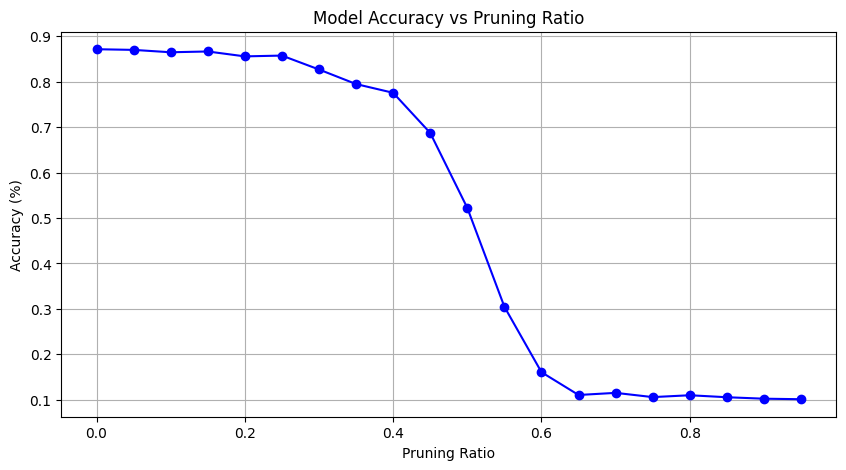

## Task Description

网络压缩，即在不损失性能的情况下使模型变小。本次作业要求训练一个非常小的模型来完成作业3（在food-11数据集上进行图像分类）。

## Dataset

图像来自food-11数据集，分为11类。

- 训练集：9866 labeled images；

- 验证集：3430 labeled images；

- 测试集：3347 images；

## 思路

### Simple Baseline (acc > 0.44820)

Score: 0.52191 Private score: 0.51344

运行助教代码。

### Medium Baseline (acc > 0.64840)

Score: 0.66832 Private score: 0.66111

实现knowledge distillation并训练更多epoch。
- KL divergence loss function


```python
# Implement the loss function with KL divergence loss for knowledge distillation.
# You also have to copy-paste this whole block to HW13 GradeScope.
def loss_fn_kd(student_logits, labels, teacher_logits, alpha=0.5, temperature=1.0):
    # ------------TODO-------------
    # Refer to the above formula and finish the loss function for knowkedge distillation using KL divergence loss and CE loss.
    # If you have no idea, please take a look at the provided useful link above.
    kl_loss = nn.KLDivLoss(reduction='batchmean', log_target= True)
    ce_loss = nn.CrossEntropyLoss()
    
    log_softmax = nn.LogSoftmax(dim=1)  # 定义LogSoftmax
    p = log_softmax(student_logits / temperature)
    q = log_softmax(teacher_logits / temperature)
    
    loss = alpha * (temperature ** 2) * kl_loss(p, q) + (1 - alpha) * ce_loss(student_logits, labels)
    return loss
```
- 训练50个epoch

```python
'n_epochs': 50
```

### Strong Baseline (acc > 0.82370)

Score: 0.84462 Private score: 0.81263

实现Depthwise&Pointwise Convolution（深度可分离卷积）、对齐Teacher模型中间层特征表示、训练更多epoch、Training阶段使用Data Augmentation、Inference阶段使用Test Time Augmentation。

- 参照[MobileNet](https://arxiv.org/abs/1704.04861)论文，实现使用depthwise and pointwise convolution的Student模型架构；

```python
# For Strong Baseline

def dwpw_conv(in_channels, out_channels, kernel_size, stride=1, padding=1,bias=False):
    return nn.Sequential(
        nn.Conv2d(in_channels, in_channels, kernel_size, stride=stride, padding=padding,bias=bias, groups=in_channels), #depthwise convolution
        nn.BatchNorm2d(in_channels),
        nn.ReLU(inplace=True),
        nn.Conv2d(in_channels, out_channels, 1,  bias= bias,), # pointwise convolution
        nn.BatchNorm2d(out_channels),
        nn.ReLU(inplace=True)
    )

class StudentNet(nn.Module):
    def __init__(self, inplanes = 64):
        super().__init__()
        self.inplanes = inplanes
        self.conv1 = nn.Conv2d(3, 64, kernel_size=7, stride=2, padding=3, bias=False)
        self.bn1 = nn.BatchNorm2d(self.inplanes)
        self.relu = nn.ReLU(inplace=True)
        self.maxpool = nn.MaxPool2d(kernel_size=3, stride=2, padding=1)

        self.layer1 = dwpw_conv(inplanes, inplanes, kernel_size=3)
        self.layer2 = dwpw_conv(inplanes, 128, kernel_size=3, stride=2)
        self.layer3 = dwpw_conv(128, 256, kernel_size=3, stride=2)
        self.layer4 = dwpw_conv(256, 141, kernel_size=3, stride=2)

        self.avgpool = nn.AdaptiveAvgPool2d((1, 1))
        self.fc = nn.Linear(141, 11)

    def forward(self, x):
        x=self.conv1(x)
        x=self.bn1(x)
        x=self.relu(x)
        x=self.maxpool(x)

        x=self.layer1(x)
        x=self.layer2(x)
        x=self.layer3(x)
        x=self.layer4(x)

        x=self.avgpool(x)
        x = torch.flatten(x, 1)
        x=self.fc(x)

        return x

def get_student_model(): # This function should have no arguments so that we can get your student network by directly calling it.
    # you can modify or do anything here, just remember to return an nn.Module as your student network.
    return StudentNet()
```

- 对齐Teacher模型中间层特征表示；

助教提供的Teacher模型为resnet18，我们可以查看该模型的详细信息。根据resnet18的模型结构，我们精心设计Student模型一些层的名称、类型和参数形状与Teacher模型一致。在训练过程中引入中间层的特征损失，约束Student网络的中间层特征与Teacher网络的对应层特征分布相似，实现知识迁移。相比仅对齐最终输出，中间层对齐能保留更多结构化知识。

**在实作中，如何获得模型中间层的输出呢？**

> 通过PyTorch的forward hook机制，捕获Teacher模型（ResNet18）和Student模型（自定义StudentNet）在推理过程中指定中间层的输出特征。

在实作中，我们对齐两个模型`layer1`、`layer2`、`layer3`的输出特征表示。

```python

Slayer1out, Slayer2out, Slayer3out, Tlayer1out, Tlayer2out, Tlayer3out = [], [], [], [], [], []

def hookS1(module, input, output):

 Slayer1out.append(output)

 return None

def hookS2(module, input, output):

 Slayer2out.append(output)

 return None

def hookS3(module, input, output):

 Slayer3out.append(output)

 return None

def hookT1(module, input, output):

 Tlayer1out.append(output)

 return None

def hookT2(module, input, output):

 Tlayer2out.append(output)

 return None

def hookT3(module, input, output):

 Tlayer3out.append(output)

 return None

student_model.layer1.register_forward_hook(hookS1)

student_model.layer2.register_forward_hook(hookS2)

student_model.layer3.register_forward_hook(hookS3)

teacher_model.layer1.register_forward_hook(hookT1)

teacher_model.layer2.register_forward_hook(hookT2)

teacher_model.layer3.register_forward_hook(hookT3)

```

损失函数在Medium Baseline基础上，增加`loss_hidden`，学习中间层输出的差异。

```python

loss_hidden = F.smooth_l1_loss(slayer1out, tlayer1out) + F.smooth_l1_loss(slayer2out, tlayer2out) + F.smooth_l1_loss(slayer3out, tlayer3out)

```

完整损失函数为：

```python

loss =  loss_hidden + 10 * lamb * loss_output

```

`lamb`为权重系数，随着训练的加深动态增长。

```python

p=epoch/(n_epochs-1)

lamb= p * p # 0-1

```

- 训练300个epoch，当训练50个epoch没有提升时，终止训练；

```python

'n_epochs': 300

'patience': 50

```

- Data Augmentation & Test Time Augmentation；

与HW3保持一致，详情参见HW3。

[ML2022-HW3-Image Classification](https://zhuanlan.zhihu.com/p/28149430319)

### Boss Baseline (acc > 0.85159)

Score: 0.86254 Private score: 0.84379

在Strong Baseline中，使用的Data Augmentation进行过度的增强反而可能损害性能。将`train_tfm`还原为默认设置，训练300个epoch，最后ensemble多份结果。

## Code

[双过Boss Baseline](https://github.com/Aaricis/Hung-yi-Lee-ML2022/tree/main/HW13)

## Report

**Report Questions - 1** 

**1-1. Please copy&paste your student model architecture code to the HW13 GradeScope (0.5pts).** 

参见Strong Baseline。

**1-2. Copy&Paste the torchsummary result of your student model to HW13 GradeScope. The total params should not exceed 100,000 (0.5pts).**

Total params: 99,060。

**Report Questions - 2** 

**2-1. Please copy and paste your KL divergence loss function (loss_fn_kd , choose alpha=0.5, temperature=1.0) to HW13 GradeScope (0.5pts).** 

参见Medium Baseline。

**2-2. Which is true about the hyperparameter T (temperature) of KL divergence loss function for knowledge distillation (0.5pts)? (a). Using a higher value for T produces a softer probability distribution over classes. (b). Using a higher value for T produces a harder probability distribution over classes**

正确答案是 (a)。使用更高的T值会产生一个更平滑的类别概率分布。

**Report Questions - 3-1** 

**Please reference to this pytorch network pruning tutorial and the provided sample code to adopt network pruning on your teacher network (you can also use the provided one). Plot the graph like below to indicate the relationship between pruning ratio and accuracy (use validation set). Please checkout HW13 GradeScope for more details about this question (1pts).** 



**Report Questions - 3-2** 

**Continue to the previous question, do you think that the implementation of network pruning in the tutorial can speed up inference time? (If you have no idea, we encourage you to implement some inference-time measurement experiments by yourself) (1pts). (a). Yes. After pruning, the neurons are removed so the amount of calculation is lower and the inference time is faster. (b). No. Such pruning technique in the tutorial is just to add some masks to the modules. The amount of calculation is nearly the same so the inference time is also similar.**

答案是（b）。非结构化剪枝生成的是随机稀疏权重，通用GPU/CPU的并行计算架构针对密集矩阵优化，无法直接跳过零值计算。因此本例中推理无法被加速。

在Colab上使用T4 GPU实际测试，施加不同的剪枝比例，推理时间分布在28~29s间，无明显区别。

## Reference

[MobileNet-Pytorch](https://github.com/jmjeon2/MobileNet-Pytorch)

[pytorch-mobilenet](https://github.com/Shubhamai/pytorch-mobilenet)

[MobileNet](https://arxiv.org/abs/1704.04861)

[以pytorch的forward hook为例探究hook机制-阿里云开发者社区](https://developer.aliyun.com/article/1619829#:~:text=Hook 机制是 PyTorch 中一种强大的工具，它允许用户在不修改模型原始代码结构的情况下，介入模型的前向传播（forward）和反向传播（backward）过程。,这种机制在模型可视化、特征提取、梯度分析等诸多任务中非常有用。 对于 forward hook，它主要用于在模型前向传播过程中插入自定义的操作，例如记录中间层的输出、对输出进行修改等。)
