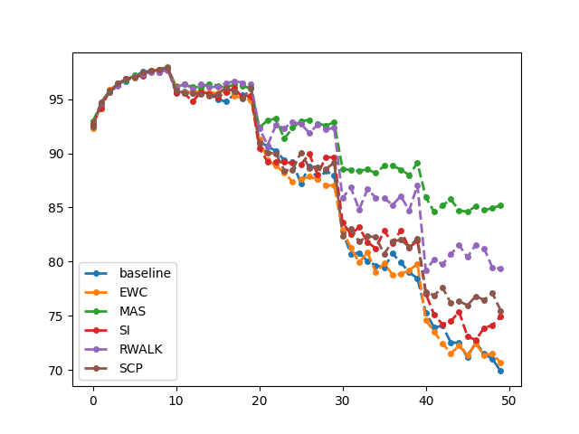

## Introduction

本次作业的主题是Lifelong Learning，即终身学习。理想情况下，模型依序在不同任务的数据上训练，从而学会解所有的任务。但现实情况中模型会发生**Catastrophic Forgetting（灾难性遗忘）**，即学会新任务的同时忘记学过的旧任务。

**为什么会发生灾难性遗忘？**

> 核心在于每个任务的error surface不同，从而参数优化的方向也不同。当模型在task1上进行训练时，将神经网络参数更新到task1的loss较小的点$\theta^b$。随后模型在task2上进行训练，将神经网络参数更新到task2的loss较小的点$\theta^*$。由于task1和task2的error surface不同，$\theta^*$在task1上不一定是较好的参数，导致模型在task1上的表现下降。

## Method

Lifelong Learning分为三个研究方向：Replay-based methods，Regularization-based methods, Parameter isolation methods。其中，**Regularization-based methods**是发展最完整的一类方法，本次作业也聚焦于该方法。

Regularization-based methods的核心思想是Selective Synaptic Plasticity（选择性突触可塑性），即模型中的一些参数对前面的任务很重要，只更改不重要的参数。

设之前任务的loss function为$L(\theta)$，要优化的loss function为$L^{\prime}(\theta)$，则：
$$
L^{\prime}(\theta)=L(\theta)+\lambda\sum_{i}b_i(\theta_{i}-\theta_{i}^b)^2
$$
其中，$\theta_i$ 是将要学习的参数，$\theta^{b}$是模型从之前的任务中学到的参数。每个$\theta_{i}^{b}$都有一个“守卫”$b_i$，代表有多强的意愿想要$\theta_i$与$\theta_i^b$接近。

如果$b_i=0$，$\theta_i$将不受任何约束，导致Catastrophic Forgetting（灾难性遗忘）；

如果$b_i=\infin$，$\theta_i$总是等于$\theta_i^{b}$，导致Intransigence（不妥协），无法学习新任务。

$b_i$是直接计算出来的，而不是学出来的。计算$b_i$的方法有很多，本次作业将会涉及以下方法：

- Elastic Weight Consolidation (EWC)
- Memory Aware Synapses (MAS)
- Synaptic Intelligence (SI)
- RWalk(Remanian Walk)
- Sliced Cramer Preservation (SCP)
- Others

## Assignment

Q1 Basic Concept - 1 

0.4 分數 

下列敘述哪一個最符合終身機器學習的學習目標: (選一個) Which descriptions meet the criteria and the goal of lifelong learning? (choose 1)

- [ ] 模型經過訓練後，當模型需要應用在一個新的任務上時，模型可以很快的適應在新的任務上，在終身機器學習裡，模型的學習目標是訓練出一 個好的初始化參數起點。 The model aimed to find new initialization parameters that could quickly adapt to new tasks.
- [x] 我們期望有一個模型，有序的連續訓練在不同新的任務上，它在過去的任務上，始終可以得到不錯的表現。所以訓練好之後，模型不會忘記舊的任務。 We expect a model that trained on different tasks continuously and could reach good performance and it could not forget the old task.
- [ ] 我們想要一個泛化能力很好的模型，透過將所有任務資料合成一個巨大 的資料集訓練模型，訓練完之後，可以在各個任務上都達到最好的表 現。 We need a model with good generalizability, and it could reach the best performance on all of the tasks by collecting all of the data from each tasks as a large training data.

Q2 Basic Concept - 2 

0.4 分數 

在 sample code 內的方法都是使用基於約束方法的終身學習作法，請問這些 sample code 作法的核心概念是什麼？ (選一個) We used regularization-based life-long learning methods in the sample codes. What is the core concept of these sample codes? (choose 1)

- [ ] 我們在訓練每一個任務時，會存下部份的訓練資料，並回放這一小部份的資料在新任務上，"回放" 最簡單的作法是將其加入新任務的訓練資料一起訓練，使模型不會發生災難性遺忘。 We stored part of the training data of tasks in the replay buffer. When we train a model on a new task, we will use the data from the replay buffer and add it into the current training task’s data to avoid catastrophically forgetting.
- [x] 我們希望模型的每一個參數會存在一個約束參數去約束模型的更新方向，這個參數可以幫助模型在訓練新任務時，盡量找出對於舊任務還有新任務共同有利的更新方向，使之訓練好的模型參數，不會在舊任務上發生災難性的遺忘。 We hope a set of constraint parameters correlated to the model parameters to constrain the model. These parameters tried to find a common update direction between the current training task and past tasks. So the model would not catastrophically forget previous tasks.
- [ ] 模型會透過遮住模型內的參數去達成不同的任務，因此每一個任務都會有一個參數遮罩使得模型透過參數遮罩之後，變成不同的子模型，可以很好的表現在不同的任務上，達到不忘記舊的任務。 The model will achieve different tasks by masking the parameters in the model, so each task will have a parameter mask so that the model will become a different submodel after passing through the parameter mask, which can be well represented on different tasks. Reach the task of not forgetting the old.
- [ ] 模型每訓練一個新任務，都會有一個不同分支的任務模型去負責新任 務，使整個模型做到在舊的任務上保持原本的表現。 Each time when the model is trained on a new task, there will be a different branch to handle the new task so that the entire model can maintain the original performance on the previous tasks.

Q3 Basic Concept - 3 

0.4 分數 

下列哪些是正確的敘述? (選一個) Which of the following are the correct statements? (choose 1)

- [ ] 『終身機器學習即是讓模型連續學習一系列的任務，並將難度分級，從簡單的任務學到困難的任務，希望訓練後，可以增強模型的表現，決定任務的順序是這一學派的關鍵要素。』 “Life long learning allows the model to continuously learn a series of tasks and grade the difficulty, from simple tasks to difficult tasks. We hopes that after training, the performance of the model can be enhanced, and the order of tasks is determined to be this Key of Life long learning."
- [ ] 『線上學習 (Online Learning) 是在學習時，先讓模型學習簡單的任務， 在一定的更新次數後，加深任務的難度，讓模型在訓練時，從簡單的任務學習到困難的任務，藉此使模型表現變好也可以在所有任務上表現不 錯，定義何謂簡單的任務，何謂困難的任務是這個學習的發展方向。』 “Online learning let the model learn simple tasks first. After a certain number of updates, we enhance the difficulty of the task. We let the model learn from simple tasks to difficult tasks, so the improvements of the model can also appear on all tasks. Defining what is simple and difficult is the direction of development of lifelong learning.”
- [ ] 『終身機器學習是希望一個模型可以處理不同的任務，為了做到這件事 情，會希望模型經過訓練後，學習到一個好的參數起始點，之後，透過極少訓練資料以及更新次數，適應在新的任務上。』 “Life long learning hopes that a model can handle different tasks. To do this, we hoped that the model would learn a good starting point for parameters after training. After that, it will adapt to the new task through very little training data and update times.”
- [x] 『多任務學習是希望一個模型可以處理很多不同的任務，所以在訓練時，會將所有任務的訓練資料倒在一起，變成一個巨量的訓練資料，一次使用多個任務的訓練資料以及對應的目標函數一起更新模型的參 數。』 “Multi-task learning hopes that a model can handle many different tasks. Therefore, during training, the training data of all tasks will be poured together to become a huge amount of training data. Using the training data of multiple tasks and the corresponding objective functions to update the parameters of the model at a time.”

Q4 EWC - 1 

0.4 分數 

Elastic Weight Consolidation 這個方法，訓練好了第一個任務之後，在訓練新的任務時，”守衛”這個參數會如何從第一個任務的資料得到？(定義第一個任務的資料為$V$ ，內只有一筆資料記作$x$ ，以及對應的標籤$y$， $L$為損失函數(交叉熵取負號)，$\theta$為訓練好第一個任務的模型參數， $\theta(x)$定義為通過模型後的標 籤機率分佈) (選一個) In Elastic Weight Consolidation, after being trained on the first task, how do we get “guard” from the data of the first task? (We defined the data of the first task as $V$, only one data $x$ and its ground truth $y$ in $V$. $L$is the loss function. $\theta$ is denoted as the model’s parameters trained on the first task. $\theta(x)$is the model’s output.) (choose 1)

- [ ] $$
  (\frac {\partial L(\theta(x), min(\theta(x)))} {\partial \theta})
  $$

- [ ] $$
  (\frac {\partial L(\theta(x), y} {\partial \theta})
  $$

- [x] $$
  (\frac {\partial L(\theta(x), y} {\partial \theta})^2
  $$

- [ ] $$
  (\frac {\partial L(\theta(x), y} {\partial x})^2
  $$

Q5 EWC - 2 

0.4 分數 

在求得 EWC 約束項的時候，需要使用到 label 的資訊。 (選一個) When obtaining the EWC regularization term, we need the label information. (choose 1)

- [x] 正確 True
- [ ] 錯誤 False

Q6 MAS - 1 

0.4 分數 

Memory Aware Synapse 這個方法，下列有關”守衛”這個參數矩陣的敘述，哪些 是正確的？ (選三個) In Memory Aware Synapse, which of the following statements about the parameter matrix "Guard" are correct? (choose 3)

- [x] 可以從一次微分項經過處理得到 It can be obtained from the first differential term after processing. 
- [ ] 是使用交叉熵處理得到 It is obtained by the cross entropy. 
- [x] 這個守衛的作用是用來處理模型訓練後不會發生災難性遺忘而設立的 The role of this guard is set up to avoid catastrophic forgetting after model training. 
- [ ] 是使用L1距離處理得到 It is obtained by the L1 norm. 
- [x] 是使用L2距離處理得到 It is obtained by the L2 norm.

Q7 MAS - 2 

0.4 分數 

在求得 MAS 約束項的時候，不需要使用到 label 的資訊。 (選一個) When obtaining the MAS regularization term, we don’t need the label information. (choose 1)

- [ ] 錯誤 False 

- [x] 正確 True

Q8 SI - 1 

0.4 分數 

SI 和 EWC 方法上最大的不同在於? (選一個) What is the biggest difference between SI and EWC? (choose 1) 

- [ ] SI 對應的約束項需要使用到 label 資訊。 SI need the label information.
- [ ] SI 的超參數 λ 會和 EWC 非常不同。 SI’s λ is very different to EWC’s λ.
- [x] SI 是透過 loss 在該任務的變動量與參數在該任務更新前後參數的變動 量處理得到守衛數值。 SI obtains the guard value by processing the change of loss in the task and the change of the parameters before and after the task training.
- [ ] SI 對應的約束項不需要使用到 label 資訊。 Si doesn’t need label information.

Q9 SI - 2 

0.4 分數 

在求得 SI 約束項的時候，不需要使用到 label 的資訊。 (選一個) When obtaining the SI regularization term, we don’t need label information. (choose 1)

- [x] 正確 True 
- [ ] 錯誤 False

Q10 RWalk - 1 

0.4 分數 

Rwalk 可以說是由哪兩種作法組合出來的? (選兩個) Which two methods will be utilized in Rwalk? (choose 2)

- [ ] MAS 
- [x] SI 
- [x] EWC 
- [ ] SCP

Q11 RWalk - 2 

0.4 分數 

在求得 RWalk 約束項的過程中，需要使用到 label 的資訊。 (選一個) When obtaining the Rwalk regularization term, we need the label information. (choose 1)

- [ ] 錯誤 False 
- [x] 正確 True

Q12 SCP - 1 

0.4 分數 

SCP 提出來的作法，主要是因為過去的方法出現了什麼問題? (選一個) The method proposed by the SCP is dealing with what problems in the past method? (choose 1)

- [ ] 過去如 EWC, MAS 需要調過多的超參數，而且表現容易受到超參數的 影響，讓研究者很難評估方法的好壞。 In the past, such as EWC and MAS, it was necessary to adjust too many hyper-parameters. The performance was easily affected by the hyper-parameters, which made it difficult for researchers to evaluate the quality of the method.
- [ ] 過去如 EWC, MAS 的作法，不能靈活的使用在不同損失函數的任務 上。 In the past, methods such as EWC and MAS could not be used flexibly on tasks with different loss functions.
- [x] 過去如 EWC, MAS 產生的守衛會太過保守於舊任務的表現，反而限制 太多，導致在新任務的表現降低。 In the past, guards generated by EWC and MAS would be too conservative in the performance of the old task. It could lead to too many restrictions, resulting in lower performance in the new task.
- [ ] 過去如EWC, MAS的作法，它們所測試的資料集過於簡單，和現實任務 差異太大。 In the past, such as the practice of EWC and MAS, the data sets they tested were too simple and very different from the actual tasks.

Q13 SCP - 2 

0.4 分數 

為了解決上方提到的問題，SCP 這個作法主要從哪一個方面改善? (選一個) In order to solve the problems mentioned above, which aspect of SCP's method is mainly improved? (Choose 1)

- [ ] 衡量模型表現的評估方法。 Evaluation methods to measure model performance. 
- [ ] 加大模型大小。 Enlarge the model size.
- [x] 得到約束項過程中，衡量距離的算法。 The algorithm of measuring the distance in the process of obtaining the guardian matrix.
- [ ] 加入穩定模型表現的訓練技巧。 The technique to stabilize the model’s performance.

Q14 SCP - 3 

0.4 分數 

在求得 SCP 約束項的時候，需要使用到 label 的資訊。 (選一個) When obtaining the SCP regularization term, the label information is needed. (choose 1)

- [ ] 正確 True 
- [x] 錯誤 False

Q15 Other Methods & scenarios - 1 

0.4 分數 

iCaRL (https://arxiv.org/abs/1611.07725) 作法大致為下列何者? (選一個) Which of the following is the method of iCaRL (https://arxiv.org/abs/1611.07725)? (choose 1)

- [ ] 藉由知識蒸餾 (knowledge distillation) (https://arxiv.org/abs/1503.02531) 的 作法去限制部份模型參數在訓練新任務時，使用舊任務的任務頭，得到 的輸出結果要接近。 The knowledge distillation (https://arxiv.org/abs/1503.02531) method is used to restrict some model parameters. When training a new task, the model would use the task head of the old task to get a closed output's result.
- [ ] 使用守衛參數，在訓練時，約束模型的更新方向，不去忘記舊的任務。 Use guard parameters to constrain the update direction of the model during training, and not forget the old tasks.
- [x] 藉由存下過去任務的部份資料，以少數的資料代表其舊任務，在預測階 段，以資料通過模型的輸出向量靠近哪一個舊類別的聚類，即判斷為哪 一個類別，達到不忘記舊的任務。 By saving part of the data of the past task, a small number of data is used to represent the old task. In the prediction process, the output vector of the data through the model is close to which cluster of the old category, that is, to determine which category it belongs to, so as not to forget old tasks.
- [ ] 藉由存下過去任務的部份資料並以此部份資料去約束模型的更新方向， 不去忘記舊的任務。 By saving part of the data of the past tasks and using it to constrain the update direction of the model, let it not forget the old tasks.

Q16 Other Methods & scenarios - 2 

0.4 分數 

iCaRL (https://arxiv.org/abs/1611.07725)這套方法的場景為何者？ (選一個) What is the scenario of iCaRL (https://arxiv.org/abs/1611.07725) ? (choose 1)

- [ ] 在家裡，機器分得出貓和狗(舊的任務)，去了一趟動物園(換新的任 務)，機器分得出長頸鹿和大象，最後，應該還是要分得出貓\狗。 Machine can distinguish dogs and cats(old task) at home. Then we let the machine visit the zoo(new task). It can also distinguish giraffes and elephants. Finally, it could still distinguish dogs/cats in the photo.
- [ ] 在家裡，機器分得出貓與狗(舊的任務)，去了一趟動物園(換新的任 務)， 機器分得出長頸鹿和大象，不給予機器環境的資訊，機器應該還 是得分出該張照片是貓\狗或是該張照片是長頸鹿\大象。 Machine can distinguish dogs and cats(old task) at home. Then we let the machine visit the zoo(new task). It can also distinguish giraffes and elephants. Finally, if we don’t give the machine any environmental information, it could still distinguish dogs/cats or giraffes/elephants in the photo.
- [ ] 在家裡，機器分得出貓與狗(舊的任務)，去了一趟動物園(換新的任 務)， 機器分得出長頸鹿和大象，給予機器家裡的資訊，機器應該還是 得學得會分出貓\狗。 Machine can distinguish dogs and cats(old task) at home. Then we let the machine visit the zoo(new task). It can also distinguish giraffes and elephants. Finally, if we don’t give the machine any environmental information, it could still distinguish cat/dog.
- [x] 在家裡，機器分得出貓和狗(舊的任務)，去了一趟動物園(換新的任 務)，機器分得出長頸鹿和大象，最後，機器應該也要分得出貓\大象\長 頸鹿\狗。 The machine can distinguish dogs and cats(old task) at home. Then we let the machine visit the zoo(new task). It can also distinguish giraffes and elephants. Finally, if we don’t give the machine any environmental information, it could still distinguish dog/cat/giraffe/elephant.

Q17 Other Methods & scenarios - 3 

0.4 分數 

LWF (https://arxiv.org/abs/1606.09282) 作法為下列何者? (選一個) Which of the following is the method of LWF (https://arxiv.org/abs/1606.09282) ? (choose 1)

- [x] 藉由知識蒸餾 (knowledge distillation) (https://arxiv.org/abs/1503.02531) 的 作法去限制部份模型參數在訓練新任務時，使用舊任務的任務頭，得到 的輸出結果要接近。 The knowledge distillation (https://arxiv.org/abs/1503.02531) method is used to restrict some model parameters. When training a new task, the model would use the task head of the old task to get a closed output's result.
- [ ] 藉由存下過去任務的部份資料，以少數的資料代表其舊任務，在預測階 段，以資料通過模型的輸出向量靠近哪一個舊類別的聚類，即判斷為哪 一個類別，達到不忘記舊的任務。 By saving part of the data of the past task, a small number of data is used to represent the old task. In the prediction process, the output vector of the data through the model is close to which cluster of the old category, that is, to determine which category it belongs to, so as not to forget old tasks.
- [ ] 使用守衛參數，在訓練時，約束模型的更新方向，不去忘記舊的任務。 Use guard parameters to constrain the update direction of the model during training, and not forget the old tasks.
- [ ] 藉由存下過去任務的部份資料並以此部份資料去約束模型的更新方向， 不去忘記舊的任務。 By saving part of the data of the past tasks and using it to constrain the update direction of the model, let it not forget the old tasks.

Q18 Other Methods & scenarios - 4 

0.4 分數 

GEM (https://arxiv.org/abs/1706.08840) 作法為下列何者? (選一個) Which of the following is the method of GEM (https://arxiv.org/abs/1706.08840)? (choose 1)

- [ ] 藉由存下過去任務的部份資料，以少數的資料代表其舊任務，在預測階 段，以資料通過模型的輸出向量靠近哪一個舊類別的聚類，即判斷為哪 一個類別，達到不忘記舊的任務。 By saving part of the data of the past task, a small number of data is used to represent the old task. In the prediction process, the output vector of the data through the model is close to which cluster of the old category, that is, to determine which category it belongs to, so as not to forget old tasks.
- [ ] 使用守衛參數，在訓練時，約束模型的更新方向，不去忘記舊的任務。 Use guard parameters to constrain the update direction of the model during training, and not forget the old tasks.
- [x] 藉由存下過去任務的部份資料並以此部份資料去約束模型的更新方向，不去忘記舊的任務。 By saving part of the data of the past tasks and using it to constrain the update direction of the model, let it not forget the old tasks.
- [ ] 藉由知識蒸餾 (knowledge distillation) (https://arxiv.org/abs/1503.02531) 的 作法去限制部份模型參數在訓練新任務時，使用舊任務的任務頭，得到 的輸出結果要接近。 The knowledge distillation (https://arxiv.org/abs/1503.02531) method is used to restrict some model parameters. When training a new task, the model would use the task head of the old task to get a closed output's result.

Q19 Other Methods & scenarios - 5 

0.4 分數 

請問 DGR (Deep Generative Replay) (https://arxiv.org/pdf/1705.08690.pdf) 這套方 法的作法為何? (選一個) What is the implementation of DGR (https://arxiv.org/pdf/1705.08690.pdf)? (choose 1)

- [ ] 模型每訓練一個新任務，都會有一個不同分支的任務模型去負責新任 務，使整個模型做到在舊的任務上保持原本的表現。 Each time when the model is trained on a new task, there will be a different branch to handle the new task so that the entire model can maintain the original performance on the previous tasks.
- [x] 利用生成模型產生假的舊任務資料，並將這些資料合進當前任務的訓練 資料一起訓練，同時當前任務的生成模型持續學習如何產生混合完的資 料分佈，藉由上述的訓練流程，使模型不忘記舊任務。 Use the generative model to generate fake old task data, and combine these data into the training data of the current task to train together. At the same time, the generative model of the current task continues to learn how to generate a mixed data distribution. Through the above training process, the model will not forget about old tasks.
- [ ] 模型會透過遮住模型內的參數去達成不同的任務，因此每一個任務都會 有一個參數遮罩使得模型透過參數遮罩之後，變成不同的子模型，可以 很好的表現在不同的任務上，達到不忘記舊的任務。 The model will achieve different tasks by masking the parameters in the model, so each task will have a parameter mask so that the model will become a different submodel after passing through the parameter mask, which can be well represented on different tasks. Reach the task of not forgetting the old.

Q20 Other Methods & scenarios - 6 

0.4 分數 

根據 (https://arxiv.org/pdf/1904.07734.pdf) 所述，在終身機器學習中，有三種應 用時考量的場景，下列敘述對應到的場景何者正確? (選兩個) According to (https://arxiv.org/pdf/1904.07734.pdf), there are three applications for lifelong learning. Which of the following descriptions corresponds to the correct scenario? (choose 2)

- [ ] 在家裡，機器分得出貓和狗(舊的任務)，去了一趟動物園(換新的任 務)，機器分得出長頸鹿和大象，最後，不給予機器環境的資訊，應該 還是要分得出貓\狗 - Class IL。 Machine can distinguish dogs and cats(old task) at home. Then we let the machine visit the zoo(new task). It can also distinguish giraffes and elephants. Finally, if we don’t give the machine any environment information, it could still distinguish cat/dog. - Class IL
- [x] 在家裡，機器分得出貓和狗(舊的任務)，去了一趟動物園(換新的任 務)，機器分得出長頸鹿和大象，最後，不給予機器環境的資訊，應該 也要分得出貓\大象\長頸鹿\狗 - Class IL。 Machine can distinguish dogs and cats(old task) at home. Then we let the machine visit the zoo(new task). It can also distinguish giraffes and elephants. Finally, if we don’t give the machine any environment information, it could still distinguish dog/cat/giraffe/elephant. - Class IL
- [ ] 在家裡，機器分得出貓與狗(舊的任務)，去了一趟動物園(換新的任 務)， 機器分得出長頸鹿和大象，最後，不給予機器環境的資訊，機器 應該還是得分出該張照片是貓\狗或是該張照片是長頸鹿\大象 - Task IL。 Machine can distinguish dogs and cats(old task) at home. Tthen we let the machine visit the zoo(new task). It can also distinguish giraffes and elephants. Finally, if we don’t give the machine any environment information, it could still distinguish dogs/cats/giraffes/elephants. - Task IL
- [ ] 在家裡，機器分得出貓和狗(舊的任務)，去了一趟動物園(換新的任 務)，機器分得出長頸鹿和大象，最後，不給予機器環境的資訊，應該 也要分得出貓\大象\狗\長頸鹿 - Task IL。 The machine can distinguish dogs and cats(old task) at home. Then we let the machine visit the zoo(new task). It can also distinguish giraffes and elephants. Finally, if we don’t give the machine any environmental information, it could still distinguish dog/cat/giraffe/elephant. - Task IL
- [x] 在家裡，機器分得出貓與狗(舊的任務)，去了一趟動物園(換新的任 務)， 機器分得出長頸鹿和大象，最後，不給予機器環境的資訊，機器 應該還是得分出該張照片是貓\狗或該張照片是長頸鹿\大象 - Domain IL。 Machine can distinguish dogs and cats(old task) at home, then we let the machine visit the zoo(new task). It can also distinguish giraffes and elephants. Finally, if we don’t give the machine any environment information, it could still distinguish dog/cat or giraffe/elephant in the photo. - Domain I
- [ ] 在家裡，機器分得出貓與狗(舊的任務)，去了一趟動物園(換新的任 務)， 機器分得出長頸鹿\大象，最後，給予機器家裡的資訊，機器應該 還是得分出貓\狗 - Domain IL。 Machine can distinguish dogs and cats(old task) at home. Then we let the machine visit the zoo(new task). It can also distinguish giraffes and elephants. Finally, if we give the machine home environment information, it could still distinguish cat/dog. - Domain IL

## Report 

- Plot the learning curve of the metric with every method. (The Plotting function is provided in the sample code.) (0.5pt) 



- Describe the metric. (0.5pt) 

  如上图所示，横轴表示依次训练5个task，每个task训练10个epoch，总共50个epoch。纵轴表示每个epoch模型在5个测试集上的平均准确率。曲线下降越慢，表示算法克服灾难性遗忘的能力越强，算法性能越好。

- Paste the code that you implement Omega Matrix for MAS. (1pt)

  ```python
  loss = output.norm(2, dim=1).pow(2).mean()
  loss.backward()
  
  for n, p in self.model.named_parameters():
      # get the gradient of each parameter and square it, then average it in all validation set.
      precision_matrices[n].data += p.grad.data ** 2 / num_data
  ```

  
