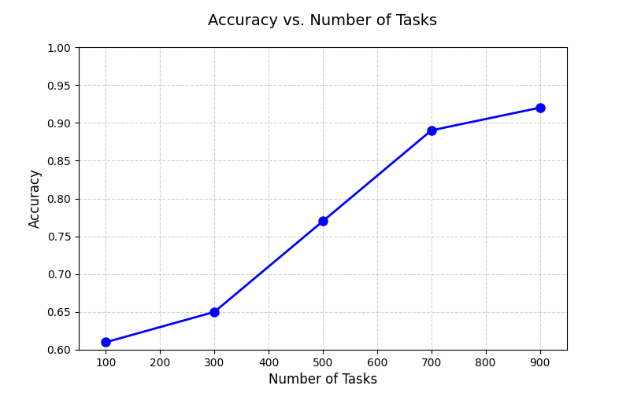
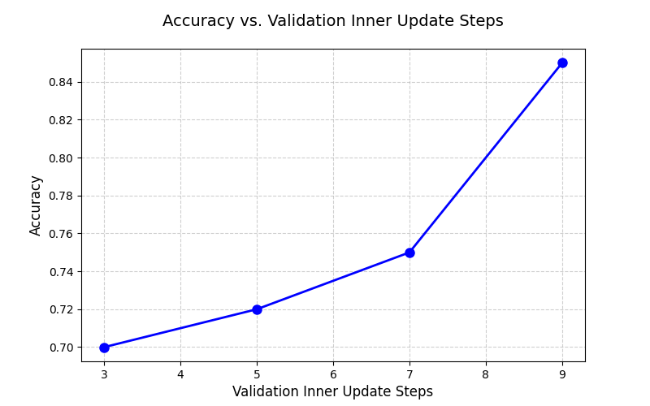

## Task Description

本次作业的主题是元学习（Meta-Learning），通过大量类似的小任务训练模型，使其获得快速适应新任务的能力。少样本分类（Few-shot Classification）是最典型的应用场景之一，通常的任务格式为**N-way K-shot**。从N个新类别中，每类提供K个训练样本（支撑集，Support Set），模型需分类测试数据（查询集，Query Set）中的样本。作业中实作 5-way 1-shot classification，Support Set包含5类手写字母，每类提供1个训练样本。Query Set包含Support Set中5种类型的字母各1个，要求模型分类它们属于5种类型中的哪一个。

## Dataset

作业使用Omniglot Dataset，是一个专为 **小样本学习（Few-shot Learning）** 和 **元学习（Meta-Learning）** 设计的经典数据集。其名称“Omniglot”源自拉丁语“omni”（全部）和“glot”（语言），强调其包含全球多样化的书写系统。

### 核心特性

- **字符多样性**：
  - 包含 **50种不同的书写系统**（如拉丁字母、梵文、韩文字母、人造文字等）。
  - 总计 **1,623个独特的手写字符类别**，每个类别由 **20个样本** 组成（不同人书写）。
- **数据格式**：
  - 所有图像为 **105×105像素** 的二值化（黑白）图片，背景为白，字符为黑。
  - 每个字符的20个样本展示了不同人的书写风格差异。
- **任务导向性**：
  - 专为 **N-way K-shot** 学习任务设计（例如5-way 1-shot：模型需从5个新类别中，每类学习1个样本后分类新样本）。

### 数据集结构

Omniglot 分为两部分，用于模拟“已知”和“未知”类别的学习场景：

- **Background Set**（背景集）：

  - 包含 **30种书写系统**，共 **964个字符类别**。

  - 用于模型预训练或元训练的“基类”。

- **Evaluation Set**（评估集）：

  - 包含 **20种书写系统**，共 **659个字符类别**。

  - 用于测试模型在全新书写系统上的泛化能力。

每个字符类的20个样本进一步划分为：

- **训练集**：前10个样本（用于支撑集，Support Set）。
- **测试集**：后10个样本（用于查询集，Query Set）。

### Data Format

**Training / validation set:** 

30 alphabets 

- multiple characters in one alphabet 
- 20 images for one character

**Testing set:** 

640 support and query pairs 

- 5 support images 
- 5 query images

实作中随机选择 N个类别，为每个类别抽取 K + Q 个样本。然后划分支撑集和查询集，前 K个样本作为支撑集，剩余 Q个作为查询集。其中，N=5、K=1、Q=1。

## 思路

### Simple Baseline(acc > 0.61562)

Score: 0.61687 Private score: 0.62937

运行助教代码。

### Medium Baseline(acc > 0.69250)

Score: 0.82750 Private score: 0.82062

根据助教提示，使用FO-MAML，并训练120个epoch。

FO-MAML 是 MAML 的简化版本，忽略二阶梯度，仅使用一阶近似（First-Order Approximation）。虽然理论收敛性不如MAML，但计算效率显著提升。

**FO-MAML核心逻辑包含：**
- Inner Loop 使用 support set 微调模型参数（first-order，即不保留二阶导数）。

- Outer Loop 使用 query set 的损失对原始模型参数做更新。


```python
""" Inner Loop Update """
grads = torch.autograd.grad(loss, fast_weights.values(), create_graph=False)
fast_weights = OrderedDict(
    (name, param - inner_lr * grad)
    for (name, param), grad in zip(fast_weights.items(), grads)
)
""" Outer Loop Update """
meta_batch_loss.backward()
optimizer.step()
```

**训练120个epoch:**

```python
max_epoch = 120
```

### Strong Baseline(acc > 0.86125)

Score: 0.90000 Private score: 0.90875

根据助教提示，使用MAML，并训练50个epoch。

在Medium Baseline基础上，设置`create_graph=True`即可实现MAML：

```python
grads = torch.autograd.grad(loss, fast_weights.values(), create_graph=True)
```
训练50个epoch：

```python
max_epoch = 50
```

因为`create_graph=True`时，PyTorch会保留计算图，可以对梯度再次求导（计算高阶导数），而MAML需在外循环对参数求二次导，从而具备"Learning to Learn"的能力。

### Boss Baseline(acc > 0.93562)
Score: 0.94125 Private score: 0.94562

MAML + Task Augmentation,具体是通过随机旋转输入图像来增加任务多样性，从而提高元学习模型的泛化能力。

```python
# 定义 Task Augmentation，以 60% 的概率执行旋转
task_augmentation = transforms.Compose([
    transforms.RandomApply(
        [transforms.RandomRotation(90)],  # 旋转操作
        p=0.6  # 执行概率（60%）
    )
])
```

```python
# transforms
meta_batch = task_augmentation(meta_batch)
```

## Code

[双过Boss Baseline](https://github.com/Aaricis/Hung-yi-Lee-ML2022/tree/main/HW15)

## Report

**Part 1: Number of Tasks** 

- According to your best meta-learning result, plot the relation between dev accuracy and the number of tasks. Include at least three different experiment in the figure. (1pt) 

  

- A one sentence description of what you observe from the above figure. (1pt) 

  task越多，模型在验证集上效果越好。

**Part 2: Inner Update Steps** 

- According to your best meta-learning result, plot the relation between dev accuracy and the inner update step at inference (noted that you should not change the inner update step at training, it should be the same with your best meta-learning result throughout the experiment). Include at least three different experiment in the figure. (1pt) 

  

- A one sentence description of what you observe from the above figure. (1pt) 

  Inner update steps越多，模型在验证集上效果越好。

## Reference

[李宏毅2022机器学习HW15解析 - 知乎](https://zhuanlan.zhihu.com/p/559938070)

[Meta Learning 元学习（李宏毅）机器学习 2023 Spring HW15 - 知乎](https://zhuanlan.zhihu.com/p/16991647530)