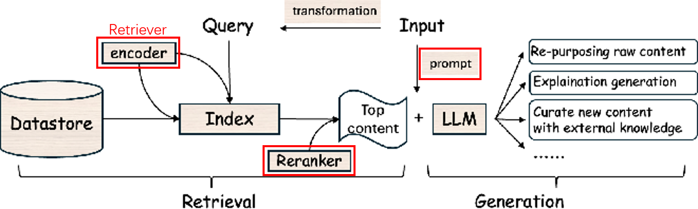
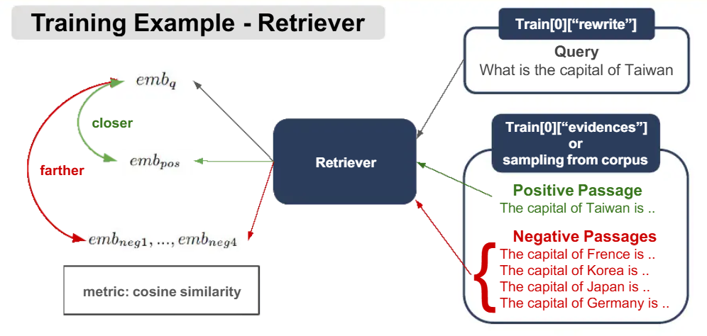
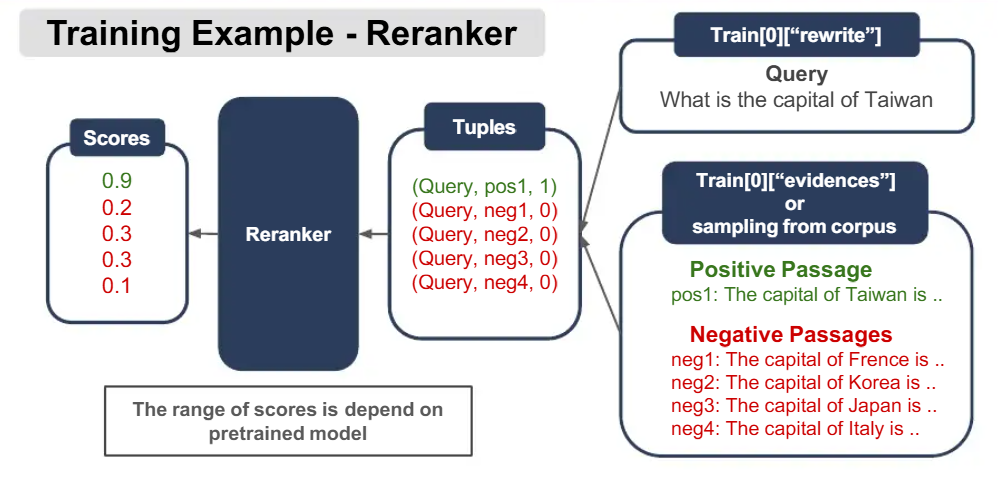
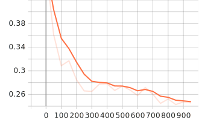

## Task

Your tasks:

- Fine-tune retriever & reranker;
- Design prompt to optimize the generation;
- RAG with RL.




### Bi-Encoder & Cross-Encoder


### Model

Model checkpoint:

- Retriever: [intfloat/multilingual-e5-small](https://huggingface.co/intfloat/multilingual-e5-small)
- Reranker: [cross-encoder/ms-marco-MiniLM-L12-v2](https://huggingface.co/cross-encoder/ms-marco-MiniLM-L12-v2)
- LLM: [Qwen/Qwen3-1.7B](https://huggingface.co/Qwen/Qwen3-1.7B) (bf16)

### Dataset

- Corpus: passages to be retrieved

  ```json
  {
      "text": "...",
      "title": "...",
      "aid": "25749059",
      "bid": 5,
      "id": "25749059@5"
  }
  ```

- qrels: mappings of queries and their positive passages

  ```json
  {
      "qid1":{
          "passageId": 1
      },
      ......
  }
  ```

- Each query has a specific positive passage

- train / test_open: train and public test data

  ```json
  {
      "qid": "...",
      "rewrite": "...",
      "evidences": [...],
       "answer": {
           "text": "",
           "answer_start": 0
       },
      "retrieval_labels": [0, 0, 0, 0, 1]
  }
  ```

   - 	rewrite: query content;
   - 	evidences: passages from BM25 negative sampling;
   - 	retrieval_labels: corresponding true/false label for passages in "evidences";
  
- The answer can be <u>an exact span of positive passage</u> or <u>CANNOTANSWER</u> in both train and test data;

- There can be no positive passage in "evidences" column in `test_open.txt`, however, you can find the positive passage id in `qrels.txt`.

## Guides

###  Fine Tune Retriever



### Fine Tune Reranker



### Inference

- Pipeline: Load data -> Retriever -> Rerank -> Generate -> Evaluate
- Evaluation metric:
  - Recall@k (k=10)
  - MRR@k (k=10)
  - Sentence similarity from bi-encoder: [sentence-transformers/all-MiniLM-L6-v2](https://huggingface.co/sentence-transformers/all-MiniLM-L6-v2)

## Results

| 模型      | Recall@10 | MRR@10 (after rerank) | Bi-Encoder CosSim |
| --------- | --------- | --------------------- | ----------------- |
| base      | 0.8172    | 0.7240                | 0.3656            |
| fine tune | 0.8549    | 0.7737                | 0.3725            |

## Report

### Q1: Retriever & Reranker Tuning (5%) 

Retriever Training Process (2.5%) and Reranker Training Process (2.5%). Both should include, but are not limited to, the following:

- Clearly describe how the training data is constructed (e.g., anchor, positive sampling, and negative sampling strategies).
- Specify and explain the loss function used for training.
- List the hyper parameters adopted in your experiments
- Provide a training loss curve with at least 5 data points to illustrate the training process. (You can use any package to plot)

#### Retriever: Bi-Encoder Training

##### Data Construction

1. 数据来源

   - 训练数据：`./data/train.txt`
   - 测试数据：`./data/test_open.txt`、`./data/qrels.txt`、`./data/corpus.txt`

2. 采样策略

   - 训练数据：

     - 锚点（Anchor）：采集`rewrite`字段作为查询文本`query`；
     - 正样本（Positive）：从`evidences`列表中选取`retrieval_labels == 1`的段落；
     - 负样本（Negative）：同一个batch中的其他正样本（in-batch negatives）、从`evidences`列表中选取`retrieval_labels == 0`的段落（hard negatives）。

     ```mathematica
     (anchor, positive, negative_1, …, negative_n)
     ```
     
   - 测试数据：

     - **queries**  – A dictionary mapping query IDs to queries.
     - **corpus**  – A dictionary mapping document IDs to documents.
     - **relevant_docs**  – A dictionary mapping query IDs to a set of relevant document IDs.
     
     ```python
     # 1. 查询
     queries = {
         "q1": "What is Python?",
         "q2": "How to install pandas?",
     }
     
     # 2. 文档库（语料）
     corpus = {
         "d1": "Python is a programming language.",
         "d2": "Java is another language.",
         "d3": "Use pip install pandas to install.",
         "d4": "Pandas is a data analysis library.",
     }
     
     # 3. 相关文档（ground truth）
     relevant_docs = {
         "q1": {"d1"},           # q1 只与 d1 相关
         "q2": {"d3", "d4"},     # q2 与 d3、d4 都相关
     }
     ```

##### Loss Function

[MultipleNegativesRankingLoss]([Losses — Sentence Transformers documentation](https://www.sbert.net/docs/package_reference/sentence_transformer/losses.html#multiplenegativesrankingloss))（MNRL）是一种对比损失函数，常用于训练嵌入模型，尤其是在语义相似性、释义检测和信息检索等任务中。其旨在最大化正样本对（查询和相关段落）之间的相似度，同时最小化锚点与批次中所有不相关示例（负样本）之间的相似度。

MNRL使用批次内的负样本（**in-batch negatives**），即批次中所有不匹配的样本对都被视为负样本。例如，在一批 (anchor, positive)对中，其他anchor的正样本充当当前anchor的负样本。这种方法计算效率很高，因为它避免了显式的负样本挖掘，同时每个批次都能提供大量的负样本。

损失函数表示为：

```mathematica
L = -log( exp(sim(anchor, positive)) / Σ(exp(sim(anchor, negative_i))) )
```

$sim()$函数代表相似性度量（例如余弦相似度），分母包含了批次中所有负例。

##### Hyper-parameters

| 超参数               | 值                             | 说明              |
| -------------------- | ------------------------------ | ----------------- |
| model_name_or_path   | intfloat/multilingual-e5-small | base model        |
| epochs               | 3                              | 训练轮次          |
| batch_size           | 32                             | 批次大小          |
| grad_accumulate_step | 4                              | 梯度累积步长      |
| learning_rate        | 2e-5                           | 学习率            |
| eval_batch_size      | 128                            | 评估时批次大小    |
| eval_steps           | 200                            | 每隔200步评估一次 |

完整超参数：

```python
training_args = SentenceTransformerTrainingArguments(
        output_dir=output_dir,

        num_train_epochs=args.epochs,
        per_device_train_batch_size=args.batch_size,
        gradient_accumulation_steps=args.grad_accumulate_step,

        eval_strategy="steps",
        eval_steps=args.eval_steps,

        save_strategy="steps",
        save_steps=args.eval_steps,
        save_total_limit=2,

        logging_steps=50,
        report_to=["tensorboard"],

        fp16=True,
        warmup_ratio=0.1,
        learning_rate=args.learning_rate,

        load_best_model_at_end=True,
        metric_for_best_model="eval_test_eval_cosine_mrr@10",  # ✅ 修正
        greater_is_better=True,

        remove_unused_columns=False,
    )
```

##### Loss Curve


训练700个step，loss下降到0.2007。

#### Reranker: Cross-Encoder Optimization

##### Data Construction

1. 数据来源

   - 训练数据：`./data/train.txt`, ` ./data/qrels.txt` ,  `./vector_database`, `passage_index.faiss`, `passage_store.db`
   - 测试数据：`./data/test_open.txt`、`./data/qrels.txt`、`./data/corpus.txt`

2. 采样策略

   - 训练数据：

     - 查询（Query）：采集`rewrite`字段作为查询文本`query`;
     - 文本（Docs）：从`passage_store.db`检索；
     - 标签（Labels）: 为每个查询从`passage_store.db`中检索文本，如果`passage_id`在`./data/qrels.txt`中，标记`label=1`；否则，`label=0`。

     ```mathematica
     (query, [doc1, doc2, …, docN])
     [score1, score2, …, scoreN]
     ```

   - 测试数据：

     字典列表，包含以下键：

     - 'query' (mandatory): The search query. 
     - 'positive' (mandatory): A list of positive (relevant) documents. 
     - 'negative’ (optional): A list of negative (irrelevant) documents. 

     ```python
     {
         "query": "What is Python?",           # str: 查询文本
         "positive": {                          # Dict[str, str]: 相关文档 {doc_id: text}
             "doc_1": "Python is a programming language.",
             "doc_2": "Python was created by Guido.",
         },
         "negative": {                          # Dict[str, str]: 不相关文档 {doc_id: text}
             "doc_3": "Java is a language.",
             "doc_4": "C++ is compiled.",
             "doc_5": "Javascript runs in browser.",
         }
     }
     ```

##### Loss Function

微调Reranker模型使用了[BinaryCrossEntropyLoss]([Losses — Sentence Transformers documentation](https://www.sbert.net/docs/package_reference/cross_encoder/losses.html#binarycrossentropyloss))和[LambdaLoss]([Losses — Sentence Transformers documentation](https://www.sbert.net/docs/package_reference/cross_encoder/losses.html#lambdaloss))。

- BinaryCrossEntropyLoss（BCE）是sentence-transformers中用于CrossEncoder的基础损失函数，核心思想是：

  > 把（查询-文档）对当成二分类问题：相关（1）vs 不相关（0），用交叉熵优化模型输出的概率。

  $$
  \mathit{L}_{BCE} = -\frac{1}{N}\sum^{N}_{i=1}[y_i \cdot log(\sigma(z_i)) + (1 - y_i) \cdot log(1 - \sigma(z_i))]
  $$

  其中：

  - $N$：样本数量；

  - $y_i\in{0, 1}$：第$i$个样本的真实标签（1=相关，0=不相关）；

  - $z_i$：CrossEncoder输出的logits（未归一化的实数）；

  - $\sigma(z_i)=\frac{1}{1+e^{-z_i}}$：sigmoid函数，将logits映射为概率$p_i\in(0, 1)$。

    

- LambdaLoss是sentence-transformers中用于CrossEncoder的**List-wise排序损失**，核心思想是：

  > 直接优化排序指标（NDCG），通过Lambda梯度（交换一对文档对NDCG的影响）来加权pairwise损失，让模型学会把高相关文档往前排。

  传统BCE只关心单对好坏，但检索评估看的是整个列表的排序质量（NDCG@10、MRR@10）。LambdaLoss把NDCG的离散不可导问题转化为可导的Lambda梯度。

  - Lambda梯度

    对于文档对$(i, j)$，其中$i$比$j$更相关$(l_i > l_j)$：
    $$
    \lambda_{ij} = \frac{\partial NDCG}{\partial s_i} - \frac{\partial NDCG}{\partial s_j} = \frac{-\sigma \cdot \Delta NDCG_{ij}}{1 + e^{\sigma(s_i - s_j)}}
    $$
    其中：

    - $s_i, s_j$：模型给文档$i, j$的打分（logits）；
    - $l_i, l_j$：真实相关度标签（如2 > 1 > 0）；
    - $\Delta NDCG_{ij}$：交换$i, j$位置导致的NDCG变化（越大越重要）；
    - $\sigma$：sigmoid 温度（通常 1.0）

  - 损失函数
    $$
    \mathit{L_{Lambda}} = - \sum_{(i, j):l_i > l_j}\lambda_{ij}\cdot log \sigma(s_i - s_j)
    $$

##### Hyper-parameters

| 超参数               | 值                                     | 说明              |
| -------------------- | -------------------------------------- | ----------------- |
| train_file           | ./data/reranker_train_hard_neg_1.jsonl | 训练数据          |
| epochs               | 1                                      | 训练轮次          |
| batch_size           | 8                                      | 批次大小          |
| grad_accumulate_step | 4                                      | 梯度累积步长      |
| eval_batch_size      | 128                                    | 评估时批次大小    |
| learning_rate        | 2e-5                                   | 学习率            |
| eval_steps           | 200                                    | 每隔200步评估一次 |

完整超参数：

```python
training_args = CrossEncoderTrainingArguments(
        # Required parameter:
        output_dir=output_dir,
        # Optional training parameters:
        num_train_epochs=args.epochs,
        per_device_train_batch_size=args.batch_size,
        per_device_eval_batch_size=args.eval_batch_size,
        gradient_accumulation_steps=args.grad_accumulate_step,
        learning_rate=args.learning_rate,
        warmup_ratio=0.1,
        fp16=True,  # Set to False if you get an error that your GPU can't run on FP16
        bf16=False,  # Set to True if you have a GPU that supports BF16
        load_best_model_at_end=True,
        # Optional tracking/debugging parameters:
        eval_strategy="steps",
        eval_steps=args.eval_steps,
        save_strategy="steps",
        save_steps=args.eval_steps,
        save_total_limit=2,
        logging_steps=50,
        logging_first_step=True,
        seed=12,

        report_to=["tensorboard"],
        # 关键修改：指定实际存在的指标
        metric_for_best_model="eval_test_eval_mrr@10",  # ✅ 使用 MRR@10 作为评估指标

        # 重要：对于 MRR/MAP，越大越好，需设置 greater_is_better=True
        greater_is_better=True,
    )
```

##### Loss Curve



训练950个step，loss下降到0.2457。

### Q2: Prompt Optimization (3%)

- **Provide a detailed explanation of how you designed your prompt. (1.5%)**

  - **Basic**：直接告诉模型根据检索到的上下文回答问题；
  - **CoT**：System Prompt让模型按步骤思考，但只输出Final Answer；User Prompt结构化context，对context进行编号输出；
  - **RAG-Aware No-COT**：明确禁止使用外部知识、强调context是唯一信息源、强调grounded answer；不使用CoT，防止模型推理出context之外的东西；
  - **Basic + 约束**：在Basic Prompt基础上，要求模型回答“准确、简介”。
  
- **Present at least three different prompts you experimented with, along with their inference performance, to demonstrate the effectiveness of your optimization approach. (1.5%)**

    Basic Prompt

    ```python
    def get_inference_system_prompt() -> str:
        """get system prompt for generation"""
        prompt = "Answer the question based on the context below."
        return prompt
    
    def get_inference_user_prompt(query : str, context_list : List[str]) -> str:
        """Create the user prompt for generation given a query and a list of context passages."""
        prompt = f"""
          Context: {context_list}
          Question: {query}
          Answer:
        """
        return prompt
    ```

    CoT Prompt

    ```python
    def get_inference_system_prompt() -> str:
        """
        System prompt with controlled Chain-of-Thought reasoning.
        """
        return (
            "You are a careful and knowledgeable assistant.\n"
            "Use the provided context to answer the question.\n"
            "Follow these steps internally:\n"
            "1. Identify the key information from the context relevant to the question.\n"
            "2. Reason step by step to derive the answer.\n"
            "3. Provide a concise and accurate final answer.\n\n"
            "Do NOT mention your reasoning steps or the context explicitly.\n"
            "Only output the final answer."
        )
    
    def get_inference_user_prompt(query: str, context_list: List[str]) -> str:
        """
        Create user prompt with structured context for RAG + COT.
        """
        context_str = "\n".join(
            [f"[{i + 1}] {ctx}" for i, ctx in enumerate(context_list)]
        )
    
        return (
            "Here is the retrieved context:\n"
            f"{context_str}\n\n"
            "Question:\n"
            f"{query}\n\n"
            "Answer:"
        )
    ```

    RAG-Aware No-COT Prompt

    ```python
    def get_inference_system_prompt() -> str:
        return (
            "You are an assistant answering questions strictly based on the given context.\n"
            "Your answer should closely follow the wording and facts in the context.\n"
            "Do not add new information or rephrase unnecessarily.\n"
            "Provide a short, direct answer."
        )
    
    def get_inference_user_prompt(query: str, context_list: List[str]) -> str:
        """
        Create user prompt with structured context for RAG + COT.
        """
        context_str = "\n".join(
            [f"[{i + 1}] {ctx}" for i, ctx in enumerate(context_list)]
        )
    
        return (
            "Here is the retrieved context:\n"
            f"{context_str}\n\n"
            "Question:\n"
            f"{query}\n\n"
            "Answer:"
        )
    ```

    Basic + 约束
    
    ```python
    def get_inference_system_prompt():
        return "Answer the user concisely based on the context passages."
    
    def get_inference_user_prompt(query: str, context_list: List[str]) -> str:
        """
        Create user prompt with structured context for RAG + COT.
        """
        context_str = "\n".join(
            [f"[{i + 1}] {ctx}" for i, ctx in enumerate(context_list)]
        )
    
        return (
            "Here is the retrieved context:\n"
            f"{context_str}\n\n"
            "Question:\n"
            f"{query}\n\n"
            "Answer:"
        )
    ```

    | Method     | Basic  | CoT    | RAG-Aware | Basic + 约束 |
    | ---------- | ------ | ------ | --------- | ------------ |
    | **CosSim** | 0.3588 | 0.2960 | 0.3281    | 0.3656       |

	**Basic+约束**方法相似度评分最高，**CoT**方法相似度评分最低。

> [!NOTE]
>
> *为什么CoT方法相似度评分最低？*
>
> *尽管CoT能够提升推理能力，但在以embedding similarity评估的RAG测试环境中，反而会降低性能。因为CoT鼓励抽象和改写，从而降低了与标准答案的词汇一致性。即使语义正确，也会导致相似度评分降低。*


> [!NOTE]
>
> *为什么RAG-Aware方法效果反而不如Basic方法？*
>
> *我们观察到，更简单的提示会产生更高的相似度得分。因为简单的提示允许模型生成在风格和抽象程度上更接近标准答案的回答，而更具限制性的、考虑RAG的提示则会使模型倾向于生成与标准答案分布不同的抽取式回答。*

### Q3: Additional Analysis (2%) 

- Show any interesting analysis using plots or experimental data obtained during inference. 

#### Retriever

使用不同的训练数据和参数微调`intfloat/multilingual-e5-small`模型，测试结果如下表所示：

| 序号 | 训练数据                                      | batch_size | grad_accumulate_step | learning_rate | epochs | Recall@10 | MRR@10 (after rerank) | Bi-Encoder CosSim |
| ---- | --------------------------------------------- | ---------- | -------------------- | ------------- | ------ | --------- | --------------------- | ----------------- |
| 0    | —                                             | —          | —                    | —             | —      | 0.8172    | 0.7240                | 0.3656            |
| 1    | (anchor, positive) pairs                      | 32         | 1                    | 1e-5          | 3      | 0.8181    | 0.7248                | 0.3643            |
| 2    | (anchor, positive) pairs                      | 64         | 1                    | 1e-5          | 3      | 0.8226    | 0.7286                | 0.3655            |
| 3    | (anchor, positive) pairs                      | 128        | 1                    | 1e-5          | 3      | 0.8294    | 0.7318                | 0.3664            |
| 4    | (anchor, positive, negative_1, …, negative_n) | 32         | 2                    | 2e-5          | 3      | 0.8444    | 0.7466                | 0.3674            |
| 5    | (anchor, positive, negative_1, …, negative_n) | 32         | 4                    | 2e-5          | 3      | 0.8549    | 0.7585                | 0.3729            |

PS：第0行为base model的测试结果。

- 由于MultipleNegativesRankingLoss使用in-batch negative，因此不断增加batch_size（第1-3行），让模型看到更多的负样本，评价指标Recall@10、MRR@10 (after rerank)、Bi-Encoder CosSim也逐步提升；
- 输入额外的hard negatives（第4-5行），增大选择难度，迫使模型从中选择正确的正样本，从而增强模型能力。
- 更大的批次大小，会导致批次内负样本数量更多，从而提高性能。

#### Reranker

固定Retriever模型，使用不同的训练数据和参数微调`cross-encoder/ms-marco-MiniLM-L12-v2`模型，测试结果如下表所示：

| 序号 | 训练数据                                                     | hard  negative                                               | loss function | batch_size | grad_accumulate_step | learning_rate | epochs | Recall@10 | MRR@10 (after rerank) | Bi-Encoder CosSim |
| ---- | ------------------------------------------------------------ | ------------------------------------------------------------ | ------------- | ---------- | -------------------- | ------------- | ------ | --------- | --------------------- | ----------------- |
| 0    | —                                                            | —                                                            | —             | —          | —                    | —             | —      | 0.8172    | 0.7240                | 0.3656            |
| 1    | (anchor, positive/negative) pairs 1 if positive, 0 if negative | 否                                                           | BCELoss       | 128        | 1                    | 2e-5          | 1      | 0.8256    | 0.5834                | 0.3579            |
| 2    | (anchor, positive/negative) pairs 1 if positive, 0 if negative | 手动挖掘                                                     | BCELoss       | 128        | 1                    | 2e-5          | 1      | 0.8549    | 0.7764                | 0.3711            |
| 3    | (query, [doc1, doc2, …, docN]) [score1, score2, …, scoreN]   | 否                                                           | RankNetLoss   | 32         | 1                    | 2e-5          | 1      | 0.8256    | 0.5226                | 0.3546            |
| 4    | (query, [doc1, doc2, …, docN]) [score1, score2, …, scoreN]   | 否                                                           | LambdaLoss    | 32         | 1                    | 2e-5          | 1      | 0.8256    | 0.5133                | 0.3522            |
| 5    | (query, [doc1, doc2, …, docN]) [score1, score2, …, scoreN]   | 手动挖掘                                                     | LambdaLoss    | 8          | 4                    | 2e-5          | 1      | 0.8549    | 0.7737                | 0.3725            |
| 6    | (query, [doc1, doc2, …, docN]) [score1, score2, …, scoreN]   | [sentence transformers mine_hard_negatives接口]([util — Sentence Transformers documentation](https://www.sbert.net/docs/package_reference/util.html#sentence_transformers.util.mine_hard_negatives)) | LambdaLoss    | 8          | 4                    | 2e-5          | 1      | 0.8549    | 0.7520                | 0.3720            |

PS：第0行为base model的测试结果。

- 第1行，使用原始`./data/train.txt`数据直接微调reranker模型，模型测试效果变差，MRR@10 (after rerank)下降明显，从0.7240降至0.5834。因为训练数据的结构是（1 query + 1 positive + 4 negatives），在这种设置下，reranker只需要学会”**把1个positive排在4个negative前面**“。这是一个**极度简化的排序问题**，BCE loss在这里非常”好用“，所以训练时看到MRR稳步上升，但测试时MRR明显下降。

  在独立测试时，实际上是在做：

  ```css
  Bi-Encoder Top-10 candidates
  → CrossEncoder rerank
  → 看相关文档排第几
  ```

  在这个场景里，Top-10里的negative都是hard negative，它们语义相近、词汇重叠、甚至部分相关。**这是一个完全不同、难得多的问题。**于是，就出现了训练与实际rerank目标的错位：

  | 阶段        | 模型学到的能力                   |
  | ----------- | -------------------------------- |
  | 训练        | 区分「明显正 vs 明显负」         |
  | 实际 rerank | 在「一堆都很像的候选」里精细排序 |

​	结果就是，正样本还在Top-10（Recall@10还不错），但被排到靠后的位置，导致MRR@10直接崩。

- 第2行相比第1行，使用手动挖掘的hard negative数据训练，模型测试效果显著提升。
- 第3-4行，使用原始`./data/train.txt`数据直接微调reranker模型，模型测试效果变差。原因与第1行类似，主要问题出在训练数据上。
- 第5-6行，分别使用手动挖掘和[sentence transformers mine_hard_negatives接口]([util — Sentence Transformers documentation](https://www.sbert.net/docs/package_reference/util.html#sentence_transformers.util.mine_hard_negatives))获取hard negative数据，模型测试效果均显著提升，且区别不大。这里推荐使用sentence transformers mine_hard_negatives接口，胜在方便。
- 对比第2、5、6行，使用BCELoss或是LambdaLoss对训练的影响不是很大。

## Reference

- [Training and Finetuning Embedding Models with Sentence Transformers v3](https://huggingface.co/blog/train-sentence-transformers#training-and-finetuning-embedding-models-with-sentence-transformers-v3)

- [Training and Finetuning Reranker Models with Sentence Transformers v4](https://huggingface.co/blog/train-reranker#training-and-finetuning-reranker-models-with-sentence-transformers-v4)
- [sentence-transformers难负例挖掘：提升模型区分能力的技术-CSDN博客](https://blog.csdn.net/gitblog_00939/article/details/151858206)
- [SentenceTransformers Documentation — Sentence Transformers documentation](https://www.sbert.net/index.html)