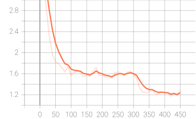
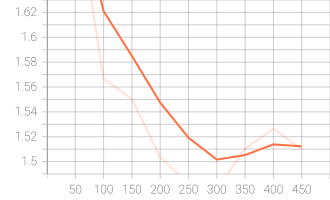
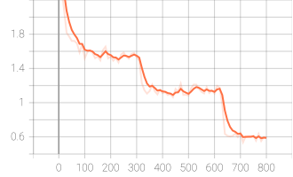
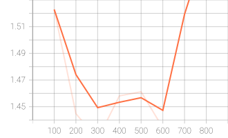

## Task

### Instruction Tuning (Classical Chinese)

文言文与白话文互译。

```json
{
    "id": "2fb7d211-978f-41c8-a3ab-e51d9df06280",
    "instruction": "翻譯成文言文：\n於是，廢帝讓瀋慶之的堂侄、直將軍瀋攸之賜瀋慶之毒藥，命瀋慶之自殺。",
    "output": "帝乃使慶之從父兄子直閣將軍攸之賜慶之藥。"
}
```

```json
{
    "id": "07f75449-94b9-4c3b-a525-e62cdbf85382",
    "instruction": "文言文翻譯：\n靈鑒忽臨，忻歡交集，乃迴燈拂席以延之。",
    "output": "答案：靈仙忽然光臨，趙旭歡欣交集，於是他就把燈點亮，拂拭乾淨床席來延請仙女。"
}
```

### Model

实验中用到的基础模型有：

- [Qwen3-4B](https://huggingface.co/Qwen/Qwen3-4B)：由阿里巴巴训练的开源模型；

- [Llama3-Taiwan (8B)](https://huggingface.co/yentinglin/Llama-3.1-Taiwan-8B)：使用繁体中文数据训练的Llama-3-8b 模型。

### QLORA

QLoRA(Quantized Low-Rank Adaptation)是一种高效的微调技术，通过量化和LoRA的结合，显著降低了大模型微调所需的显存。其核心创新在于冻结基础模型的4-bit量化权重，仅更新通过LoRA添加的可训练参数。这使得在单个消费级GPU上微调大型模型成为可能，显著降低了显存需求。

#### QLoRA的关键技术

1. 4位量化（NF4）：QLoRA使用一种称为Normal Float 4-bit (NF4)的量化格式，旨在最大限度地减少信息损失，适用于神经网络权重的正态分布特性；
2. 双重量化：QLoRA采用双重量化技术，对量化常数进行再次量化，进一步节省内存；
3. 分页优化器：为处理训练期间的内存峰值，QLoRA使用NVIDIA的统一内存功能在CPU和DPU之间进行”分页“，防止内存不足错误。

#### QLoRA的优势

1. 显存节省：通过量化，QLoRA显著减少了模型的内存占用，使得在有限的显存中运行大型模型成为可能；
2. 保持性能：QLoRA证明了即使将权重量化到4位精度，模型性能仍能保持，打破了低精度量化会导致性能下降的传统观念；
3. 易于实现：用户可以在现有的LoRA框架上进行扩展，利用其内存优化特性。

QLoRA采用4-bit量化压缩模型，16-bit浮点数执行计算，从而降低LLM微调的内存使用量并且不牺牲模型性能。

### Experiments

#### Dataset

- Training (train.json): 10000 
- Testing (Public) (public_test.json): 250 
- Testing (Private) (private_test.json): 250

#### Evaluation

Perplexity（困惑度）
$$
Perplexity = exp(-\frac{1}{N} \sum^N_{i=1}logP(x_i|x_{<i})) = exp(CrossEntropy)
$$

| 符号             | 含义                               |
| ---------------- | ---------------------------------- |
| $P(x_i\|x_{<i})$ | 模型预测第 $i$ 个 token 的条件概率 |
| $N$              | 有效 token 数（这里用 mask 控制）  |
| CrossEntropy     | 平均负对数似然                     |

Perplexity衡量模型有多“困惑”，即模型对下一个词预测的不确定性。

- PPL = 100：相当于从100个等概率词中猜下一个词；
- PPL = 10：相当于从10个等概率词中猜，更确定。

## Code

[Classical-Chinese-Translation-Instruction-Tuning](https://github.com/Aaricis/Classical-Chinese-Translation-Instruction-Tuning)

## Report

### Q1: LLM Tuning 

- **Describe:** 
  
  - **How much training data did you use? (2%)** 
  
    使用`train.json`（10,000笔）作为训练集，`public_test.json`（250笔）作为验证集。
  
  - **How did you tune your model? (2%)** 
  
    - 使用QLoRA技术对`Qwen3_4b`模型进行指令微调。QLoRA冻结`Qwen3_4b`的4-bit量化权重，同时在模型的注意力层（"q_proj", "k_proj", "v_proj", "o_proj"）和前馈网络（"gate_proj", "up_proj", "down_proj"）插入可训练的LoRA模块；
    - 实作采用`transformers`库的`Trainer`接口实现指令微调。
  
  - **What hyper-parameters did you use? (2%)**  
  
    | Hyper-parameter             | Value         |
    | --------------------------- | ------------- |
    | base model                  | Qwen/Qwen3-4B |
    | epoch                       | 5             |
    | learning_rate               | 1e-4          |
    | train_batch_size            | 2             |
    | gradient_accumulation_steps | 16            |
    | eval_batch_size             | 2             |
    | lora_rank                   | 64            |
    | lora_alpha                  | 128           |
    | lora_dropout                | 0.05          |
    | max_seq_length              | 1024          |
    | warmup_ratio                | 0.05          |
  
- **Show your performance:**
  - **What is the final performance of your model on the public testing set? (2%)** 
  
    Mean perplexity: 6.71778125
  
  - **Plot the learning curve on the public testing set (2%)**
  
    **Train loss如图所示：**
	  
	  
	  
	  **Eval loss如图所示：**
	
	

​	训练300个step，eval loss达到最低点。train loss在300个step之后继续下降，发生过拟合。


### Q2: LLM Inference Strategies

- **Zero-Shot**
  
  - **What is your setting? How did you design your prompt? (1%)**
  
    直接输入Prompt到原始的`Qwen/Qwen3-4B`模型，对`public_test.json`中的所有instruction进行推理，并计算生成output的ppl。
  
    **Prompt design**：明确指定了模型的身份为“精通中國古代文學與語言學的專家”，规定翻译要遵循的规则，并要求直接输出翻译结果。
  
    ```python
    def get_prompt(instruction: str) -> str:
         return (f"你是一位精通中國古代文學與語言學的專家，擅長文言文與現代漢語之間的互譯。\
                 請遵循以下原則：\
                     1. 準確理解用戶指令中的翻譯方向（現代轉文言，或文言轉現代）。\
                     2. 譯文需簡練、準確，符合對應時代的語言習慣（文言文需古雅，現代文需通順）。\
                     3. 直接輸出翻譯結果，不要添加「答案：」、「譯文：」等多餘前綴，也不要輸出解釋性文字。\
                     4. 若原文涉及歷史人名、官職，請保留或根據常識還原，確保語義通順。\
                 {instruction}\
                 請直接輸出翻譯結果："
                 )
    ```
  	下面展示了默认提示和修改后的提示的评估结果。
    
    | Prompt              | Model    | Mean Perplexity Value |
    | ------------------- | -------- | --------------------- |
    | Default(TA provide) | Qwen3-4B | 1517.36975            |
    | Modified            | Qwen3-4B | 254.3996875           |
  
- **Few-Shot (In-context Learning)**
  
  - **What is your setting? How did you design your prompt? (1%)**
    
	  在Zero-Shot Prompt基础上增加1-5个范例供模型参考。
    
    ```python
    def get_prompt(instruction: str) -> str:
    return (f"""你是一位精通中國古代文學與語言學的專家，擅長文言文與現代漢語之間的互譯。
            請遵循以下原則：
                1. 準確理解用戶指令中的翻譯方向（現代轉文言，或文言轉現代）。
                2. 譯文需簡練、準確，符合對應時代的語言習慣（文言文需古雅，現代文需通順）。
                3. 直接輸出翻譯結果，不要添加「答案：」、「譯文：」等多餘前綴，也不要輸出解釋性文字。
                4. 若原文涉及歷史人名、官職，請保留或根據常識還原，確保語義通順。
    
            請參考以下範例進行翻譯：
    
            ### 範例 1
            指令：翻譯成文言文：
            於是，廢帝讓瀋慶之的堂侄、直將軍瀋攸之賜瀋慶之毒藥，命瀋慶之自殺。
            輸出：帝乃使慶之從父兄子直閣將軍攸之賜慶之藥。
    
            ### 範例 2
            指令：文言文翻譯：
            靈鑒忽臨，忻歡交集，乃迴燈拂席以延之。
            輸出：靈仙忽然光臨，趙旭歡欣交集，於是他就把燈點亮，拂拭乾淨床席來延請仙女。
    
            ### 範例 3
            指令：翻譯成文言文：
            硃全忠聽後哈哈大笑。
            輸出: 全忠大笑。
    
            ### 範例 4
            指令： 文言文翻譯：
            契丹主以陽城之戰為彥卿所敗，詰之。彥卿曰： 臣當時惟知為晉主竭力，今日死生惟命。
            輸出: 契丹主因陽城之戰被符彥卿打敗，追問符彥卿，彥卿說： 臣當時隻知為晉主竭盡全力，今日死生聽你決定。
    
            ### 範例 5
            指令：翻譯成文言文：
            希望您以後留意，不要再齣這樣的事，你的小女兒病就會好。
            輸出: 以後幸長官留意，勿令如此。
    
            ### 當前任務
            指令：{instruction}
	          請直接輸出翻譯結果：
        """
        )
    
    ```
  
    测试不同数量的范例对模型生成翻译的影响。
  
    | Prompt | Model    | Mean Perplexity Value |
    | ------ | -------- | --------------------- |
    | 1-Shot | Qwen3-4B | 2294.813875           |
    | 2-Shot | Qwen3-4B | 1646.2709375          |
    | 3-Shot | Qwen3-4B | 2160.1710625          |
    | 4-Shot | Qwen3-4B | 1542.916875           |
    | 5-Shot | Qwen3-4B | 1581.53403125         |

- **How many in-context examples are utilized? How you select them? (1%)**

  直接从`train.json`文件中复制前5笔数据作为Few-Shot范例。根据测试结果，4-Shot效果最佳。

- **Comparison**
  
  - **What’s the difference between the results of zero-shot, few-shot, and LoRA? (2%)** 
  
    | Method            | Model                   | Mean Perplexity Value |
    | ----------------- | ----------------------- | --------------------- |
    | Zero-Shot         | Qwen3-4B                | 254.3996875           |
    | Few-Shot (4-Shot) | Qwen3-4B                | 1542.916875           |
    | QLoRA             | Qwen3-4B + LoRA adapter | 6.71778125            |
  
    - QLoRA微调模型完全对齐特定任务的数据分布，获得最低的ppl，效果最佳但成本最高；
    - Zero-Shot方法最简单且不引入多余的token，少许提示词即可获得相当好的ppl；
    - 本任务中Few-Shot表现最差，可能是上下文长度增加导致累积误差增大，模型注意力被范例分散，而非聚焦当前任务。另外，ppl分数高并不能完全代表生成答案的能力差。

**Note: Please conduct zero-shot and few-shot experiments on Orginal Model that has not been fine-tuned with QLoRA**

### Q3: Bonus: Try Llama3-Taiwan (8B) (2%)

- **Llama-3-8b trained by traditional Chinese data**
- **Tune this model on the classical chinese data**
- **Describe your experimental settings and compare the results to those obtained from your original methods**

#### LLM Tuning 

使用相同的数据测试和微调`yentinglin/Llama-3.1-Taiwan-8B`模型，微调超参数如下：

| Hyper-parameter             | Value                          |
| --------------------------- | ------------------------------ |
| base model                  | yentinglin/Llama-3.1-Taiwan-8B |
| epoch                       | 5                              |
| learning_rate               | 5e-5                           |
| train_batch_size            | 2                              |
| gradient_accumulation_steps | 16                             |
| eval_batch_size             | 2                              |
| lora_rank                   | 128                            |
| lora_alpha                  | 256                            |
| lora_dropout                | 0.05                           |
| max_seq_length              | 1024                           |
| warmup_ratio                | 0.05                           |

- `Llama-3.1-Taiwan-8B`参数量是`Qwen3-4B`的两倍，模型本身更大、有更强的基础能力，使用相同的`learning_rate`容易过拟合。因此，降低`learning_rate`到`5e-5`。
- `Llama-3.1-Taiwan-8B`的`hidden_size=4096`，相比`Qwen3-4B`的`hidden_size`（约2560），LoRA矩阵维度更大，`rank=64`的相对表达能力更弱。因此，适当提升到`lora_rank=128`，`lora_alpha=256`，在文白互译任务上收益明显。

微调后的模型在`public_test.json`数据集上获得Mean perplexity: 6.06021875。

**Train loss：**



**Eval loss：**



训练300个step，eval loss达到最低点。train loss在300个step之后继续下降，发生过拟合。

#### LLM Inference Strategies

使用相同的Prompt测试`Llama-3.1-Taiwan-8B`。

- **Zero-Shot**

  | Prompt              | Model               | Mean Perplexity Value |
  | ------------------- | ------------------- | --------------------- |
  | Default(TA provide) | Llama-3.1-Taiwan-8B | 31.7616875            |
  | Modified            | Llama-3.1-Taiwan-8B | 21.05678125           |

- **Few-Shot (In-context Learning)**

  | Prompt | Model               | Mean Perplexity Value |
  | ------ | ------------------- | --------------------- |
  | 1-Shot | Llama-3.1-Taiwan-8B | 21.1184375            |
  | 2-Shot | Llama-3.1-Taiwan-8B | 23.09103125           |
  | 3-Shot | Llama-3.1-Taiwan-8B | 22.48334375           |
  | 4-Shot | Llama-3.1-Taiwan-8B | 22.37846875           |
  | 5-Shot | Llama-3.1-Taiwan-8B | 20.990875             |

​	直接从`train.json`文件中复制前5笔数据作为Few-Shot范例。根据测试结果，5-Shot效果最	佳。

- **Comparison**

  | Method            | Model                              | Mean Perplexity Value |
  | ----------------- | ---------------------------------- | --------------------- |
  | Zero-Shot         | Llama-3.1-Taiwan-8B                | 21.05678125           |
  | Few-Shot (5-Shot) | Llama-3.1-Taiwan-8B                | 20.990875             |
  | QLoRA             | Llama-3.1-Taiwan-8B + LoRA adapter | 6.06021875            |

## Conclusion

|           | Qwen3-4B    | Llama-3.1-Taiwan-8B |
| --------- | ----------- | ------------------- |
| Zero-Shot | 254.3996875 | 21.05678125         |
| Few-Shot  | 1542.916875 | 20.990875           |
| QLoRA     | 6.71778125  | 6.06021875          |

对比`Qwen3-4B`与`Llama-3.1-Taiwan-8B`在相同条件下获得的Mean Perplexity。

- `Llama-3.1-Taiwan-8B`参数量较多，在Zero-Shot和Few-Shot实验均远好于`Qwen3-4B`；
- QLoRA实验两者Mean Perplexity相差不多。相比原始模型，`Qwen3-4B`微调之后收益更明显。

## Reference

- [QLoRA（Quantized LoRA）详解](https://zhuanlan.zhihu.com/p/666234324)
- [【Llama3大模型-SwiGLU激活函数】]( https://www.bilibili.com/video/BV1Sw4m1U7NQ/?share_source=copy_web&vd_source=f27af9aa2b0a1efe2d357b9f461ba958)

